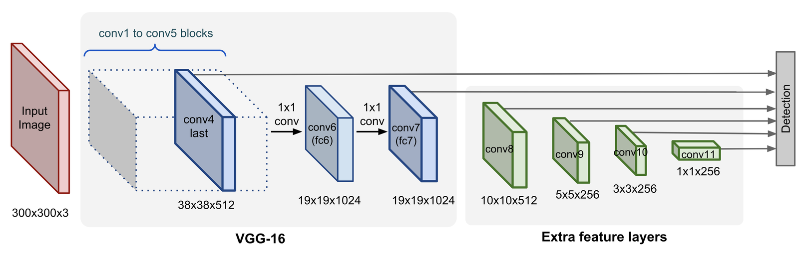
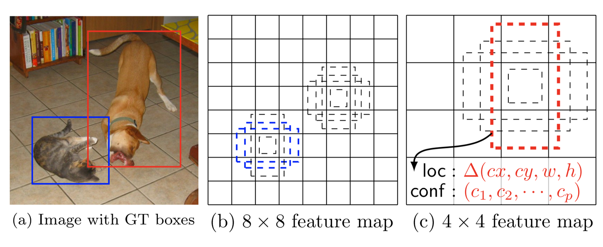
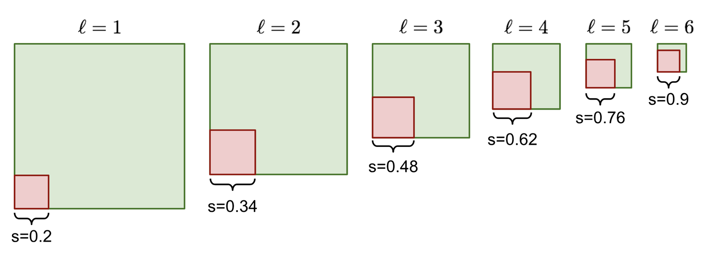

# SSD Object Detection

**Type**: concept  
**Tags**: #concept

## Overview

**SSD** (Single Shot MultiBox Detector; Liu et al., ECCV 2016) runs detection on **multiple conv feature map scales** of a VGG-based network, predicting offsets and class scores for **default boxes (anchors)** at every cell—single forward pass, no external proposals.

## Appearances

- [[Object Detection Part 4]] — pyramid, anchor formulas, loss, hard negative mining.
- [[Papers Explained 31 - Single Shot MultiBox Detector]]

## Architecture

- Base: **VGG-16** pre-trained on ImageNet.
- Extra conv layers → **feature pyramid** (large maps → small maps).
- **Fine maps** (e.g. 8×8): small objects, small anchors on input.
- **Coarse maps** (e.g. 4×4): large objects, large anchors.

## Default boxes per cell

At feature location \((i,j)\) on layer \(\ell\) of size \(m \times n\):

\[
s_\ell = s_{min} + \frac{s_{max} - s_{min}}{L - 1}(\ell - 1)
\]

Aspect ratios \(r \in \{1, 2, 3, 1/2, 1/3\}\); when \(r=1\), extra scale \(s'_\ell = \sqrt{s_\ell s_{\ell+1}}\) → **6 boxes** per cell.

\[
w_\ell^r = s_\ell \sqrt{r}, \quad h_\ell^r = s_\ell / \sqrt{r}, \quad
(x_\ell^i, y_\ell^j) = \left(\frac{i+0.5}{m}, \frac{j+0.5}{n}\right)
\]

**3×3×p** conv per anchor predicts **4 offsets + c class scores** → \(kmn(c+4)\) filters per map.

## Loss

\[
\mathcal{L} = \frac{1}{N}(\mathcal{L}_{cls} + \alpha \mathcal{L}_{loc})
\]

- **\(\mathcal{L}_{loc}\)**: [[Smooth L1 Loss]] on matched pairs; targets same as [[Bounding Box Regression]] (\(t_x, t_y, t_w, t_h\)).
- **\(\mathcal{L}_{cls}\)**: softmax cross-entropy; positives \(\mathbb{1}_{ij}^k\) for matched class \(k\); negatives include background class index 0.

## Hard negative mining

Sort anchors by objectness; keep top false positives for training; **neg:pos at most 3:1**—controls background dominance.

## vs YOLO

| | SSD | YOLO v1 |
|---|-----|---------|
| Spatial prior | Multi-scale anchors on pyramid | Single grid |
| Box count per location | 6 default boxes | \(B\) predicted boxes |
| Backbone | VGG + extras | GoogLeNet-like + FC |

## Related

- [[Papers Explained 21 - Feature Pyramid Network]], [[Papers Explained 31 - Single Shot MultiBox Detector]]
- [[YOLO]], [[RetinaNet]], [[One-Stage Object Detector]]
- [[Object Detection Part 4]]
