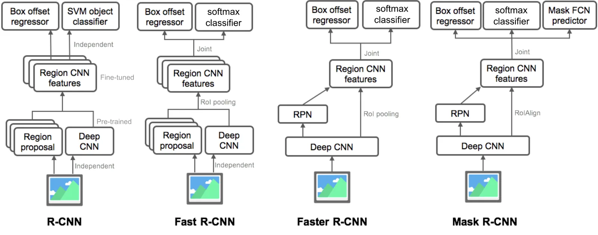

# Two-Stage Object Detector

**Type**: concept  
**Tags**: #concept

## Overview

**Two-stage detectors** first produce a **sparse** set of [[Region Proposal|region proposals]], then apply a classifier/regressor to each candidate. The [[R-CNN]] family (R-CNN → Fast → Faster → Mask R-CNN) is the canonical line—historically highest mAP, slower than one-stage designs.

## Appearances

- [[Object Detection Part 4]] — contrasted with YOLO/SSD/RetinaNet.

## Stage breakdown

| Stage | What happens | Examples |
|-------|--------------|----------|
| **1. Propose** | ~300–2000 candidate boxes | Selective Search, [[Region Proposal Network]] |
| **2. Detect** | Classify + refine ( + mask) per RoI | Fast R-CNN head, Mask branch |

## Evolution of shared computation

| Model | Proposal cost | Feature sharing |
|-------|---------------|-----------------|
| R-CNN | SS + 2000× CNN | None per image |
| Fast R-CNN | SS | 1× CNN + RoI pool |
| Faster R-CNN | RPN (GPU) | Shared conv |
| Mask R-CNN | RPN | + mask head |

## Strengths and weaknesses

**Strengths**: High recall proposals; RoI-specific computation focuses capacity on likely object regions; still strong baselines for accuracy-focused systems.

**Weaknesses**: Pipeline complexity; proposal stage latency; harder to optimize end-to-end in earliest forms.

## Related

- [[R-CNN]], [[Fast R-CNN]], [[Faster R-CNN]], [[Mask R-CNN]]
- [[One-Stage Object Detector]]
- [[Object Detection for Dummies Part 3]], [[Object Detection Part 4]]
