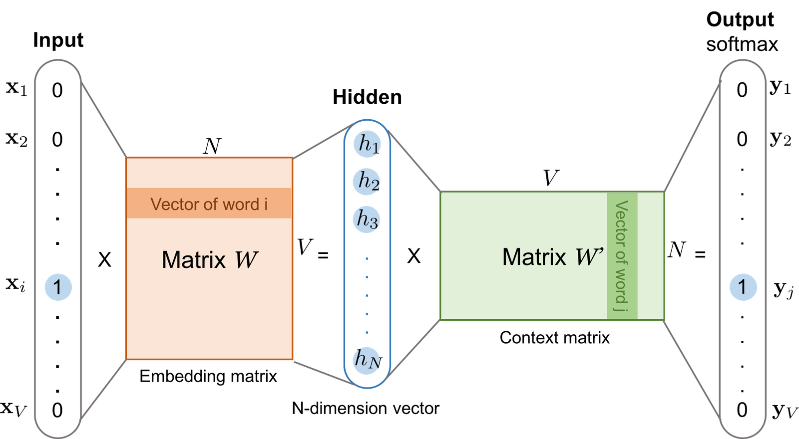
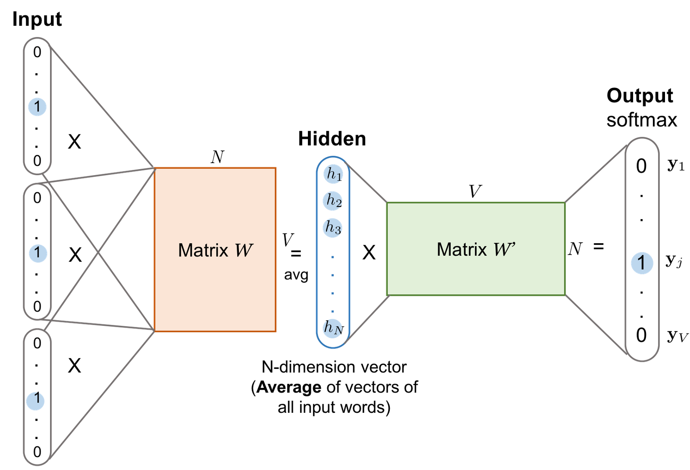
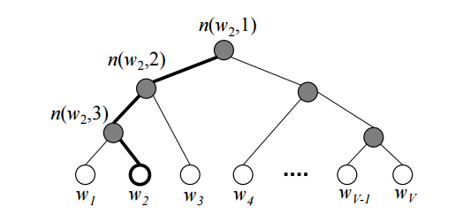

# Learning Word Embedding

**Source**: `raw/2017-10-15-word-embedding/full-article.html` (92 KB); secondary: `raw/2017-10-15-word-embedding/full-article.md`  
**Canonical URL**: https://lilianweng.github.io/posts/2017-10-15-word-embedding/  
**Author**: Lilian Weng  
**Published**: 2017-10-15  
**Ingested**: 2026-05-21  
**Tags**: #summary

## Summary

Lilian Weng's 2017 post is a self-contained tutorial on classical **word embedding** methods—the dense vector representations that replaced one-hot vocabulary encodings in NLP pipelines before transformers dominated. The article frames the problem as turning free-text words into numeric vectors that preserve similarity (e.g. "cat" / "kitten") and relational structure (analogies like cat:kitten :: dog:puppy), using **context** as the primary learning signal.

Two families of approaches are contrasted throughout. **Count-based** methods (vector space models) factorize global word co-occurrence statistics—PCA, topic models, and neural probabilistic language models—mapping frequency/co-occurrence matrices to low-dimensional vectors. **Context-based** (predictive) methods train supervised models to predict a word from neighbors (or vice versa); the embedding matrix **W** is learned as model parameters. The tutorial then goes deep on Word2Vec-style architectures, every major softmax approximation used in practice, GloVe's count+context hybrid, and a hands-on Game of Thrones gensim demo.

The exposition is equation-heavy: full softmax, hierarchical softmax, cross-entropy reformulation, [[Noise-Contrastive Estimation]], [[Negative Sampling]], GloVe's log-co-occurrence objective, and Mikolov's training heuristics (soft sliding windows, subsampling, phrase learning). For modern readers, this page is the bridge between [[Distributed Representations]] in [[Deep Learning]] and contemporary dense encoders catalogued under [[Embedding and Retrieval]]—including later GloVe refreshes in [[Papers Explained - GloVe 2024]].

## Key Claims

- **One-hot encoding** over full vocabulary is computationally impractical (hundreds of thousands of dimensions); embeddings use dense, low-dimensional real vectors that capture similarity and analogy structure.
- **Count-based** models (co-occurrence matrix factorization) and **context-based** predictors (skip-gram, CBOW) are the two main historical routes; both exploit the distributional hypothesis that similar contexts imply similar meanings.
- **Skip-gram** (Mikolov et al., 2013) treats each (target, context) pair from a sliding window as a training example; input and output are one-hot, hidden layer is **W** row for target, output uses separate context matrix **W′** (not a transpose of W).
- **CBOW** averages context word vectors to predict the center target; smoothing from averaging can help on **small datasets**.
- **Full softmax** over vocabulary size V is O(V) per sample—prohibitively expensive at scale; motivates hierarchical softmax, NCE, and negative sampling.
- **Hierarchical softmax** (Morin & Bengio, 2005) encodes outputs in a binary tree, reducing training-time denominator cost from O(V) to O(log V); prediction still requires scanning leaves unless the target leaf is known.
- **Cross-entropy** loss for skip-gram equals −log p(w_O|w_I); gradient decomposes into positive reinforcement on the true output and negative pressure on all other words, estimable via noise samples.
- **NCE** (Gutmann & Hyvärinen, 2010) reframes learning as logistic regression distinguishing true context words from noise draws; assumes partition function Z(w_I) ≈ 1; noise often follows log-uniform (Zipfian) sampling.
- **Negative sampling** (NEG) is a simplified NCE variant focused on embedding quality rather than modeling the full word distribution; uses sigmoid classifiers on dot products.
- **GloVe** (Pennington et al., 2014) argues word meaning is in **ratios** of co-occurrence probabilities (ice/steam example); fits log C(w_i, w̃_k) ≈ w_i^T w̃_k + b_i + b̃_k with weighted least-squares on sparse counts.
- **Practical Word2Vec tips**: soft/randomized window sizes, subsampling frequent words with probability 1−√(t/f(w)), and phrase detection via bigram score before embedding training.
- **Game of Thrones demo**: gensim Word2Vec (size=128, window=3) on ASOIF corpus yields culturally coherent neighbors ("king" → baratheon, joffrey; "queen" → cersei, margaery).

## Figures

| Figure | Caption | Source |
|--------|---------|--------|
|  | Skip-gram model: one-hot input x and output y; hidden layer is N-dimensional embedding from matrix W (V×N); context matrix W′ (N×V) produces output probabilities. | Weng blog Fig. 1 |
|  | CBOW model: multiple context one-hot vectors averaged in the hidden layer before predicting the center target word. | Weng blog Fig. 2 |
|  | Hierarchical softmax binary tree: leaves are vocabulary words; internal nodes carry turn-left/right probabilities via sigmoid of embedding dot products along the path. | Weng blog Fig. 3 (after Xin Rong) |

The skip-gram diagram  shows why **W** and **W′** are independent matrices—input embeddings vs context embeddings. The hierarchical softmax tree  illustrates path probability as a product of sigmoid decisions at each internal node.

## Problem Setup: From One-Hot to Dense Vectors

| Representation | Dimensionality | Values | Limitation |
|----------------|----------------|--------|------------|
| One-hot | V (vocabulary size, often 10⁵–10⁶) | Binary {0,1} | No similarity structure; sparse; impractical dot products |
| Word embedding | N ≪ V (typically 50–300) | Dense reals | Similar words nearby; analogies via vector arithmetic |

**Distributional hypothesis** (Harris, Firth): words that occur in similar contexts tend to have similar meanings. Both count-based and context-based methods operationalize this—globally via co-occurrence matrices or locally via prediction in a sliding window.

## Count-Based Vector Space Models

Count-based methods build on **word frequency and co-occurrence** with the assumption that words sharing contexts have related semantics. Raw counts are insufficient; smart transforms (PMI, PPMI, log, entropy weighting) precede matrix factorization.

| Method | Mechanism | Output |
|--------|-----------|--------|
| LSA / SVD | Factorize term-document or word-context matrix | Low-rank word vectors |
| Topic models (LDA, etc.) | Latent topics explain word co-occurrence | Word–topic mixtures |
| Neural probabilistic LM (Bengio et al.) | Learn distributed word features + predict next word | Embeddings as NN parameters |
| [[GloVe]] | Weighted regression on **log** co-occurrence counts | Global vectors w_i, w̃_j |

These are **unsupervised** and **global**—statistics aggregated over the full corpus before or during factorization. See [[Count-Based Vector Space Model]].

Baroni et al. (ACL 2014, ref. [10] in source) systematically compared count-based vs context-predicting vectors; both families remain competitive on intrinsic tasks, with tradeoffs by corpus size and domain.

## Skip-Gram (Detailed)

Given sliding window size (e.g. 5), each center word is a **target**; words within the window are **context**. The model learns to predict context words from the target (not the reverse—that is CBOW).

### Full training-sample table (window size = 5)

Source sentence: *"The man who passes the sentence should swing the sword."* — Ned Stark

| Sliding window | Target | Context words |
|----------------|--------|---------------|
| [The man who] | the | man, who |
| [The man who passes] | man | the, who, passes |
| [The man who passes the] | who | the, man, passes, the |
| [man who passes the sentence] | passes | man, who, the, sentence |
| [who passes the sentence should] | the | passes, sentence, should |
| [passes the sentence should swing] | sentence | the, should, swing |
| [the sentence should swing the] | should | sentence, swing, the |
| [sentence should swing the sword] | swing | sentence, should, the, sword |
| [should swing the sword] | the | should, swing, sword |
| [swing the sword] | sword | swing, the |

Each (target, context) pair is an independent training example. Target **"swing"** alone yields: (swing, sentence), (swing, should), (swing, the), (swing, sword).

### Architecture ([[Skip-Gram]])


Given vocabulary size **V** and embedding dimension **N**:

1. Input word w_I → one-hot **x** ∈ {0,1}^V (length V, 1 at index I).
2. **Hidden layer** = x^T W = row I of **W** ∈ ℝ^{V×N} → embedding **v_{w_I}** ∈ ℝ^N.
3. Output logits = W′ v_{w_I} where **W′** ∈ ℝ^{N×V} (context matrix; **not** W^T or W⁻¹).
4. Softmax over columns of W′ gives p(w_O | w_I).

**Critical detail**: W encodes words as **input/target** roles; W′ encodes words as **context** roles. The same word type has two different learned representations depending on role—symmetry is not assumed.

Each context-target pair is one SGD observation; corpora yield billions of updates.

## CBOW (Detailed)


[[Continuous Bag-of-Words]] predicts the **center** word from **context** words. For target "swing" with context {sentence, should, the, sword}:

1. Each context word → one-hot → row of W → context vectors.
2. **Average** context vectors → hidden layer h ∈ ℝ^N.
3. W′ h → softmax over vocabulary → predict "swing".

| Aspect | Skip-gram | CBOW |
|--------|-----------|------|
| Prediction direction | target → each context word | context bag → target |
| Training pairs per window position | more (one per context) | one |
| Rare words | often better (more updates per rare token) | weaker |
| Small corpora | can overfit sparse patterns | averaging smooths; often preferred |
| Hidden layer | single target embedding | mean of context embeddings |

## Loss Functions and Softmax Approximations

All losses below use skip-gram notation: **v_{w_I}** from W, **v'_{w}** from W′, score z_{ij} = v'_{w_j}^T v_{w_I}.

### Full softmax

p(w_O | w_I) = exp(v'_{w_O}^T v_{w_I}) / Σ_{i=1}^V exp(v'_{w_i}^T v_{w_I})

- **Exact** likelihood for conditional log-linear model.
- **Cost**: O(V) per training sample for denominator—prohibitive at V ≈ 10⁶.
- **Parameters**: O(VN) in W and W′; most memory in output layer for large V.

### Hierarchical softmax


[[Hierarchical Softmax]] (Morin & Bengio, 2005) encodes the output layer as a **binary tree**: leaves = words; internal nodes = binary decisions.

At internal node n with learned vector v_n':
- p(turn right | w_I, n) = σ(v_n'^T v_{w_I})
- p(turn left | w_I, n) = 1 − σ(v_n'^T v_{w_I}) = σ(−v_n'^T v_{w_I})

Path probability for output word w_O (path length L(w_O), nodes n(w_O,k)):

p(w_O | w_I) = ∏_{k=1}^{L(w_O)} σ( I_turn(n(w_O,k), n(w_O,k+1)) · v_{n(w_O,k)}'^T v_{w_I} )

where I_turn = +1 if the next node is the **left** child, −1 if **right**.

| Phase | Complexity | Notes |
|-------|------------|-------|
| Training | O(log V) per sample | Only nodes on the path to w_O are updated |
| Inference | O(V) worst case | Must compare paths to all leaves to find argmax unless structure prunes search |

**Tree design heuristics**:
- **Huffman tree** by word frequency—short paths for common words (fast training signal).
- **Semantic clustering** (WordNet, manual clusters)—similar words share early branches; can improve quality.

### Cross-entropy view

True label **y** is one-hot (1 at w_O, 0 elsewhere). Cross-entropy H(y, p) = −Σ_i y_i log p(w_i | w_I) = −log p(w_O | w_I).

Expanding softmax:

L_θ = −v'_{w_O}^T v_{w_I} + log Σ_{i=1}^V exp(v'_{w_i}^T v_{w_I}) = −z_{IO} + log Σ_{i=1}^V e^{z_{Ii}}

**Gradient** (z_{IO} = v'_{w_O}^T v_{w_I}):

∇_θ L_θ = −∇_θ z_{IO} + Σ_{i=1}^V p(w_i | w_I) ∇_θ z_{Ii} = −∇_θ z_{IO} + E_{w_i ~ p(·|w_I)}[∇_θ z_{Ii}]

Interpretation:
- **First term** (−∇z_{IO}): increases score of the **correct** context word (positive reinforcement).
- **Second term** (expectation over full vocabulary): decreases scores of **all** words, weighted by current predicted probability—strong words get stronger negative push.

Sampling-based methods approximate the expectation with noise distribution Q(w̃) instead of summing all V words.

### Noise Contrastive Estimation (NCE)

[[Noise-Contrastive Estimation]] (Gutmann & Hyvärinen, 2010) reframes learning as **binary classification**: is word w the true context of w_I, or a noise draw?

Sample N noise words w̃_1,…,w̃_N ~ Q. Classifier label d ∈ {0,1}.

**Loss** (finite samples):

L = −[ log p(d=1|w,w_I) + Σ_{i=1}^N log p(d=0|w̃_i,w_I) ]

**Joint model** of (d, word) given w_I:

| d | word | p(d, word | w_I) |
|---|------|---------------------|
| 1 | true w | (1/(N+1)) · p(w|w_I) |
| 0 | noise w̃ | (N/(N+1)) · q(w̃) |

**Posteriors**:

p(d=1|w,w_I) = p(w|w_I) / (p(w|w_I) + N·q(w̃))

p(d=0|w̃,w_I) = N·q(w̃) / (p(w|w_I) + N·q(w̃))

Full NCE still has partition function Z(w_I) in p(w|w_I). **Mnih & Teh (2012)** assume Z(w) ≈ 1 (softmax already normalized), yielding simplified loss with exp(v'_w^T v_{w_I}) terms in numerator and denominator.

**Noise distribution Q** requirements:
1. Similar to the empirical word distribution (so negatives are hard enough).
2. Cheap to sample.

**Log-uniform / Zipfian** (TensorFlow `log_uniform_candidate_sampler`): probability of rank-r word:

q(w̃) = (log(r+1) − log r) / log V,  r ∈ [1, V]

High-frequency words have low rank → higher q; matches natural language Zipf tails.

### Negative sampling (NEG)

[[Negative Sampling]] drops explicit p(w|w_I) modeling; uses **sigmoid** binary logistic loss—optimized for **embedding quality**, not generative LM likelihood.

p(d=1|w,w_I) = σ(v'_w^T v_{w_I}) = 1 / (1 + exp(−v'_w^T v_{w_I}))

p(d=0|w̃,w_I) = σ(−v'_{w̃}^T v_{w_I})

**Loss**:

L = −[ log σ(v'_w^T v_{w_I}) + Σ_{w̃_i ~ Q} log σ(−v'_{w̃_i}^T v_{w_I}) ]

| Method | Models full p(w|context)? | Training cost per sample | Typical use |
|--------|---------------------------|--------------------------|-------------|
| Full softmax | Yes | O(V) | Small V only |
| Hierarchical softmax | Yes (tree-normalized) | O(log V) | Older LMs |
| NCE | Approximately | O(N) negatives | General unnormalized models |
| Negative sampling | No (discriminative) | O(N) negatives | **Word2Vec default** |

**Default hyperparameters** (Mikolov / gensim conventions): N_neg = 5–20; subsample threshold t ≈ 10⁻⁵–10⁻³; window 5–10; dim N = 100–300; negative distribution ∝ unigram^{3/4}.

## Training Heuristics (Mikolov et al., 2013)

| Technique | Mechanism | Rationale |
|-----------|-----------|-----------|
| **Soft sliding window** | For each training step, sample actual window size uniformly from {1,…,s_max}. Context word at distance d included with probability 1/d. | Down-weights distant context; adjacent words always included; more diverse effective window sizes per epoch |
| **Subsampling frequent words** | Discard token w before window construction with probability P_drop(w) = 1 − √(t / f(w)), where f(w) is relative frequency and t a threshold (e.g. 10⁻⁵) | "the", "a" co-occur with everything and add little discriminative signal; boosts effective rate of informative tokens |
| **Phrase learning** | Score bigram w_i w_j: s = (C(w_i w_j) − δ) / (C(w_i)·C(w_j)); merge if s exceeds threshold; repeat passes with lower cutoff for longer phrases | "New York", "machine learning" behave as single tokens; prevents compositionally wrong splits |

**Phrase detection detail**: δ discounts rare bigrams to avoid spurious merges. Multi-word phrases built by scanning corpus repeatedly, merging highest-scoring pairs first (similar to word2vec phrase paper and gensim `phrases` module).

## GloVe (Detailed)

[[GloVe]] (Pennington, Socher, Manning, 2014) unifies **global matrix factorization** with **local context prediction** insights from Word2Vec.

### Co-occurrence statistics

p_co(w_k | w_i) = C(w_i, w_k) / C(w_i) — probability that word k appears in context of word i.

**Not** the same as skip-gram p(w_O | w_I); GloVe uses corpus-wide count matrix **X** (often symmetric: window-based C(w_i,w_j) = C(w_j,w_i)).

### Ice / steam ratio intuition

| w_i | w_j | w̃_k | Expected ratio p_co(w̃_k\|w_i) / p_co(w̃_k\|w_j) |
|-----|-----|------|--------------------------------------------------|
| ice | steam | solid | **Large** — solid co-occurs with ice, not steam |
| ice | steam | water | **≈ 1** — water co-occurs with both |
| ice | steam | fashion | **≈ 1** — fashion unrelated to both |

**Key claim**: ratios encode meaning better than raw p_co — raw probabilities track corpus frequency of w_i and w_j, ratios cancel that confound.

### Model derivation (summary)

Define F(w_i, w_j, w̃_k) = p_co(w̃_k|w_i) / p_co(w̃_k|w_j). Seek F = f((w_i − w_j)^T w̃_k). Symmetry w_i ↔ w̃ and w_j ↔ w̃ forces **exponential** form:

F(w_i^T w̃_k) = exp(w_i^T w̃_k) = p_co(w̃_k|w_i)

Ratio form: exp((w_i − w_j)^T w̃_k) = p_co(w̃_k|w_i) / p_co(w̃_k|w_j)

Taking logs:

w_i^T w̃_k = log C(w_i, w̃_k) − log C(w_i) = log C(w_i, w̃_k) + b_i + b̃_k

where bias b_i absorbs −log C(w_i) (word-specific frequency), b̃_k absorbs context-word effects.

### Objective and weighting

Minimize weighted squared error on **non-zero** co-occurrences only (sparse X):

L = Σ_{i,j=1}^V f(X_{ij}) ( w_i^T w̃_j + b_i + b̃_j − log X_{ij} )²

**Weight function** f(c) (defaults from paper: x_max = 100, α = 0.75):

- f(0) = 0 (zero weight on non-co-occurring pairs—no loss term)
- f(c) = (c / c_max)^α for c < c_max (rare pairs still matter, but not dominated)
- f(c) = 1 for c ≥ c_max (cap influence of very frequent co-occurrences)

**Implementation**: AdaGrad on all w_i, w̃_j, b_i, b̃_j; often 50–300 dimensions; symmetric window (e.g. 10) to build X before optimization.

Combines **global co-occurrence statistics** (count-based) with **linear vector structure** (context-based dot products).

## Game of Thrones Example

Hands-on pipeline from the source (gensim + NLTK on *A Song of Ice and Fire* books 1–5).

**Corpus**: `a_song_of_ice_and_fire.zip` → `001ssb.txt` … `005ssb.txt`.

**Preprocessing**:
- Lowercase lines; strip non-ASCII via `unicode_escape` (legacy Python 2 pattern in original post).
- `sent_tokenize` → sentences; regex `\b(\w+)\b` tokenization; remove NLTK English stopwords; keep sentences with >1 content word.

**Training**:

```python
from gensim.models import Word2Vec
model = Word2Vec(GOT_SENTENCE_WORDS, size=128, window=3, min_count=5, workers=4)
model.wv.save_word2vec_format("got_word2vec.txt", binary=False)
```

| Hyperparameter | Value | Effect |
|----------------|-------|--------|
| size | 128 | Embedding dimension N |
| window | 3 | Max distance for context pairs |
| min_count | 5 | Ignore very rare tokens |
| workers | 4 | Parallel training threads |

### Similarity results (cosine nearest neighbors)

**king** (top 10):

| Word | Similarity |
|------|------------|
| kings | 0.897 |
| baratheon | 0.810 |
| son | 0.764 |
| robert | 0.709 |
| lords | 0.699 |
| joffrey | 0.696 |
| prince | 0.696 |
| brother | 0.685 |
| aerys | 0.685 |
| stannis | 0.683 |

**queen** (top 10):

| Word | Similarity |
|------|------------|
| cersei | 0.943 |
| joffrey | 0.934 |
| margaery | 0.931 |
| sister | 0.929 |
| prince | 0.927 |
| uncle | 0.923 |
| varys | 0.918 |
| ned | 0.917 |
| melisandre | 0.915 |
| robb | 0.915 |

**Interpretation**: Embeddings capture **domain-specific** relations (Westerosi houses, characters, kinship) rather than generic encyclopedic semantics—expected for in-domain training without Wikipedia-scale diversity.

## References (from source)

| # | Reference |
|---|-----------|
| [1] | TensorFlow Tutorial: Vector Representations of Words |
| [2] | Chris McCormick — "Word2Vec Tutorial - The Skip-Gram Model" |
| [3] | Sebastian Ruder — "On word embeddings - Part 2: Approximating the Softmax" |
| [4] | Xin Rong — *word2vec Parameter Learning Explained* (hierarchical softmax figure source) |
| [5] | Mikolov et al. — arXiv:1301.3781 (efficient estimation / Word2Vec) |
| [6] | Morin & Bengio — AISTATS 2005 (hierarchical softmax) |
| [7] | Gutmann & Hyvärinen — AISTATS 2010 (NCE) |
| [8] | Mikolov et al. — NIPS 2013 (distributed representations of words and phrases) |
| [9] | Mikolov et al. — arXiv:1301.3781 (duplicate entry in source) |
| [10] | Baroni, Dinu, Kruszewski — ACL 2014 (count vs predict systematic comparison) |
| [11] | Pennington, Socher, Manning — EMNLP 2014 (GloVe) |

**BibTeX** (from post):

```bibtex
@article{weng2017wordembedding,
  title   = {Learning word embedding},
  author  = {Weng, Lilian},
  journal = {lilianweng.github.io},
  year    = {2017},
  url     = {https://lilianweng.github.io/posts/2017-10-15-word-embedding/}
}
```

## Entities

- [[Lilian Weng]] — author; ML/NLP educator blog (lilianweng.github.io).
- [[Tomas Mikolov]] — Word2Vec, negative sampling, distributed representations papers (2013).
- [[Jeffrey Pennington]] — GloVe lead author (with Socher, Manning, EMNLP 2014).
- [[Yoshua Bengio]] — hierarchical softmax (Morin & Bengio, 2005).
- [[Michael Gutmann]] — NCE principle (with Aapo Hyvärinen, AISTATS 2010).

## Questions & Gaps

- Article predates subword (BPE/SentencePiece) and contextual embeddings (ELMo, BERT); static word vectors are assumed.
- Full softmax and hierarchical softmax paths are explained; production Word2Vec almost always uses negative sampling—implementation details (negative count, learning rate schedule) are light.
- GloVe section summarizes Pennington et al. (2014); full derivation of F and symmetry constraints is deferred to the paper.
- GoT example uses Python 2-era `decode('unicode_escape')` patterns; corpus licensing and modern tokenization not discussed.
- No comparison table vs fastText, GloVe 2024 retraining, or neural LM embeddings from [[Large Language Models]].

## Related

- [[Embedding and Retrieval]] — modern dense retrieval and embedding-model lineage.
- [[Distributed Representations]] — theoretical basis for dense codes vs one-hot.
- [[Noise-Contrastive Estimation]] — partition-function-free learning; NCE vs NEG.
- [[Negative Sampling]] — Word2Vec's practical training loss.
- [[GloVe]] — global co-occurrence + local structure hybrid.
- [[Papers Explained - GloVe 2024]] — 2024 English GloVe retrain and NER/analogy benchmarks.
- [[Deep Learning]] — representation learning and NCE in the Goodfellow textbook.
- [[Softmax]] — full vocabulary normalization bottleneck.
- [[Cross-Entropy Loss]] — probabilistic view of skip-gram training.
- [[Word2Vec]] — umbrella for skip-gram, CBOW, and tooling ecosystem.
