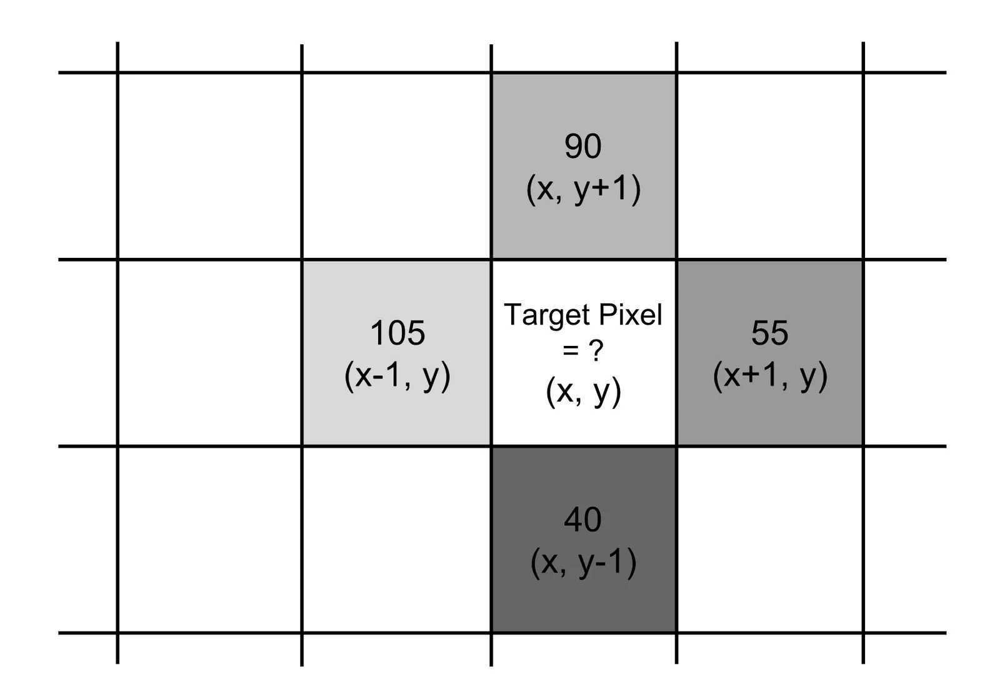
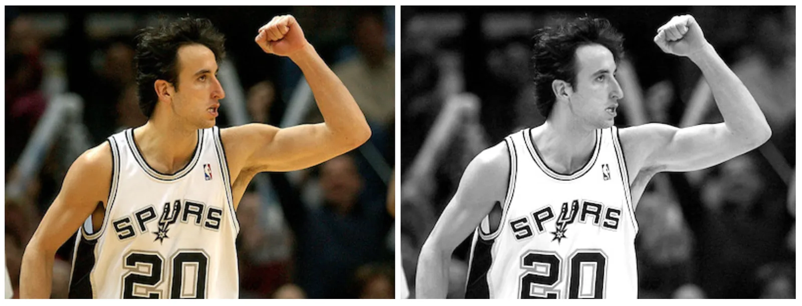
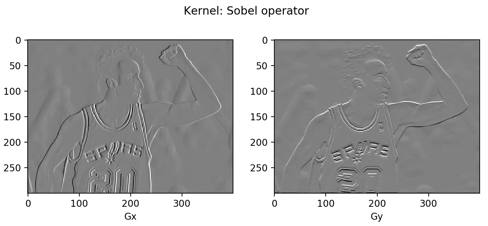
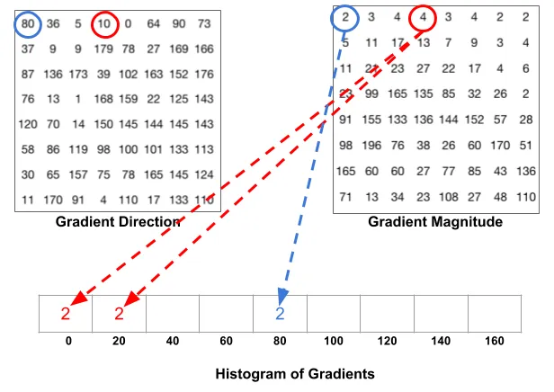
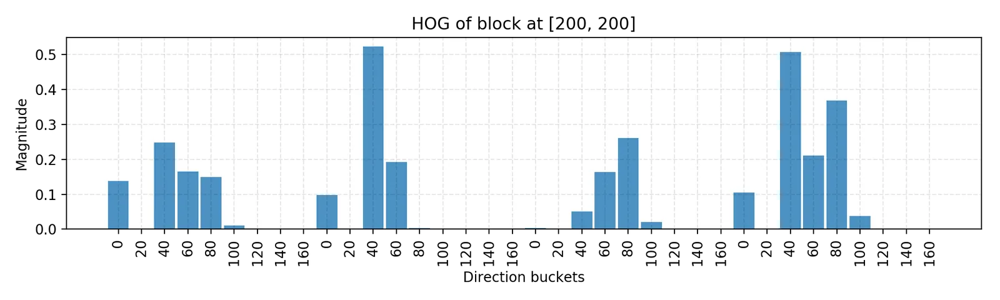
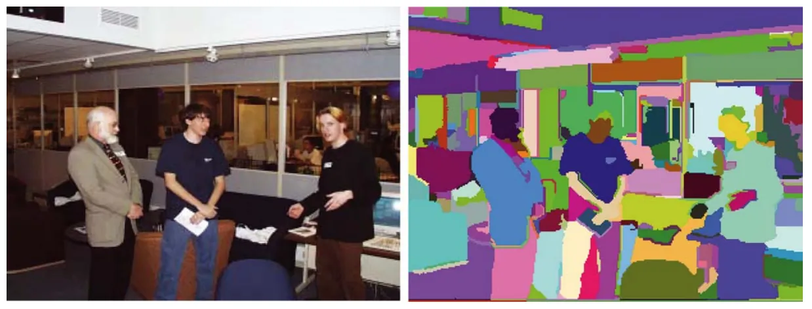
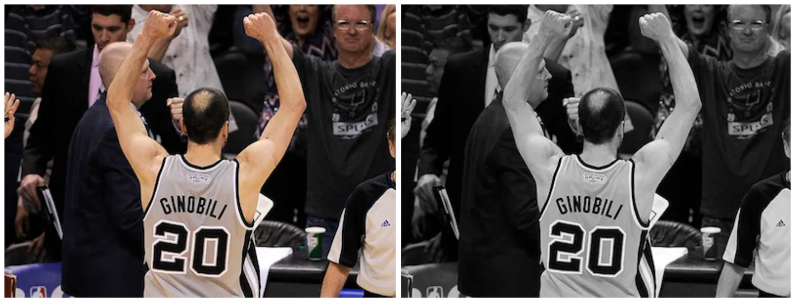
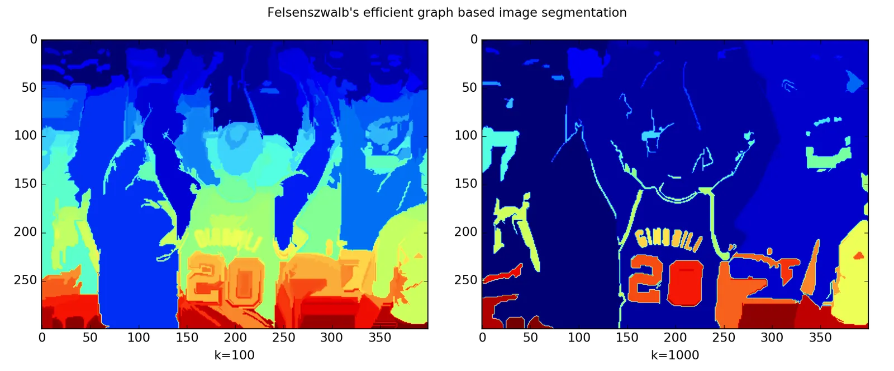
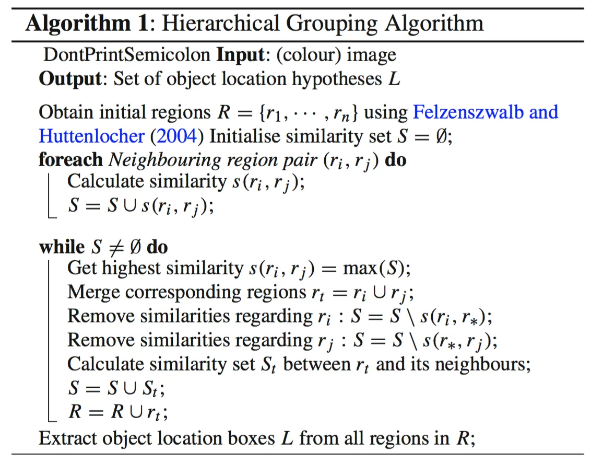

# Object Detection for Dummies Part 1

**Source**: `raw/2017-10-29-object-recognition-part-1/full-article.md` (93 KB); secondary: `raw/2017-10-29-object-recognition-part-1/full-article.md`  
**Canonical URL**: https://lilianweng.github.io/posts/2017-10-29-object-recognition-part-1/  
**Author**: Lilian Weng  
**Published**: 2017-10-29  
**Ingested**: 2026-05-21  
**Tags**: #summary

## Summary

Part 1 of Lilian Weng's *Object Detection for Dummies* series builds the **classical computer-vision stack** that predates end-to-end deep detectors: per-pixel [[Image Gradient|image gradient]] vectors, [[Histogram of Oriented Gradients|HOG]] features, graph-based [[Felzenszwalb Segmentation|image segmentation]], and [[Selective Search]] region proposals. No neural networks appear yet—the post motivates detection by explaining how an autonomous system might separate a stop sign from a pedestrian before any CNN is introduced.

Weng distinguishes **object recognition** (does an object exist?) from **object detection** (where is it?), while noting the two are tightly coupled in practice. The technical arc moves from calculus on discrete pixels (gradient magnitude and direction) through convolutional edge operators (Prewitt, Sobel) to a full HOG pipeline: 8×8 cells, 9-bin unsigned orientation histograms with soft binning, 2×2 cell blocks normalized to unit L2 norm, and concatenation into a feature vector for linear classifiers like SVM. Worked Python uses a Manu Ginobili photo series as a running example.

The second half covers **region formation**: Felzenszwalb–Huttenlocher graph segmentation (grid or nearest-neighbor graphs; internal difference, difference between components, merge predicate) and **Selective Search**, which greedily merges segmentation regions using color, texture, size, and shape similarities. Selective Search becomes the standard region proposal front-end for early R-CNN systems in [[Object Detection for Dummies Part 3]].

## Series

| Part | Topic | Wiki |
|------|-------|------|
| **1** (this page) | Gradients, HOG, segmentation, Selective Search | [[Object Detection for Dummies Part 1]] |
| 2 | AlexNet/VGG/ResNet, mAP, DPM, Overfeat | [[Object Detection for Dummies Part 2]] |
| 3 | R-CNN family | [[Object Detection for Dummies Part 3]] |
| 4 | YOLO, SSD, RetinaNet | [[Object Detection Part 4]] |

## Key Claims

- **Image gradient** at pixel \((x,y)\): \(\nabla f = [f(x+1,y)-f(x-1,y),\; f(x,y+1)-f(x,y-1)]^\top\); magnitude \(\|g\|_2\), direction \(\arctan(g_y/g_x)\).
- Gradients over the full image are computed efficiently via **convolution** (e.g. kernels \([-1,0,1]\), Prewitt 3×3, Sobel 3×3 with center weight 2).
- **HOG** (Dalal & Triggs, CVPR 2005): 8×8 cells → 9 orientation bins (0–180°); magnitudes split between adjacent bins; 2×2 cells → 36-D block vector, L2-normalized; repeat over sliding blocks.
- **Felzenszwalb segmentation** (2004): merge components while \(w(e) \leq MInt(C_i, C_j)\); \(Int(C)=\max_{e\in MST(C)} w(e)\); threshold \(\tau(C)=k/|C|\).
- **Selective Search** (Uijlings et al.): initialize with Felzenszwalb segments; iteratively merge most similar neighbor regions (color, texture/SIFT, size, shape); diverse configs via \(k\), color spaces, and metric blends.
- HOG features and graph regions feed **later detectors** (DPM uses HOG; R-CNN uses Selective Search)—see Parts 2–3.

## Figures

| Figure | Caption |
|--------|---------|
|  | 3×3 pixel patch with gradient vector components \(g_x, g_y\) at center pixel. |
|  | Grayscale example image (Manu Ginobili, 2004) for gradient/HOG demos. |
|  | Sobel operator outputs \(G_x\) and \(G_y\) on the 2004 photo. |
|  | Splitting gradient magnitude between two orientation bins when angle falls between bucket centers. |
|  | Normalized 36-D HOG histogram for one 2×2-cell block at location [200,200]. |
|  | Indoor scene segmented with grid-graph Felzenszwalb algorithm (\(k=300\)). |
|  | Grayscale example (2013) for segmentation comparison. |
|  | Fine vs coarse segmentation on Manu 2013 (\(k=100\) left, \(k=1000\) right). |
|  | Flowchart of Selective Search hierarchical region grouping. |

The gradient patch  grounds the discrete \(\nabla f\) definition. HOG soft binning  explains why small pose shifts do not destabilize descriptors. Selective Search  is the bridge to ~2k region proposals per image in R-CNN.

## Recognition vs detection

| Task | Question | Output |
|------|----------|--------|
| Object **recognition** | Is class \(c\) present? | Label (possibly with score) |
| Object **detection** | Where are instances of \(c\)? | Bounding boxes + labels |

Weng notes she initially conflated the terms; detection pipelines still rely on recognition-style features (HOG, CNN) inside proposed regions.

## Derivative, directional derivative, gradient

| | Derivative | Directional derivative | Gradient |
|---|------------|------------------------|----------|
| Type | Scalar | Scalar | **Vector** |
| On images | \(\partial f/\partial x\), \(\partial f/\partial y\) per pixel | Rate along \(\vec{u}\) | \((g_x, g_y)\) jointly |

## Edge operators (kernels)

| Operator | \(G_x\) idea | \(G_y\) idea |
|----------|--------------|--------------|
| Simple | \([-1,0,1]\) row | \([+1,0,-1]^\top\) column |
| Prewitt | 3×3, equal neighbor weight | 3×3 |
| Sobel | Center row/col weight **2** | Emphasizes immediate neighbors |

Global gradients = **convolution** of image matrix \(\mathbf{A}\) with these kernels (see [[Convolution]]).

## HOG (detailed)

**Dalal & Triggs (CVPR 2005)** — see [[Histogram of Oriented Gradients]].

Soft-bin example: magnitude 8 at 15° between 0° and 20° bins → assign **2** to 0° bin, **6** to 20° bin. Block at top-left [200,200] in demo: 36 bars after L2 norm (9 bins × 4 cells in 2×2 block).

Off-the-shelf: OpenCV, SimpleCV, scikit-image.

## Felzenszwalb algorithm (detailed)

Graph \(G=(V,E)\), edge weights = dissimilarity. Bottom-up merge sorted by increasing \(w(e)\). Predicate \(D(C_1,C_2)\): merge if **not** sufficiently different—i.e. when \(w(e) \leq MInt(C_1,C_2)\).

| Parameter | Effect |
|-----------|--------|
| \(k\) in \(\tau(C)=k/|C|\) | Larger \(k\) → coarser segments |
| Grid vs NN graph | Intensity-only vs position+RGB |

## Selective Search (detailed)

Built on Felzenszwalb output; **region-level** features (not single-pixel). Greedy merge by best neighbor similarity until full image is one region; **all intermediate regions** become proposals.

Best config: mixture of segmentations + color spaces + **all four** similarities (color, texture/SIFT, size, shape)—highest quality, highest cost.

## Image Gradient (Worked Example)

For the 3×3 patch with center intensity 255 and neighbors as in the post:

\[
\nabla f = \begin{bmatrix} 55-105 \\ 90-40 \end{bmatrix} = \begin{bmatrix} -50 \\ 50 \end{bmatrix},\quad
\|g\|_2 \approx 70.71,\quad \theta = -45^\circ
\]

Convolution implements the same operation globally: \(G_x = [-1,0,1] * A\), \(G_y = [+1,0,-1]^\top * A\) (see [[Convolution]]).

## HOG Pipeline Summary

| Stage | Size / detail |
|-------|----------------|
| Cell | 8×8 pixels |
| Orientation bins | 9 (unsigned 0–180°) |
| Block | 2×2 cells → 36 values, L2-normalize |
| Output | Concatenate all block vectors → classifier input |

## Felzenszwalb Merge Predicate

\(D(C_1,C_2)=\text{True}\) iff \(Dif(C_1,C_2) > MInt(C_1,C_2)\), where \(MInt = \min(Int(C_1)+\tau(C_1), Int(C_2)+\tau(C_2))\). Bottom-up: sort edges by weight; merge when predicate fails (components still "similar").

## Entities

- [[Lilian Weng]] — author; pedagogical series on detection.
- [[Pedro Felzenszwalb]] — graph segmentation (with Huttenlocher); later DPM lead author (Part 2).

## Questions & Gaps

- Post uses legacy `scipy.misc.imread` and Python 2 `map`/`reduce` in HOG demo—modern code would use `imageio`/`cv2` and vectorized histograms.
- Selective Search runtime and exact proposal counts are qualitative; R-CNN papers cite ~2k proposals empirically.
- No deep learning in Part 1; CNN classifiers and detectors begin in [[Object Detection for Dummies Part 2]].

## Related

- [[Object Detection for Dummies Part 2]] — CNN backbones and DPM/Overfeat.
- [[Object Detection for Dummies Part 3]] — R-CNN uses Selective Search proposals.
- [[Histogram of Oriented Gradients]] — concept page.
- [[Selective Search]] — concept page.
- [[Region Proposal]] — concept page.
- [[Computer Vision]] — topic index.
- [[Convolution]] — gradient as convolution.
- [[Papers Explained 14 - RCNN]] — downstream use of region proposals.
