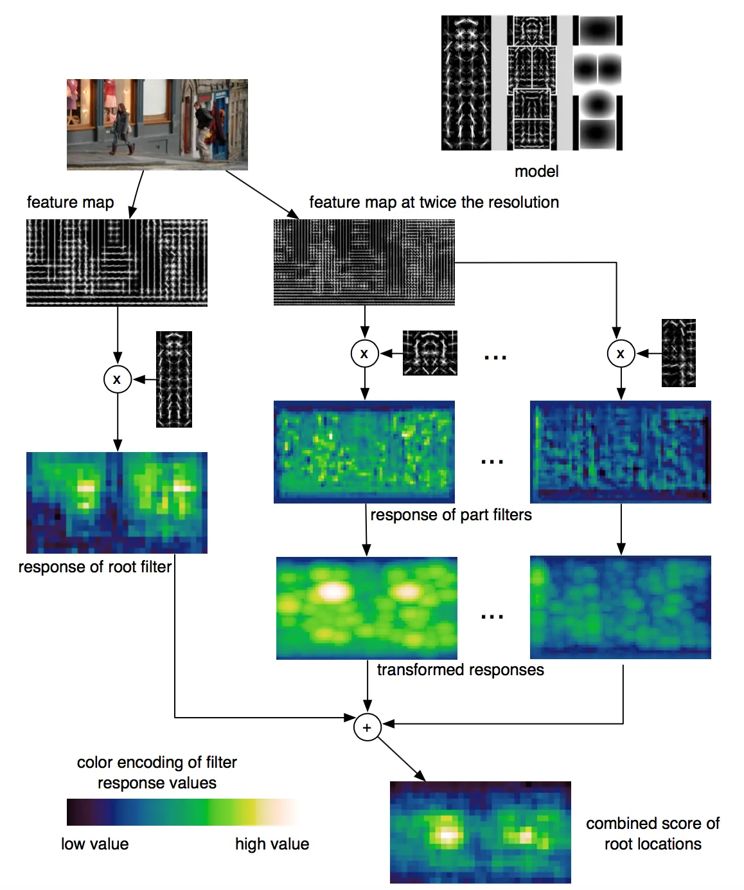
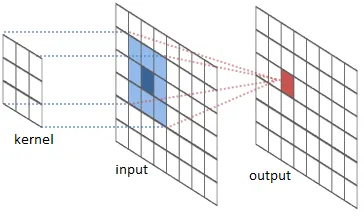
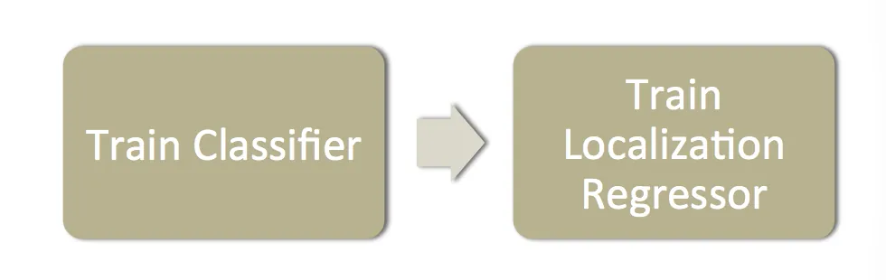
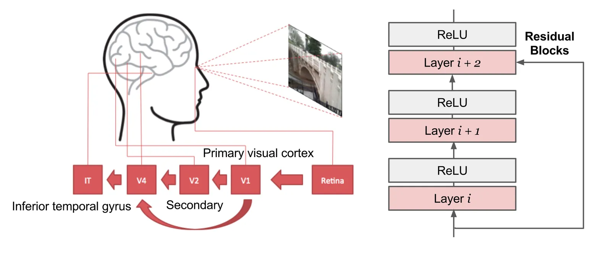

# Object Detection for Dummies Part 2

**Source**: `raw/2017-12-15-object-recognition-part-2/full-article.md` (51 KB); secondary: `raw/2017-12-15-object-recognition-part-2/full-article.md`  
**Canonical URL**: https://lilianweng.github.io/posts/2017-12-15-object-recognition-part-2/  
**Author**: Lilian Weng  
**Published**: 2017-12-15  
**Ingested**: 2026-05-21  
**Tags**: #summary

## Summary

Part 2 bridges [[Object Detection for Dummies Part 1]]'s classical features to **deep learning classifiers and early integrated detectors**. Weng reviews 2D [[Convolution]] (kernels, padding, stride), then three landmark [[Convolutional Neural Networks|CNN]] architectures—**AlexNet** (2012), **VGG** (2014), **ResNet** (2015)—that became backbones for detection. She introduces detection **metrics** ([[Mean Average Precision|mAP]], [[Intersection over Union|IoU]]), the part-based [[Deformable Parts Model|DPM]] (Felzenszwalb et al., 2010), and **Overfeat** (Sermanet et al., 2013), which jointly classifies and regresses boxes in a sliding-window CNN.

AlexNet: five conv (+ pool) layers, two MLP layers, softmax; heavy data augmentation. VGG: 19 layers of stacked 3×3 conv and 2×2 pool. ResNet: 152-layer stacks with **residual blocks** skipping input two layers ahead—mitigating vanishing gradients in very deep nets. DPM scores root + deformable parts with latent SVM; features often HOG. Girshick et al. (CVPR 2015) later showed DPM inference unrolls to CNN layers. Overfeat trains AlexNet-like classification, then replaces the head with **per-class bounding-box regressors** (L2 loss on edge coordinates), merging high-overlap predictions at test time.

## Series

| Part | Topic | Wiki |
|------|-------|------|
| 1 | HOG, Selective Search | [[Object Detection for Dummies Part 1]] |
| **2** (this page) | CNN, DPM, Overfeat | [[Object Detection for Dummies Part 2]] |
| 3 | R-CNN family | [[Object Detection for Dummies Part 3]] |
| 4 | YOLO, SSD, RetinaNet | [[Object Detection Part 4]] |

## Key Claims

- **2D convolution** slides a kernel over a feature map; output size controlled by padding and stride (see Dumoulin & Visin arXiv:1603.07285).
- **AlexNet** won ImageNet 2012 with deep conv + MLP + dropout/augmentation—template for later detection backbones.
- **VGG** trades filter size for depth: only 3×3 conv layers simulate larger receptive fields with fewer parameters per layer.
- **ResNet** residual paths \(y = F(x) + x\) enable training 100+ layer networks where plain stacks fail.
- **mAP**: per-class AP = area under precision–recall curve; mAP = mean over classes; TP if IoU > threshold (often 0.5 → mAP@0.5).
- **DPM**: score = root filter response + sum of best part scores minus deformation cost; \(\Phi(x)\) often HOG-based.
- **Overfeat**: same conv trunk for classification and localization; class-specific regressors output \((x_{left}, x_{right}, y_{top}, y_{bottom})\).

## Figures

| Figure | Caption |
|--------|---------|
|  | Kernel sliding over input feature map to produce output activations. |
|  | 3×3 kernel on 5×5 input, no padding, stride 1. |
|  | Same with zero padding and stride 2. |
|  | AlexNet layer stack (conv, pool, FC). |
|  | Scoring object hypothesis from root and part placements. |
|  | Train classifier CNN, then bbox regression head per class. |

## Convolution (2D)

Slides a **kernel** (filter) over the input feature map; multiply-add → output map. Output spatial size set by **padding** (zero border) and **stride** (step size).

  

Reference: Dumoulin & Visin, [A guide to convolution arithmetic for deep learning](https://arxiv.org/pdf/1603.07285.pdf) (arXiv:1603.07285).

## CNN backbones for detection

| Model | Year | Depth / structure | Detection relevance |
|-------|------|-------------------|---------------------|
| **AlexNet** | 2012 | 5 conv (+ max pool) + 2 FC + softmax | First strong ImageNet CNN; R-CNN default era backbone |
| **VGG** | 2014 | 19 layers, only 3×3 conv + 2×2 pool | Very deep uniform stacks; used in Fast R-CNN papers |
| **ResNet** | 2015 | Up to 152 layers; **residual block** \(y=F(x)+x\) | Enables very deep nets; Faster/Mask R-CNN backbones |

**AlexNet** training tricks: translations, horizontal flips, patch sampling. **ResNet** addresses vanishing gradients when plain depth increases—skip paths pass gradients and raw input forward.

## mAP and IoU (Quick Reference)

| Metric | Definition |
|--------|------------|
| **IoU** | \(\frac{|B_{pred} \cap B_{gt}|}{|B_{pred} \cup B_{gt}|}\) for boxes |
| **AP** | Area under PR curve for one class |
| **mAP** | Mean of AP across classes (0–100 scale in PASCAL VOC tradition) |

## DPM Score (Layman's Form)

\[
f(\text{model}, x) = f(\beta_{root}, x) + \sum_{\beta_{part}} \max_y \big[ f(\beta_{part}, y) - \text{cost}(\beta_{part}, x, y) \big]
\]

Base filter score: \(f(\beta, x) = \beta \cdot \Phi(x)\).

## Entities

- [[Lilian Weng]] — author.
- [[Pedro Felzenszwalb]] — DPM and segmentation.
- [[Ross Girshick]] — DPM-as-CNN unrolling (CVPR 2015).
- [[Kaiming He]] — ResNet (detection backbone in later parts).
- [[Pierre Sermanet]] — Overfeat lead author.

## Questions & Gaps

- Post summarizes architectures at blog depth; see [[Papers Explained Review 01 - Convolutional Neural Networks]] for paper-level detail.
- Overfeat predates unified multi-task heads in Faster R-CNN; region proposals still separate until Part 3.

## Related

- [[Object Detection for Dummies Part 1]] — HOG features used in DPM.
- [[Object Detection for Dummies Part 3]] — CNN features + region proposals (R-CNN).
- [[Convolutional Neural Networks]], [[Convolution]], [[Mean Average Precision]], [[Intersection over Union]], [[Deformable Parts Model]], [[Overfeat]]
- [[Papers Explained 14 - RCNN]]
