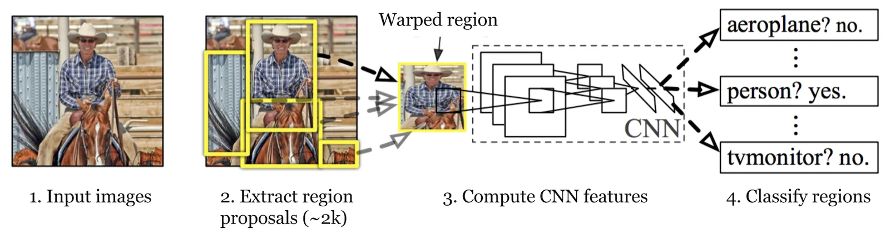
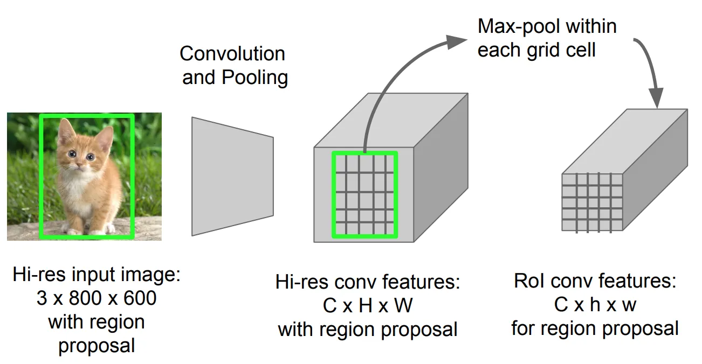
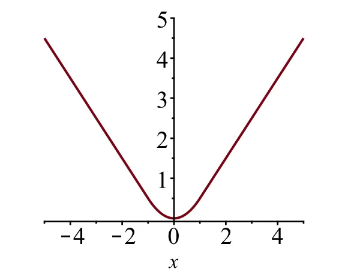
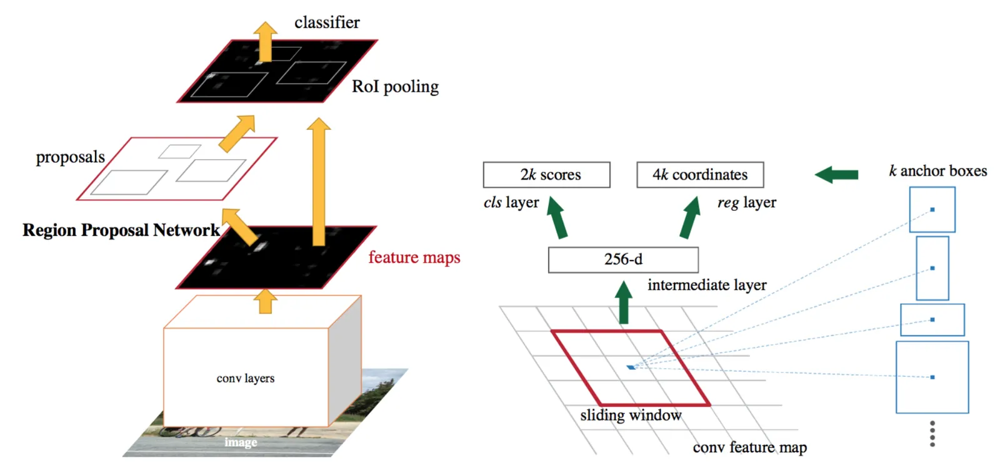
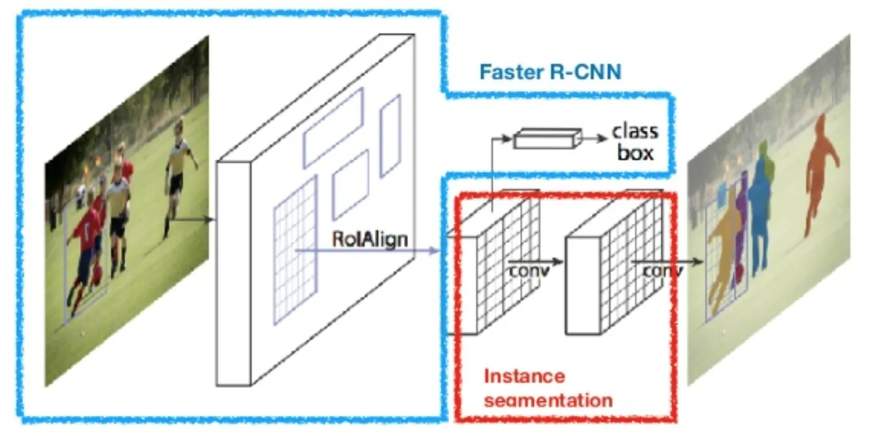
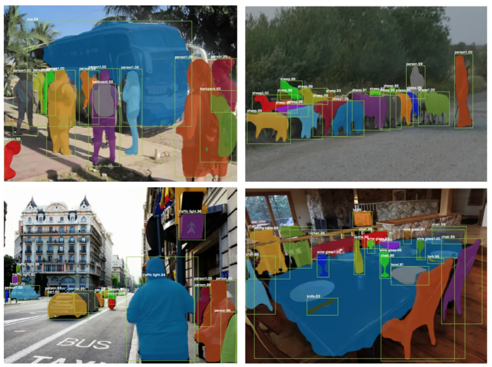
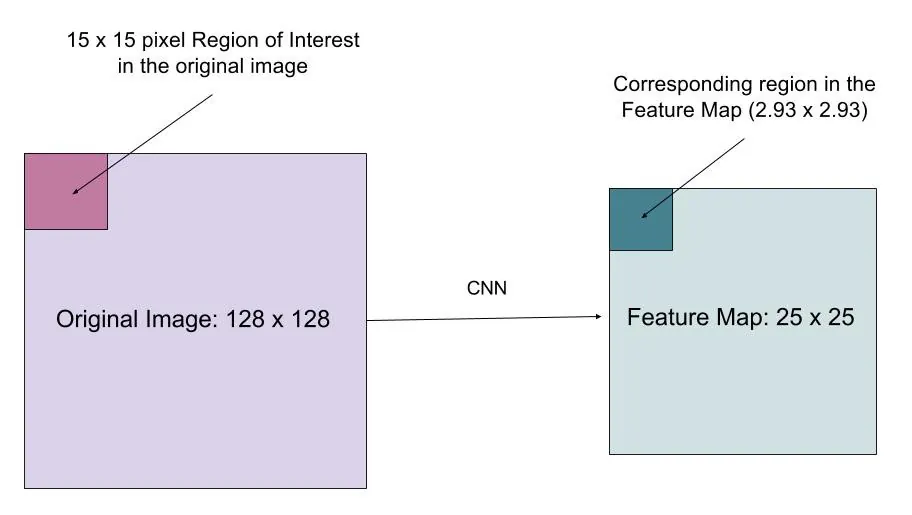

# Object Detection for Dummies Part 3

**Source**: `raw/2017-12-31-object-recognition-part-3/full-article.md` (73 KB); secondary: `raw/2017-12-31-object-recognition-part-3/full-article.md`  
**Canonical URL**: https://lilianweng.github.io/posts/2017-12-31-object-recognition-part-3/  
**Author**: Lilian Weng  
**Published**: 2017-12-31 (updated 2018-12-20: YOLO moved to Part 4; 2018-12-27: bbox regression + tricks)  
**Ingested**: 2026-05-21  
**Tags**: #summary

## Summary

Part 3 walks through the **R-CNN family**—region-based detectors that combine [[Region Proposal|region proposals]] with CNN features. [[R-CNN]] (Girshick et al., 2014) pre-trains a CNN, runs [[Selective Search]] (~2k boxes), warps each RoI, fine-tunes \(K{+}1\) classes (background = 0), classifies with **per-class linear SVMs** (positives IoU ≥ **0.3**), and refines boxes with [[Bounding Box Regression|bbox regression]] (train pairs IoU ≥ 0.6). Bottlenecks: no shared conv, three separate models, expensive per-region forward passes.

[[Fast R-CNN]] (2015) runs **one CNN forward** per image, pools each proposal with [[RoI Pooling]] into fixed vectors, and jointly trains softmax + bbox head with multi-task loss (smooth L1 on foreground RoIs). [[Faster R-CNN]] (Ren et al., 2016) adds a [[Region Proposal Network]] sharing conv features—anchors at each sliding position, alternating RPN/Fast R-CNN fine-tuning. [[Mask R-CNN]] (He et al., 2017) adds a per-RoI mask branch and replaces RoI Pooling with [[RoIAlign]] for pixel-accurate segmentation.

Common tricks: [[Non-Maximum Suppression]] (greedy, IoU > 0.5 suppression) and [[Hard Negative Mining]] (retrain on hard false positives). YOLO and one-stage models were **removed** from this post (see [[Object Detection Part 4]]).

## Series

| Part | Topic | Wiki |
|------|-------|------|
| 1–2 | Classical + CNN foundations | [[Object Detection for Dummies Part 1]], [[Object Detection for Dummies Part 2]] |
| **3** (this page) | R-CNN → Mask R-CNN | [[Object Detection for Dummies Part 3]] |
| 4 | One-stage detectors | [[Object Detection Part 4]] |

## Evolution at a Glance

| Model | Proposal | Feature extraction | Heads | Key speedup |
|-------|----------|------------------|-------|-------------|
| R-CNN | Selective Search | CNN per RoI | SVM + bbox | — |
| Fast R-CNN | Selective Search | Shared CNN + RoI pool | Softmax + bbox | Shared conv |
| Faster R-CNN | RPN | Shared CNN | RPN + Fast R-CNN | Learned proposals |
| Mask R-CNN | RPN | Shared CNN + RoIAlign | + mask branch | Pixel masks |

## Key Claims

- **R-CNN workflow**: pre-train CNN → selective search → warp RoIs → fine-tune \(K{+}1\) → SVM per class → bbox regressor on CNN features.
- **BBox targets** (scale-invariant): \(t_x=(g_x-p_x)/p_w\), \(t_y=(g_y-p_y)/p_h\), \(t_w=\log(g_w/p_w)\), \(t_h=\log(g_h/p_h)\); predict \(\hat{g}\) via \(d_i(\mathbf{p})\) with exp on scale.
- **Fast R-CNN loss**: \(\mathcal{L}=\mathcal{L}_{cls}+\mathbb{1}[u\geq1]\mathcal{L}_{box}\); cls = \(-\log p_u\); box = smooth L1 on \(t^u-v\).
- **Faster R-CNN RPN loss**: binary cls log loss + \(\lambda\)-weighted smooth L1 on positive anchors; positives IoU > 0.7, negatives < 0.3.
- **Mask R-CNN**: \(\mathcal{L}=\mathcal{L}_{cls}+\mathcal{L}_{box}+\mathcal{L}_{mask}\); mask is \(m\times m\) per class, BCE only on ground-truth class channel.
- **RoIAlign**: bilinear sampling without quantizing RoI coordinates—fixes misalignment vs RoI Pooling.

## Figures

| Figure | Caption |
|--------|---------|
|  | R-CNN: proposals → warp → CNN → SVM + bbox. |
|  | Predicted vs ground-truth box parameterization. |
|  | Multiple car boxes collapsed to highest-scoring non-overlapping set. |
|  | Single CNN + RoI pooling + dual heads. |
|  | Max-pool within each sub-window of arbitrary RoI on feature map. |
|  | Huber-style \(L_1^{smooth}\) for robust regression. |
|  | Shared conv + RPN + Fast R-CNN detector. |
|  | Classification, box, and mask branches. |
|  | Instance masks on COCO test images. |
|  | Floating-point RoI mapping with bilinear interpolation. |
|  | Side-by-side R-CNN family architectures. |

## R-CNN workflow (detailed)

| Step | Action | Detail |
|------|--------|--------|
| 1 | Pre-train CNN | ImageNet; N classes |
| 2 | Selective Search | ~2000 proposals, varied scales |
| 3 | Warp RoIs | Fixed input size per CNN |
| 4 | Fine-tune | \(K+1\) classes; background=0; low LR; oversample positives |
| 5 | Extract features | Forward each RoI → vector |
| 6 | Train SVMs | One binary SVM per class; pos IoU ≥ **0.3** |
| 7 | Bbox regression | CNN features; train if IoU ≥ **0.6** with GT |

Pre-trained weights: Caffe AlexNet zoo; TensorFlow-slim ResNet/VGG (circa 2017 blog note).

## Fast R-CNN (detailed)

Replace last pool with [[RoI Pooling]]; shared forward; softmax + box head. Loss ignores box term for background RoIs. Still uses Selective Search externally.

## Faster R-CNN (detailed)

[[Region Proposal Network]]: 3×3 sliding window on conv map; **9 anchors** per position (3 scales × 3 ratios example). Alternating RPN/detector fine-tuning. \(\lambda \approx 10\) balances cls and box terms in RPN loss.

## Mask R-CNN (detailed)

Third branch: \(m \times m\) mask per RoI; **\(K \cdot m^2\)** outputs; BCE on **GT class channel only**. [[RoIAlign]] + bilinear interpolation for mask alignment.

## NMS and hard negatives

**NMS**: sort by score; keep best; drop IoU > 0.5 overlaps (per class). **Hard negative mining**: add misclassified background patches to training set—see [[Hard Negative Mining]].

## Bounding Box Regression (Summary)

Given \(\mathbf{p}=(p_x,p_y,p_w,p_h)\), \(\mathbf{g}\) ground truth:

\[
\hat{g}_x = p_w d_x(\mathbf{p}) + p_x,\quad \hat{g}_w = p_w \exp(d_w(\mathbf{p}))
\]

(and symmetric for \(y,h\)). Train with SSE + \(\lambda\|\mathbf{w}\|^2\) on pairs with sufficient IoU.

## Smooth L1

\[
L_1^{smooth}(x) = \begin{cases} 0.5 x^2 & |x|<1 \\ |x|-0.5 & \text{else} \end{cases}
\]

## Entities

- [[Lilian Weng]] — author.
- [[Ross Girshick]] — R-CNN, Fast R-CNN, Mask R-CNN.
- [[Shaoqing Ren]] — Faster R-CNN lead.
- [[Kaiming He]] — Mask R-CNN, RoIAlign.

## Questions & Gaps

- **IoU threshold note**: Weng uses 0.3 for R-CNN SVM positives; many reproductions use 0.5—document when comparing to [[Papers Explained 14 - RCNN]].
- Selective Search remains the proposal bottleneck until RPN; Part 4 covers real-time one-stage alternatives.

## Related

- [[Object Detection for Dummies Part 2]], [[Object Detection Part 4]]
- [[R-CNN]], [[Fast R-CNN]], [[Faster R-CNN]], [[Mask R-CNN]]
- [[Papers Explained 14 - RCNN]], [[Papers Explained 15 - Fast RCNN]], [[Papers Explained 16 - Faster RCNN]], [[Papers Explained 17 - Mask RCNN]], [[Papers Explained Review 03 - RCNNs]]
- [[Selective Search]], [[RoI Pooling]], [[RoIAlign]], [[Region Proposal Network]]
