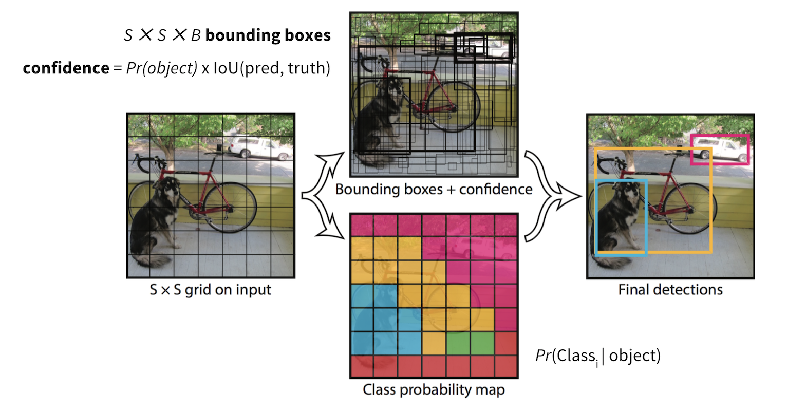
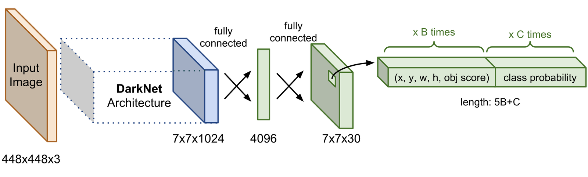
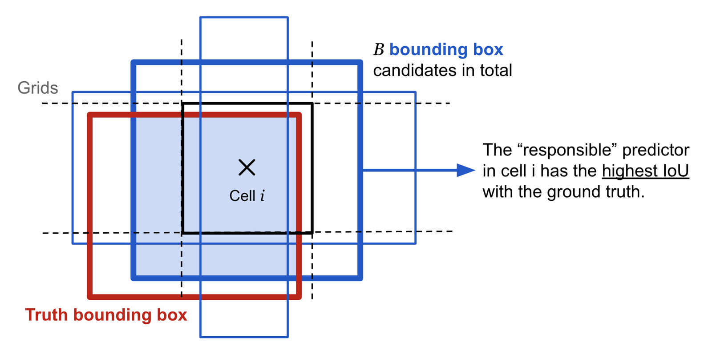
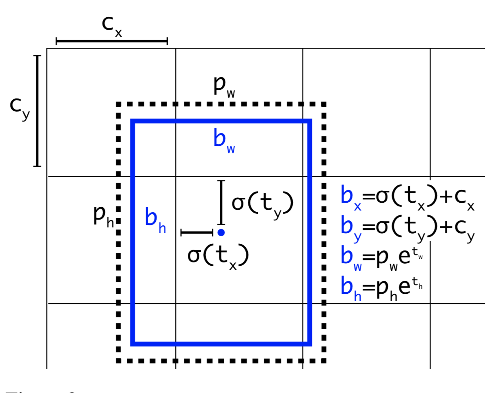
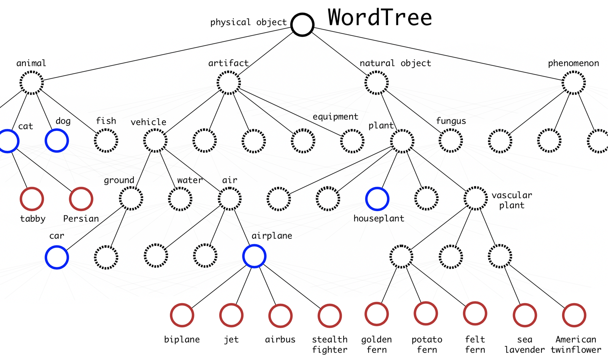
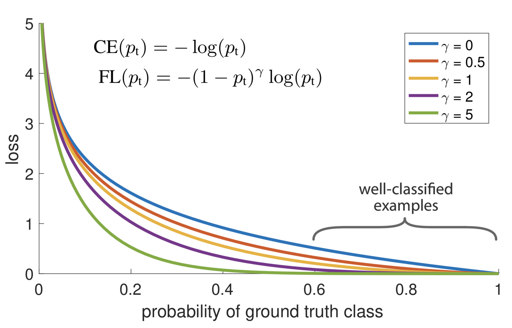
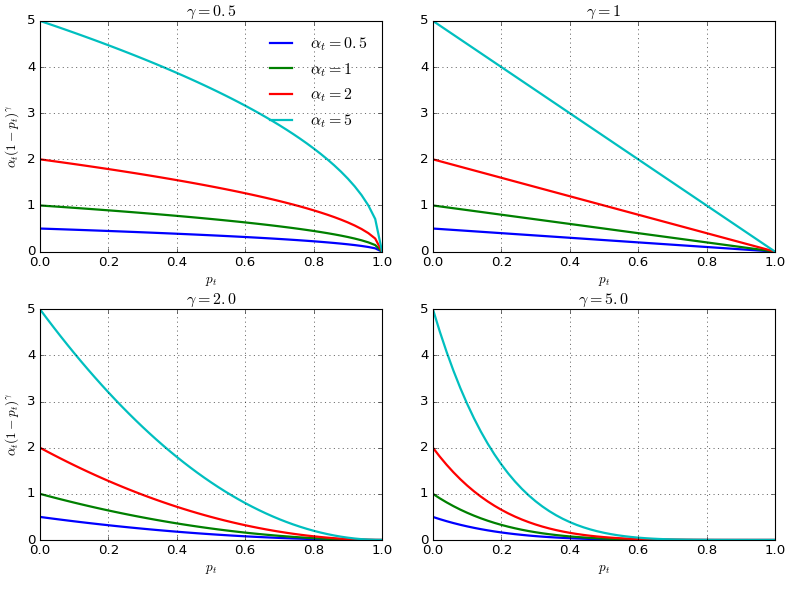
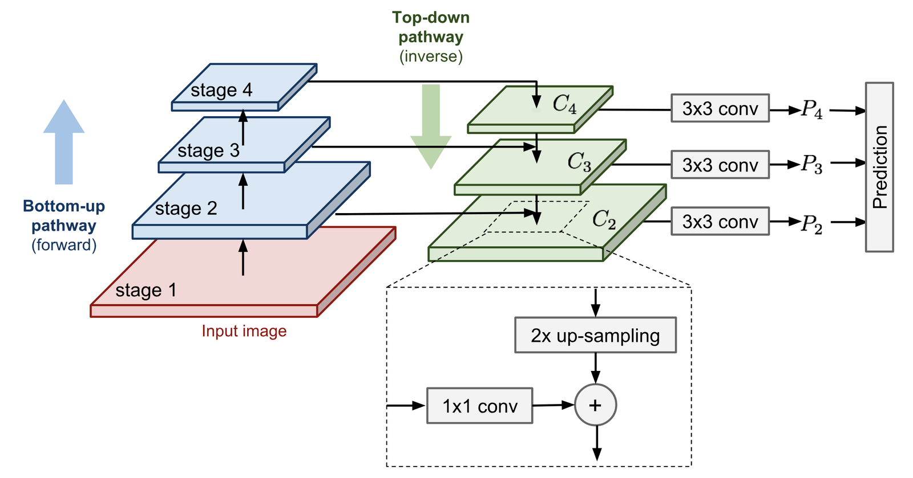
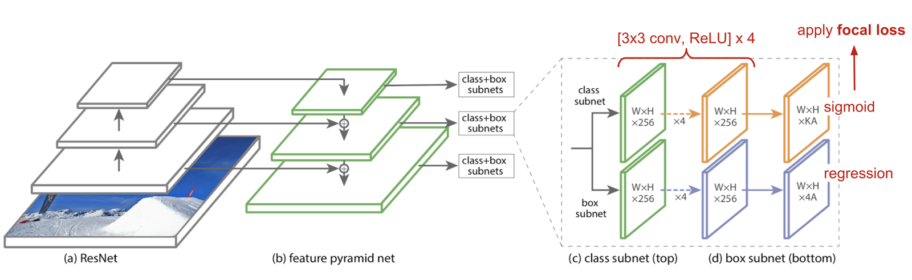
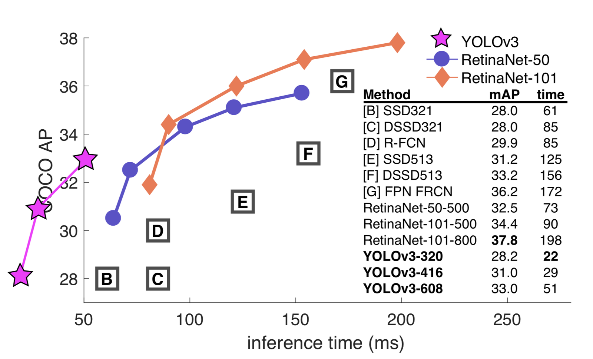

# Object Detection Part 4

**Source**: `raw/2018-12-27-object-recognition-part-4/full-article.html` (88 KB); secondary: `raw/2018-12-27-object-recognition-part-4/full-article.md`  
**Canonical URL**: https://lilianweng.github.io/posts/2018-12-27-object-recognition-part-4/  
**Author**: Lilian Weng  
**Published**: 2018-12-27  
**Ingested**: 2026-05-21  
**Tags**: #summary

## Summary

Part 4 covers **one-stage object detectors** that skip explicit region proposal and classify dense locations in a single pass—trading some accuracy for speed vs [[Two-Stage Object Detector|two-stage]] R-CNN models in [[Object Detection for Dummies Part 3]]. Weng contrasts sparse proposal + per-RoI classifiers with dense prediction over anchors or grid cells.

**YOLO** (Redmon et al., 2016) divides the image into \(S\times S\) cells; the cell containing an object's center predicts \(B\) boxes, confidence \(\mathrm{Pr}(\mathrm{obj})\times\mathrm{IoU}\), and class probabilities—output tensor \(S\times S\times(5B+K)\). **SSD** (Liu et al., 2016) uses a VGG-based **feature pyramid** with default anchor boxes at every feature-map location, multi-scale aspect ratios, smooth L1 localization + softmax classification, and hard negative mining (neg:pos ≤ 3:1). **YOLOv2/YOLO9000** add BatchNorm, anchor clustering (k-means on IoU distance), conv predictions, passthrough fine features, multi-scale training, Darknet-19, and WordTree hierarchical labels for 9000 classes. **RetinaNet** (Lin et al., 2018) combines an FPN backbone with **focal loss** \(\mathrm{FL}(p_t)=-\alpha(1-p_t)^\gamma\log p_t\) to down-weight easy background examples and close the accuracy gap with two-stage detectors.

## Series

| Part | Topic | Wiki |
|------|-------|------|
| 1–3 | Classical + R-CNN | [[Object Detection for Dummies Part 1]] … [[Object Detection for Dummies Part 3]] |
| **4** (this page) | YOLO, SSD, RetinaNet | [[Object Detection Part 4]] |

## Two-Stage vs One-Stage

| | Two-stage (R-CNN family) | One-stage (this post) |
|---|--------------------------|------------------------|
| Proposals | Sparse (SS / RPN) | Dense grid / anchors |
| Speed | Slower | Faster (real-time YOLO) |
| Typical issue | Pipeline complexity | Class imbalance (background) |

## Key Claims

- **YOLO**: responsible predictor = box with highest IoU to GT in cell; \(\lambda_{coord}=5\), \(\lambda_{noobj}=0.5\); weak on irregular groups of small objects.
- **SSD**: anchors per level with scale \(s_\ell\), aspect ratios \(\{1,2,3,1/2,1/3\}\); \(kmn(c+4)\) outputs per feature map; loc loss = R-CNN-style smooth L1 on matched boxes.
- **YOLOv2**: \(\sigma(t_x)+c_x\) centering; \(b_w=p_w e^{t_w}\); k-means priors; passthrough layer; multi-scale training (multiples of 32).
- **RetinaNet**: FPN top-down + lateral links; focal loss with \(\gamma=2, \alpha=0.25\) best in paper; competes with two-stage mAP at higher FPS.

## Figures

| Figure | Caption |
|--------|---------|
|  | Grid cells, box predictions, confidence and class outputs. |
|  | GoogLeNet-style backbone + FC output tensor. |
|  | Highest-IoU box in cell handles object loss. |
|  | VGG-16 + extra conv pyramid layers. |
|  | Multi-scale anchors on 8×8 vs 4×4 maps. |
|  | Box size vs layer index \(\ell\). |
|  | Anchor-relative sigmoid/exp parameterization. |
|  | COCO + ImageNet hierarchy for YOLO9000. |
|  | \((1-p_t)^\gamma\) down-weights easy examples. |
|  | \(\alpha(1-p_t)^\gamma\) vs \(p_t\) for different hyperparameters. |
|  | Top-down pathway merging coarse and fine features. |
|  | ResNet + FPN + classification/regression subnets. |
|  | YOLOv3, SSD, RetinaNet compared on COCO-style metrics. |

## YOLO v1 (detailed)

- Grid **\(S \times S\)**; cell owning object **center** predicts \(B\) boxes + confidences + **one** class distribution per cell (shared across \(B\)).
- Output channels per cell: **\(5B + K\)** — \((x,y,w,h)\) per box, confidence, \(K\) class probs.
- Loss: squared error; \(\lambda_{coord}=5\), \(\lambda_{noobj}=0.5\); only penalize cls if object in cell; only penalize box if **responsible** predictor (max IoU with GT in cell).
- Limits: struggles with irregular shapes and **groups of small objects** (few boxes per cell).

## SSD (detailed)

VGG-16 + extra conv layers → pyramid; **default boxes** per feature cell; scales \(s_\ell = s_{min} + \frac{s_{max}-s_{min}}{L-1}(\ell-1)\); aspect ratios \(r \in \{1,2,3,1/2,1/3\}\) plus extra scale at \(r=1\). Loss: \(\mathcal{L} = \frac{1}{N}(\mathcal{L}_{cls} + \alpha \mathcal{L}_{loc})\); hard negative mining **neg:pos ≤ 3:1**.

## YOLOv2 / YOLO9000 highlights

| Improvement | Effect |
|-------------|--------|
| BatchNorm | Faster convergence |
| High-res fine-tune | Better detection |
| Conv predictors + anchors | Like RPN; decoupled cls/loc |
| k-means anchors (IoU distance) | Better priors than hand-picked |
| \(\sigma(t_x)+c_x\), \(b_w=p_w e^{t_w}\) | Stable location learning |
| Passthrough layer | Fine features (+1% mAP) |
| Multi-scale training | Robust to input size (multiples of 32) |
| Darknet-19 | Faster backbone |
| WordTree (YOLO9000) | Joint COCO + ImageNet 9000 classes; hierarchical softmax path |

## RetinaNet / focal loss (detailed)

CE on objectness: \(\text{CE}(p_t) = -\log p_t\) where \(p_t = p\) if \(y=1\) else \(1-p\). **Focal**: \(\text{FL}(p_t) = -(1-p_t)^\gamma \log p_t\); easy examples (\(p_t \to 1\)) down-weighted. Best: \(\alpha=0.25, \gamma=2\). Backbone: [[Papers Explained 21 - Feature Pyramid Network|FPN]] on ResNet—see featurized pyramid figure.

## Entities

- [[Lilian Weng]] — author.
- [[Joseph Redmon]] — YOLO, YOLOv2, YOLO9000, YOLOv3.

## Questions & Gaps

- Post predates YOLOv4+ and transformer detectors (DETR, etc.)—see [[Papers Explained 79 - DETR]] for later paradigms.
- Focal loss detail also in [[Papers Explained 22 - Focal Loss for Dense Object Detection (RetinaNet)]]; FPN in [[Papers Explained 21 - Feature Pyramid Network]].

## Related

- [[Object Detection for Dummies Part 3]] — two-stage baseline.
- [[YOLO]], [[SSD Object Detection]], [[RetinaNet]], [[One-Stage Object Detector]], [[Two-Stage Object Detector]]
- [[Papers Explained 31 - Single Shot MultiBox Detector]], [[Papers Explained 22 - Focal Loss for Dense Object Detection (RetinaNet)]], [[Papers Explained 21 - Feature Pyramid Network]]
- [[Mean Average Precision]], [[Intersection over Union]], [[Hard Negative Mining]]
