# What are Diffusion Models?

**Source**: `raw/2021-07-11-diffusion-models/full-article.html`, `raw/2021-07-11-diffusion-models/full-article.md`  
**Ingested**: 2026-05-22  
**Tags**: #summary

## Summary

This article is an exhaustive, math-heavy survey on the foundations, formulations, and advanced evolutions of **Diffusion Generative Models**. Deconstructing the paradigm into three major families—**Denoising Diffusion Probabilistic Models (DDPM)**, **Noise-Conditioned Score Networks (NCSN)**, and **Stochastic Differential Equations (SDEs)**—the post establishes their deep mathematical equivalence. Specifically, it highlights how denoising transitions in a Markov chain correspond directly to score matching along a continuous stochastic drift, where predicting the added noise is equivalent to estimating the score of the data distribution $\nabla_x \log p(x)$.

The article details the forward diffusion process as a predefined Markov chain that systematically adds Gaussian noise to a data sample $x_0 \sim q(x)$ according to a variance schedule $\beta_1, \dots, \beta_T$:

$$q(x_1, \dots, x_T \mid x_0) = \prod_{t=1}^T q(x_t \mid x_{t-1}) \quad \text{where} \quad q(x_t \mid x_{t-1}) = \mathcal{N}(x_t; \sqrt{1 - \beta_t}x_{t-1}, \beta_t \mathbf{I})$$

A key mathematical property of the forward process is its tractability at any arbitrary timestep $t$ in closed form, using the reparameterization trick with $\alpha_t = 1 - \beta_t$ and $\bar{\alpha}_t = \prod_{i=1}^t \alpha_i$:

$$q(x_t \mid x_0) = \mathcal{N}(x_t; \sqrt{\bar{\alpha}_t}x_0, (1 - \bar{\alpha}_t)\mathbf{I}) \implies x_t = \sqrt{\bar{\alpha}_t}x_0 + \sqrt{1 - \bar{\alpha}_t}\epsilon \quad \text{where} \quad \epsilon \sim \mathcal{N}(0, \mathbf{I})$$

Conversely, the reverse process is a learned Markov chain parameterized by a neural network (typically a U-Net or a Diffusion Transformer) that learns to denoise the samples starting from $p(x_T) = \mathcal{N}(0, \mathbf{I})$ down to $x_0$:

$$p_\theta(x_{0:T}) = p(x_T) \prod_{t=1}^T p_\theta(x_{t-1} \mid x_t) \quad \text{where} \quad p_\theta(x_{t-1} \mid x_t) = \mathcal{N}(x_{t-1}; \mu_\theta(x_t, t), \Sigma_\theta(x_t, t))$$

Training optimizes the Variational Lower Bound (VLB) of the negative log-likelihood, which Ho et al. (2020) simplified into a mean squared error objective over the predicted noise vector:

$$L_{\text{simple}}(\theta) = \mathbb{E}_{t, x_0, \epsilon} \left[ \|\epsilon - \epsilon_\theta(\sqrt{\bar{\alpha}_t}x_0 + \sqrt{1 - \bar{\alpha}_t}\epsilon, t)\|^2 \right]$$

To accelerate sampling, the survey traces the transition from Markovian generation to **Denoising Diffusion Implicit Models (DDIM)**, which leverage a non-Markovian forward process sharing the same marginals $q(x_t \mid x_0)$ to define deterministic, customizable sampling trajectories. It then details modern acceleration and guidance paradigms: **Classifier-Free Guidance (CFG)**, which mathematically interpolates between conditional and unconditional score estimates; **Latent Diffusion Models (LDM)**, which partition generative modeling into an initial perceptual compression stage (via an autoencoder) and a subsequent semantic synthesis stage (via latent space denoising); **Consistency Models**, which map points along a continuous trajectory directly to the origin $x_0$ to achieve single-step generation; and **Diffusion Transformer (DiT)**, which scales up the generative backbone by swapping the standard convolutional U-Net for a patchified vision transformer.

## Key Claims

- **Denoising and Score Matching Equivalence**: Predicting the injected noise $\epsilon_\theta(x_t, t)$ in DDPM is mathematically equivalent to predicting the score function $\nabla_{x_t} \log q(x_t)$ of the noised data distribution.
- **Closed-Form Forward Trajectory**: Due to Gaussian properties, any intermediate noised state $x_t$ can be sampled directly from $x_0$ without iteratively generating intermediate states $x_1, \dots, x_{t-1}$.
- **Variance Schedule Optimization**: Replacing the traditional linear schedule of DDPM with a cosine-based variance schedule prevents the rapid destruction of signal at early timesteps, leading to improved negative log-likelihoods.
- **Deterministic Acceleration via DDIM**: DDIM permits deterministic sampling paths that require up to $10\times$ to $50\times$ fewer discretization steps than DDPM while maintaining identical marginal distributions and sample quality.
- **Classifier-Free Guidance Extrapolation**: CFG trains a single model on both conditional and unconditional objectives by randomly zeroing out the conditioning variable $y$ (e.g. text prompts). The guidance step extrapolates away from the unconditional estimate:
  $$\tilde{\epsilon}_\theta(x_t, c) = (1 + w)\epsilon_\theta(x_t, c) - w\epsilon_\theta(x_t, \emptyset)$$
- **Latent Space Decoupling**: Latent Diffusion Models (LDMs) prove that training the diffusion model inside a perceptually compressed latent space $\mathbf{z} = \mathcal{E}(x)$ reduces computational complexity significantly while enhancing spatial detail synthesis.
- **Self-Consistency Mapping**: Consistency Models establish a self-consistency function $f(x_t, t) = x_0$ that maps any state on a continuous trajectory back to the starting point. This enables high-fidelity single-step or few-step sampling.
- **Backbone Scale-up with DiT**: Swapping convolutional U-Net architectures for Diffusion Transformers (DiT) enables massive scaling, exhibiting strong scaling laws where model performance (measured by FID) improves consistently with compute budget and parameter size.

## Figures

| Figure | Caption | Source Section |
|--------|---------|----------------|
| 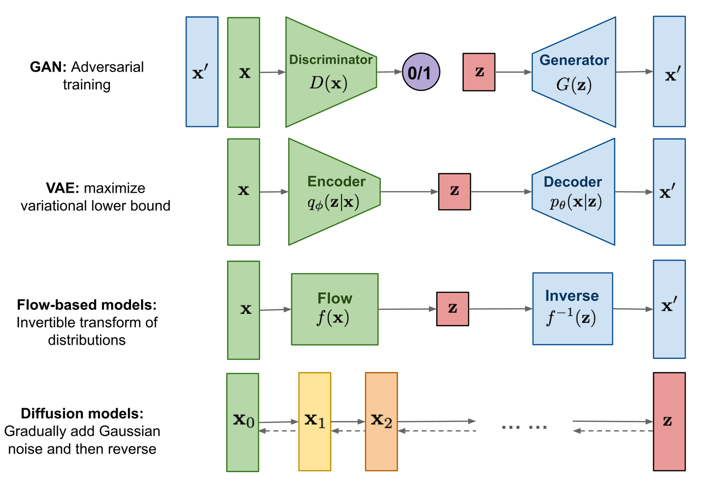 | Overview of generative model architectures: GANs (adversarial training), VAEs (variational lower bound), Flow-based models (invertible mapping), and Diffusion models (stochastic iterative denoising). | Introduction / Generative Taxonomies |
| 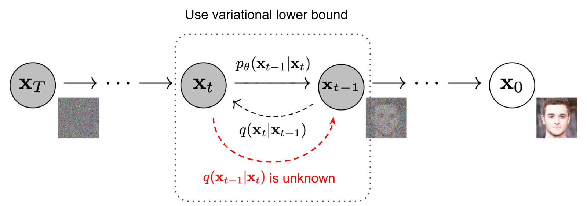 | Directed graphical model illustrating the forward Markovian chain $q(x_t \mid x_{t-1})$ adding Gaussian noise and the reverse generative process $p_\theta(x_{t-1} \mid x_t)$ predicting denoising parameters. | Denoising Diffusion Probabilistic Models |
| 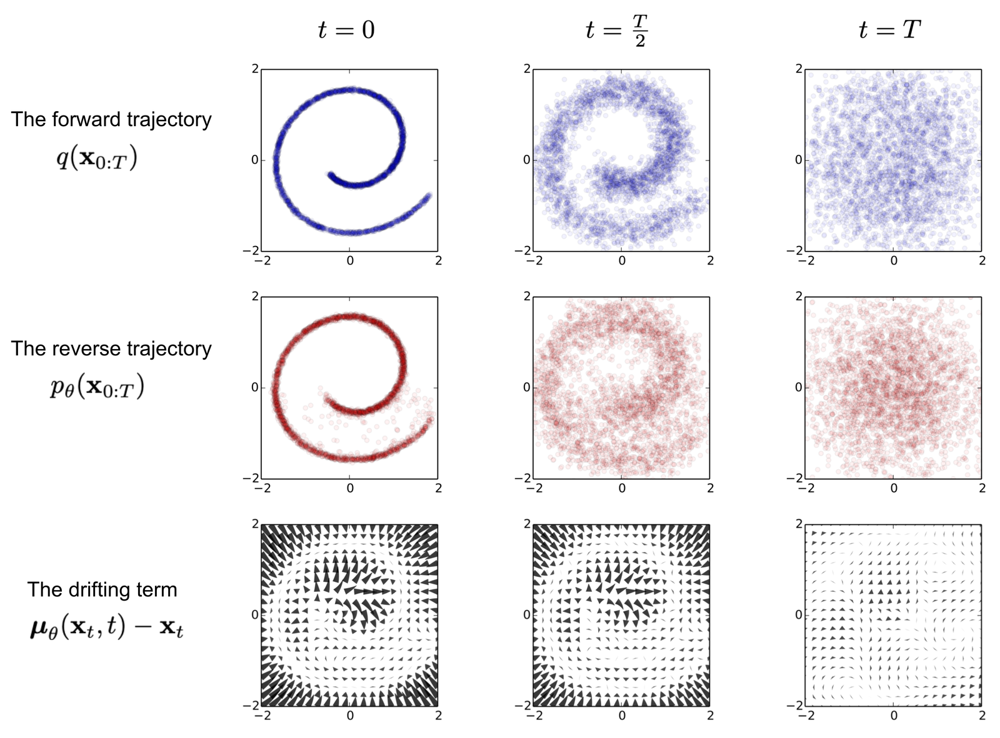 | Visual demonstration of the forward and reverse diffusion processes over a toy tractor image. The image is progressively corrupted to pure Gaussian noise and reconstructed. | DDPM Processes |
| 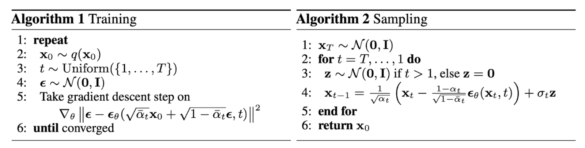 | Algorithmic details of the DDPM framework showing (1) training optimization via simplified MSE noise prediction, and (2) reverse sampling step. | DDPM Training & Sampling |
| 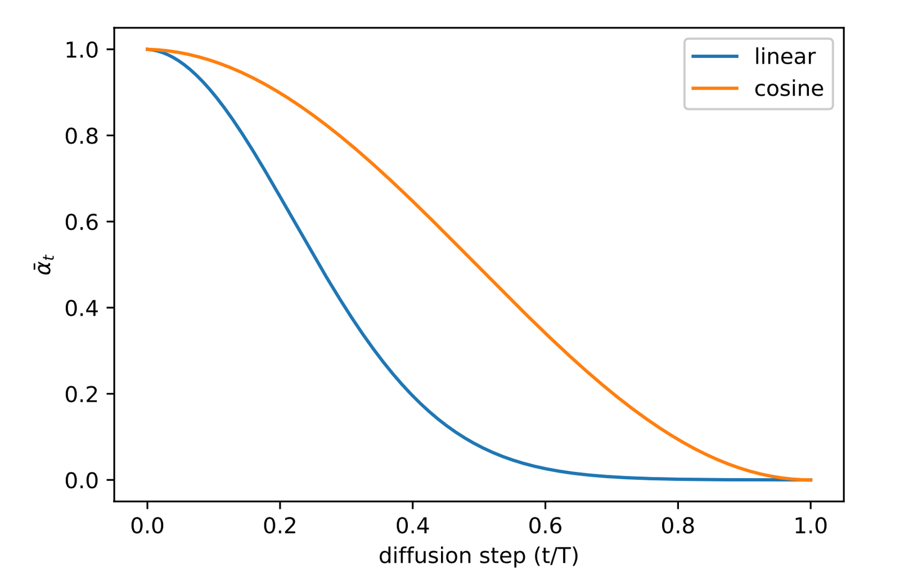 | Comparison of linear and cosine variance schedules. The cosine schedule drops variance more gradually, preventing rapid data destruction early in the chain. | Improved DDPM / Variance Schedules |
| 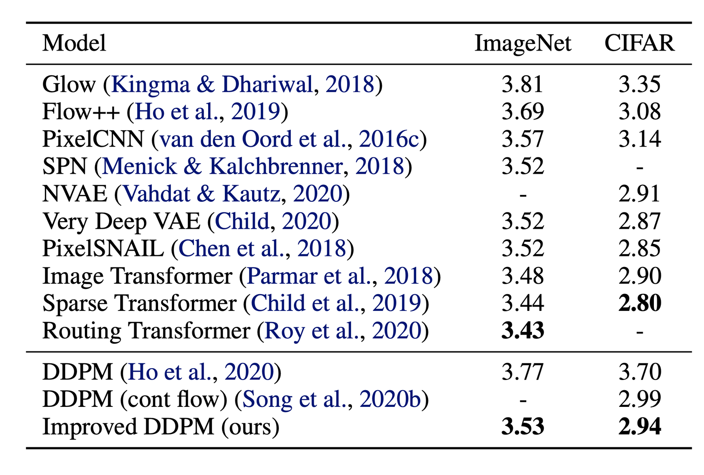 | CIFAR-10 negative log-likelihood (NLL) comparing linear vs. cosine variance schedules. Cosine schedule yields better NLL scores. | Improved DDPM Results |
| 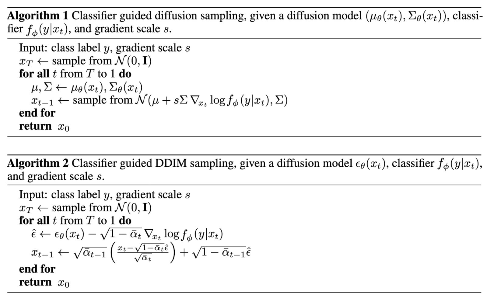 | Sampling trajectory under classifier-guided DDPM. The class-conditional mean is perturbed by the gradient of the log-probability of a classifier $\nabla_{x_t} \log p_\phi(y \mid x_t)$. | Guided Diffusion / Classifier Guidance |
| 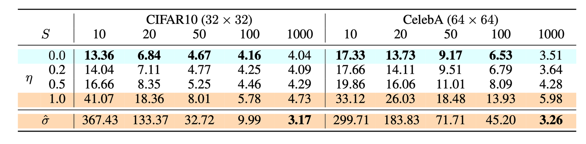 | FID quality versus sampling steps for DDIM against standard DDPM. DDIM achieves competitive FID with a fraction of the steps ($50\times$ faster). | Denoising Diffusion Implicit Models |
| 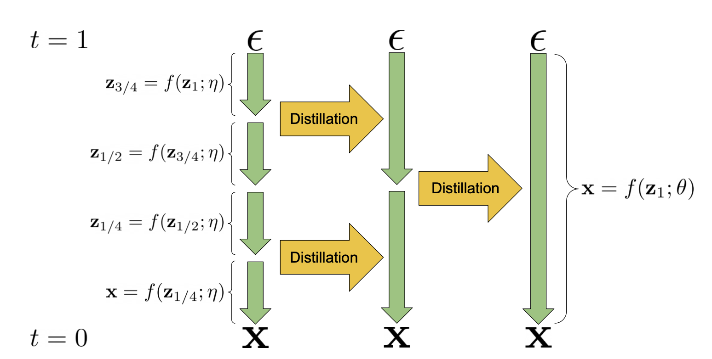 | Concept of progressive distillation. A student sampler is trained to replicate two steps of a teacher sampler in a single step, recursively halving the step budget. | Speed up Diffusion Models |
| 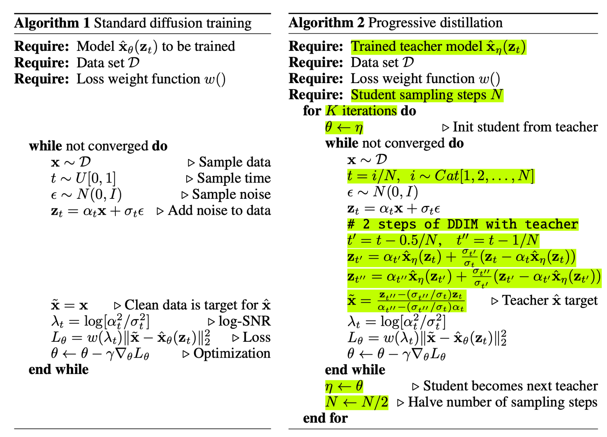 | Algorithmic formulation of progressive distillation of a deterministic sampler. | Progressive Distillation Algorithm |
| 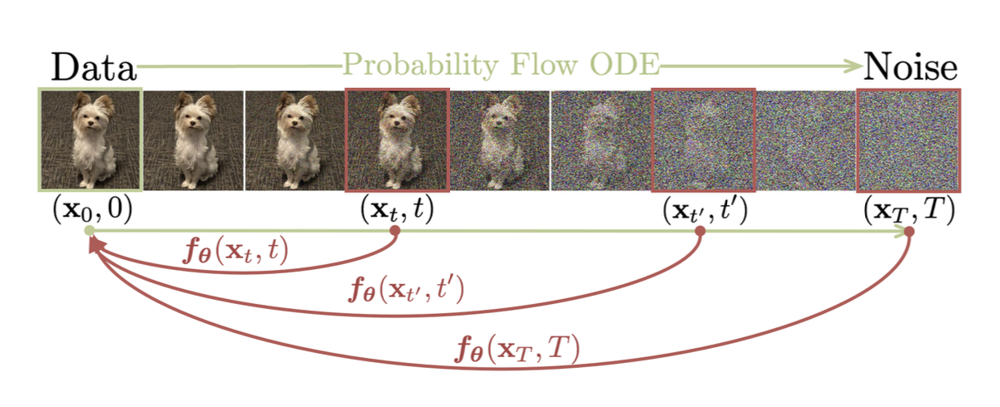 | Consistency Models training mechanism: enforcing the consistency function $f(x_t, t) = f(x_{t'}, t')$ along any point of a continuous-time probability flow ODE trajectory. | Consistency Models |
| 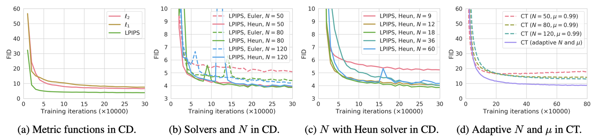 | Visual comparison of Consistency Training (CT) and Consistency Distillation (CD) on ImageNet. | Consistency Models Evaluation |
| 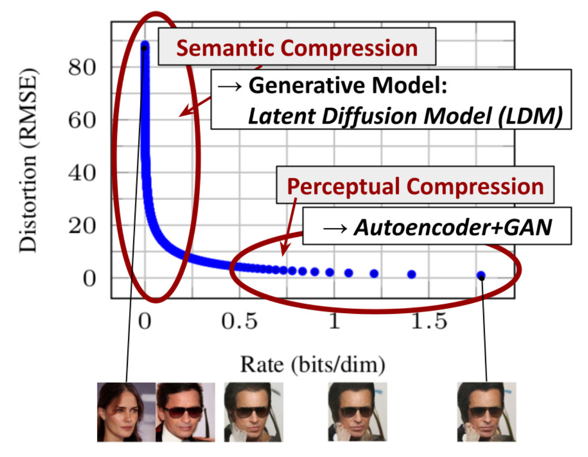 | Empirical performance (FID vs. Steps) comparing single-step generation capabilities of Consistency Models, progressive distillation, and standard samplers. | Distortion-Rate Tradeoffs |
| 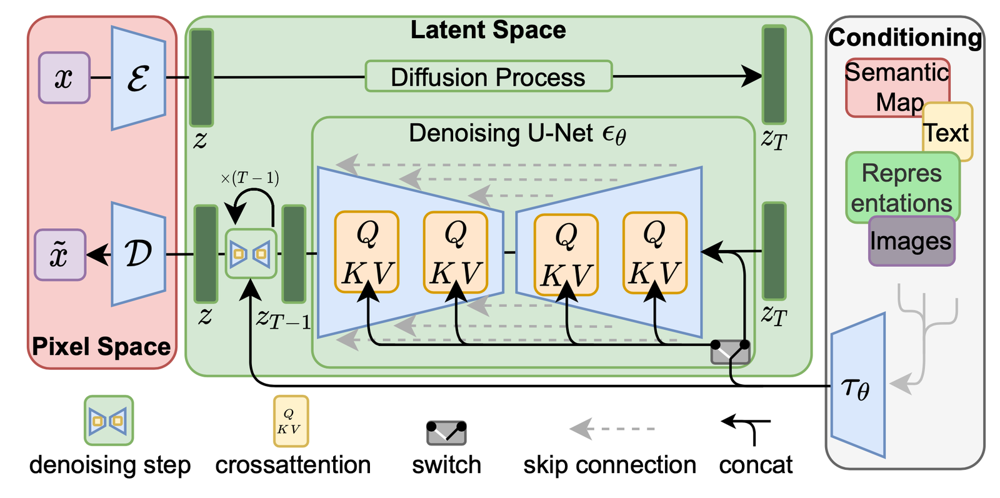 | Architecture of Latent Diffusion Models (LDMs) showing how an autoencoder compresses high-dimensional pixels into a lower-dimensional latent space where the U-Net operates. | Latent Diffusion Models |
|  | Pipeline of Cascaded Diffusion Models producing high-resolution outputs by cascading a low-resolution base diffusion model with subsequent super-resolution models. | unCLIP / Cascaded Diffusion |
| 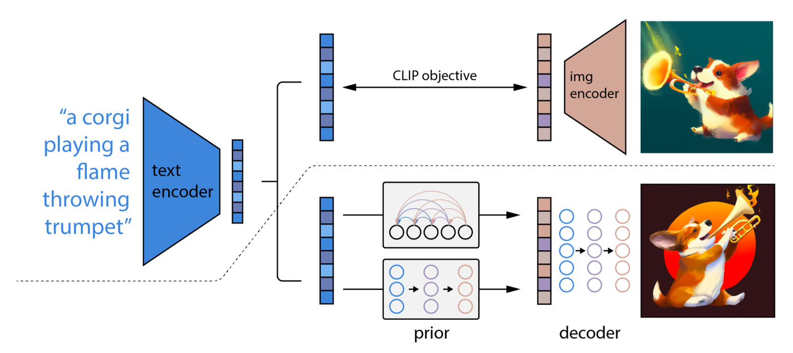 | Architecture of unCLIP (DALL-E 2) showing the prior mapping text embeddings to CLIP image embeddings and the diffusion decoder generating images. | unCLIP Architecture |
| 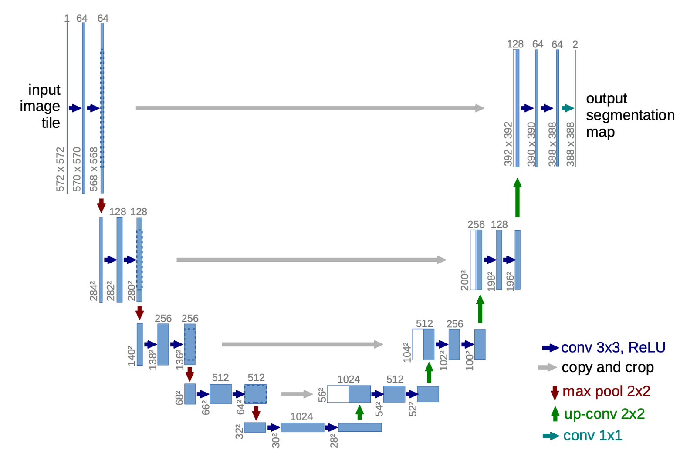 | Typical U-Net backbone design consisting of downsampling/upsampling blocks, residual blocks, self-attention, and cross-attention text-conditioning mechanisms. | Diffusion Backbones / U-Net |
| 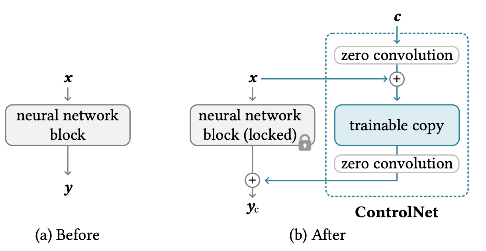 | ControlNet architecture showing how spatial conditioning (e.g. Canny edges, depth maps) is integrated by locking base weights and copying active paths with zero convolutions. | Spatial Conditioning / ControlNet |
| 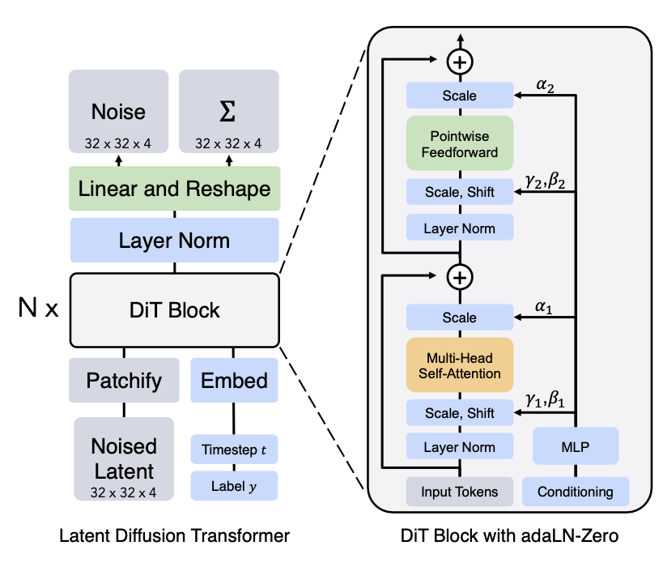 | Diffusion Transformer (DiT) architecture substituting U-Net with ViT-like block processing on latent patches, scaled via adaptive layer normalization (AdaLN). | Diffusion Transformer (DiT) |

## Entities

- [[Lilian Weng]] — ML researcher, writer, and compiler of this comprehensive survey.
- [[Denoising Diffusion Probabilistic Models]] — The mathematical foundation established by Ho et al. (2020) mapping Markovian forward/reverse trajectories.
- [[Denoising Diffusion Implicit Models]] — The deterministic non-Markovian sampling formulation by Song et al. (2020) enabling accelerated inference.
- [[Classifier-Free Guidance]] — The joint training strategy proposed by Ho & Salimans (2021) that eliminates the need for separate classifier models.
- [[Latent Diffusion Models]] — The spatial and perceptual compression framework by Rombach et al. (2022) operating diffusion inside low-dimensional latents.
- [[Consistency Models]] — The continuous boundary-trajectory self-consistency framework proposed by Song et al. (2023) to enable single-step synthesis.
- [[Diffusion Transformer]] — The scalable architecture proposed by Peebles & Xie (2022) that replaces standard convolutional backbones with patch-based Vision Transformers.

## Questions & Gaps

- **Optimizing Scheduling Dynamically**: While cosine and linear variance schedules exist, there remains a gap in establishing adaptive variance schedules based on individual sample complexities during continuous Probability Flow ODE sampling.
- **Manifold Discretization Instability**: Sampling models using low discretization numbers (e.g. $<5$ steps) can occasionally suffer from structural artifacts due to integration errors in the vector field.
- **Perceptual Autoencoder Bottlenecks**: The latent representation learned by LDM's autoencoder is fixed; training-time discrepancies or reconstruction limitations in the autoencoder set a hard ceiling on the final generation quality.

## Related

- [[Denoising Score Matching]] — The foundational score prediction theory connected to denoising.
- [[Papers Explained - GLIDE]] — A primary conditional image generation paper demonstrating the power of Classifier-Free Guidance.
- [[Lilian Weng]] — Author profile compiling notes across deep learning surveys.
- [[How Diffusion Models Work: The Math from Scratch]] — AI Summer pedagogical DDPM primer with step-by-step ELBO derivation; complements this survey's breadth with tutorial depth.
- [[An Overview of Classifier-Free Guidance for Diffusion Models]] — AI Summer CFG survey part 1: schedules, thresholding, spatial guidance extensions.
- [[An Overview of Classifier-Free Diffusion Guidance: Impaired Model Guidance with a Bad Version of Itself (Part 2)]] — AI Summer CFG part 2: autoguidance and training-free impaired-model alternatives.
