# How to Train Really Large Models on Many GPUs?

**Source**: `raw/2021-09-25-train-large/full-article.html` (HTML) and `raw/2021-09-25-train-large/full-article.md` (Markdown Sibling)  
**Ingested**: 2026-05-21  
**Tags**: #summary

## Summary

"How to Train Really Large Models on Many GPUs?" is an exhaustive, highly influential synthesis of distributed deep learning systems, written by Lilian Weng. It serves as a comprehensive reference for scaling deep neural networks whose parameters and training states far exceed the memory limits of a single accelerator node (such as an individual GPU). Weng breaks down the core bottlenecks of large-scale model training—namely, the excessive memory footprints of model parameters, gradients, optimizer states (particularly under Adam), and intermediate activation tensors—and compiles a systematic taxonomy of state-of-the-art parallelism paradigms and memory-saving designs.

The synthesis begins by categorizing training parallelism strategies across three core dimensions: **Data Parallelism (DP)**, **Model Parallelism (MP)**, and **Tensor Parallelism (TP)**. In standard data parallelism, models are replicated across workers, which quickly fails when a model exceeds single-node memory. To address this, Weng contrasts vertical model splitting (simple Model Parallelism) with advanced **Pipeline Parallelism (PP)** frameworks such as **GPipe** (which splits minibatches into synchronous microbatches) and **PipeDream** (which adopts a 1F1B—One Forward, One Backward—asynchronous scheduling pattern with weight stashing or double-buffering to minimize idle bubbles). She further details horizontal tensor sharding via **Tensor Parallelism** as implemented in **Megatron-LM**, which shards attention and MLP blocks across devices, and the hybrid **PTD-P** pipeline scheduling that interleaves model chunks to maximize hardware utilization.

Beyond vertical and horizontal splitting, the post details two crucial domains of modern extreme-scale ML engineering: **Sparsely-Gated Mixture-of-Experts (MoE)** and **Memory Optimization**. Under MoE, Weng charts the progress from early sparsely gated layers (Shazeer et al. 2017) to **GShard**'s sharded top-2 gating with local group dispatching, the **Switch Transformer**'s top-1 routing (which scales to trillions of parameters), and **Expert Choice (EC) Routing** which reverses token routing to ensure perfect load balancing. Orthogonally, she catalogs critical memory-saving tricks, including **Activation Recomputation** (sublinear $O(\sqrt{\ell})$ memory scaling), **Mixed Precision Training** (FP16/FP32 master copies, loss scaling, and arithmetic precision), **Optimizer Memory Reduction** (Adafactor and SM3), and the widely adopted **ZeRO (Zero Redundancy Optimizer)** DP partitioning framework.

---

## Key Claims & Mathematical Foundations

*   **Pipeline Bubbles and Synchronous Microbatching**: In naive vertical model parallelism, sequential dependency across layers causes massive idle bubbles where devices sit under-utilized. **GPipe** resolves this by splitting a minibatch of size $m$ into smaller microbatches processed in parallel across $d$ pipeline partitions. The idle bubble fraction is mathematically defined as:
    $$\text{Bubble Fraction} = 1 - \frac{2md}{(2m + 2(d-1))d} = \frac{d-1}{m+d-1}$$
    If the number of microbatches $m$ is at least $4\times$ the pipeline depth $d$ ($m > 4d$), the bubble overhead becomes negligible when combined with activation recomputation.
*   **Asynchronous PipeDream and Weight Stashing**: Unlike GPipe's synchronous step, **PipeDream** implements a 1F1B schedule where workers alternate between forward and backward steps. To prevent learning instability caused by asynchronous weight updates (where the forward pass and backward pass of a microbatch use different parameter versions), PipeDream implements **Weight Stashing**, forcing each worker to store multiple stashed parameter versions corresponding to active in-flight batches. **PipeDream-2BW** reduces this footprint by maintaining exactly two weight versions via double-buffering.
*   **Intra-Layer Tensor Parallelism**: **Megatron-LM** shards the individual weight matrices of a transformer block horizontally. For a Feed-Forward Network (FFN) layer with GEMMs, weights are split column-wise in the first layer and row-wise in the second:
    $$\begin{aligned}
    \text{Split } A &= [A_1, A_2] \quad (\text{Column-wise}) \\
    [Y_1, Y_2] &= [\text{GeLU}(X A_1), \text{GeLU}(X A_2)] \\
    B &= \begin{bmatrix} B_1 \\ B_2 \end{bmatrix} \quad (\text{Row-wise}) \\
    Z &= Y_1 B_1 + Y_2 B_2
    \end{aligned}$$
    This row-wise second layer naturally sums the parallel outputs using an `AllReduce` operation, minimizing communication boundaries. Multi-Head Attention blocks are sharded similarly: query, key, and value matrices ($Q, K, V$) are partitioned column-wise, and the output projection matrix is sharded row-wise.
*   **Sparsely-Gated Mixture-of-Experts and Noisy Gating**: An MoE layer routes input representations $x$ to a subset of $n$ feed-forward expert networks $\{E_i\}_{i=1}^n$ using a gating network $G(x)$. To maintain sparsity and add structural exploration, **Noisy Top-k Gating** adds tunable Gaussian noise to the gating logits before selecting the top $k$ experts:
    $$\begin{aligned}
    G(x) &= \text{softmax}(\text{topk}(H(x), k)) \\
    H^{(i)}(x) &= (x W_g)^{(i)} + \epsilon \cdot \text{softplus}((x W_{\text{noise}})^{(i)}) \quad \text{where } \epsilon \sim \mathcal{N}(0, 1) \\
    \text{topk}^{(i)}(v, k) &= \begin{cases} v^{(i)} & \text{if } v^{(i)} \text{ is in the top } k \text{ elements of } v \\ -\infty & \text{otherwise} \end{cases}
    \end{aligned}$$
*   **Mitigating Expert Load Imbalance**: To prevent the gating network from routing all tokens to a few "strong" experts (causing memory/compute bottlenecks and severe under-utilization of other experts), Shazeer et al. (2017) introduce an auxiliary **Importance Loss** based on the batchwise average coefficient of variation (CV):
    $$L_{\text{aux}} = w_{\text{aux}} \cdot \text{CV}\left(\sum_{x \in X} G(x)\right)^2$$
    In **Switch Transformer**, which simplifies routing by selecting exactly one expert ($k=1$), load balancing is enforced by minimizing the cross-entropy of token fractions $f_i$ and routing probabilities $p_i$:
    $$L_{\text{aux}} = w_{\text{aux}} \sum_{i=1}^n f_i p_i$$
*   **Reversing Gating via Expert Choice (EC)**: Rather than having tokens choose their preferred experts (which can lead to over-capacity overflows and token dropping), **Expert Choice Routing** reverses the routing path: each expert selects its top-$k$ tokens based on token-to-expert affinity scores $S = \text{softmax}(X \cdot W_g)$. This guarantees absolute load balancing and fixed capacities:
    $$G, I = \text{top-k}(S^\top, k) \quad P = \text{one-hot}(I)$$
    However, EC requires knowing future tokens and thus cannot be applied directly in autoregressive decoding or extremely small batch sizes.
*   **Sublinear Memory Cost via Activation Recomputation**: Standard training stores all intermediate layer activations in GPU memory to compute backward gradients, leading to $O(\ell)$ memory scaling for $\ell$ layers. **Activation Recomputation** only saves activations at partition boundaries (checkpoints) and recomputes the intermediate activations on the fly during the backward pass. This reduces the memory cost to:
    $$M(\ell) = O\left(\frac{\ell}{d}\right) + O(d)$$
    Setting the partition depth $d = \sqrt{\ell}$ minimizes the memory cost to $O(\sqrt{\ell})$, requiring only a single additional forward pass computation per batch.
*   **Mixed Precision Stabilization**: Half-precision (FP16) training reduces memory usage by 2x but is highly susceptible to gradient underflow. Narang & Micikevicius (2018) stabilize this via three key methods:
    1.  **Full-Precision Master Copy**: Storing a master copy of weights in FP32 to accumulate tiny gradient updates (updates $< 2^{-24}$ round to zero in FP16).
    2.  **Loss Scaling**: Multiplying the loss by a constant factor (e.g. 8 or 16) to scale tiny gradients up into the representable FP16 range, and unscaling before the weight update.
    3.  **Arithmetic Precision**: Accumulating vector dot-products and reduction sums in FP32, then casting down to FP16.
*   **ZeRO State Partitioning**: **ZeRO (Zero Redundancy Optimizer)** eliminates redundant copies of model states across data-parallel processes. It shards states dynamically:
    -   **ZeRO-1**: Partitions the Adam optimizer states (momentums, variances) across DP processes (4x memory reduction).
    -   **ZeRO-2**: Partitions both optimizer states and gradients (8x memory reduction).
    -   **ZeRO-3**: Partitions optimizer states, gradients, and model parameters, fetching required weights on the fly via collective communication (`AllGather`).

---

## Figures

Below is the mapping of all 17 figures extracted and mirrored from the canonical HTML source.

| Figure | Caption | Section |
|--------|---------|---------|
| 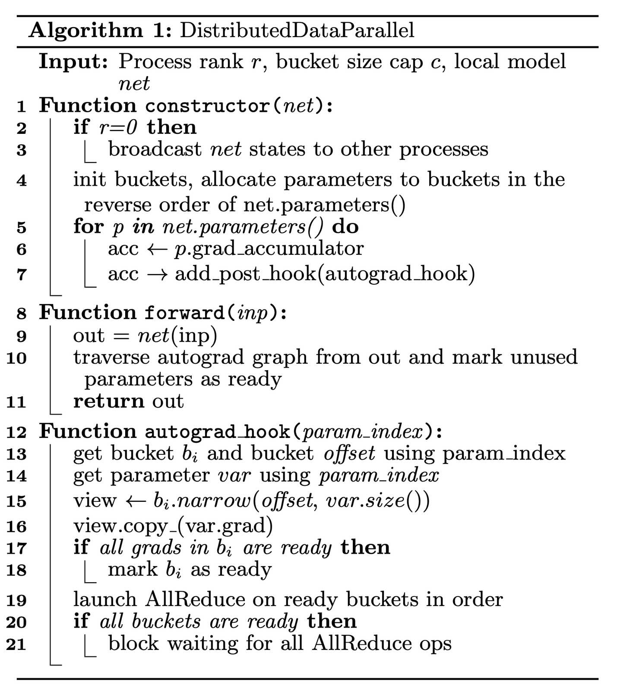 | PyTorch DDP execution flow and gradient bucketing pseudo code. | Data Parallelism |
| 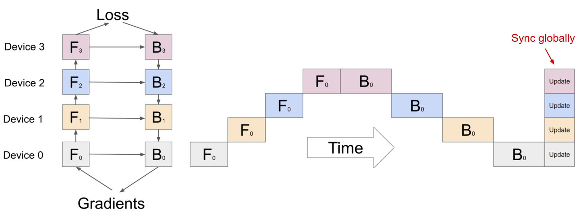 | Naive model parallelism vertical splitting causing severe idle "bubbles". | Model Parallelism |
| 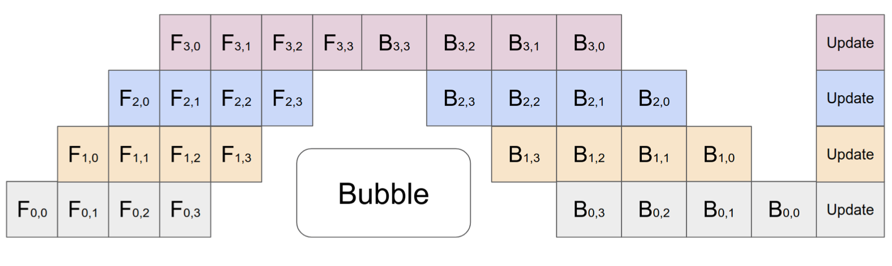 | GPipe pipeline parallelism microbatch scheduling with synchronous update. | Pipeline Parallelism |
| 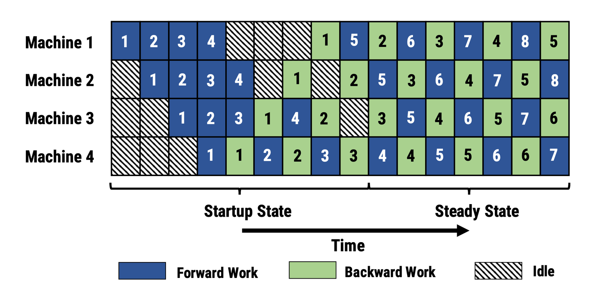 | PipeDream 1F1B (One Forward, One Backward) microbatch scheduling. | Pipeline Parallelism |
| 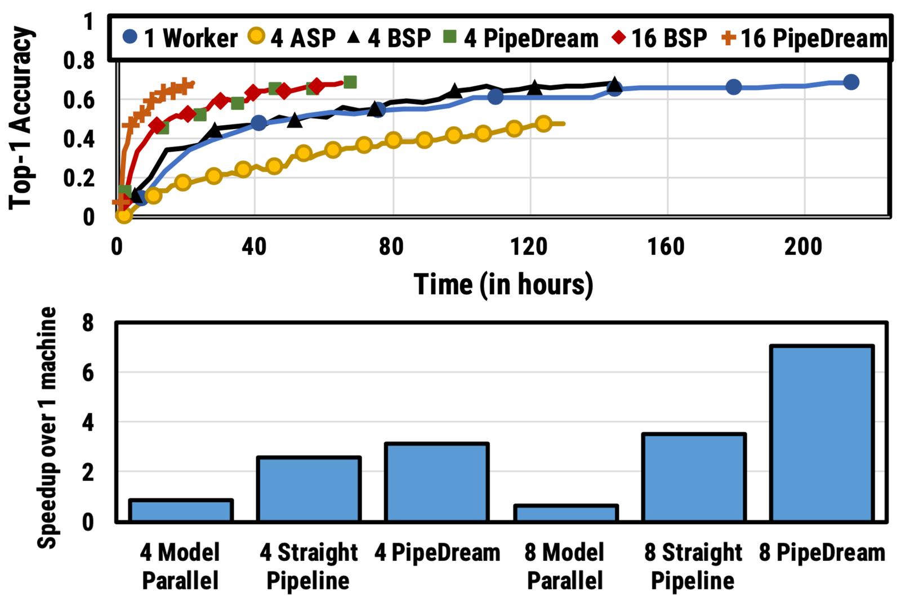 | VGG16 speedup results across BSP, ASP, and PipeDream pipeline variations. | Pipeline Parallelism |
| 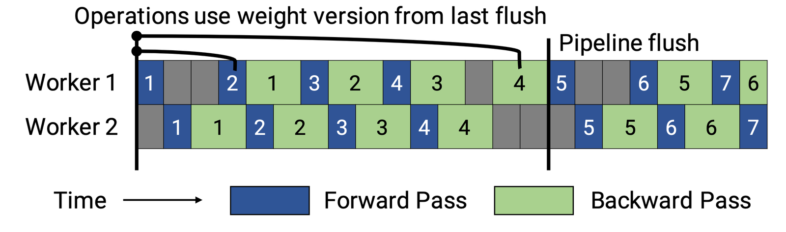 | PipeDream-Flush scheduling with periodic pipeline flushes to save memory. | Pipeline Parallelism |
| 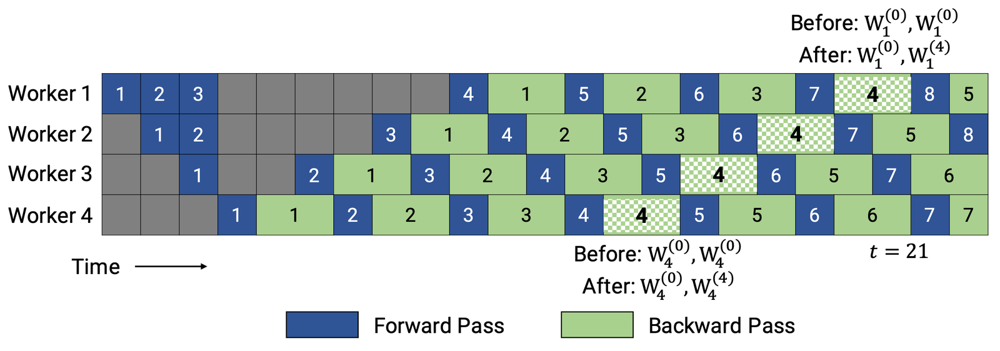 | PipeDream-2BW double-buffered weight scheduling limiting weight versions to two. | Pipeline Parallelism |
| 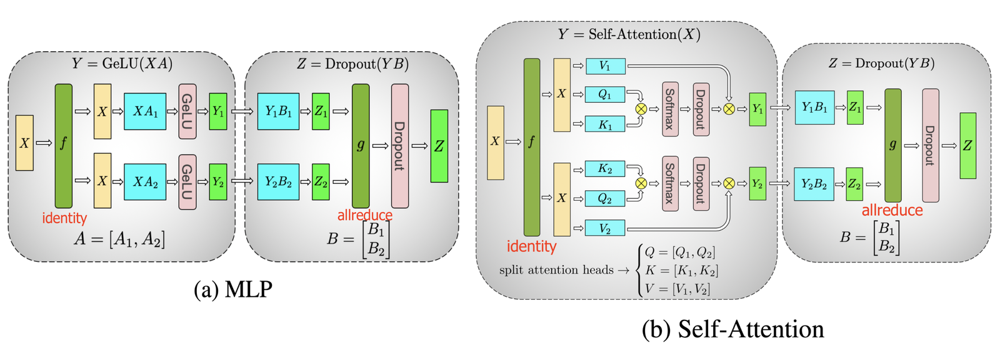 | Megatron-LM horizontal tensor parallelism sharding for MLP and Attention blocks. | Tensor Parallelism |
| 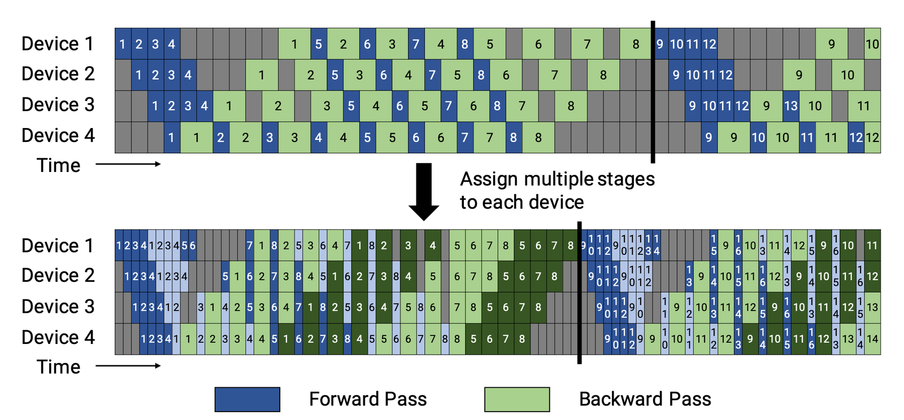 | PTD-P interleaved 1F1B schedule reducing bubble sizes across multiple model chunks. | Tensor Parallelism |
| 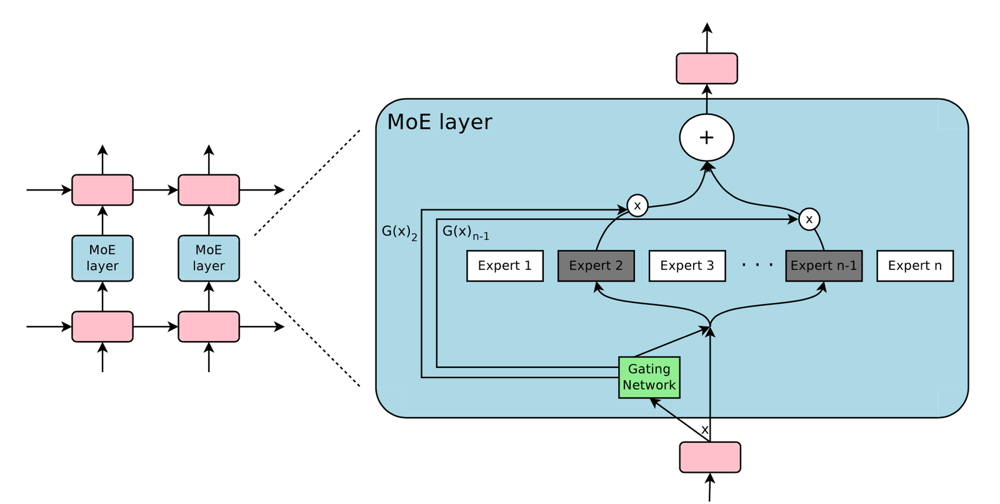 | Sparsely-Gated Mixture-of-Experts layer routing tokens to active experts. | Mixture-of-Experts (MoE) |
| 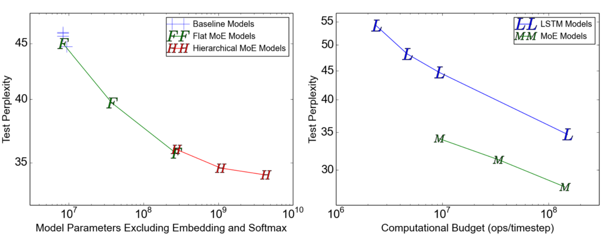 | Test perplexity and throughput scaling with varying numbers of experts. | Mixture-of-Experts (MoE) |
| 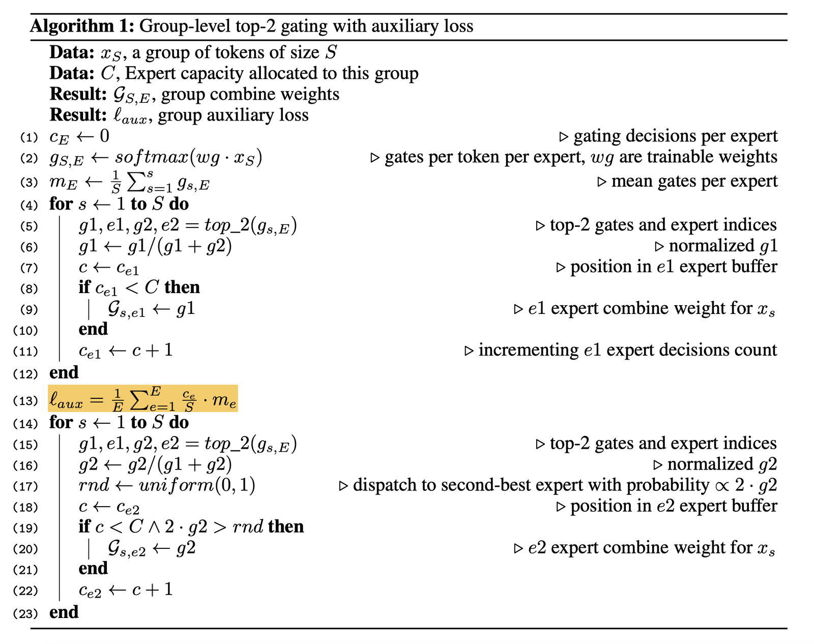 | GShard group-level top-2 gating with auxiliary load-balance loss pseudo code. | Mixture-of-Experts (MoE) |
| 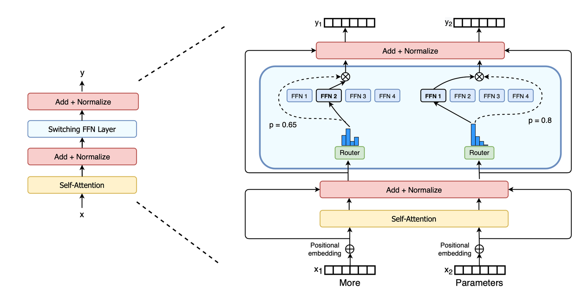 | Switch Transformer sparse switch FFN layer routing to exactly one expert. | Mixture-of-Experts (MoE) |
| 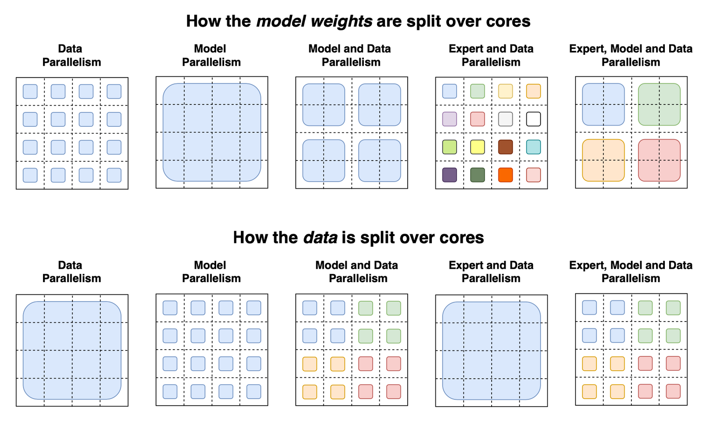 | Switch Transformer sharding strategies (data, model, expert, and hybrid). | Mixture-of-Experts (MoE) |
| 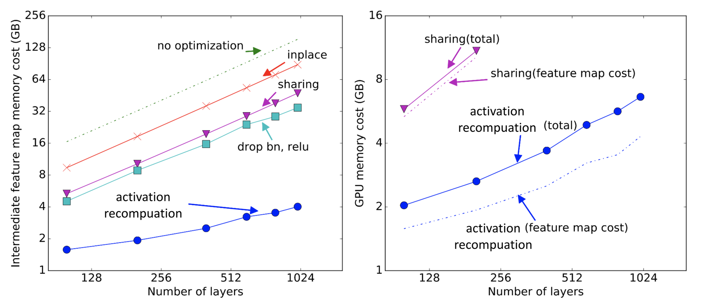 | Memory cost comparisons of activation sharing, in-place, and recomputation. | Activation Recomputation |
| 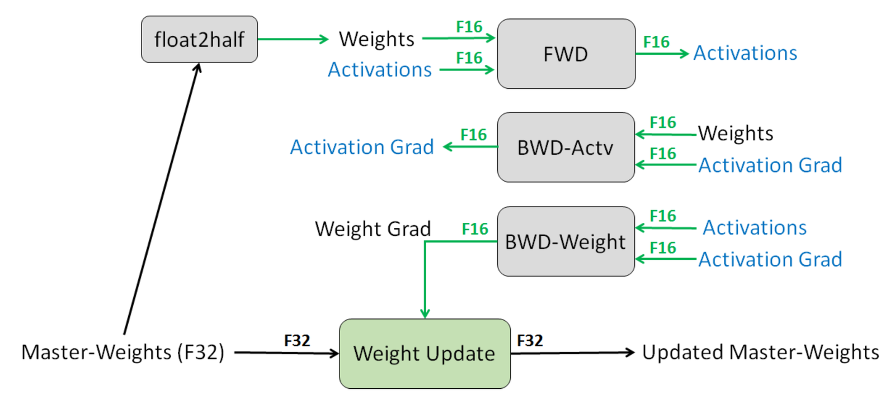 | Mixed Precision Training workflow highlighting master weights and loss scaling. | Mixed Precision Training |
| 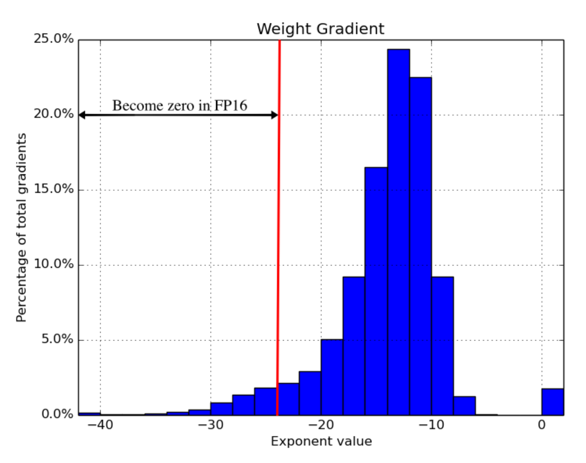 | FP32 gradient exponent histogram showing underflow values lost in FP16. | Mixed Precision Training |

---

## Entities

*   [[Lilian Weng]] — Author of the original post, ML researcher, and Head of Safety Systems at OpenAI.
*   [[DeepSpeed]] — Microsoft's deep learning library that implements **ZeRO**, CPU offloading, and 3D parallelism strategies.
*   [[Megatron-LM]] — NVIDIA's library introducing **Tensor Parallelism** for horizontal intra-layer scaling.
*   [[GPipe]] — Google's framework introducing microbatch-based synchronous **Pipeline Parallelism**.
*   [[Microsoft]] — The organization behind the development and open-sourcing of **DeepSpeed** and **ZeRO**.

---

## Questions & Gaps

*   **EC Autoregressive Incompatibility**: While **Expert Choice (EC)** routing completely eliminates load imbalance and token overflow during pre-training, it remains fundamentally incompatible with autoregressive generation (inference). Because auto-regressive decoding generates tokens sequentially, there is no batch of future tokens available for the experts to perform a top-$k$ selection. A hybrid routing strategy that bridges EC pre-training with token-choice inference remains an active research challenge.
*   **Loss Scaling Automation**: Traditional Mixed Precision loss scaling relies on manual, dynamic heuristics (e.g. doubling the scale factor until a NaN overflow occurs, then halving it). These fluctuations can cause transient instability during massive runs, and a rigorous, mathematically unified framework for automated, optimal loss-scale estimation is still missing.
*   **Load Balancing in Deep MoE Routing**: While GShard and Switch Transformer enforce balanced routing via auxiliary losses, these losses act as soft regularization constraints. In practice, during long training runs with diverse distribution shifts, experts still experience transient computation spikes and capacity drops, leading to padding wastes or under-trained expert networks.

---

## Related

*   [[Data Parallelism]] — Concepts and architectures for replication-based scaling.
*   [[Model Parallelism]] — Vertical layer sharding strategies across devices.
*   [[Pipeline Parallelism]] — Microbatch scheduling frameworks including GPipe and PipeDream.
*   [[Tensor Parallelism]] — Horizontal intra-layer sharding developed in Megatron-LM.
*   [[Activation Recomputation]] — Memory reduction techniques yielding sublinear scaling.
*   [[Mixed Precision Training]] — FP16 training stability methods using loss scaling and master weights.
*   [[ZeRO]] — Memory redundancies optimization sharding optimizer states, gradients, and weights.
*   [[Mixture of Experts]] — Sparse architectures employing gated routing networks.
