# Learning with not Enough Data Part 1: Semi-Supervised Learning

**Source**: `raw/2021-12-05-semi-supervised/full-article.html` (119 KB HTML), `raw/2021-12-05-semi-supervised/full-article.md` (Markdown sibling)  
**Canonical URL**: https://lilianweng.github.io/posts/2021-12-05-semi-supervised/  
**Author**: Lilian Weng  
**Published**: 2021-12-05  
**Ingested**: 2026-05-22  
**Tags**: #summary

## Summary

Part 1 of Lilian Weng's "Learning with not enough data" trilogy is a vision-centric survey of **semi-supervised learning (SSL)** — training jointly on a small labeled set $\mathcal{X}$ and a large unlabeled pool $\mathcal{U}$ when full annotation is expensive. Weng positions SSL among four strategies for scarce labels: (1) pre-train + fine-tune on a large unlabeled corpus, (2) SSL, (3) active learning (Part 2), and (4) LM-driven data generation (Part 3). Most SSL literature in the post targets **computer vision**; language pipelines more often rely on large-scale pre-training than dedicated SSL losses.

Nearly every method shares $\mathcal{L} = \mathcal{L}_s + \mu(t)\mathcal{L}_u$, where $\mathcal{L}_s$ is supervised loss on labeled data and $\mu(t)$ ramps up the unsupervised term over training steps. Weng organizes $\mathcal{L}_u$ around **consistency regularization** (predictions invariant under dropout/augmentation) and **pseudo labeling** (high-confidence model predictions as targets). The narrative runs from classical Π-model / temporal ensembling through Mean Teacher, VAT, ICT, and UDA; then pseudo labels, self-training, Noisy Student, and Meta Pseudo Labels; finally hybrids MixMatch → ReMixMatch → DivideMix → **FixMatch**, and closing with **SimCLRv2 + distillation** as a pre-training alternative that can match dedicated SSL.

The post is equation-heavy and explicitly excludes architecture-modification SSL (generative models, graph methods — see van Engelen & Hoos 2020). A closing checklist summarizes modern themes: diverse augmentation, MixUp, confidence thresholds, minimum labeled samples per batch, and distribution sharpening.

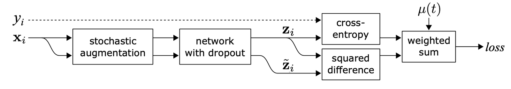

## Notation

| Symbol | Meaning |
|--------|---------|
| $L$ | Number of unique labels |
| $(\mathbf{x}^l, y) \sim \mathcal{X}$, $y \in \{0,1\}^L$ | Labeled sample; one-hot label |
| $\mathbf{u} \sim \mathcal{U}$ | Unlabeled sample |
| $\mathcal{D} = \mathcal{X} \cup \mathcal{U}$ | Full training set |
| $\bar{\mathbf{x}}$ | Augmented version of $\mathbf{x}$ |
| $\mathcal{L}_s$, $\mathcal{L}_u$ | Supervised and unsupervised losses |
| $\mu(t)$ | Unsupervised weight (often ramped over time) |
| $f_\theta$, $\mathbf{z}$, $\hat{y}$ | Network, logits, softmax prediction |
| $D[\cdot,\cdot]$ | MSE, CE, or KL between distributions |
| $\beta$ | EMA decay for teacher weights |
| $\alpha$, $\lambda$ | MixUp Beta$(\alpha,\alpha)$ parameters |
| $T$ | Sharpening temperature |
| $\tau$ | Confidence threshold for pseudo labels |

## Structural Hypotheses (H1–H4)

| ID | Name | Content |
|----|------|---------|
| H1 | Smoothness | Nearby points in a high-density region should share labels |
| H2 | Cluster | Dense regions form clusters with shared labels (extension of H1) |
| H3 | Low-density separation | Decision boundaries lie in sparse regions, not through clusters |
| H4 | Manifold | High-dimensional data lies on a lower-dimensional manifold — foundation for [[Representation Learning]] |

## Method Families

### Consistency regularization

**Π-model** (Sajjadi 2016; Laine & Aila 2017): two stochastic passes on the same input should agree:
$$\mathcal{L}_u^\Pi = \sum_{\mathbf{x} \in \mathcal{D}} \text{MSE}(f_\theta(\mathbf{x}), f'_\theta(\mathbf{x}))$$

**Temporal ensembling**: per-sample EMA of predictions $\tilde{\mathbf{z}}_i$, updated once per epoch with bias correction:
$$\tilde{\mathbf{z}}^{(t)}_i = \frac{\alpha \tilde{\mathbf{z}}^{(t-1)}_i + (1-\alpha)\mathbf{z}_i}{1-\alpha^t}$$

**[[Mean Teacher]]**: EMA of *weights* $\theta' \leftarrow \beta\theta' + (1-\beta)\theta$ — faster targets on large data; MSE consistency; student-only augmentation/dropout; $\beta=0.99$ ramp-up then $0.999$ late training.

**VAT** (Miyato et al. 2018): virtual adversarial perturbation $r_\text{vadv}$ maximizing divergence from fixed-copy prediction $p_{\hat{\theta}}(y|\mathbf{x})$; applies to labeled and unlabeled data.

**ICT** (Verma et al. 2019): MixUp on unlabeled pairs with interpolated teacher predictions as targets — encourages consistency along lines between unlabeled points (often near decision boundaries).

**[[Unsupervised Data Augmentation]]** (Xie et al. 2020): consistency between clean $\mathbf{x}$ and RandAugment view $\bar{\mathbf{x}}$; **low-confidence masking** + **sharpening** + in-domain filtration. Near fully-supervised CIFAR-10 error with only 250 labels.

### Pseudo labeling

**Pseudo labeling** (Lee 2013) ≡ **entropy regularization** on unlabeled data (Grandvalet & Bengio 2004) — pushes boundaries to low-density regions.

**Label propagation** (Iscen et al. 2019): similarity graph diffusion of labels from known to unknown samples (k-NN-like, poor scaling).

**Self-training / [[Noisy Student]]**: iterative teacher→student pseudo labels; student must be **larger**, trained with **noise** (RandAugment, dropout, stochastic depth), **class-balanced** soft labels; 300M pseudo-labeled ImageNet images.

**Meta Pseudo Labels** (Pham et al. 2021): teacher optimized via student performance on labeled set (MAML-style one-step gradient); UDA loss on teacher.

**Confirmation-bias mitigations** (Arazo et al. 2020): MixUp with soft pseudo labels; minimum labeled count per mini-batch via oversampling (not loss upweighting).

### Hybrids (consistency + pseudo labels)

| Method | Key mechanism |
|--------|----------------|
| [[MixMatch]] | $K$ augmentations → average → sharpen → MixUp; $\mathcal{L}_s + \mathcal{L}_u$ |
| ReMixMatch | + distribution alignment $p(y)/\tilde{p}(\hat{y})$; augmentation anchoring (CTAugment) |
| [[DivideMix]] | GMM on per-sample loss splits clean/noisy; dual networks (co-divide, co-refinement, co-guessing) |
| [[FixMatch]] | Weak-augment pseudo label + strong-augment CE; threshold $\tau$; Cutout/CTAugment required |

**FixMatch** losses:
$$\mathcal{L}_s = \frac{1}{B}\sum_{b=1}^B \text{CE}(y_b, p_\theta(y|\mathcal{A}_\text{weak}(\mathbf{x}_b)))$$
$$\mathcal{L}_u = \frac{1}{\mu B}\sum_{b=1}^{\mu B} \mathbb{1}[\max(\hat{y}_b) \geq \tau]\;\text{CE}(\hat{y}_b, p_\theta(y|\mathcal{A}_\text{strong}(\mathbf{u}_b)))$$

Ablation: weak augmentation essential for label guessing; strong-only diverges; sharpening redundant when $\tau$ is used.

### Pre-training + self-training (SimCLRv2)

Chen et al. (2020) three-step pipeline: (1) self-supervised pretrain (SimCLRv2), (2) supervised fine-tune on few labels — **bigger models = more label-efficient**, (3) distillation on unlabeled data with fixed teacher $\hat{\theta}_T$:
$$\mathcal{L}_\text{distill} = -(1-\alpha)\sum_{(\mathbf{x}^l_i,y_i)\in\mathcal{X}} \log p_{\theta_S}(y_i|\mathbf{x}^l_i) - \alpha\sum_{\mathbf{u}_i\in\mathcal{U}} \sum_{i=1}^L p_{\hat{\theta}_T}(y^{(i)}|\mathbf{u}_i;T)\log p_{\theta_S}(y^{(i)}|\mathbf{u}_i;T)$$

Zoph et al. (2020) findings on detection: pre-training helps in **low-data** regimes, hurts in high-data; self-training helps with strong augmentation; joint self-supervised + supervised objectives are additive; **targeted** pseudo labels beat untargeted pre-training labels.

## Worked Example: FixMatch threshold ($\tau = 0.95$)

Weak-augment softmax on unlabeled $\mathbf{u}$: $p = [0.02, 0.96, 0.02]$ for three classes → $\max \geq \tau$, pseudo label = class 1, strong-augment CE applies. Flat $[0.40, 0.35, 0.25]$ → below $\tau$, sample dropped from $\mathcal{L}_u$. See step-by-step tables on [[FixMatch]].

## Common Themes (Weng checklist)

- Valid, diverse augmentation (RandAugment, CTAugment, MixUp on images; small gains on text)
- Confidence threshold $\tau$ to discard bad pseudo labels
- Minimum labeled samples per mini-batch
- Sharpen pseudo-label distributions (reduce class overlap)
- Dual networks or EMA teachers to reduce confirmation bias

## Key Claims

- **Four strategies for scarce labels**: Pre-train + fine-tune, SSL, active learning, and pre-train + auto-generated labels — each fits different cost and domain constraints.
- **Smoothness and low-density separation**: SSL assumes nearby points in feature space share labels (H1–H4); consistency losses enforce this by penalizing prediction change under valid perturbations.
- **Mean Teacher beats Π-model on SVHN**: EMA weight averaging updates targets every step (not once per epoch), with MSE consistency and strong augmentation on the student only.
- **UDA**: RandAugment + sharpening + confidence masking; complements BERT fine-tuning on text.
- **Pseudo labels ≈ entropy regularization**: Pseudo labeling minimizes conditional entropy on unlabeled data (Grandvalet & Bengio 2004).
- **Noisy Student**: Teacher on 300M images; student larger, noisier, class-balanced — noise is essential for student to surpass teacher.
- **FixMatch**: SOTA among methods using only the training-set unlabeled pool; weak/strong augmentation asymmetry is critical.
- **Pre-training dominates at scale**: SimCLRv2 + fine-tune + distillation can match dedicated SSL; self-supervised pretrain alone can hurt in high-data regimes.

## Figures

| Figure | Caption | Section |
|--------|---------|---------|
|  | Π-model: two stochastic passes on the same input should produce consistent outputs (Laine & Aila 2017). | Π-model |
| 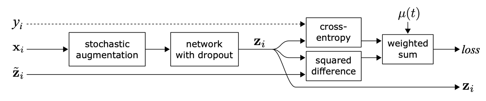 | Temporal ensembling: per-sample EMA of predictions as learning targets (Laine & Aila 2017). | Temporal ensembling |
| 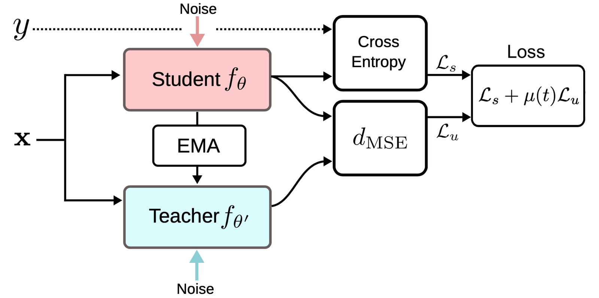 | Mean Teacher: student vs EMA teacher weight-averaged model (Tarvainen & Valpola 2017). | Mean teachers |
| 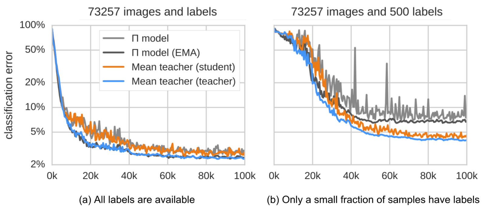 | Mean Teacher outperforms Π-model on SVHN classification error (Tarvainen & Valpola 2017). | Mean teachers |
| 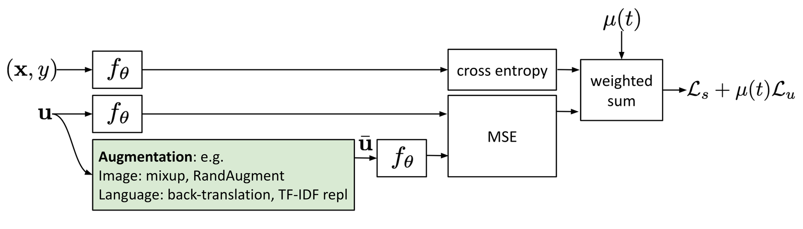 | Consistency training with noisy augmented unlabeled samples. | Noisy samples |
| 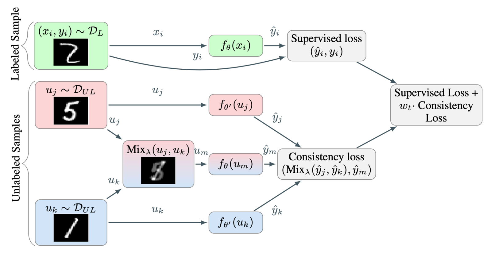 | Interpolation Consistency Training (ICT) with MixUp on unlabeled pairs (Verma et al. 2019). | ICT |
| 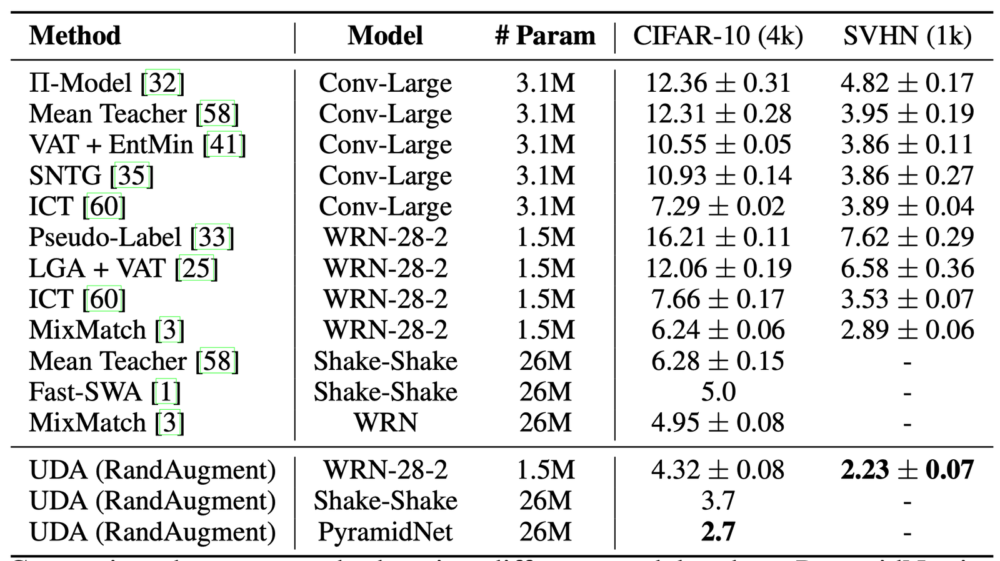 | UDA CIFAR-10 results vs other SSL methods (Xie et al. 2020). | UDA |
| 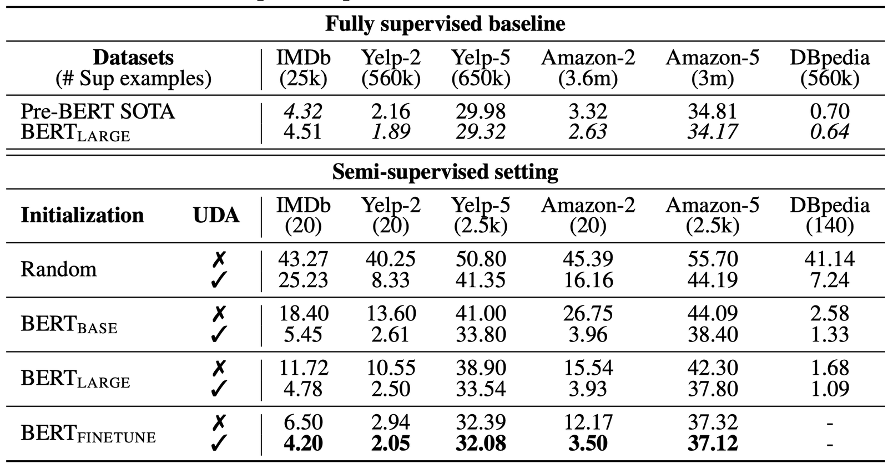 | UDA text classification with different BERT initialization configs (Xie et al. 2020). | UDA |
| 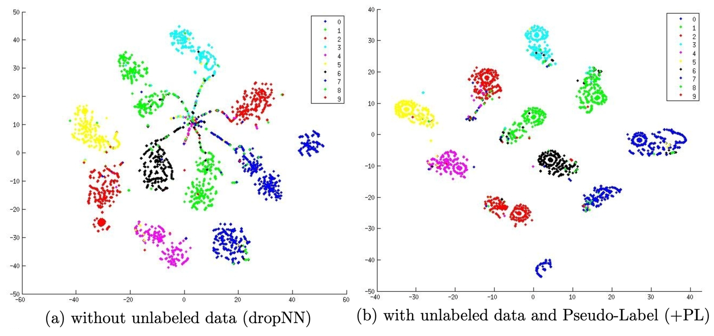 | t-SNE: pseudo labeling improves class segregation on MNIST (Lee 2013). | Pseudo labeling |
| 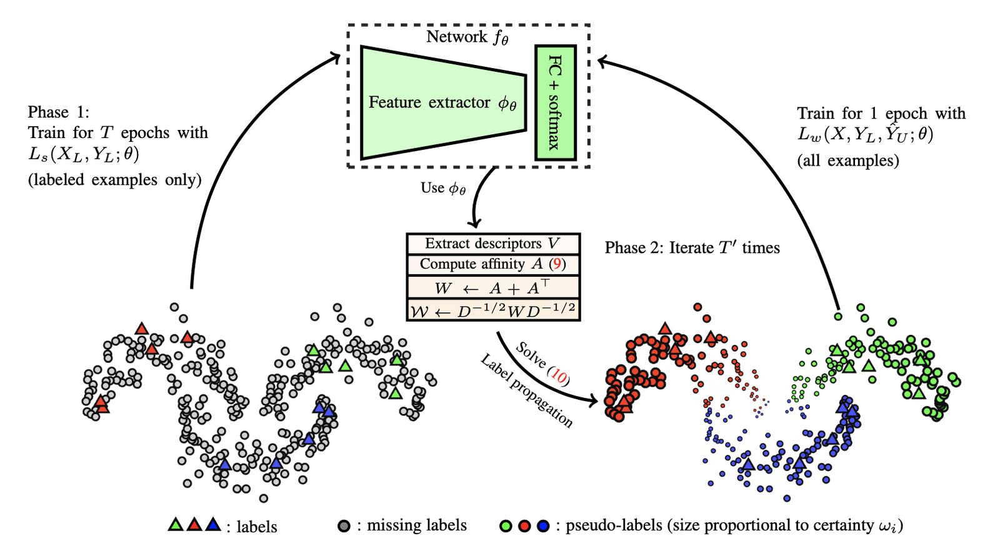 | Label propagation via similarity graph diffusion (Iscen et al. 2019). | Label propagation |
| 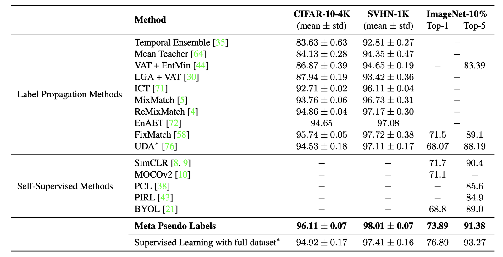 | Meta Pseudo Labels vs other SSL methods on image classification (Pham et al. 2021). | Meta Pseudo Labels |
| 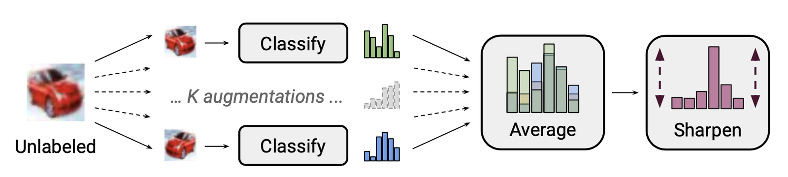 | MixMatch label guessing: average $K$ augmentations, sharpen, align marginals (Berthelot et al. 2019). | MixMatch |
| 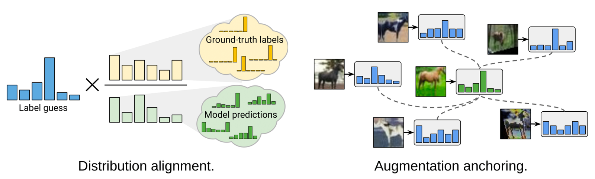 | ReMixMatch: distribution alignment + augmentation anchoring over MixMatch (Berthelot et al. 2020). | ReMixMatch |
| 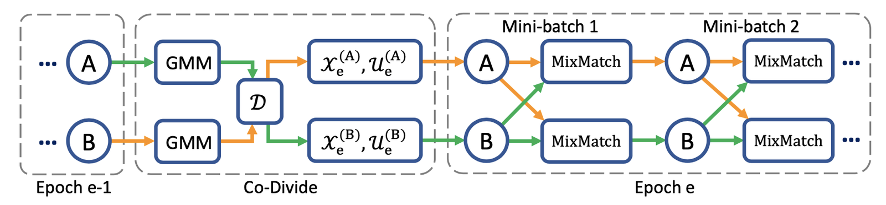 | DivideMix: GMM splits clean vs noisy unlabeled samples (Li et al. 2020). | DivideMix |
| 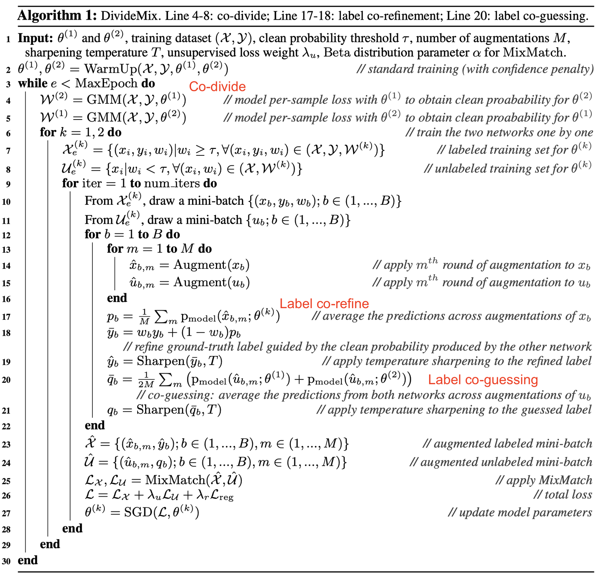 | DivideMix training algorithm overview (Li et al. 2020). | DivideMix |
| 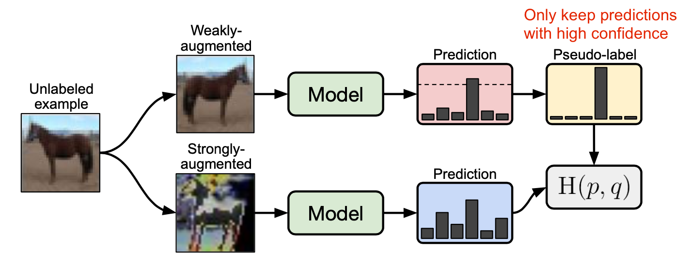 | FixMatch: weak-augment pseudo label + strong-augment consistency (Sohn et al. 2020). | FixMatch |
| 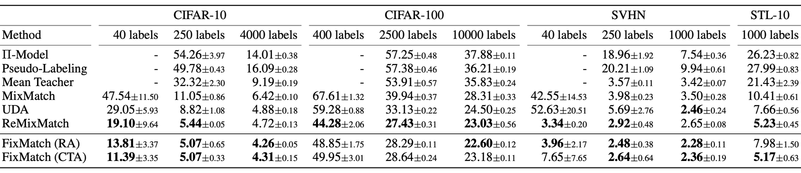 | FixMatch CIFAR-10/100 and SVHN results vs prior SSL (Sohn et al. 2020). | FixMatch |
| 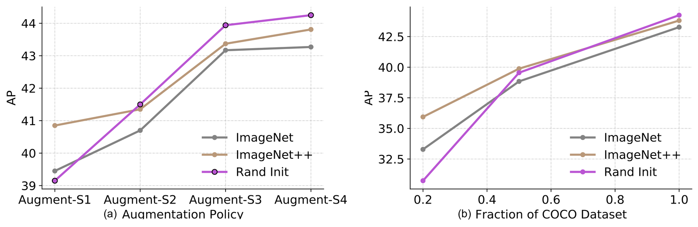 | Self-training + pre-training pipeline for large-scale vision (Xie et al. 2020). | Combined pre-training |
| 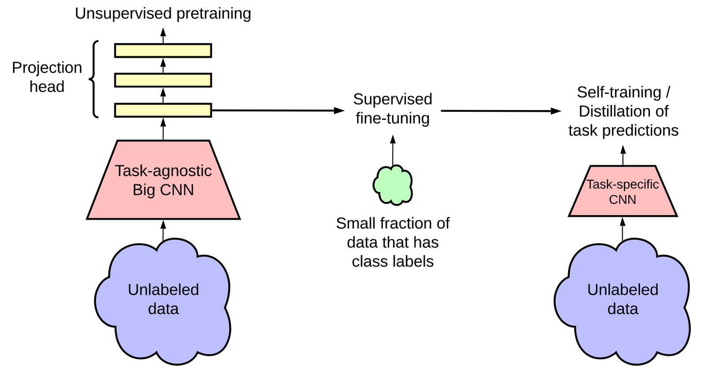 | Big self-supervised model (SimCLRv2) + fine-tuning architecture (Chen et al. 2020). | Combined pre-training |
| 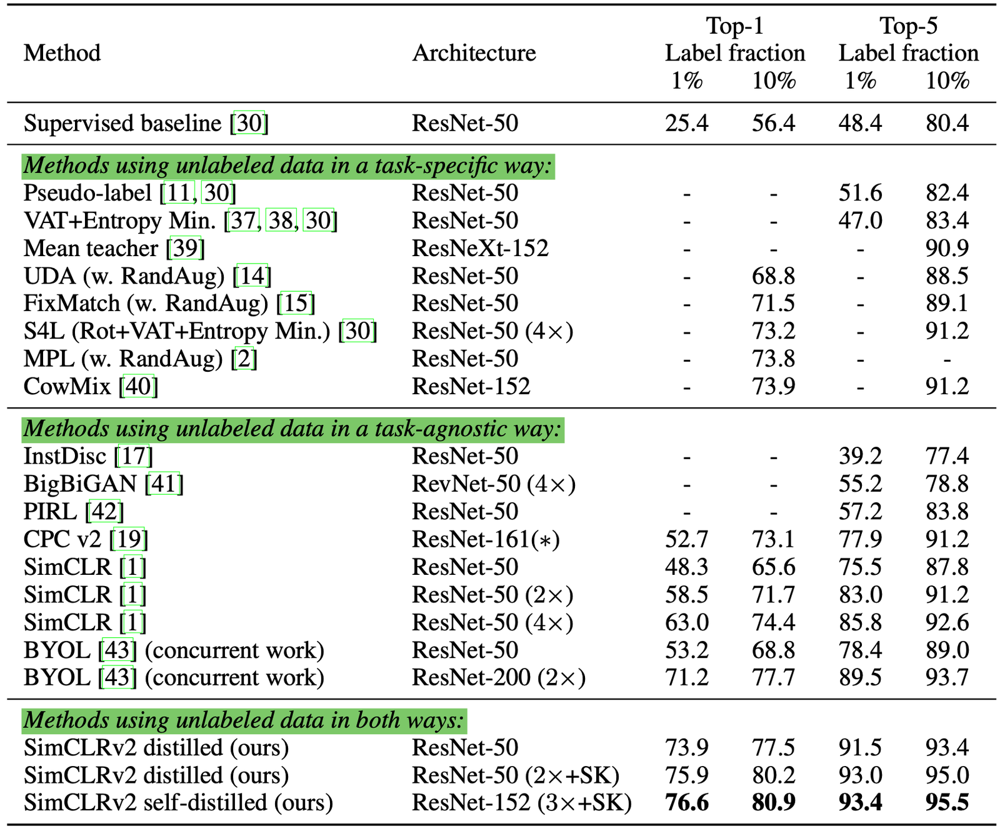 | SimCLRv2 semi-supervised fine-tuning matches dedicated SSL on CIFAR (Chen et al. 2020). | Combined pre-training |

## Entities

- [[Lilian Weng]] — Author of the three-part "learning with not enough data" series.
- [[Semi-Supervised Learning]] — Core paradigm: labeled + unlabeled joint training.
- [[Consistency Regularization]] — Unsupervised loss enforcing prediction invariance under perturbation.
- [[Mean Teacher]] — EMA teacher weights for consistency targets.
- [[FixMatch]] — Weak/strong augmentation SSL combining pseudo labels and consistency.
- [[MixMatch]] — Holistic SSL merging consistency, entropy minimization, and MixUp.
- [[DivideMix]] — GMM-based clean/noisy split with dual-network co-training.
- [[Meta Pseudo Labels]] — Teacher trained via student gradient on labeled data.
- [[Virtual Adversarial Training]] — Adversarial consistency without labels.
- [[Unsupervised Data Augmentation]] — UDA consistency training with RandAugment and sharpening.
- [[Noisy Student]] — Large-scale self-training with noisy student and soft pseudo labels.
- [[Representation Learning]] — Manifold and cluster assumptions underpin SSL design.
- [[Contrastive Representation Learning]] — Self-supervised pre-training alternative/complement to SSL.

## Questions & Gaps

- Architecture-modification SSL (generative, graph-based) excluded — see van Engelen & Hoos 2020.
- ReMixMatch assumes labeled/unlabeled class marginals match — often false in practice.
- SSL vs foundation-model fine-tuning from modern pretrained checkpoints is under-explored in the 2021 post.

## Related

- [[Learning with not Enough Data Part 2: Active Learning]] — Part 2: budgeted labeling via acquisition functions.
- [[Learning with not Enough Data Part 3: Data Generation]] — Part 3: augmentation and LM synthesis.
- [[Self-Supervised Representation Learning]] — Pretext-task pre-training that increasingly replaces dedicated SSL.
- [[Contrastive Representation Learning]] — SimCLR/BYOL family referenced as pre-training baselines.
- [[Transfer Learning]] — Pre-train + fine-tune as the dominant language paradigm.
- [[Deep Learning]] — Book coverage of semi-supervised assumptions (§7.6, §15.3).
- [[Synthetic Data]] — Part 3 covers LM-driven label generation as a fourth strategy.
