# Learning with not Enough Data Part 2: Active Learning

**Source**: `raw/2022-02-20-active-learning/full-article.html` (106 KB HTML), `raw/2022-02-20-active-learning/full-article.md` (Markdown sibling)  
**Canonical URL**: https://lilianweng.github.io/posts/2022-02-20-active-learning/  
**Author**: Lilian Weng  
**Published**: 2022-02-20  
**Ingested**: 2026-05-22  
**Tags**: #summary

## Summary

Part 2 of Lilian Weng's scarce-data trilogy covers **active learning (AL)** — given unlabeled pool $\mathcal{U}$, labeling budget $B$, and batch size $b$, iteratively select the most valuable samples to annotate so each labeling dollar maximizes model improvement. Unlike [[Semi-Supervised Learning]] (Part 1), AL spends human effort selectively; unlike data generation (Part 3), it acquires *ground-truth* labels. The post targets **deep neural networks in batch mode** for $K$-way classification (e.g. medical imaging where annotation is costly).

The cyclic workflow: train on current labeled set → score all unlabeled points with acquisition function $U(\mathbf{x})$ → label top-$b$ → repeat until $B$ is exhausted. Weng maps classical strategies to three axes — **uncertainty**, **diversity/representativeness**, and **expected model change** — then surveys deep extensions: [[MC Dropout]] / DBAL, Bayes-by-backprop, loss-prediction modules, adversarial [[VAAL]] / MAL / CAL, core-sets, [[BADGE]], [[BALD]], forgetting events / label dispersion, and hybrids (Suggestive Annotation, Zhdanov clustering, **CEAL** with pseudo-labeling).

A central tension: deep classifiers are **overconfident and miscalibrated** — softmax scores poorly track true uncertainty. Naive ensembles work best but are expensive; MC dropout is the economical default; cheap snapshot/DEE ensembles underperform. Hybrid methods that fuse uncertainty with diversity (BADGE, MAL, SA, CEAL) generally beat pure uncertainty on vision benchmarks.

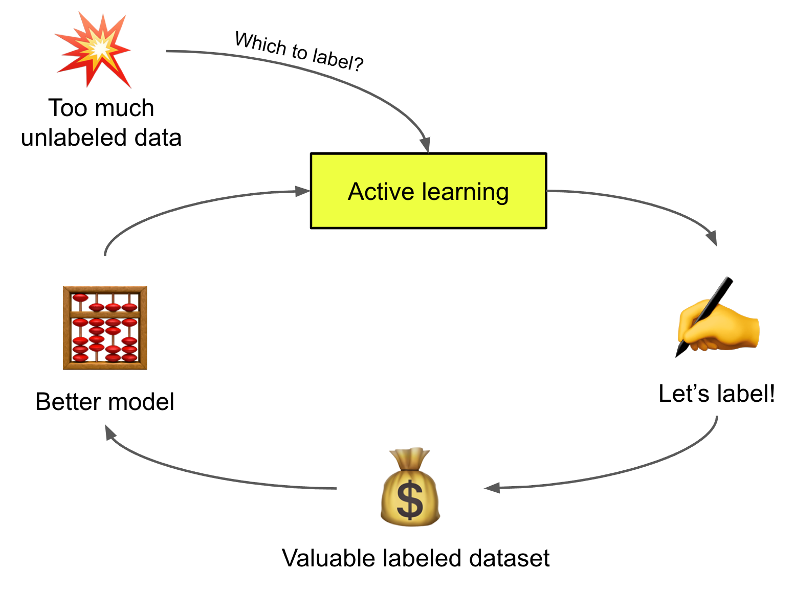

## Notation

| Symbol | Meaning |
|--------|---------|
| $K$ | Number of class labels |
| $(\mathbf{x}^l, y) \sim \mathcal{X}$ | Labeled sample; one-hot $y$ |
| $\mathbf{u} \sim \mathcal{U}$ | Unlabeled sample |
| $U(\mathbf{x})$ | Acquisition score (higher = more valuable) |
| $P_\theta(y|\mathbf{x})$ | Softmax classifier |
| $\hat{y} = \arg\max_y P_\theta(y|\mathbf{x})$ | Top prediction |
| $B$ | Total labeling budget |
| $b$ | Batch size per AL round |

## Classical Acquisition Functions

### Uncertainty sampling

| Name | Formula | Intuition |
|------|---------|-----------|
| Least confidence | $U(\mathbf{x}) = 1 - P_\theta(\hat{y}|\mathbf{x})$ | Low max probability |
| Margin | $U(\mathbf{x}) = P_\theta(\hat{y}_1|\mathbf{x}) - P_\theta(\hat{y}_2|\mathbf{x})$ | Small gap between top-2 |
| Entropy | $U(\mathbf{x}) = -\sum_y P_\theta(y|\mathbf{x})\log P_\theta(y|\mathbf{x})$ | Flat distribution |

**Query-by-Committee (QBC)** with $C$ models $\theta_1,\ldots,\theta_C$:

| Metric | Formula |
|--------|---------|
| Voter entropy | $U(\mathbf{x}) = \mathcal{H}(V(y)/C)$ where $V(y)$ counts votes for label $y$ |
| Consensus entropy | $U(\mathbf{x}) = \mathcal{H}(P_\mathcal{C})$ on averaged committee prediction |
| KL divergence | $U(\mathbf{x}) = \frac{1}{C}\sum_{c=1}^C D_\text{KL}(P_{\theta_c} \| P_\mathcal{C})$ |

### Diversity sampling

Select samples that **represent** the full data distribution — important because the deployed model must work on in-the-wild data, not only uncertain edge cases. Typically uses embedding similarity / clustering.

### Expected model change

Select samples that would cause the largest update to weights or training loss if labeled (EGL, influence-based methods).

## Deep Acquisition Methods

### Uncertainty in deep models

**Aleatoric** uncertainty: irreducible noise in data (sensor noise, measurement error), possibly input-dependent.

**Epistemic** uncertainty: ignorance about model parameters — reducible with more labels. Deep AL primarily targets epistemic uncertainty.

**[[MC Dropout]]** (Gal & Ghahramani 2016): dropout at every weight layer at test time ≈ approximate Bayesian NN; ensemble multiple forward passes. **DBAL** (Gal et al. 2017) uses MC dropout for acquisition on MNIST.

**Ensembles** (Beluch et al. 2018): naive independent training beats snapshot ensemble, DEE, split-head; MC dropout remains practical compromise.

**Bayes-by-backprop** (Blundell et al. 2015): variational distribution $q(\mathbf{w}|\theta)$ over weights; sample $\mathbf{w} = \mu + \log(1+\exp(\rho))\circ\epsilon$; minimize $\text{KL}[q \| p(\mathbf{w}|\mathcal{D})]$.

**Loss prediction** (Yoo & Kweon 2019): auxiliary MLP on intermediate features predicts loss magnitude; pair-wise ranking loss (not MSE, since loss scale drifts):
$$\mathcal{L}_\text{loss}(\mathbf{x}_i,\mathbf{x}_j) = \max(0, -\mathbb{1}(l_i,l_j)\cdot(\hat{l}(\mathbf{x}_i)-\hat{l}(\mathbf{x}_j)) + \epsilon)$$

### Adversarial / latent-space methods

**VAAL** (Sinha et al. 2019): $\beta$-VAE + discriminator $D$ distinguishes labeled vs unlabeled latent codes; select low $D$ scores (far from labeled manifold). Acquisition does not depend on task loss.

**MAL** (Ebrahimi et al. 2021): minimax on unlabeled data — encoder $F$ minimizes entropy, classifier $C$ maximizes it; hybrid score = low $D$ (diversity) + high $C$ entropy (uncertainty). Strong ImageNet results.

**CAL** (Margatina et al. 2021): contrastive examples — different labels but similar representations; high KL between neighbor predictions.

### Representativeness

**[[Core-Set Active Learning]]** (Sener & Savarese 2018): minimize core-set error bound → $k$-center problem (greedy approximate). Strong on few-class vision; weakens in high dimensions.

**SVP** (Coleman et al. 2020): proxy with weaker/smaller model to speed core-set selection without much final-error penalty.

**[[BADGE]]** (Ash et al. 2020): gradient embedding $g_\mathbf{x}$ w.r.t. final layer using predicted label; high $\|g_\mathbf{x}\|$ ≈ high influence; $k$-means++ on embeddings for batch diversity.

### Expected model change

**EGL** (Settles et al. 2008): $\text{EGL}(\mathbf{x}_i) = \sum_{y_i} P(y=y_i|\mathbf{x}_i)\|\nabla\mathcal{L}^{(y_i)}(\theta)\|$

**[[BALD]]** (Houlsby et al. 2011): maximize information gain about weights:
$$I[\boldsymbol{\theta}, y | x, \mathcal{D}] = H(y|x,\mathcal{D}) - \mathbb{E}_{\boldsymbol{\theta}}[H(y|x,\boldsymbol{\theta})]$$
High marginal entropy, low per-draw entropy. **BatchBALD** (Kirsch et al. 2019) extends to batches.

### Forgetting and label dispersion

**Forgetting events** (Toneva et al. 2019): count train-time flips correct↔incorrect; forgettable = redundant/noisy; unforgettable examples can be pruned safely.

**Label dispersion** (Bengar et al. 2021): for unlabeled $\mathbf{x}$, fraction of epochs where prediction ≠ mode label $c^*$:
$$\text{Dispersion}(\mathbf{x}) = 1 - f_\mathbf{x}/T, \quad f_\mathbf{x} = \sum_{t=1}^T \mathbb{1}[\hat{y}_t = c^*]$$
Correlates with uncertainty; usable without ground truth.

## Hybrid & Cost-Effective Methods

**Suggestive Annotation (SA)** (Yang et al. 2017): (1) top-$K$ uncertain from ensemble disagreement → candidate pool $\mathcal{S}_c$; (2) greedy max-cover on cosine similarity to pick diverse $\mathcal{S}_a \subseteq \mathcal{S}_c$.

**Zhdanov (2019)**: prefilter top $\beta b$ informative ($\beta \in [10,50]$), $k$-means into $b$ clusters, pick cluster centers.

**CEAL** (Yang et al. 2017): parallel tracks — (1) AL on uncertain samples for human labels; (2) high-confidence pseudo labels when entropy $< \delta$, with $\delta$ decaying over time. Combines AL with semi-supervised savings.

## Worked Examples

### BALD on a 3-model binary committee

See full derivation on [[BALD]]. Committee votes split 2:1 with each member individually confident → marginal entropy $\approx 0.63$ nats, mean per-member entropy $\approx 0.33$ → **BALD $\approx 0.30$** (acquire). Unanimous 0.9+ confidence on one class → BALD $\approx 0$ (skip).

### VAAL acquisition score (conceptual)

After training, unlabeled $\mathbf{u}$ maps to $\mathbf{z}^u = q_\phi(\mathbf{z}|\mathbf{u})$. Discriminator outputs $D(\mathbf{z}^u) \in [0,1]$ (probability "looks labeled"). VAAL ranks by **ascending** $D(\mathbf{z}^u)$:

| Sample | $D(\mathbf{z})$ | Action |
|--------|-----------------|--------|
| $\mathbf{u}_A$ | 0.05 | Label first (far from labeled manifold) |
| $\mathbf{u}_B$ | 0.45 | Later |
| $\mathbf{u}_C$ | 0.92 | Skip (already looks like labeled data) |

No softmax on classes required — pure latent-space diversity.

### MAL hybrid scoring

Combine VAAL diversity (low $D$) with classifier entropy $H(p(y|\mathbf{u}))$ from minimax-trained $C$. A point with $D=0.1$ and $H=1.2$ nats ranks above $D=0.1$, $H=0.3$ — both unfamiliar, but the former is model-uncertain.

## Key Claims

- **Active learning objective**: Maximize model improvement per labeling dollar via $U(\mathbf{x})$ and batch selection until budget $B$.
- **Deep miscalibration**: Softmax confidence ≠ true uncertainty; ensembles and dropout proxies needed.
- **MC dropout ≈ Bayesian NN**: Economical epistemic uncertainty for acquisition (DBAL).
- **Naive ensembles > cheap proxies**: Snapshot/DEE underperform; MC dropout is practical default.
- **Core-sets**: $k$-center geometric coverage; NP-hard greedy; curse of dimensionality limits effectiveness.
- **BADGE**: Gradient norm + $k$-means++ unifies uncertainty and diversity in one batch pass.
- **BALD**: Information gain about weights; BatchBALD for batch mode.
- **VAAL/MAL**: Latent adversarial diversity + (MAL) minimax entropy for uncertainty.
- **CEAL**: Active labeling + confident pseudo labels reduces budget needs.

## Figures

| Figure | Caption | Section |
|--------|---------|---------|
|  | Cyclic active learning workflow: train → acquire → label → repeat. | What is Active Learning? |
| 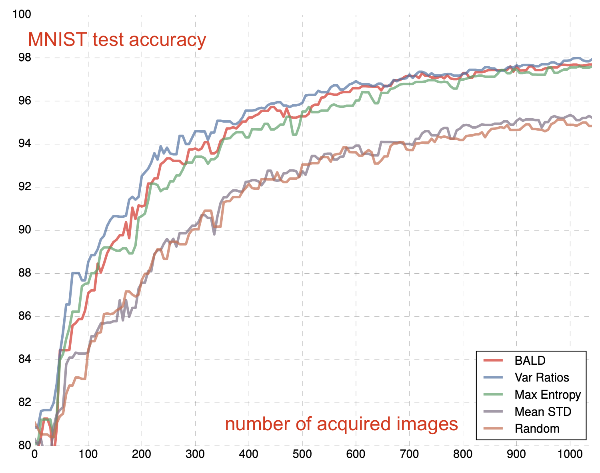 | DBAL (MC dropout) active learning results on MNIST (Gal et al. 2017). | MC dropout |
| 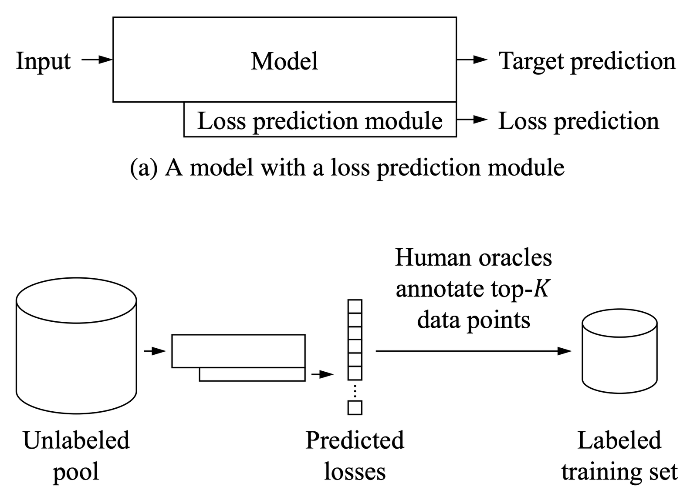 | Loss prediction module architecture for acquisition (Yoo & Kweon 2019). | Loss prediction |
| 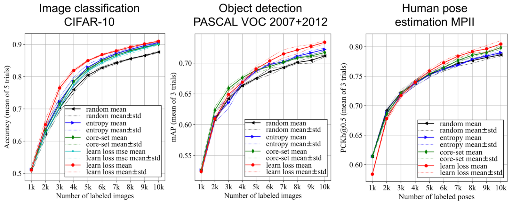 | Loss-prediction-based AL vs entropy and core-set baselines (Yoo & Kweon 2019). | Loss prediction |
| 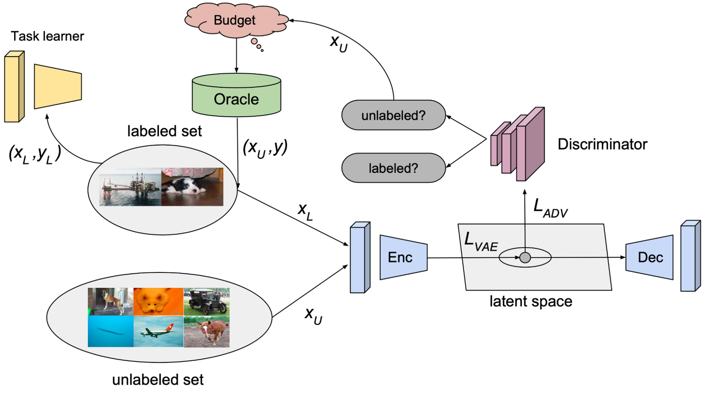 | VAAL: β-VAE + discriminator for latent-space acquisition (Sinha et al. 2019). | VAAL |
| 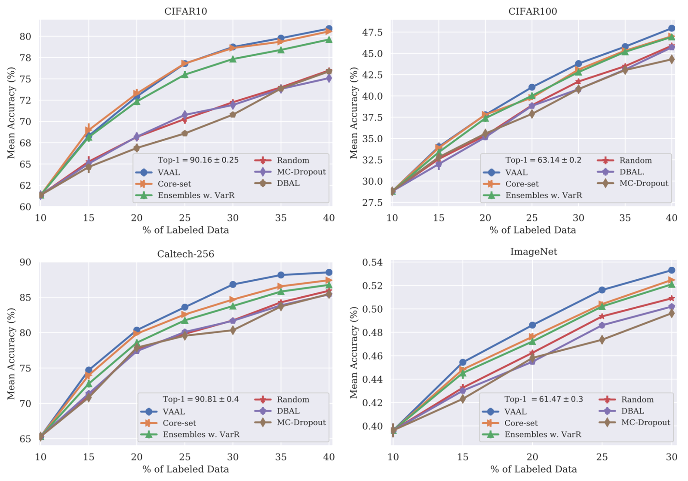 | VAAL experiment results on image classification (Sinha et al. 2019). | VAAL |
| 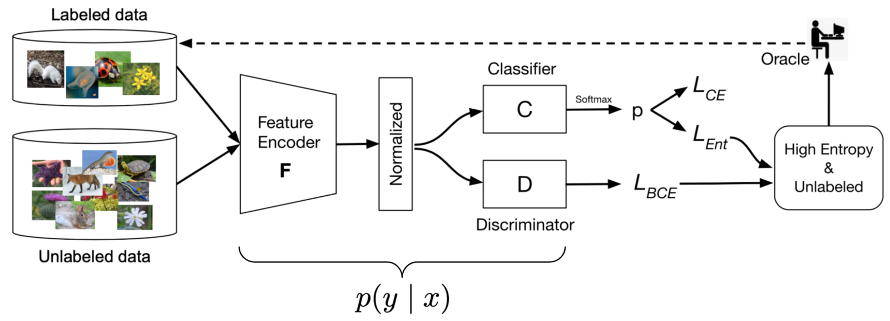 | MAL minimax encoder–classifier framework (Ebrahimi et al. 2021). | MAL |
| 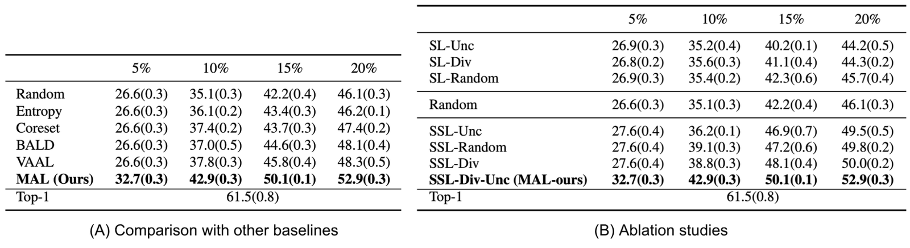 | MAL ImageNet results vs BALD, VAAL, core-set (Ebrahimi et al. 2021). | MAL |
| 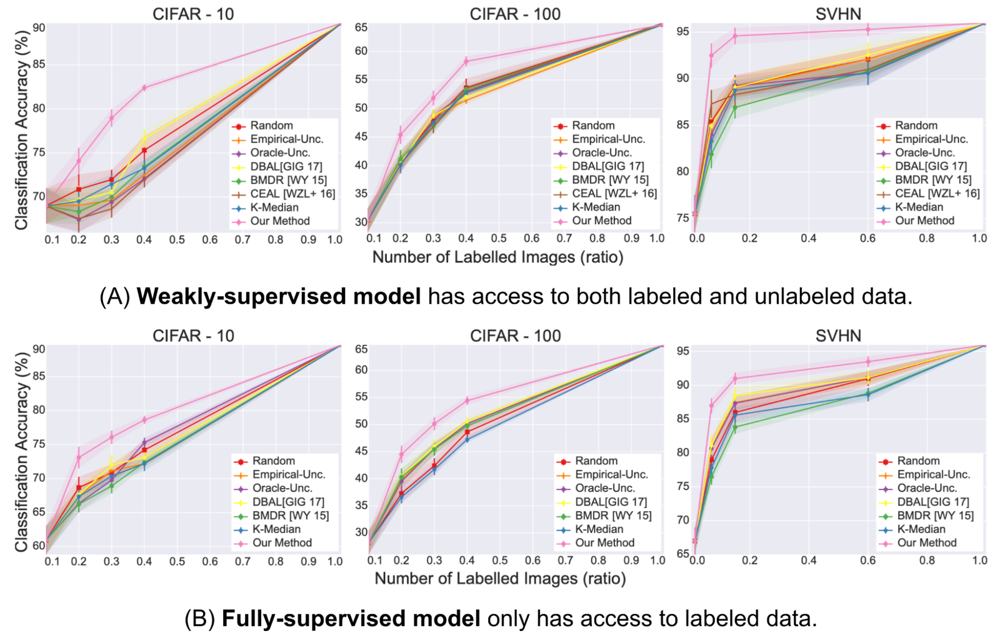 | Core-sets active learning vs baselines on CIFAR/SVHN (Sener & Savarese 2018). | Core-sets |
| 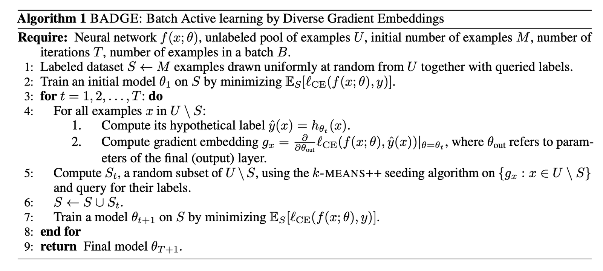 | BADGE algorithm: $k$-means++ on gradient embeddings (Ash et al. 2020). | BADGE |
| 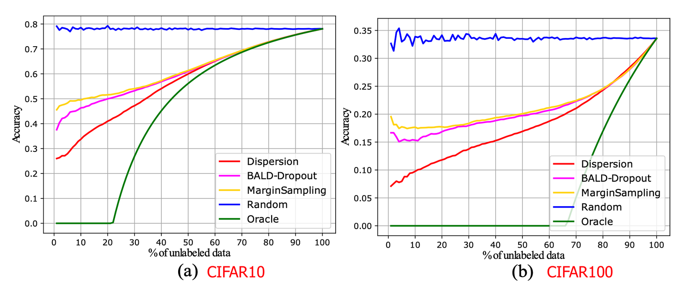 | Label dispersion vs uncertainty for acquisition (Bengar et al. 2021). | Forgetting events |
| 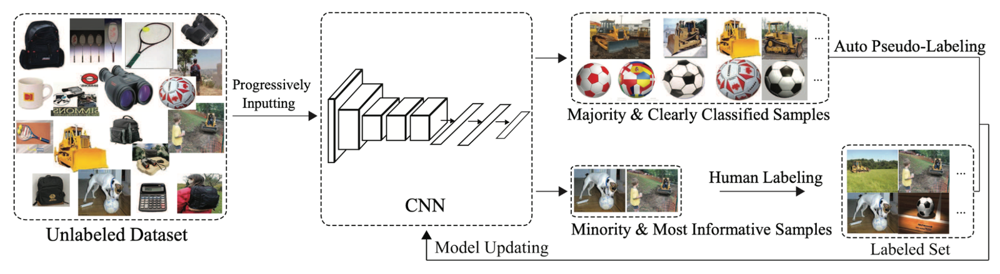 | CEAL hybrid confidence + adversarial diversity framework. | Hybrid |

## Entities

- [[Lilian Weng]] — Author; Part 2 of the scarce-data trilogy.
- [[Active Learning]] — Budgeted sample selection for labeling.
- [[MC Dropout]] — Test-time dropout for epistemic uncertainty estimation.
- [[BALD]] — Bayesian Active Learning by Disagreement.
- [[BADGE]] — Batch active learning via diverse gradient embeddings.
- [[Core-Set Active Learning]] — $k$-center geometric sample selection.
- [[VAAL]] — Latent-space adversarial diversity without task loss.
- [[MAL]] — VAAL + minimax entropy uncertainty on ImageNet.
- [[CEAL]] — Parallel human AL and confident pseudo-labeling.
- [[Contrastive Active Learning]] — Similar embeddings, diverging predictions vs labeled neighbors.
- [[Suggestive Annotation]] — Ensemble uncertainty filter + greedy max-cover diversity.
- [[Semi-Supervised Learning]] — Part 1: uses unlabeled data without extra labeling budget.
- [[Synthetic Data]] — Part 3: generate labels via augmentation or LMs.

## Questions & Gaps

- Classical version-space methods less applicable to deep batch training.
- Core-set / VAAL scale issues in very high-dimensional embedding spaces.
- LLM-era data curation (prompt selection, RLHF filtering) outside 2022 scope.

## Related

- [[Learning with not Enough Data Part 1: Semi-Supervised Learning]] — Uses unlabeled data without selective labeling.
- [[Learning with not Enough Data Part 3: Data Generation]] — GPT-3 + active learning human-in-the-loop labeling.
- [[Evaluation and Benchmarks]] — Medical and low-label vision tasks where AL is critical.
- [[Computer Vision]] — Primary application domain in the surveyed methods.
- [[Dropout]] — Architectural basis for MC dropout approximation.
