# Learning with not Enough Data Part 3: Data Generation

**Source**: `raw/2022-04-15-data-gen/full-article.md` (128 KB HTML), `raw/2022-04-15-data-gen/full-article.md` (Markdown sibling)  
**Canonical URL**: https://lilianweng.github.io/posts/2022-04-15-data-gen/  
**Author**: Lilian Weng  
**Published**: 2022-04-15  
**Ingested**: 2026-05-22  
**Tags**: #summary

## Summary

Part 3 of Weng's scarce-data trilogy addresses **data generation** when labeled examples are insufficient. Two modes: **augmented data** (transform existing samples, semantics preserved) and **new data** (synthesize $(\mathbf{x}, y)$ from pretrained models, especially LMs). The augmentation section duplicates material from [[Contrastive Representation Learning]] with edits; image synthesis (GAN/VAE/diffusion) is deferred to other posts.

**Augmentation** covers image pipelines (basic PIL ops, AutoAugment → RandAugment → PBA → UDA policy selection, Mixup/Cutmix/MoCHi hard negatives), text ([[Easy Data Augmentation]], contextual BERT/CBERT, back-translation, embedding Mixup/FreeLB), audio (mixup, time/frequency masking, frequency shift), and architectural augmentation (dropout views in [[SimCSE]], cutoff).

**Synthesis** covers GPT-3 as weak annotator + [[Active Learning]] relabeling (Wang et al. 2021), [[LAMBADA Data Generation]], [[Unsupervised Data Generation]] (UDG + noisy label annealing), and Han et al. (2021) few-shot translation via distillation + back-translation.

**Quality metrics**: affinity (model-sensitive distribution shift) and diversity (augmentation complexity) from Gontijo-Lopes et al. (2020). **Noisy-label training**: noise adaptation layers, [[Generalized Cross Entropy]], curriculum/NPCL losses, F-correction/GLC, MentorNet, [[Co-teaching]], L2R meta-reweighting. Hierarchy: **a lot of clean data > a lot of noisy data > a little clean data**.

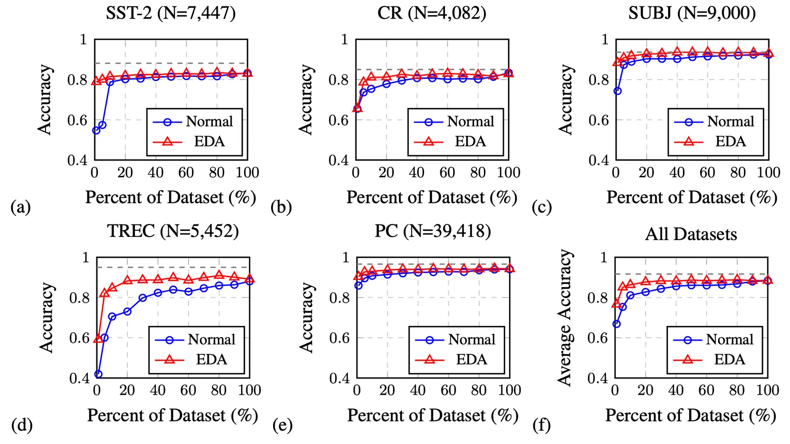

## Data Augmentation Taxonomy

### Images

| Family | Method | Idea |
|--------|--------|------|
| Basic | Crop, flip, color jitter, blur, grayscale | Standard PIL-style ops |
| Learned policy | AutoAugment (RL search), RandAugment (single magnitude), PBA (evolutionary) | Task-specific augmentation sequences |
| Consistency-driven | UDA | Minimize KL between clean and augmented predictions |
| Mixture | Mixup, Cutmix, MoCHi | Pixel/region blend; hard negative feature mix in contrastive queues |

**Mixup**: $I_\text{mixup} \leftarrow \alpha I_1 + (1-\alpha)I_2$, $\alpha \in [0,1]$.

**Cutmix**: $I_\text{cutmix} \leftarrow \mathbf{M}_b \odot I_1 + (1-\mathbf{M}_b)\odot I_2$ with binary mask $\mathbf{M}_b$.

### Text

**[[Easy Data Augmentation]]** (Wei & Zou 2019): SR, RI, RS, RD with $p=\alpha$, $n=\alpha \times \text{len}$ — largest gains on *smaller* training sets.

**Contextual augmentation** (Kobayashi 2018): replace token $w_i$ by sampling from bidirectional LM $p(\cdot|S\setminus w_i)$; label-conditioned CBERT for label-safe substitutions.

**Back-translation**: translate out and back; both directions need decent quality.

**Embedding Mixup / FreeLB**: mix or adversarially perturb embedding space (Guo et al. 2019; Zhu et al. 2019).

### Audio (Wang & van den Oord 2021)

| Op | Description |
|----|-------------|
| Audio mixup | $\hat{\mathbf{x}} = \alpha\mathbf{x}_1 + (1-\alpha)\mathbf{x}_2$; label = dominant speaker |
| Time masking | Mask short consecutive time chunks |
| Frequency masking | Drop frequency bands on spectrogram |
| Frequency shift | Shift spectrum by $\pm F$ bins (pitch change) |

### Architectural

**SimCSE**: same sentence, two dropout masks → positive pair. **Cutoff**: remove random token embedding spans (Shen et al. 2020).

## Data Synthesis Pipelines

### GPT-3 as noisy annotator (Wang et al. 2021)

Few-shot prompt with human examples → GPT-3 labels → rank by label logit → lowest-confidence sent to humans via active learning → re-annotate. ~10× cheaper than pure human labeling in low-cost regime; gap remains when budget is large.

Essentially **self-training** with entropy regularization on GPT-labeled unlabeled data.

### [[LAMBADA Data Generation]] (Anaby-Tavor et al. 2019)

1. Train classifier $h = \mathcal{A}(\mathcal{D}_\text{train})$
2. Fine-tune LM $\mathcal{M}$ on $\mathcal{D}_\text{train}$
3. Generate continuations from `y[SEP]` until EOS
4. Filter: $h(x)=y$ and top 10% by classifier confidence among 10× oversample

Train final model on $\mathcal{D}_\text{syn} \cup \mathcal{D}_\text{train}$.

### [[Unsupervised Data Generation]] (Wang et al. 2021)

Few-shot prompt with label description + unlabeled examples → LM generates $\mathbf{x}$ given $y$ (reverse of prediction). **Noisy label annealing (NLA)**: at step $t$, drop $(\mathbf{x}_i, \hat{y}_i)$ if $p(\bar{y}_i|\mathbf{x}_i) > \mu_t$ and $\bar{y}_i \neq \hat{y}_i$; $\mu_t$ anneals from 0.9 → $1/\text{num\_classes}$.

### Translation synthesis (Han et al. 2021)

Zero-shot LM translation → few-shot amplify → distill on `[L1] seq1 [[TRANSLATE]] [L2] seq2` → back-translate reversed pairs → iterate. Depends on strong pretrained LM seed.

## Quantifying Augmentation Quality

**Affinity** (model-sensitive distribution shift): performance gap training on clean vs evaluating on augmented data (model trained on clean). High affinity = augmentation stays on-manifold for the model.

**Diversity** (augmentation complexity): final training loss with given augmentation; correlated with entropy of transformed data and time-to-threshold-accuracy.

Both must be high for test gains (Gontijo-Lopes et al. 2020 scatter plot — fig-09).

## Training with Noisy Labels

Generated/augmented labels are rarely 100% correct. Deep nets memorize noise; robust training is required.

### Robust objectives

| Loss | Property |
|------|----------|
| CCE | Standard; sensitive to noise |
| MAE | Treats all samples equally; robust but slow convergence |
| **GCE** (Zhang & Sabuncu 2018) | $\mathcal{L}_q(f) = \frac{1-f^{(j)}(\mathbf{x})^q}{q}$; $q\to0$ → CCE, $q=1$ → MAE |
| Zero-one / hinge | Robust; NPCL tightens hinge upper bound with noise-rate pruning |

**NPCL** (noise-pruned curriculum loss): prune top $\rho$ fraction highest-loss samples when noise rate $\rho$ known.

### Label correction

**F-correction** (Patrini et al. 2017): noise matrix $C_{ij} = p(\tilde{y}=j|y=i)$; forward loss $-\log\sum_j C_{ji}\hat{p}(y=j|\mathbf{x})$.

**GLC** (Hendrycks et al. 2018): estimate $\hat{C}$ from small clean set via confusion matrix; train on $\mathcal{D}_c$ with raw loss, $\mathcal{D}_n$ with $\hat{C}^\top f(\mathbf{x})$.

**Distillation pseudo labels** (Li et al. 2017): auxiliary $f_c$ on clean data → soft labels propagated through knowledge graph $\mathcal{G}$ → $\mathcal{L} = \text{CE}(\lambda y + (1-\lambda)\hat{s}, f(\mathbf{x}))$.

### Sample reweighting & selection

**Importance reweighting** (Liu & Tao 2015): $w(\mathbf{x},\tilde{y})$ corrects corrupted distribution under known flip rates.

**L2R** (Ren et al. 2018): meta-learn per-sample weights to minimize loss on clean validation set; ~3× training cost.

**MentorNet** (Jiang et al. 2018): LSTM mentor predicts curriculum weights $w_i$ for StudentNet on corrupted labels.

**[[Co-teaching]]** (Han et al. 2018): two networks exchange small-loss subsets; selection rate $R(T)$ decays over time; beats F-correction at high noise / asymmetric corruption.

## Key Claims

- **Two generation modes**: Augmentation perturbs existing samples; synthesis creates new pairs from pretrained generators.
- **EDA**: Cheap text ops; gains scale inversely with training set size.
- **Augmentation policy evolution**: AutoAugment → RandAugment → PBA → UDA KL selection.
- **GPT-3 economics**: Noisy large-scale labels beat small clean sets in low-budget regime; AL improves quality per dollar.
- **UDG + NLA**: Reverse prompting (label→text) with progressive pseudo-label removal.
- **Affinity × diversity**: Both required; scatter plot shows failure modes (high affinity/low diversity and vice versa).
- **GCE/NPCL/Co-teaching**: Practical toolkit when synthetic labels are imperfect.

## Figures

| Figure | Caption | Section |
|--------|---------|---------|
|  | EDA text augmentation improves classification on small training sets (Wei & Zou 2019). | Text augmentation |
| 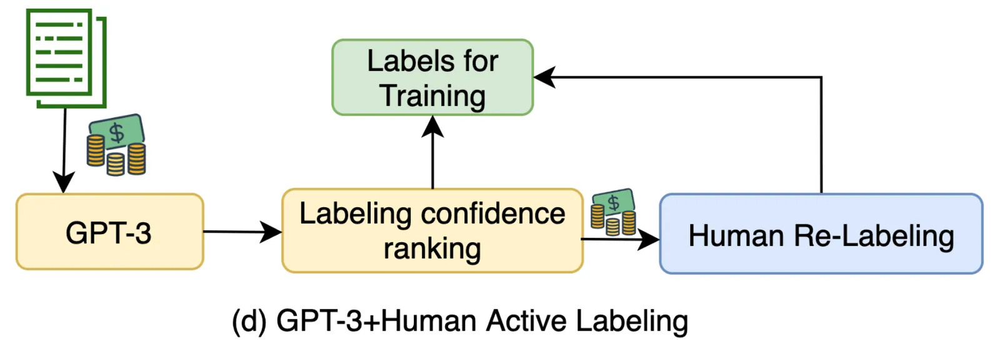 | GPT-3 + active learning human-in-the-loop labeling pipeline (Wang et al. 2021). | LM as annotator |
| 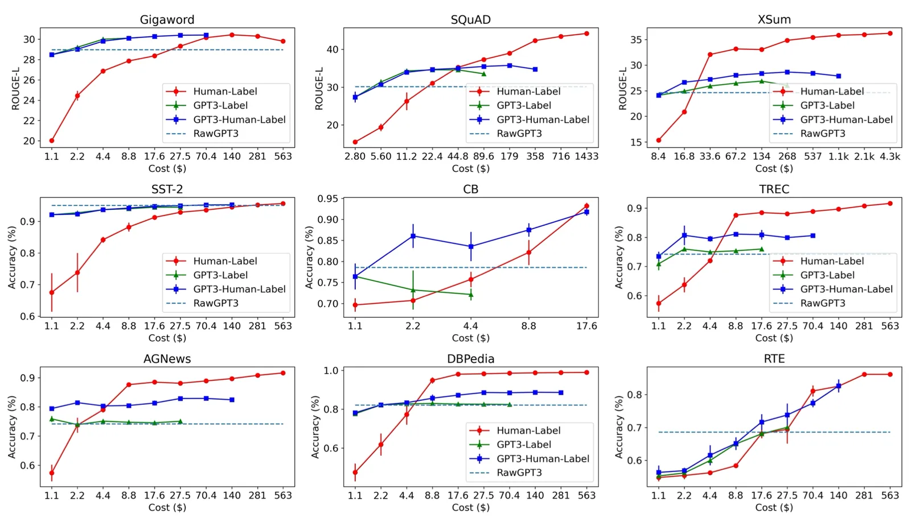 | GPT-3 labeling vs human cost curve on classification (Wang et al. 2021). | LM as annotator |
| 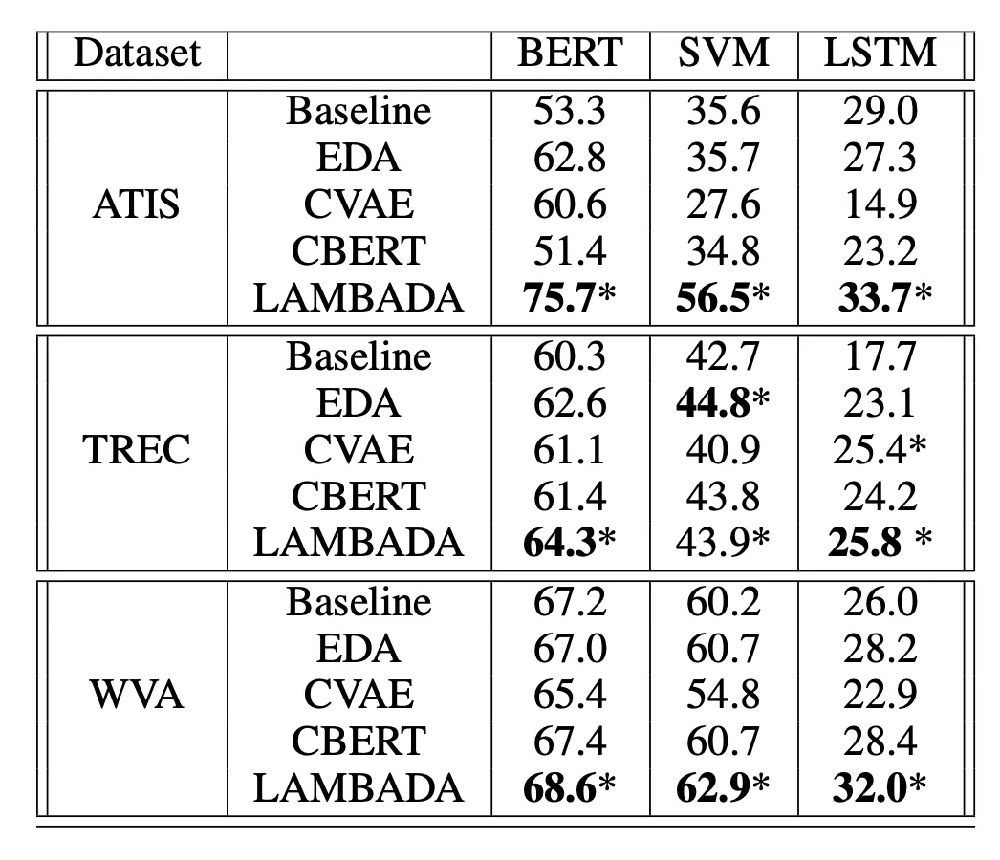 | LAMBADA LM-based data augmentation framework (Anaby-Tavor et al. 2019). | LAMBADA |
| 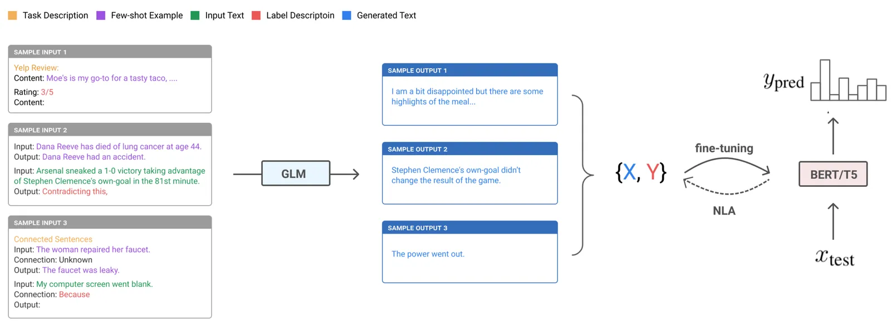 | UDG unsupervised data generation via few-shot prompting (Wang et al. 2021). | UDG |
| 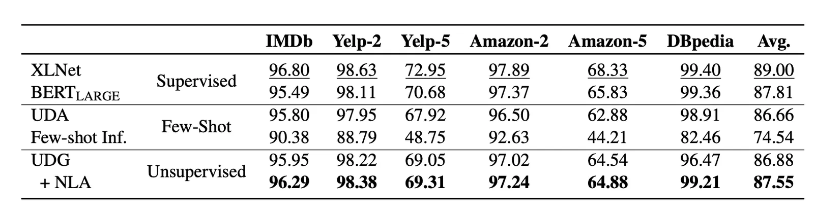 | UDG accuracy vs few-shot and supervised baselines (Wang et al. 2021). | UDG |
| 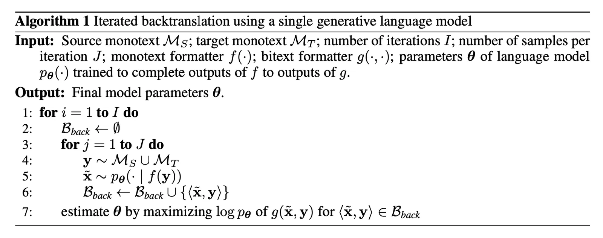 | Few-shot generation + distillation + back-translation for translation (Han et al. 2021). | Translation synthesis |
| 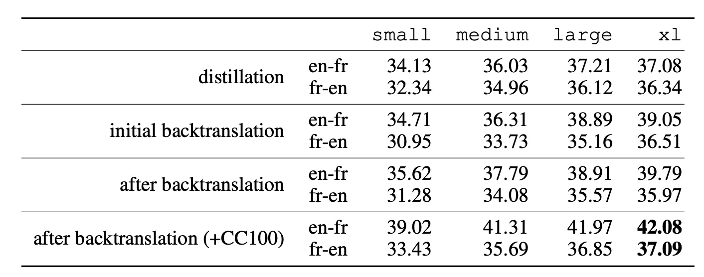 | BLEU scores: distillation vs back-translation combinations (Han et al. 2021). | Translation synthesis |
| 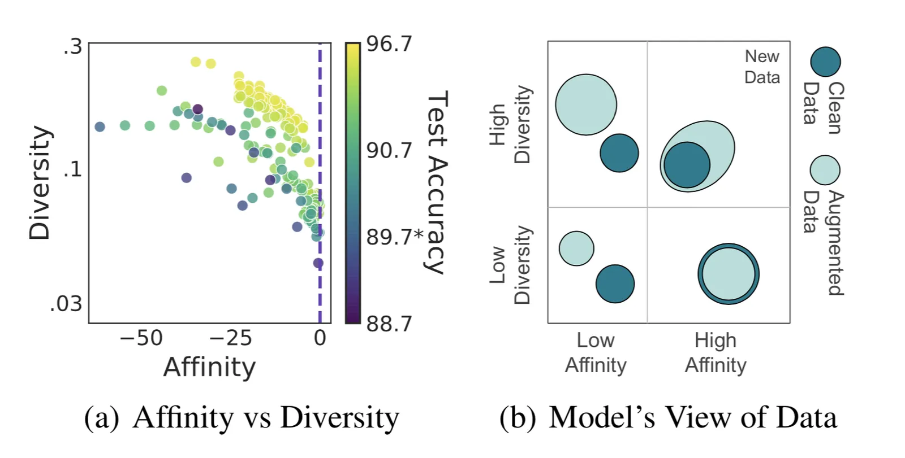 | Affinity vs diversity scatter plot for augmentation quality (Gontijo-Lopes et al. 2020). | Data quality metrics |
| 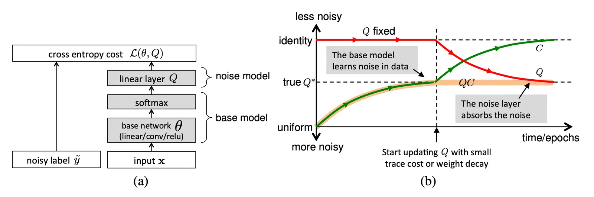 | Noise adaptation layer $Q$ between softmax and loss (Sukhbaatar et al. 2015). | Noisy training |
| 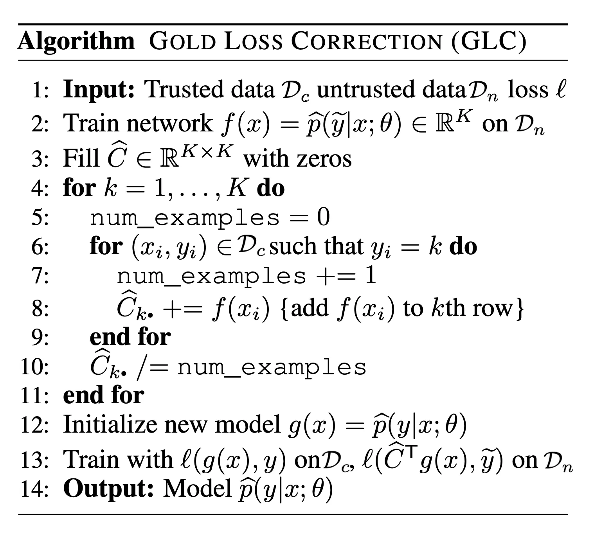 | Gold loss correction (GLC) noise matrix estimation (Hendrycks et al. 2018). | Label correction |
| 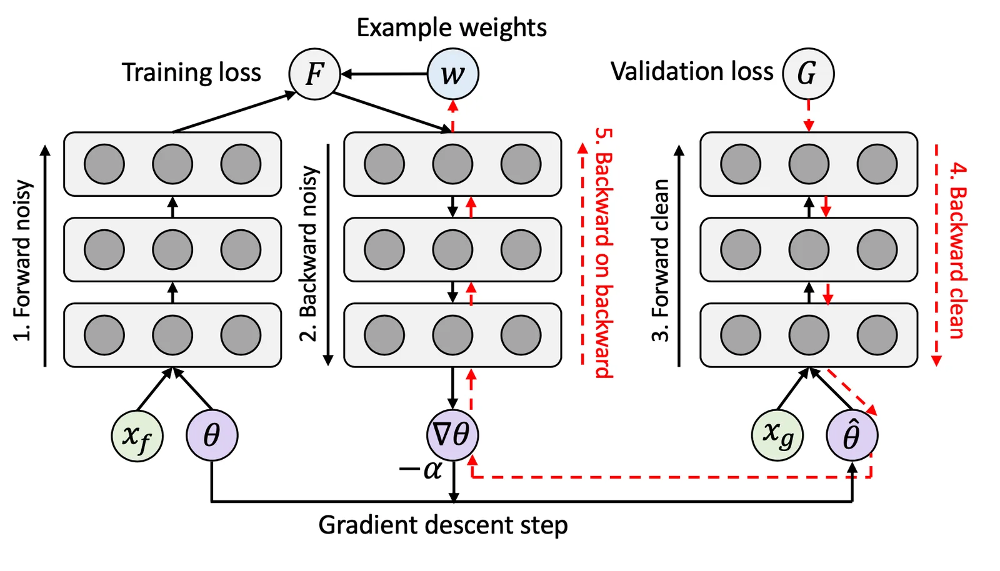 | Learning to reweight (L2R) meta-gradient sample weights (Ren et al. 2018). | Sample reweighting |
| 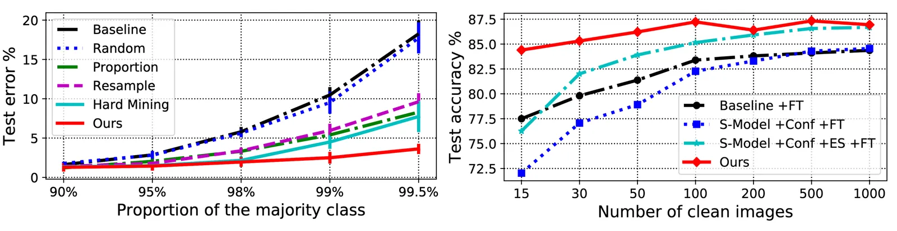 | L2R experiment results on biased/noisy data (Ren et al. 2018). | Sample reweighting |
| 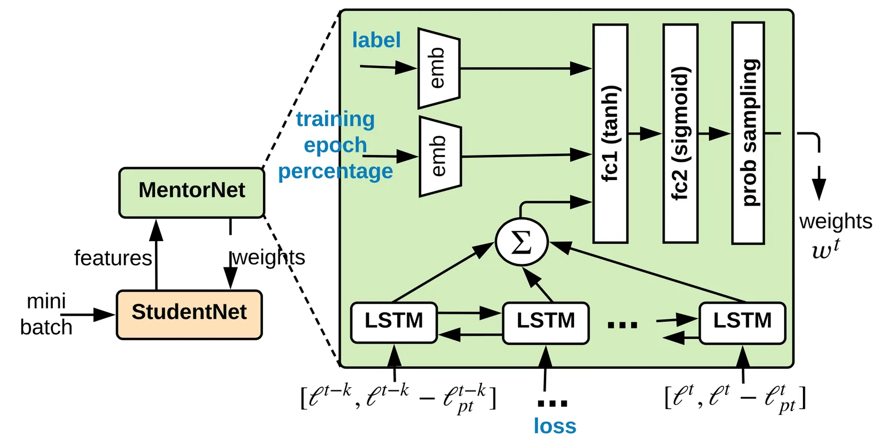 | MentorNet curriculum over noisy samples (Jiang et al. 2018). | Sample reweighting |
| 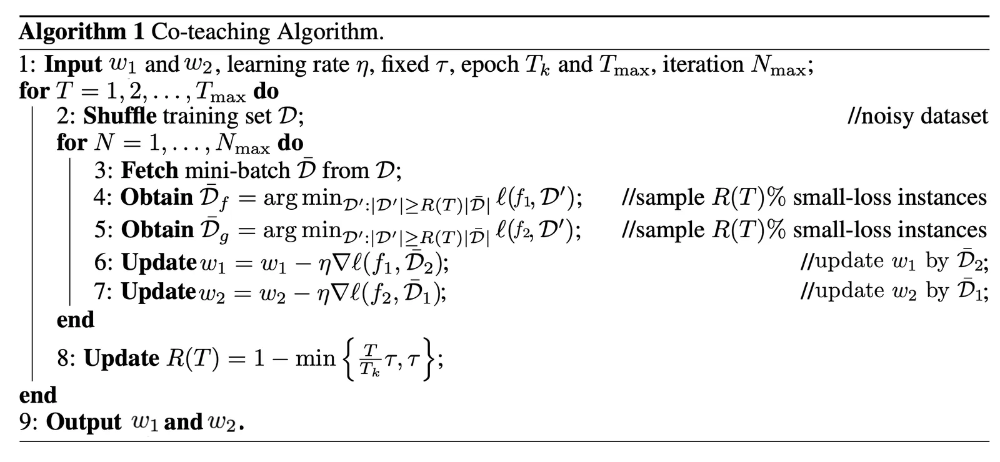 | Co-teaching: cross-network small-loss selection (Han et al. 2018). | Co-teaching |

## Entities

- [[Lilian Weng]] — Author; Part 3 of the scarce-data trilogy.
- [[Synthetic Data]] — Topic hub for generation, filtering, and instruction data.
- [[Easy Data Augmentation]] — EDA lexical text augmentation.
- [[Unsupervised Data Generation]] — UDG few-shot LM synthesis framework.
- [[LAMBADA Data Generation]] — Class-conditioned LM fine-tuning for synthetic text.
- [[Generalized Cross Entropy]] — Robust loss interpolating CCE and MAE.
- [[Co-teaching]] — Dual-network mutual small-loss training for noisy labels.
- [[Active Learning]] — GPT-3 pipeline uses AL for human relabeling budget.
- [[Contrastive Representation Learning]] — Source of duplicated augmentation section.
- [[SimCLR]] — Architectural dropout augmentation (SimCSE) referenced.

## Questions & Gaps

- Image synthesis (GAN/VAE/diffusion) explicitly deferred.
- Modern instruction-tuning / constitutional filtering pipelines post-date 2022.
- Affinity/diversity metrics lack standardized benchmarks across modalities.

## Related

- [[Learning with not Enough Data Part 1: Semi-Supervised Learning]] — SSL uses unlabeled data without synthesis.
- [[Learning with not Enough Data Part 2: Active Learning]] — Budgeted labeling; combined with GPT-3 annotation here.
- [[Synthetic Data]] — Wiki topic aggregating synthetic-data papers and methods.
- [[Contrastive Representation Learning]] — Overlapping augmentation coverage (SimCLR, MoCHi, EDA, SimCSE).
- [[MixMatch]] — Semi-supervised noise filter for generated labels.
- [[Cross-Entropy Loss]] — Baseline loss contrasted with GCE/MAE robust variants.
