# 2024-02-05-human-data-quality

**Source**: `raw/2024-02-05-human-data-quality/full-article.md` (HTML) and `raw/2024-02-05-human-data-quality/full-article.md` (Markdown)  
**Ingested**: 2026-05-22  
**Tags**: #summary #topic

## Summary

High-quality human data is the essential fuel driving modern deep learning, especially for supervised fine-tuning (SFT) and Reinforcement Learning from Human Feedback (RLHF) in large language model alignment. While model development dominates academic attention, data-centric engineering—spanning task design, annotator training, label aggregation, and training dynamic diagnostics—is the primary bottleneck to model capabilities. Lilian Weng's master survey categorizes the search for premium human data along two primary interfaces: human operation workflows that determine how labels are generated, and deep learning training dynamics that act as diagnostics to identify and prune mislabeled instances after training.

At the operational layer, Weng decomposes crowdsourcing quality control into two contrasting paradigms: the **prescriptive paradigm** and the **descriptive paradigm**. The traditional prescriptive paradigm assumes a single absolute ground truth exists and treats rater disagreement as noise to be suppressed via detailed guidelines, strict auditor consensus, and aggregation metrics (such as [[Majority Voting]], Cohen's Kappa, and probabilistic graph models like [[MACE]]). Conversely, the modern descriptive paradigm recognizes that on subjective or culturally loaded tasks (like safety, toxicity, and alignment), annotator disagreements reflect valid, diverse demographic beliefs and real-world variance. Descriptive architectures, such as **Disagreement Deconvolution** and **Jury Learning**, explicitly model individual and group characteristics to preserve diverse perspectives, rather than washing them out in a generic consensus.

Once a dataset is collected and a model is trained, machine learning diagnostics can analyze training behavior to locate hidden errors. Tools like **Influence Functions** approximate computationally expensive leave-one-out retraining to measure the impact of individual samples on parameters and test loss. In parallel, epoch-by-epoch training behavior reveals data quality through **Data Maps** (which segment samples based on model confidence and variability), forgetting dynamics (which identify forgettable versus unforgettable examples), and **Area Under the Margin (AUM)**. AUM ranks samples based on the margin between the assigned label logit and the next largest logit, leveraging the gradient tension between global model generalization and local label noise to isolate and prune mislabeled instances.

## Key Claims

*   **Everyone wants model work, not data work**: In line with Sambasivan et al. (2021), data cascades are prevalent, where systemic under-investment in data quality and raters causes critical downstream safety and performance failures.
*   **The Wisdom of Crowds requires spammer filtering**: While crowdsourced judgments (Vox populi) can equal or exceed expert translations when properly managed (Callison-Burch 2009), they are highly vulnerable to spammers who maximize throughput. Models like [[MACE]] use expectation-maximization to estimate an annotator's spamming probability and downweight their votes.
*   **Agreement rates are semantic-dependent**: Human-expert agreement is highly variable across subjects. T&S professionals and crowd annotators agree closely (up to 0.96) on objective, high-severity topics like violence, but drop to a mere 0.25 on highly personal or nuanced debatable conversations (Wang et al. 2023).
*   **Individual inconsistency is noise, but group dissent is signal**: Individual annotators often show stochastic inconsistencies (giving different answers to identical prompts at different times). **Disagreement Deconvolution** filters out this random individual noise to reveal clean demographic beliefs.
*   **Multi-task/multi-annotator heads improve prediction**: Standard models trained on aggregated majority votes fail to learn annotator diversity and uncertainty. Modeling each rater as a distinct classification head in a multi-task MLP network preserves dissent and provides calibrated model uncertainty (Davani et al. 2021).
*   **SGD generalization exposes mislabeled samples**: In deep learning, other training samples act as regularizers through generalization. When a sample is mislabeled, SGD attempts to generalize from clean samples to this image, conflicting with the noisy label supervised update. This tension results in low confidence, low variability, and low/negative margin profiles (AUM).

## Figures

| Figure | Description |
|--------|-------------|
| 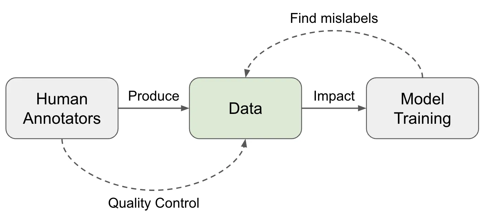 | **Operations vs. Training Dynamics**: The two directions for approaching high data quality: human raters/aggregation operations vs. training dynamics/model learning behavior. |
| 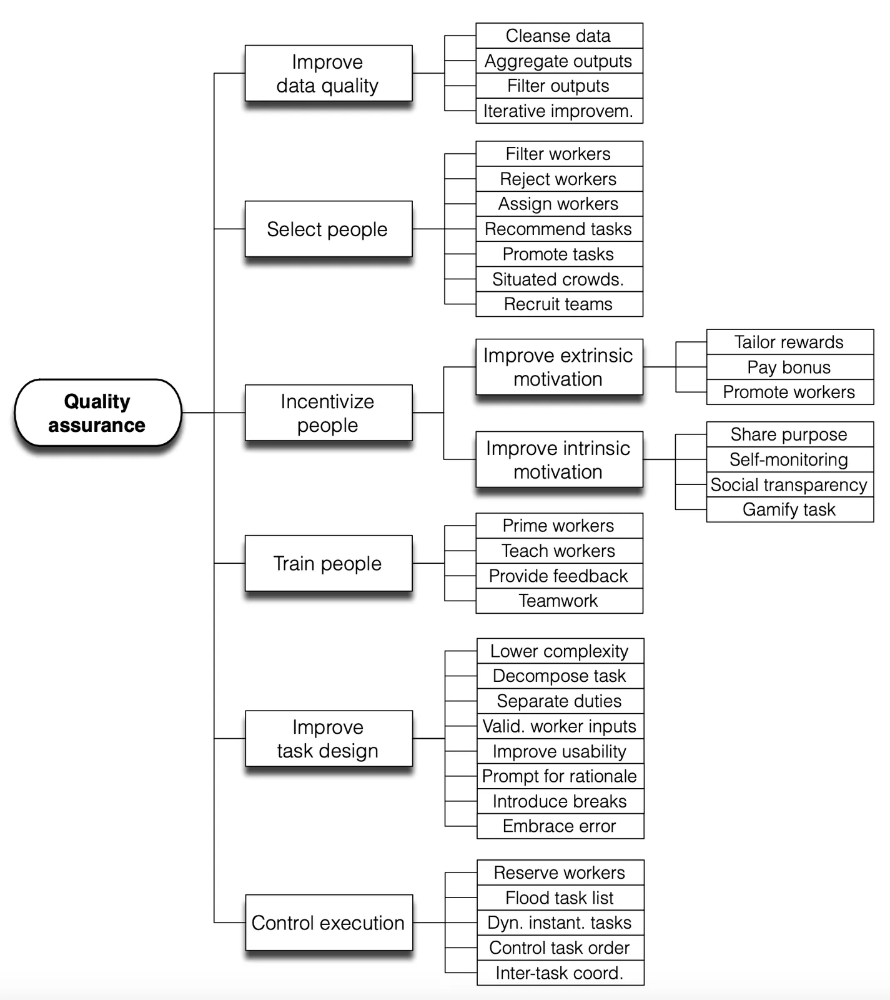 | **Crowdsourcing Quality Control Flow**: Daniel et al. (2018) quality model detailing assessment techniques, quality attributes, and assurance actions. |
| 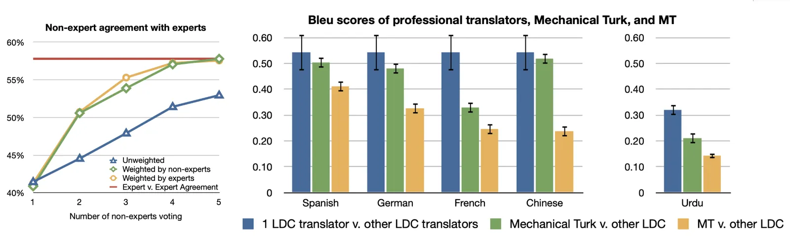 | **Translation Evaluation Agreement**: Left: expert-expert vs. non-expert-expert agreement on translation. Right: BLEU comparison showing non-expert translations closely matching expert quality. |
| 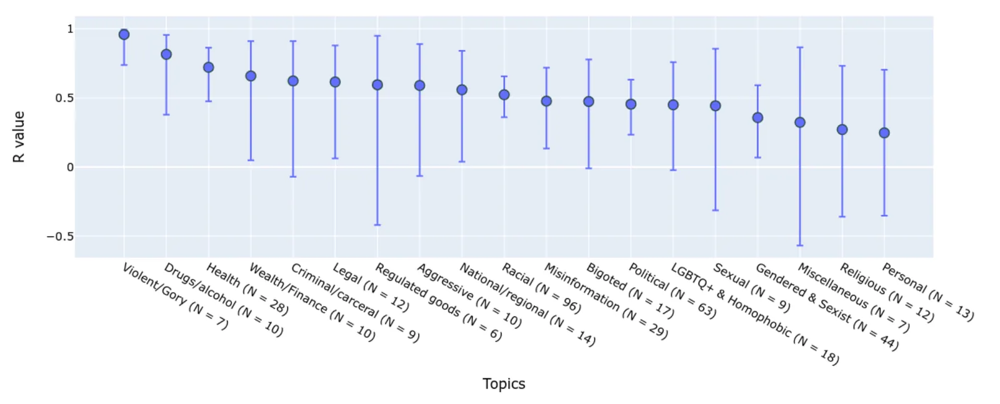 | **Topic-Specific Safety Correlation**: Agreement rates between experts and non-expert annotators on chat safety vary wildly across topics, dropping lowest on personal/nuanced dialogues. |
| 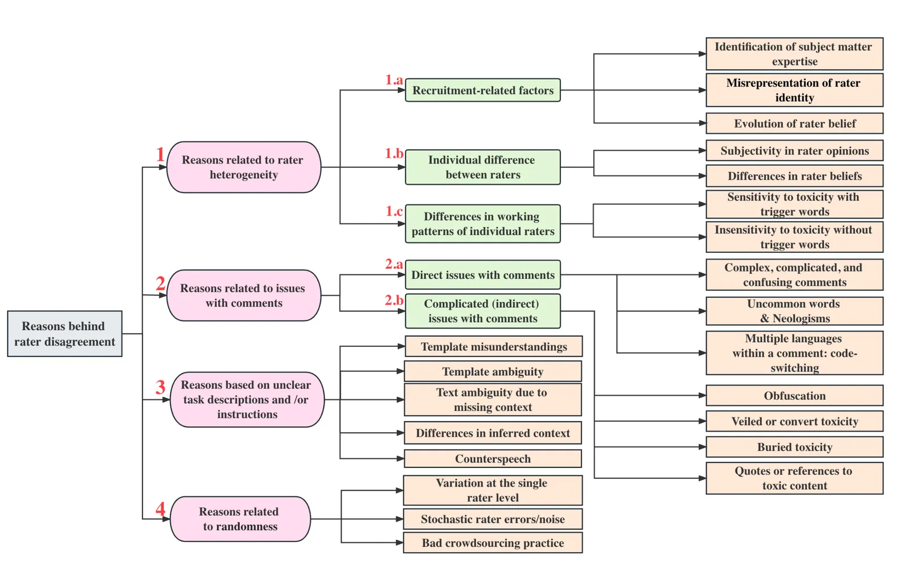 | **Taxonomy of Rater Disagreement**: Causes categorized by individual errors (inattention, interface), cognitive difficulty (linguistic, task), and genuine diverse beliefs. |
| 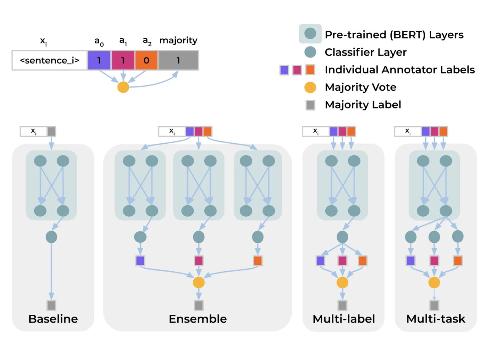 | **Multi-Annotator Architectures**: Structural diagrams comparing Single-task majority vote baselines, Ensembles, Multi-label outputs, and Multi-task heads. |
| 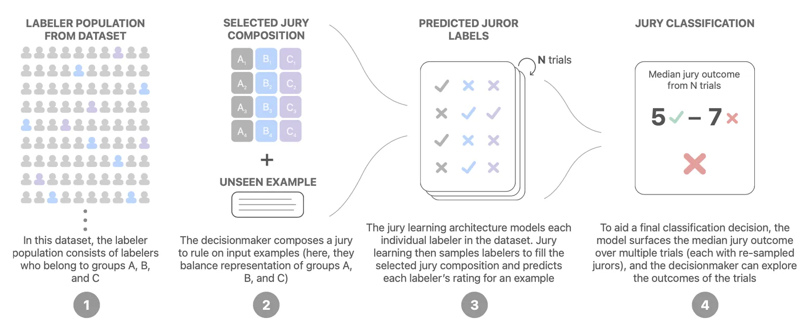 | **Jury Learning Decision Pipeline**: Process of collecting demographically annotated labels, training individual juror predictors, and specifying a custom jury composition at runtime. |
| 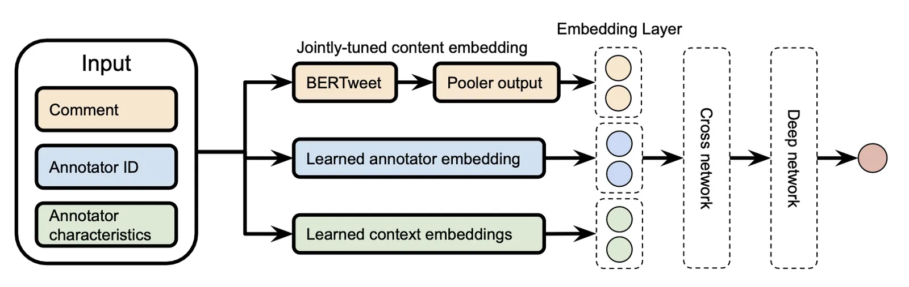 | **Deep & Cross Network (DCN) for Jurors**: DCN structure combining text embeddings (BERT) with annotator and group characteristic embeddings. |
| 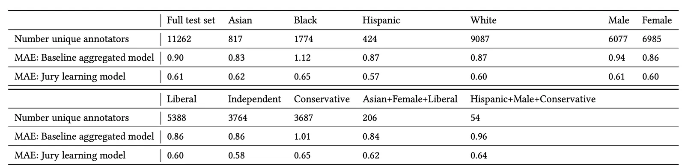 | **Jury Learning Performance**: Mean Absolute Error (MAE) comparing annotator-agnostic baselines with jury learning across multiple demographic splits. |
| 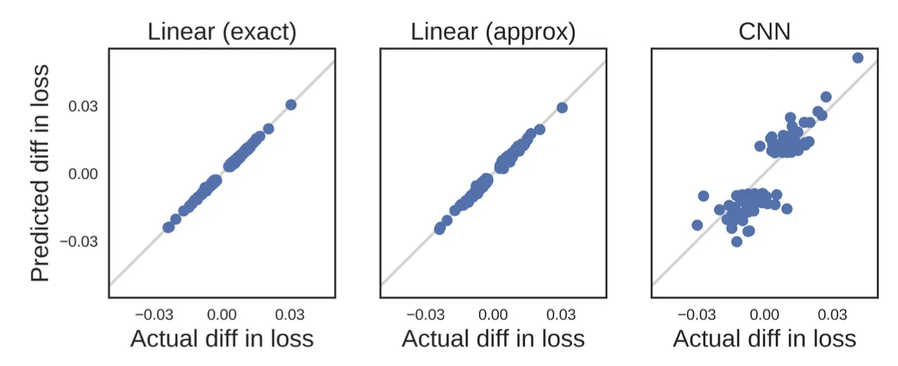 | **Influence Function Validation**: Influence estimates $\mathcal{I}_{\text{up,loss}}$ compared to actual leave-one-out retraining validation on a 10-class MNIST dataset. |
| 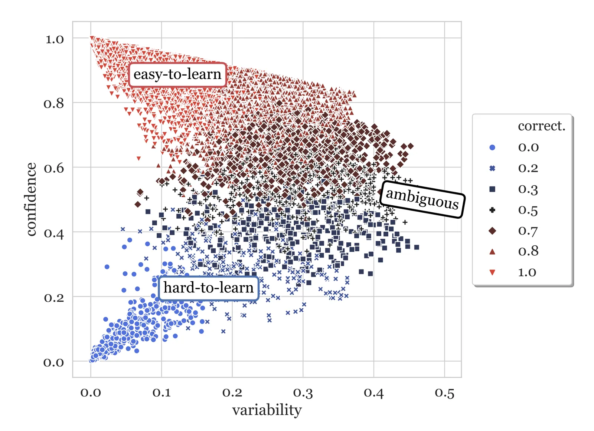 | **Dataset Cartography Map**: SNLI training dataset mapped along Confidence and Variability axes, dividing data into easy-to-learn, ambiguous, and hard-to-learn regions. |
| 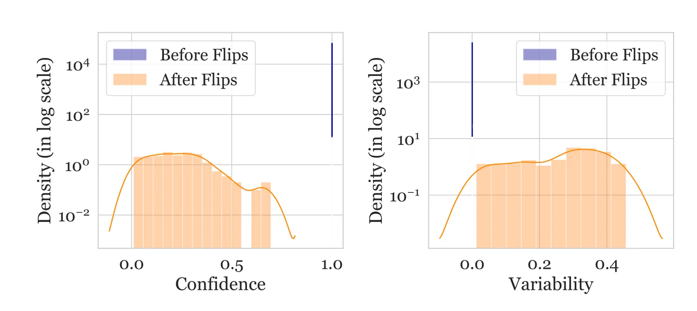 | **Data Map Trajectory under Label Flipping**: High-confidence, low-variability instances move down and right (low confidence, high variability) when their labels are flipped. |
| 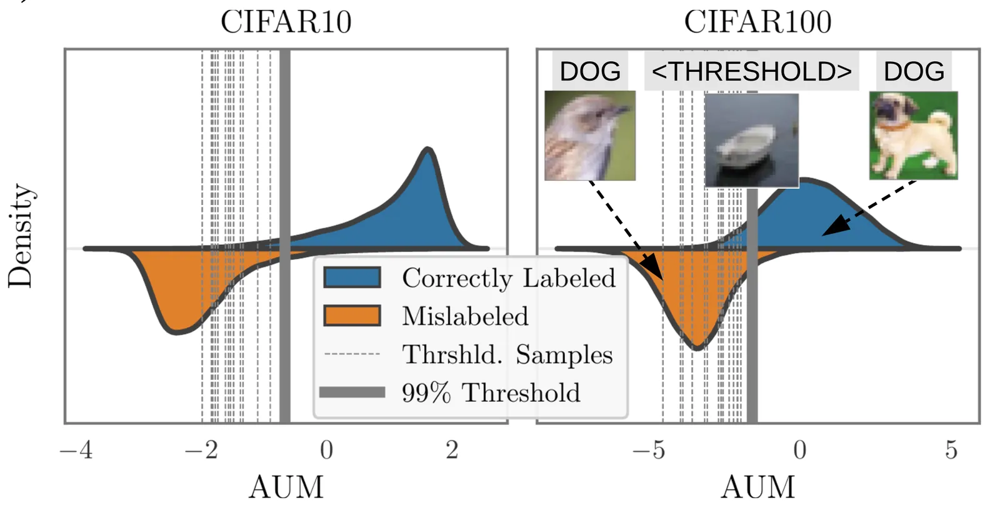 | **Area Under the Margin (AUM) Distribution**: Comparison of Margin distributions. AUM of randomly flipped samples sits significantly lower than clean samples, separated cleanly by threshold samples. |
| 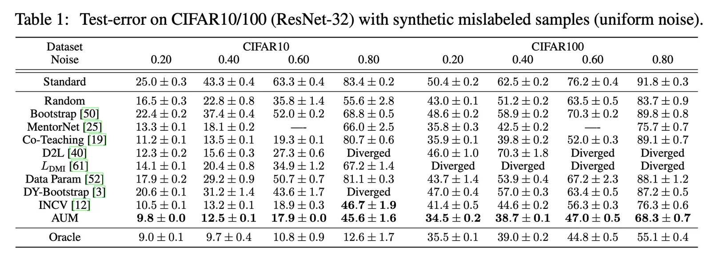 | **Test Error under AUM Pruning**: Retrained test error on CIFAR 10/100 as a function of noisy label removal, showing AUM pruners outperform standard baselines. |
| 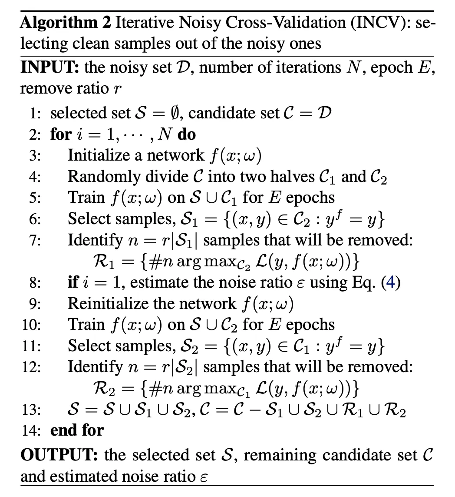 | **Iterative Noisy Cross-Validation (INCV)**: The flow of INCV using dual-split models to cross-evaluate clean candidates and prune noisy samples iteratively. |

Reference figures inline as  when mapping.

## Entities

*   **[[Lilian Weng]]** — Author of the survey, ML safety and alignment expert.
*   **[[Majority Voting]]** — Baseline consensus pooling method.
*   **[[MACE]]** — Graph model estimating annotator competence and spammers.
*   **[[Disagreement Deconvolution]]** — Probabilistic model extracting clean label distributions from stochastic rater flip noise.
*   **[[Jury Learning]]** — Deep & Cross Network framework modeling demographic-dependent predictions.
*   **[[Influence Functions in DL]]** — Closed-form approximation of training instance impact on loss.
*   **[[Data Maps]]** — Dataset cartography method categorizing samples by training dynamics.
*   **[[Area Under the Margin]]** — Logit-margin dynamic tracking for clean and noisy dataset auditing.

## Questions & Gaps

*   **Incentive Alignment**: MACE and other graph models assume spamming is a latent independent random choice. In reality, modern automated click-farms and coordinated LLM spammers exhibit complex, correlated cheating behaviors that might bypass standard EM graphical models.
*   **Inference Overhead of Multi-task Heads**: Training a distinct multi-task classification MLP head for each of the thousands of individual raters (as in Davani et al. 2021) does not scale well to vast crowdsourcing platforms with hundreds of thousands of fluid raters.
*   **Noisy Labels in Reasoning Models**: The paper concentrates primarily on classification and short translation. The training dynamics and margin profiles of long-horizon reasoning models (e.g., GRPO with multiple rollout paths) under subtle label noise or reward hacking remains an open frontier.

## Related

*   **[[Lilian Weng]]** — Parent profile page and full catalog of surveys.
*   **[[Reward Hacking in Reinforcement Learning]]** — Companion safety survey focusing on how human preference limits cause specification gaming.
*   **[[Extrinsic Hallucinations in LLMs]]** — July 2024 survey detail on safety and factuality evaluation.
*   **[[Learning with not Enough Data Part 3: Data Generation]]** — Covers noise-robust training algorithms like Co-teaching and GCE.
