# Diffusion Models for Video Generation

**Source**: `raw/2024-04-12-diffusion-video/full-article.md`, `raw/2024-04-12-diffusion-video/full-article.md`  
**Ingested**: 2026-05-22  
**Tags**: #summary

## Summary

This article by [[Lilian Weng]] is a comprehensive, structured survey of **Diffusion Models for Video Generation**. Generating videos with diffusion is treated as a high-dimensional temporal superset of text-to-image synthesis. The task introduces significant challenges, specifically the strict requirement for **temporal consistency** across frames and the extreme scarcity of high-quality paired text-video datasets compared to text-image pairs.

To address these hurdles, the research community has evolved three primary modeling paradigms:
1. **Video Generation from Scratch**: Designing architectures and schedules without pre-trained image backbones. These systems rely on factorized space-time operators—such as space-time separable convolutions and temporal attention blocks—and specialized diffusion schedules like **velocity ($\mathbf{v}$) parameterization** (which prevents color shift) and **reconstruction guidance** (for coherent autoregressive extension and temporal interpolation). Notable models include Google's **Video Diffusion Models (VDM)**, **Imagen Video** (which utilizes a cascaded temporal and spatial super-resolution pipeline), and OpenAI's **Sora** (which represents videos as visual tokens of spacetime patches using a **Diffusion Transformer (DiT)** architecture).
2. **Adapting Image Models to Generate Videos**: "Inflating" a frozen pre-trained text-to-image diffusion model by interleaving temporal layers that are fine-tuned on video datasets. This allows the model to leverage rich image-text priors, dramatically lowering data and training requirements. Key models in this space include Meta's **Make-A-Video** (introducing pseudo-3D convolutions/attention), **Tune-A-Video** (enabling one-shot video editing via spatiotemporal self-attention), Runway's **Gen-1** (decomposing video synthesis into decoupled structure and content channels), **Video Latent Diffusion Models (Video LDM)** (which adds temporal layers to a latent space U-Net and fine-tunes the autoencoder decoder with a patch-wise 3D discriminator to eliminate flickering), **Stable Video Diffusion (SVD)** (which highlights the massive impact of dataset curation via optical flow, OCR, and aesthetic filtering), and Google's **Lumiere** (which uses a **Space-Time U-Net (STUNet)** to generate the entire temporal sequence at once, bypassing low-quality temporal super-resolution cascades).
3. **Training-Free Adaptation**: Synthesizing consistent videos from pre-trained image models without any parameter fine-tuning. These training-free approaches utilize **motion dynamics** (warping random latent codes via DDIM backward-forward trajectories to seed camera motion) and **cross-frame attention** (reprogramming self-attention blocks so that subsequent frames attend to either the first frame or previous frames to maintain object identity). Representative models include **Text2Video-Zero** (which enforces consistency via first-frame cross-attention and background masking) and **ControlVideo** (extending ControlNet with full-sequence cross-frame attention, interleaved-frame smoothing, and hierarchical sampling for long sequences).

---

## Key Claims

- **Trigonometric $\mathbf{v}$-Parameterization**: Video diffusion heavily benefits from velocity prediction ($\mathbf{v} = \alpha_t \boldsymbol{\epsilon} - \sigma_t \mathbf{x}$) parameterization derived in the angular coordinate ($\phi_t = \arctan(\sigma_t/\alpha_t)$). By shifting update equations to the angular coordinate:
  $$\mathbf{z}_{\phi_s} = \cos(\phi_s - \phi_t)\mathbf{z}_{\phi_t} + \sin(\phi_s - \phi_t)\hat{\mathbf{v}}_\theta$$
  the model avoids the characteristic color-shift artifacts common in standard noise-prediction ($\boldsymbol{\epsilon}$-parameterization) models under high noise schedules.
- **Reconstruction Guidance for Conditioning**: Sampling subsequent frames autoregressively or performing temporal interpolation requires conditioning on a reference frame sequence $\mathbf{x}^a$. VDM proves that conditioning is achieved by modifying the predicted reconstruction of $\mathbf{x}^b$ with an auxiliary gradient:
  $$\tilde{\mathbf{x}}^b_\theta (\mathbf{z}_t) = \hat{\mathbf{x}}^b_\theta (\mathbf{z}_t) - \frac{w_r \alpha_t}{2} \nabla_{\mathbf{z}_t^b} \| \mathbf{x}^a - \hat{\mathbf{x}}^a_\theta (\mathbf{z}_t) \|^2_2$$
  where a weighting factor $w_r > 1$ dramatically enhances temporal alignment and sample quality.
- **Space-Time Separable Blocks**: Factoring 3D spatiotemporal operations into separate 2D spatial blocks (treating frames as batch dimension) and 1D temporal blocks (treating pixels as batch dimension) keeps memory complexity tractable while capturing strong spatiotemporal coherence.
- **Autoencoder Flickering Bottleneck**: Latent video diffusion models suffer from flickering artifacts because their pre-trained image autoencoders decode each frame independently. Fine-tuning the decoder with interleaved temporal layers and a 3D patch-wise temporal discriminator while keeping the encoder frozen successfully enforces temporal consistency.
- **Dataset Curation Dominance**: Stable Video Diffusion (SVD) demonstrates that dataset curation is far more impactful than raw scale. Removing static clips (using optical flow scores $< 2$ fps), filtering text-heavy frames via OCR, and ranking clips with aesthetic scoring models yields significantly higher-fidelity video generation.
- **Single-Pass Space-Time Generation**: Lumiere demonstrates that generating the entire temporal duration of a video at once via a Space-Time U-Net (STUNet) yields superior temporal consistency compared to the traditional cascade of low-resolution base generation followed by temporal and spatial super-resolution models (TSR/SSR), which frequently suffer from boundary mismatches.
- **Zero-Shot Latent Warping**: Text2Video-Zero establishes that deterministic DDIM trajectories can be warped in latent space with global motion vectors ($\boldsymbol{\delta}^k$) to generate consistent zero-shot camera and scene motion:
  $$\mathbf{x}^k_T = \text{DDIM-forward}(W_k(\text{DDIM-backward}(\mathbf{x}^1_T, \Delta t)), \Delta t)$$
- **Foreground Identity Preservation**: Cross-frame attention, where subsequent frames query either the first frame (Text2Video-Zero) or a combined key-value pool of the first and previous frames (Tune-A-Video), prevents foreground objects from morphing over time without requiring any weights to be trained.

---

## Figures

| Figure | Caption | Source Section |
|--------|---------|----------------|
| 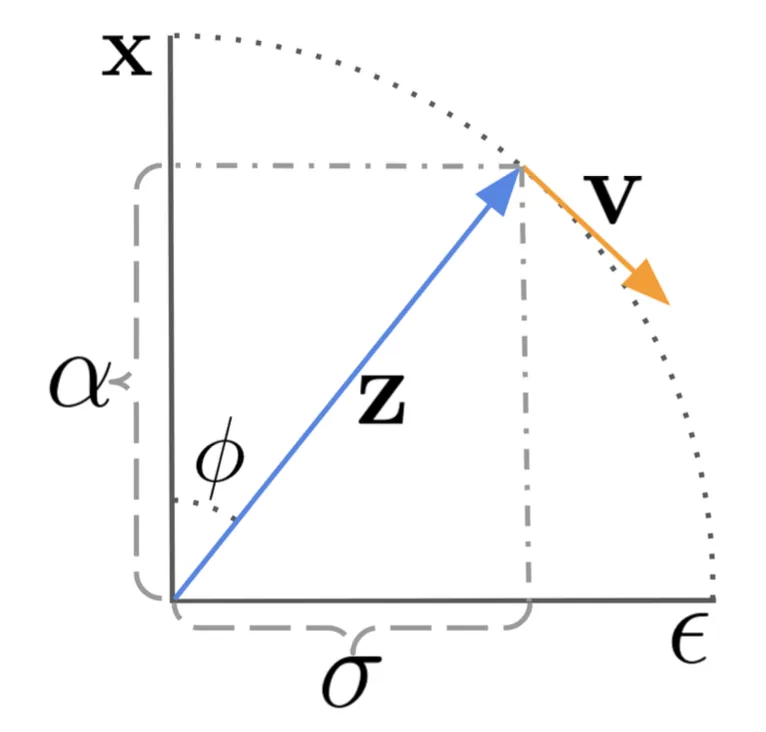 | Visualizing the diffusion update step in the angular coordinate, where DDIM evolves $\mathbf{z}_{\phi_s}$ by moving it along the $-\hat{\mathbf{v}}_{\phi_t}$ direction. | Video Generation from Scratch / Parameterization |
| 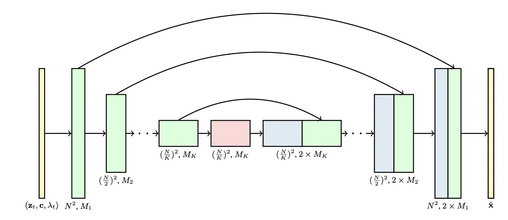 | The factorized 3D U-Net architecture separating spatial operations (convolutions, spatial attention) from temporal attention blocks. | Video Generation from Scratch / Architecture |
| 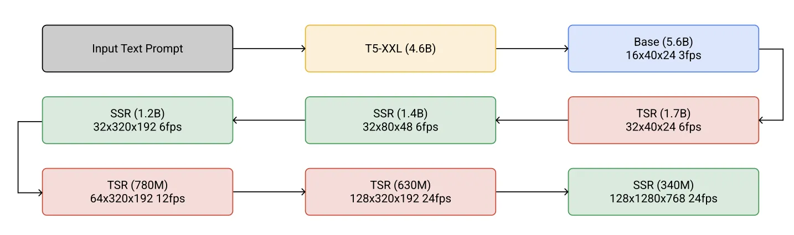 | The cascaded sampling pipeline of Imagen Video: base model followed by three temporal (TSR) and three spatial (SSR) super-resolution models. | Video Generation from Scratch / Imagen Video |
| 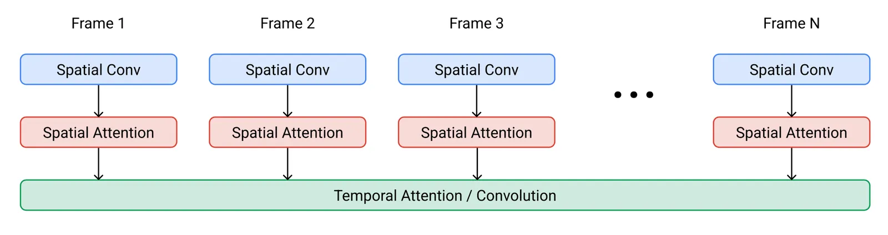 | The architecture of one space-time separable block in the Imagen Video model, featuring spatial convolution, spatial attention, and temporal attention. | Video Generation from Scratch / Imagen Video Block |
| 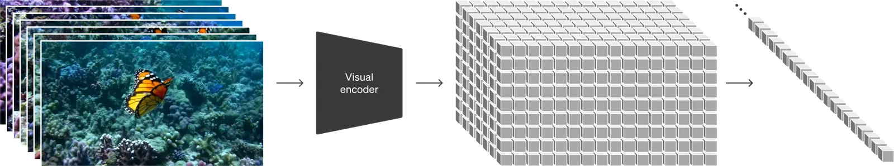 | Sora's Diffusion Transformer (DiT) architecture, which tokenizes visual inputs into spatiotemporal patches. | Video Generation from Scratch / Sora DiT |
| 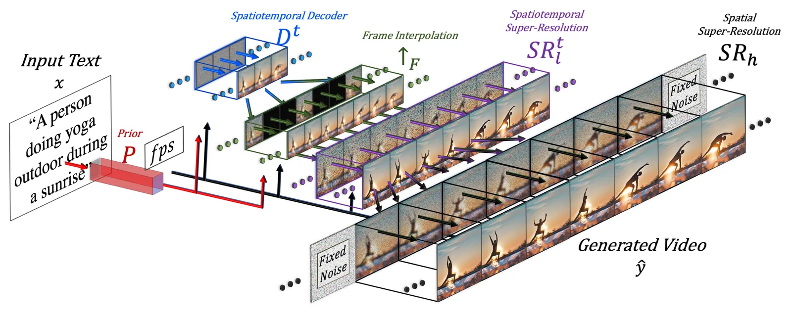 | The Make-A-Video pipeline: text embeddings projected to prior, decoded to low-resolution frames, interpolated, and spatial-temporally upscaled. | Adapting Image Models / Make-A-Video |
| 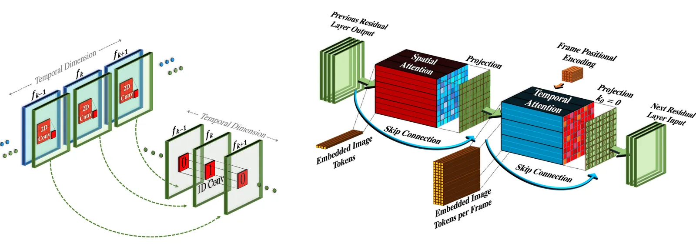 | Pseudo-3D convolutions and attention blocks in Make-A-Video, stacking 1D temporal operations after 2D spatial ones. | Adapting Image Models / Pseudo-3D Blocks |
| 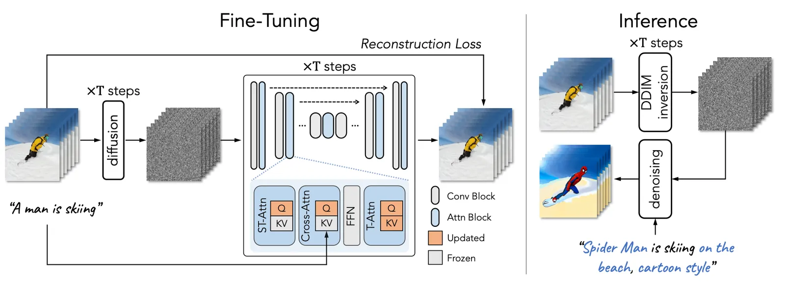 | Tune-A-Video one-shot tuning and inference pipeline, showing how ST-attention incorporates first-frame and previous-frame contexts. | Adapting Image Models / Tune-A-Video |
| 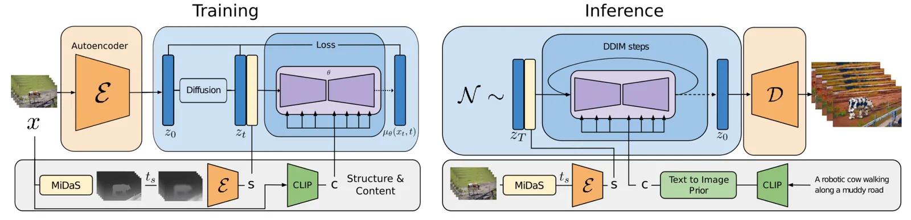 | Gen-1 training pipeline separating visual content conditioning (CLIP embeddings) from geometric structure conditioning (depth maps). | Adapting Image Models / Runway Gen-1 |
| 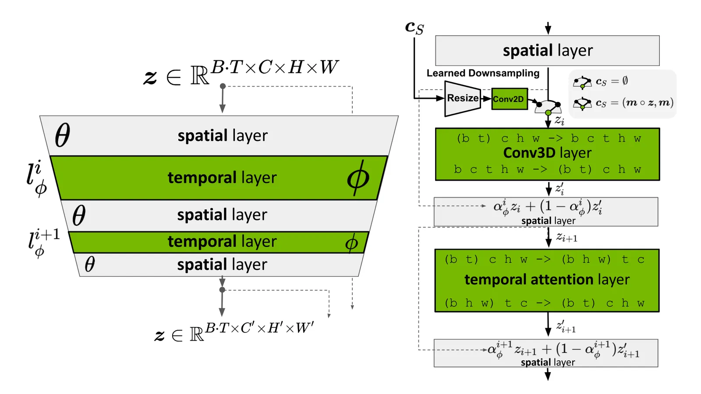 | Reshaping of latent sequences in Video LDM, interleaving frozen spatial blocks with newly inserted temporal attention and 3D convolutions. | Adapting Image Models / Video LDM |
| 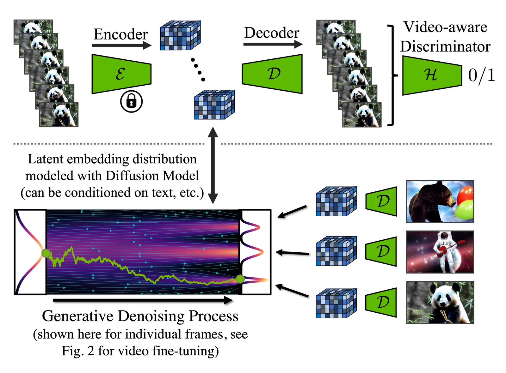 | Fine-tuning the LDM autoencoder decoder with temporal layers and an across-frame discriminator to resolve independent frame flickering. | Adapting Image Models / Video LDM Decoder |
| 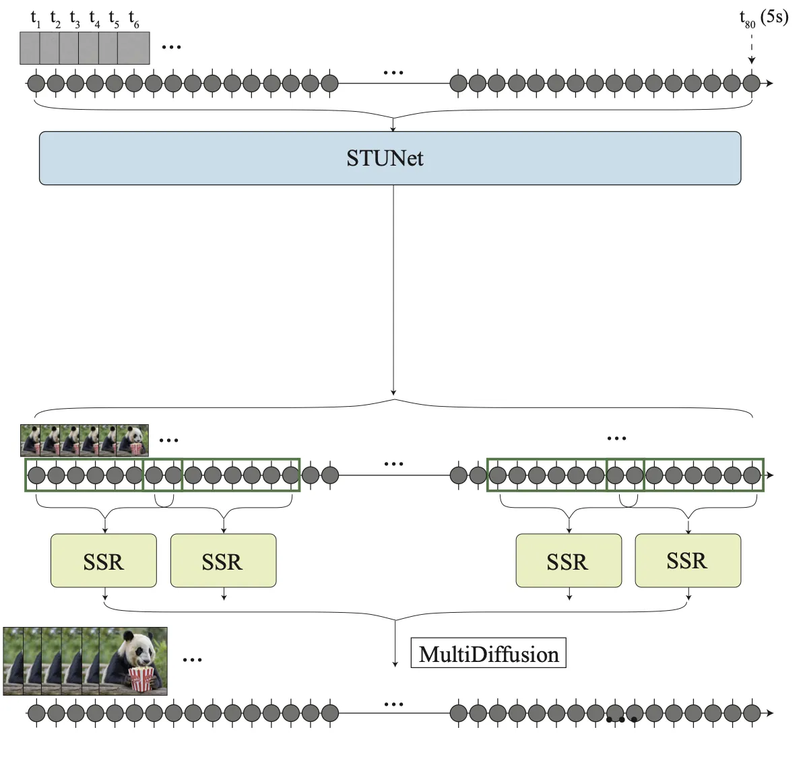 | Lumiere global Space-Time U-Net (STUNet) generating a complete sequence at once, compared to overlapping spatial-temporal super-resolution snippets. | Adapting Image Models / Lumiere |
| 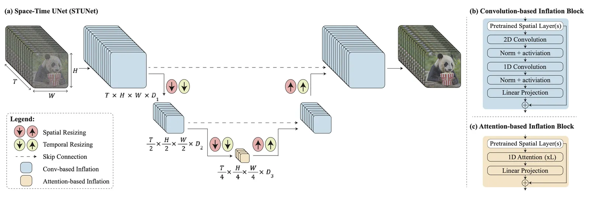 | STUNet architecture details showing downsampling blocks in both spatial and temporal dimensions, and convolution/attention block designs. | Adapting Image Models / STUNet Details |
| 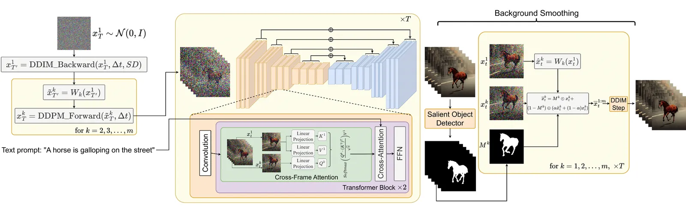 | Text2Video-Zero zero-shot, training-free video generation pipeline incorporating DDIM latent warping and cross-frame attention. | Training-Free Adaptation / Text2Video-Zero |
| 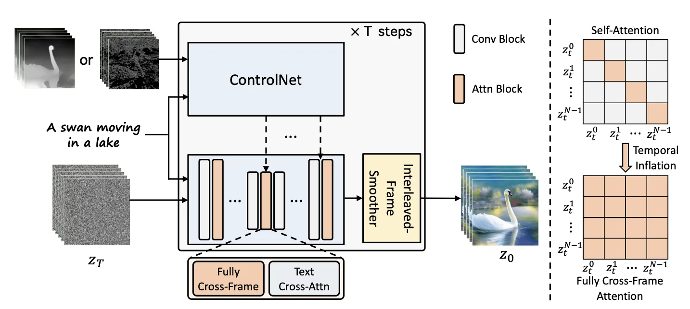 | ControlVideo controllable structure pipeline leveraging cross-frame attention, interleaved-frame smoothing, and hierarchical clip sampling. | Training-Free Adaptation / ControlVideo |

---

## Inline Figure Reference

The trigonometric velocity formulation can be visualized as an angular rotation in the coordinate space:

When performing image model inflation, instead of full 3D spatiotemporal operations, pseudo-3D blocks stack 1D temporal convolutions immediately following pre-trained 2D spatial layers:

Lumiere addresses the artifacts caused by spatial-temporal super-resolution snippets (top) by modeling the entire sequence at once using a global Space-Time U-Net (bottom):

---

## Entities

- [[Lilian Weng]] — Author of this comprehensive deep learning and generative modeling survey.
- **Video Diffusion Models** — The foundational framework (VDM) factorizing 3D U-Nets into separable space-time operations.
- [[v-parameterization]] — Velocity-based parameterization derived in angular coordinates to prevent color shifts in video diffusion.
- **Imagen Video** — Cascaded spatiotemporal super-resolution architecture with progressive distillation and oscillating guidance.
- **Sora** — Diffusion Transformer (DiT) architecture scaling video generation via spatiotemporal visual patches.
- **Make-A-Video** — Image adaptation architecture inserting pseudo-3D layers and using auxiliary frame interpolation networks.
- [[pseudo-3d-convolution]] — Architectural block stacking 1D temporal kernels immediately following pre-trained 2D spatial kernels.
- **Tune-A-Video** — One-shot video tuning and editing framework introducing keyframe-conditioned spatiotemporal self-attention.
- [[cross-frame-attention]] — Mechanism allowing frames to query reference frame contexts to maintain global semantic consistency.
- [[reconstruction-guidance]] — Conditioning technique adjusting predicted latents with auxiliary MSE gradients to enforce temporal alignment.
- **Lumiere** — Space-Time U-Net (STUNet) generating full-duration temporal sequences in a single pass.
- [[space-time-u-net]] — A U-Net architecture downsampling in both spatial and temporal dimensions to model sequence-wide dynamics.
- **Text2Video-Zero** — Zero-shot, training-free video generator using latent warping and first-frame cross-frame attention.

---

## Questions & Gaps

- **Memory Bottlenecks in Single-Pass Models**: Although global Space-Time U-Nets (Lumiere) eliminate the interpolation artifacts of TSR/SSR cascades, they suffer from extreme memory footprints, setting a physical boundary on the duration and resolution of single-pass video synthesis.
- **Autoregressive Temporal Drift**: Conditioning sequences via reconstruction guidance (VDM) remains prone to accumulation errors over long sequences, leading to progressive semantic decay, structural deformation, or scene drift.
- **Rigid Physical Dynamics**: While zero-shot latent warping (Text2Video-Zero) maintains high semantic and spatial consistency, it is restricted to simple linear camera translations or rigid warping, failing to model complex non-rigid physical object transformations or dynamic interactions.

---

## Related

- [[What are Diffusion Models?]] — Pre-read survey detailing the foundational math, score matching, and backbones of diffusion.
- [[Denoising Diffusion Implicit Models]] — Song et al. (2020) non-Markovian sampling framework utilized in video acceleration and latent warping.
- [[Latent Diffusion Models]] — Latent space compression paradigm modified in Video LDM and Stable Video Diffusion.
- [[Diffusion Transformer]] — Scalable transformer backbone expanded by Sora to process visual spacetime patches.
- [[Lilian Weng]] — Author page detailing her deep learning surveys.
