# Scaling Laws, Carefully

**Source**: `raw/2026-06-24-scaling-laws/full-article.md`, `raw/2026-06-24-scaling-laws/full-article.md`  
**Ingested**: 2026-07-12  
**Tags**: #summary

## Summary

Lilian Weng's June 2026 post is a careful walk through how [[Scaling Laws]] are fit, interpreted, and often misread. The core observation is old: test loss $L$ falls as a power law when model size $N$, dataset size $D$, or compute $C \approx 6ND$ grows. What matters in practice is how you allocate compute between parameters and tokens, and how fragile that allocation looks once you leave the infinite-data regime or change fitting details.

Weng starts with pre-LLM work. Amari et al. (1992) gave four learning-curve shapes under different noise and algorithm assumptions. Hestness et al. (2017) showed power-law error across NMT, vision, LM, and speech, with architecture shifting the offset but not the exponent. Rosenfeld et al. (2020) combined both axes into $\hat{L}(N,D) \approx A/N^\alpha + B/D^\beta + E$, the parametric form later reused everywhere.

The Kaplan vs. [[Papers Explained 49 - Chinchilla|Chinchilla]] split is the center of the post. Kaplan et al. (2020) argued $N_\text{opt} \propto C^{0.73}$: grow the model faster than the data, train big and stop early. Chinchilla (Hoffmann et al. 2022) refit on larger models and three methods (fixed-$N$ token sweeps, [[IsoFLOP Profiles]], and direct parametric fit) and got $N_\text{opt} \propto C^{0.5}$: double parameters, double tokens. Pearce & Song (2024) reconcile much of the gap by counting embeddings (Kaplan excluded them, Chinchilla included them) and showing the Kaplan exponent is a local fit in a small-model band.

The data-limited section is where the post gets most useful for 2026 planning. Hernandez et al. (2022) showed double descent when repeating a small fraction of data. Muennighoff et al. (2023) discount repeated tokens with an exponential decay on effective data $D'$. Lovelace et al. (2026) add an explicit overfitting penalty scaling with repetition and the capacity ratio $N/U_D$. Both are curve fits, not derived theory, but they track experiments better than pretending unique tokens are unlimited.

Weng closes on fitting hygiene. Besiroglu et al. (2024) show Chinchilla Method 3 drifted because of Huber-loss averaging, early L-BFGS termination, and rounded $\alpha,\beta$. A toy widget demonstrates how loss rounding, milli-loss noise, and fit-region choice move the apparent frontier. The practical lesson: scaling laws are extrapolation tools; small procedural differences become large budget errors.

## Key Claims

- Power-law loss decay with $N$, $D$, and $C$ is robust across domains, but optimal $N{:}D$ allocation is not universal.
- Kaplan et al. recommended $N_\text{opt} \propto C^{0.73}$; Chinchilla found $N_\text{opt} \propto C^{0.5}$ via three agreeing methods on 400+ runs.
- Pearce & Song (2024) attribute much of the Kaplan/Chinchilla gap to embedding-parameter counting and small-model extrapolation.
- Classic scaling laws assume unlimited unique data; repetition, double descent, and overfitting penalties require extended forms (Muennighoff 2023, Lovelace 2026).
- Data quality and cleaning matter as much as raw token count $D$ for compute efficiency.
- Fitting choices (parameter counting, loss aggregation, rounding, fit region) can dominate extrapolation error (Besiroglu et al. 2024).
- The gzip paper in this wiki ([[gzip Predicts Data-dependent Scaling Laws]]) extends the same parametric form by making coefficients depend on data compressibility.

## Figures

| Figure | Caption | Page |
|--------|---------|------|
| 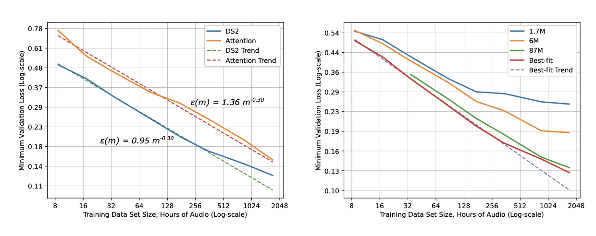 | Hestness et al.: learning curves for speech models of various sizes | Early days |
| 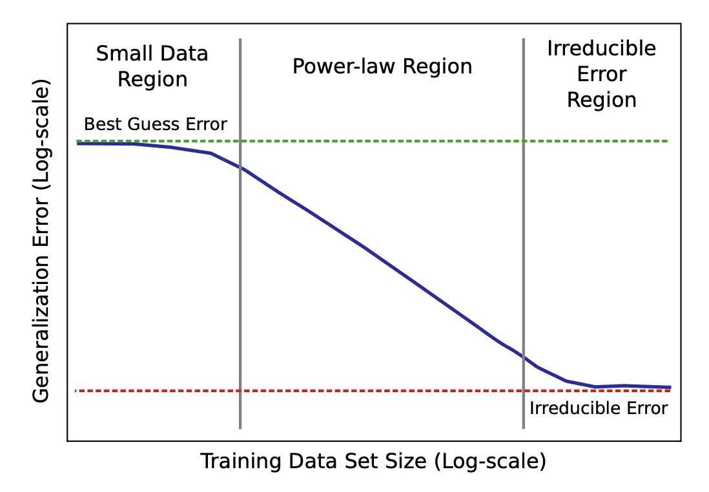 | Hestness et al.: three-phase power-law learning curve illustration | Early days |
| 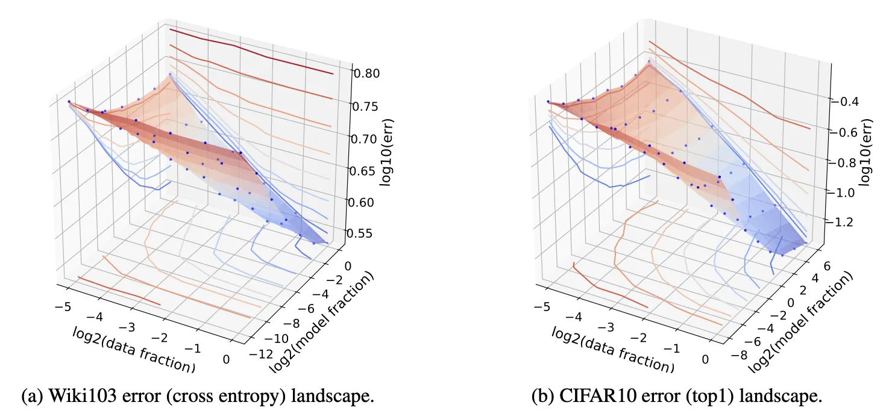 | Rosenfeld et al.: 3D contour of error vs. data and model size | Early days |
| 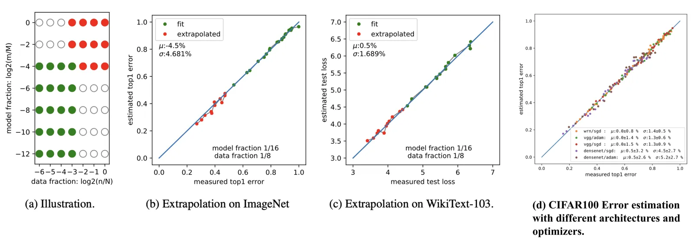 | Rosenfeld et al.: parametric fit extrapolation on ImageNet, WikiText-103, CIFAR-100 | Early days |
| 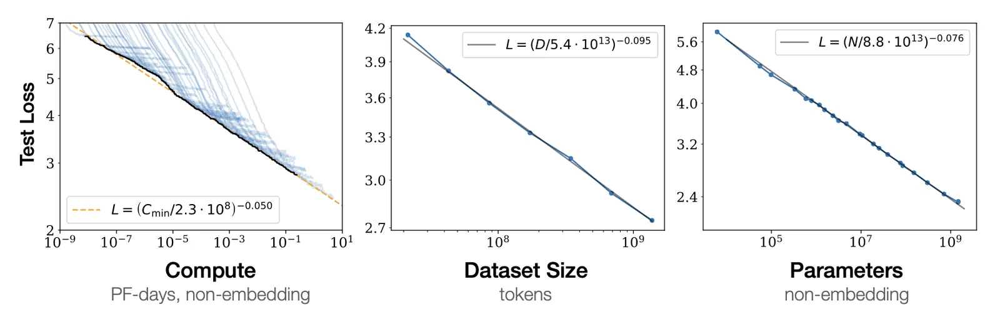 | Kaplan et al.: test loss power laws in compute, data, and parameters | Data-infinite |
| 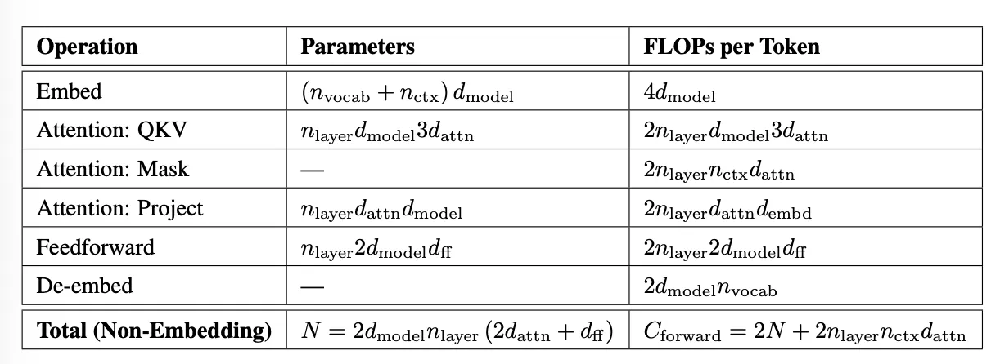 | Kaplan et al.: Transformer parameter and FLOP estimation table | Data-infinite |
| 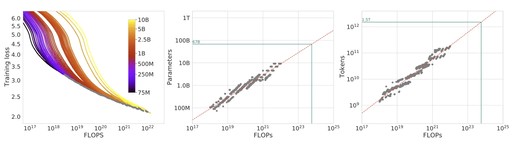 | Chinchilla Method 1: loss vs. FLOPs across model sizes | Chinchilla |
| 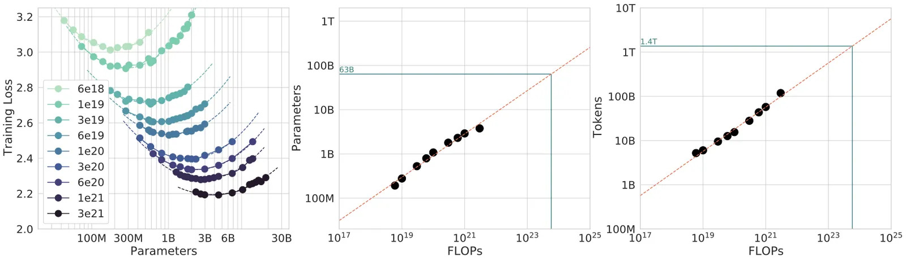 | Chinchilla Method 2: IsoFLOP parabolas in log-space | Chinchilla |
| 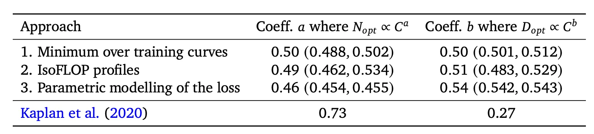 | Chinchilla: three methods agree on $N_\text{opt} \propto C^{0.5}$ | Chinchilla |
| 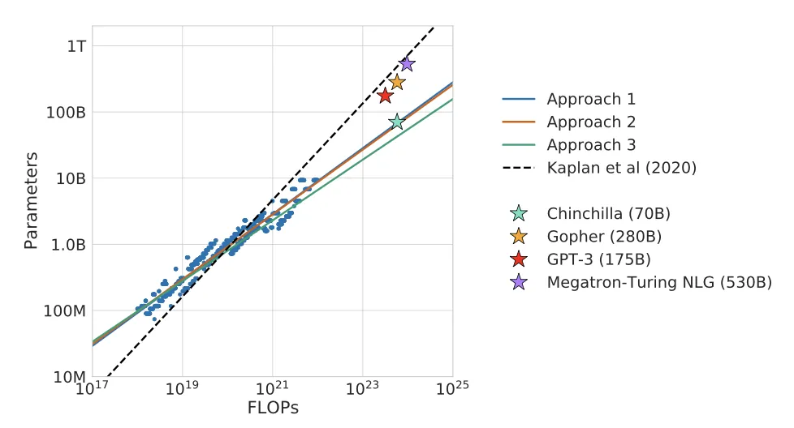 | Chinchilla vs. Kaplan predictions; mainstream LLMs were undertrained | Chinchilla |
| 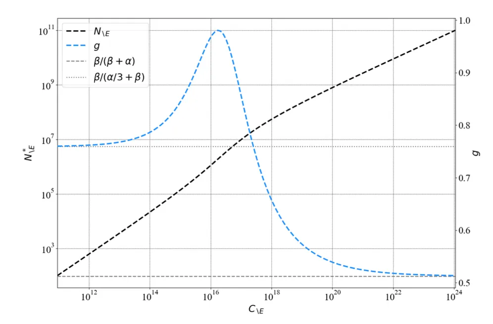 | Pearce & Song: local exponent $g$ vs. compute | Reconciliation |
| 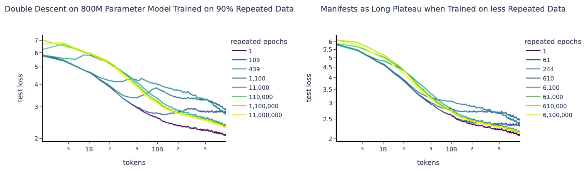 | Hernandez et al.: double descent with repeated data fraction | Data-limited |
| 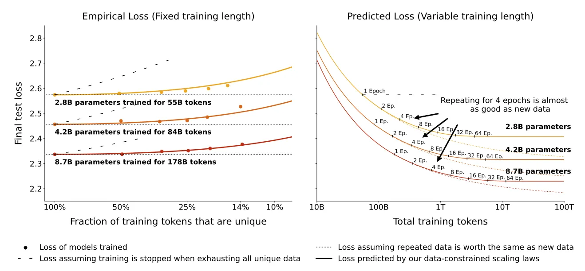 | Muennighoff et al.: data-constrained fit with exponential token decay | Data-limited |
| 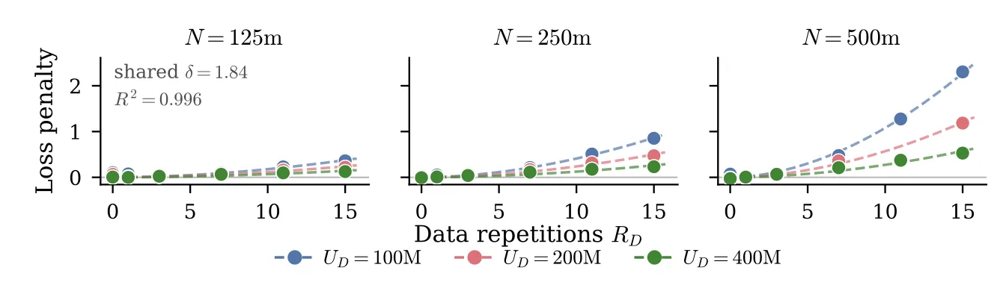 | Lovelace et al.: fit residuals grow with epochs and model size | Data-limited |
| 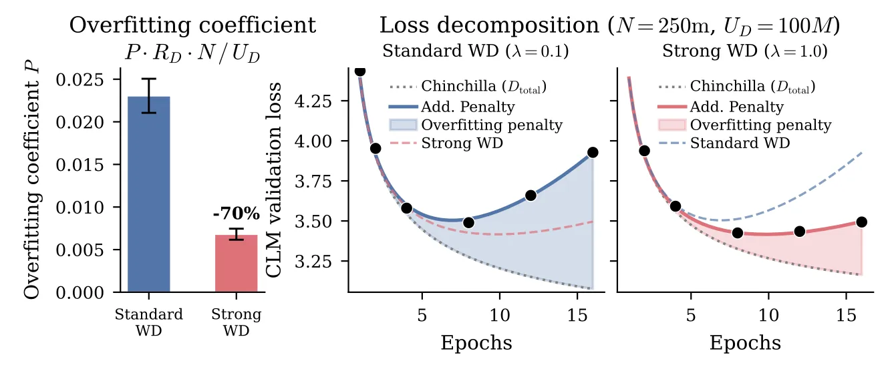 | Lovelace et al.: strong weight decay reduces repetition penalty | Data-limited |

## Entities

- [[Lilian Weng]] — author; Lil'Log survey of scaling-law history and pitfalls.
- [[Scaling Laws]] — central concept extended across infinite- and data-limited regimes.
- [[IsoFLOP Profiles]] — Chinchilla Method 2 for compute-optimal $N$ at fixed FLOPs.
- [[Data-Constrained Scaling Laws]] — Muennighoff and Lovelace extensions for repeated data.

## Questions & Gaps

- Lovelace et al. and Muennighoff et al. use empirical penalty terms without a first-principles derivation.
- Weng's toy simulation is illustrative but not linked to a reproducible notebook in the post.
- How data-dependent scaling ([[gzip Predicts Data-dependent Scaling Laws]]) combines with repetition-aware laws is still open.

## Related

- [[Papers Explained 49 - Chinchilla]] — canonical compute-optimal LLM scaling reference.
- [[Papers Explained 85 - Scaling Data-Constrained Language Models]] — Muennighoff et al. paper page.
- [[gzip Predicts Data-dependent Scaling Laws]] — data-complexity-dependent scaling coefficients.
- [[Large Language Models]] — topic hub for pretraining compute planning.
