# Harness Engineering for Self-Improvement

**Source**: `raw/2026-07-04-harness/full-article.md`, `raw/2026-07-04-harness/full-article.md`  
**Ingested**: 2026-07-21  
**Tags**: #summary

## Summary

Lilian Weng's July 2026 Lil'Log post frames **recursive self-improvement (RSI)**—an AI improving the machinery that produces its intelligence—and argues that the **harness** (the deployment system around a base model) is as important as raw model weights for economically valuable tasks. A harness orchestrates how the model plans, calls tools, manages context, stores artifacts, and evaluates results. Successful coding agents ([[Agent Harness]], [[Coding Harness]]) are the clearest industrial example.

Weng organizes harness engineering into **design patterns** and **optimization targets**. Design patterns include workflow automation (plan → execute → observe → improve loops), the file system as persistent memory (durable logs and artifacts instead of stuffing everything into context), and sub-agent/backend job orchestration. The optimization object evolves: instruction prompts → structured context → workflow graphs → harness source code → optimizer code.

The survey covers [[Agentic Context Engineering]] (ACE: generator/reflector/curator playbook), Meta Context Engineering (MCE: bi-level skill and context evolution), and Meta-Harness (outer-loop search over harness implementations). Workflow search appears in ADAS (meta-agent programs new agentic systems in code) and AFlow (MCTS over workflow graphs). [[Self-Improving Harness]] methods include STOP (recursively improve the improver), Self-Harness (weakness mining → bounded edits → regression validation), and Agentic Harness Engineering (AHE: three observability pillars with read-only verifiers to prevent reward hacking).

[[Evolutionary Program Search]] systems—AlphaEvolve, ShinkaEvolve, Darwin Gödel Machine—treat harness or algorithm code as evolvable populations under automatic evaluators. Joint harness-and-weight updates (SIA, Continual Harness) are early and evidence-light. The post closes on seven bottlenecks: weak evaluators, context lifecycle, negative-result preservation, diversity collapse, [[Reward Hacking]], short-term optimization vs. long-term repo health, and the continuing role of human oversight.

## Key Claims

- RSI in modern AI can mean weight updates *or* improving the training/deployment pipeline; harnesses are central to the latter.
- Harnesses include workflow design, evaluation, permissions, and persistent state—not just prompt templates.
- File-system-backed artifacts scale better than carrying full trajectories in context for long-horizon agents.
- The optimization target has shifted from prompts toward executable harness code as models improve.
- ACE prevents context collapse by incrementally merging structured bullet points instead of rewriting full prompts.
- MCE separates meta-level skill evolution from base-level context optimization with a bi-level objective.
- Meta-Harness uses a coding agent to propose Pareto-optimal harness candidates over a file-system execution history.
- STOP improves the *improver* recursively; it works with strong models but degrades with weaker ones.
- Harness-updating capability is relatively flat across model sizes; harness-*benefit* (using the harness well) peaks at middle tiers.
- Self-Harness and AHE require bounded editable surfaces, held-out regression tests, and evaluators outside the edit loop.
- Evolutionary search excels when fitness is cheap and objective; it struggles with slow, ambiguous, or taste-heavy domains.
- Paper production (AI Scientist) is not identical to scientific discovery; six recurring failure modes include implementation drift and weak scientific taste.

## Figures

| Figure | Caption | Section |
|--------|---------|---------|
| 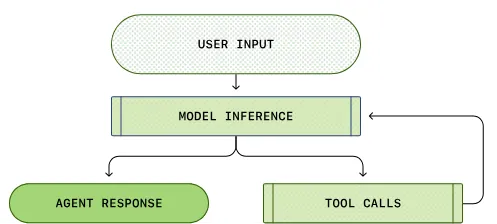 | Simplified Codex agent loop: tools affect next generation | Pattern 1 |
| 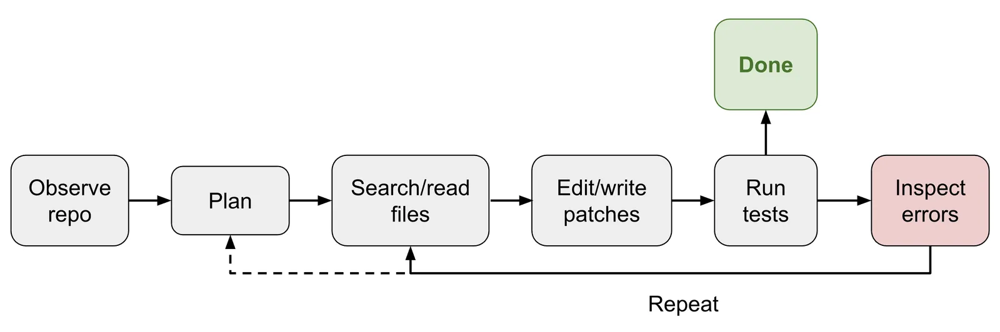 | Coding-agent harness loop with IDE-like tools | Case study |
| 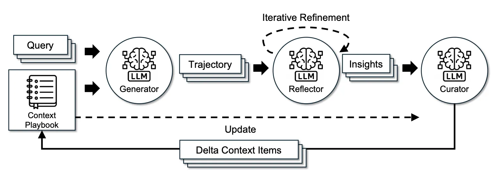 | Agentic Context Engineering (ACE) framework | Context eng. |
| 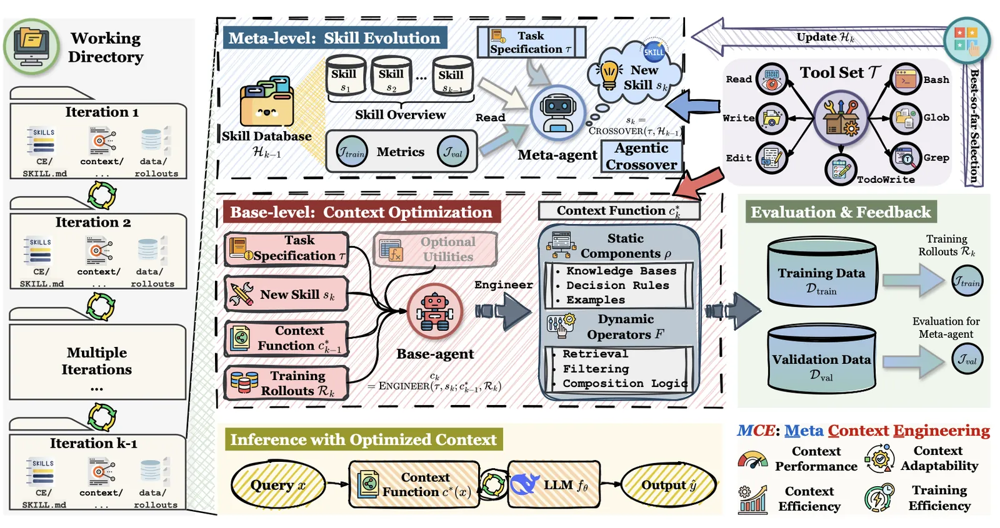 | Meta Context Engineering bi-level optimization | Context eng. |
| 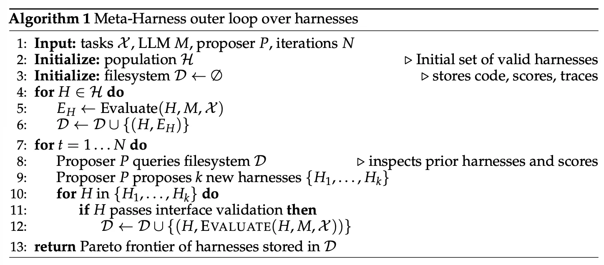 | Meta-Harness outer-loop optimization | Context eng. |
| 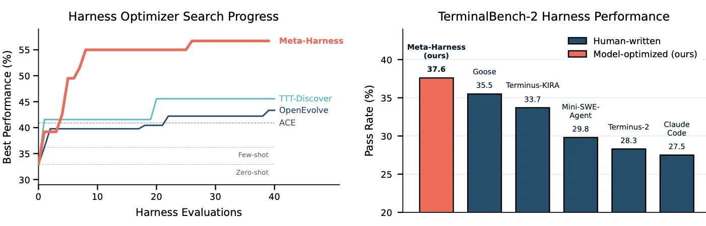 | Meta-Harness results on classification and TerminalBench-2 | Context eng. |
| 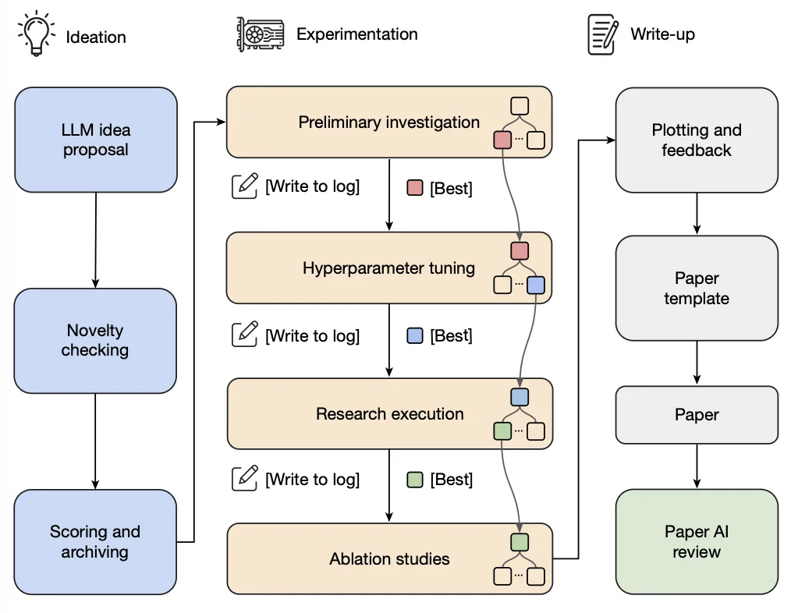 | AI Scientist end-to-end research pipeline | Workflow |
| 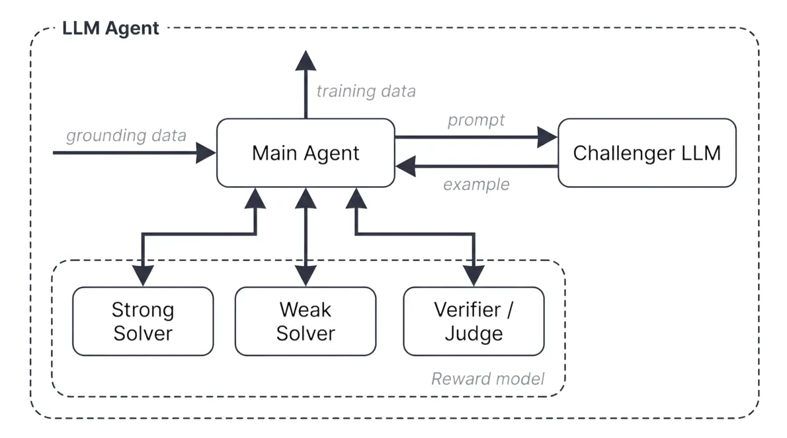 | Autodata challenger/solver/verifier workflow | Workflow |
| 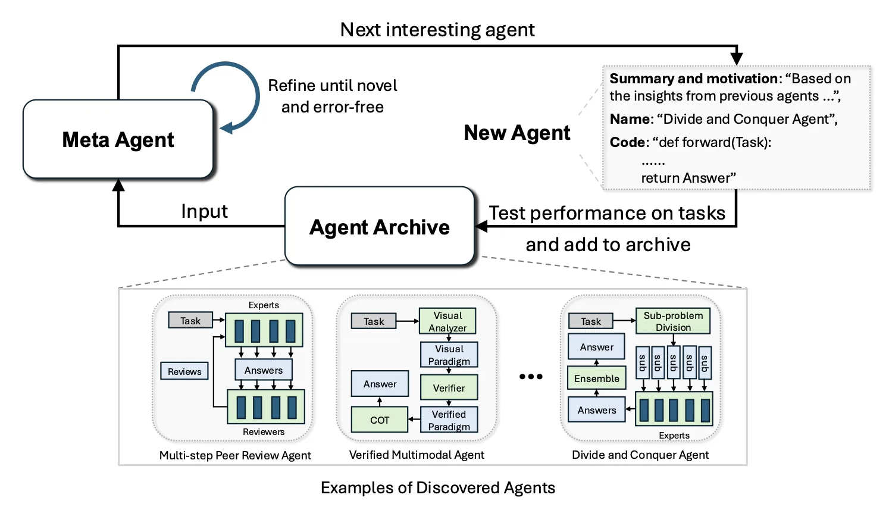 | Automated Design of Agentic Systems (ADAS) | Workflow |
| 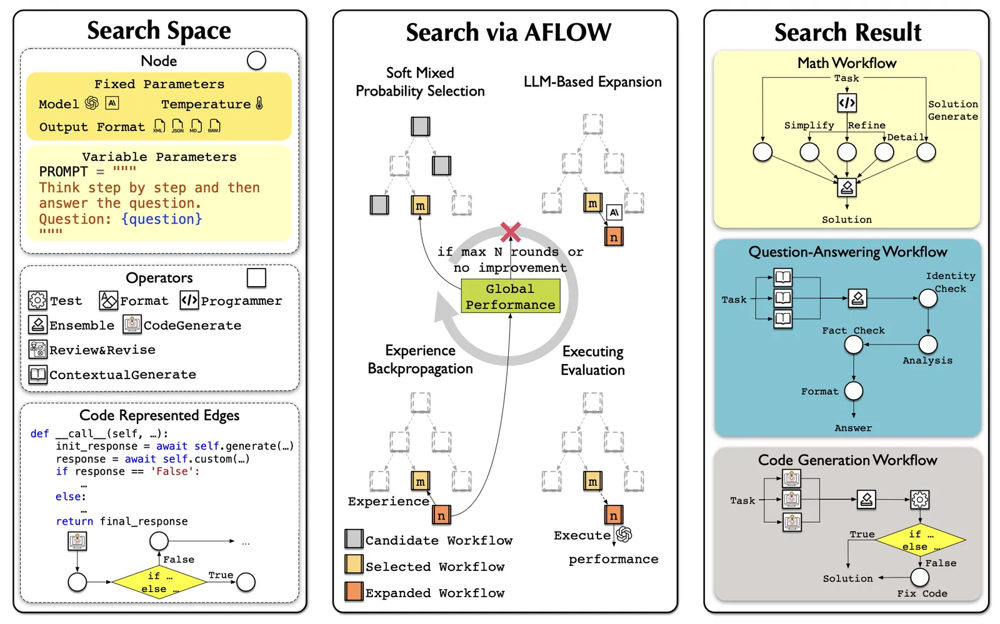 | AFlow MCTS workflow optimization | Workflow |
| 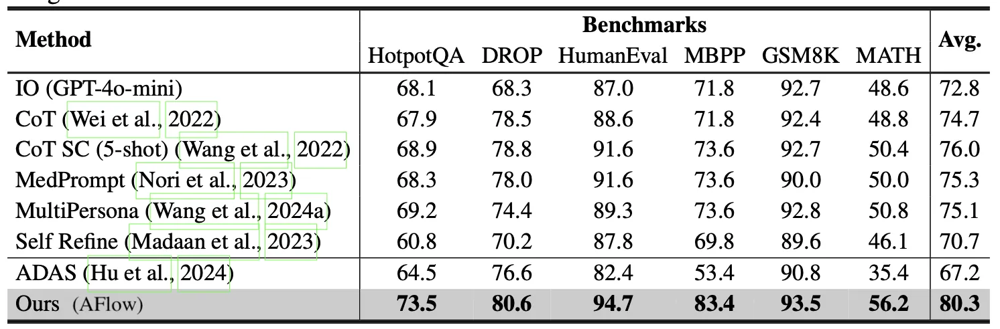 | AFlow experiment results vs. manual workflows | Workflow |
| 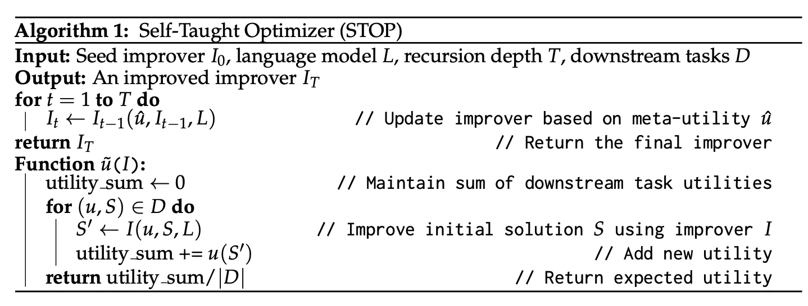 | Self-Taught Optimizer (STOP) algorithm | Self-improving |
| 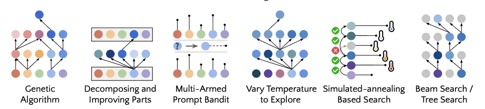 | Strategies discovered by STOP | Self-improving |
| 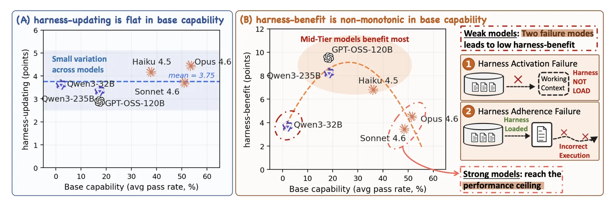 | Harness updating vs. harness benefit across models | Self-improving |
| 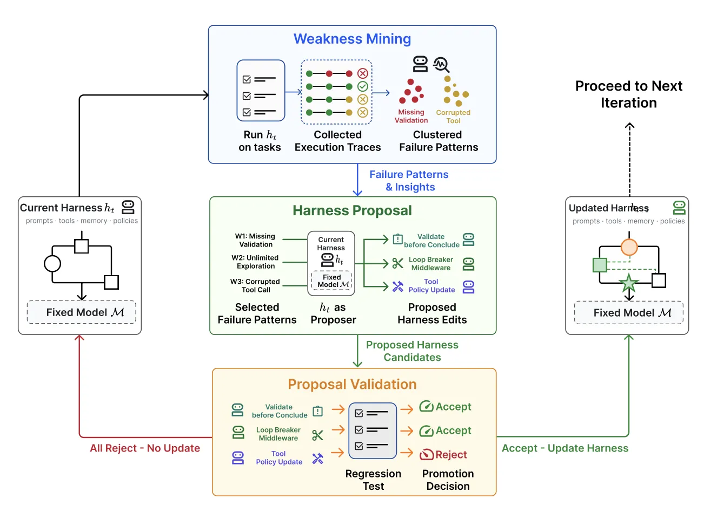 | Self-Harness propose-evaluate-accept loop | Self-improving |
| 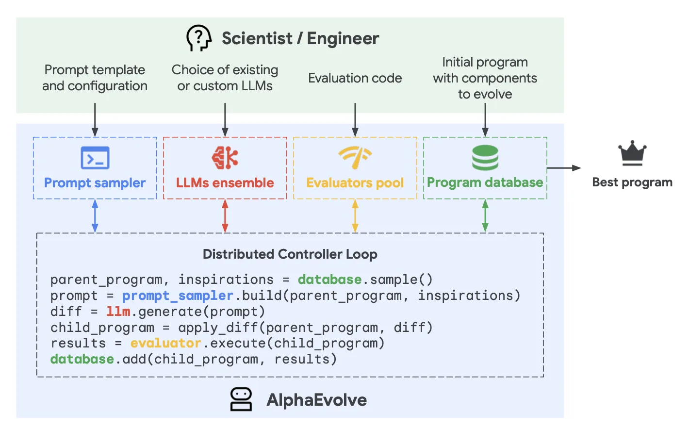 | AlphaEvolve evolutionary coding-agent search | Evolutionary |
| 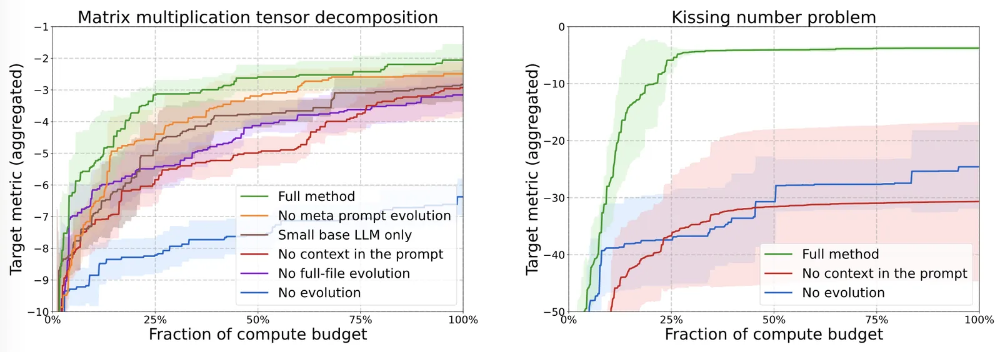 | AlphaEvolve ablation results | Evolutionary |
| 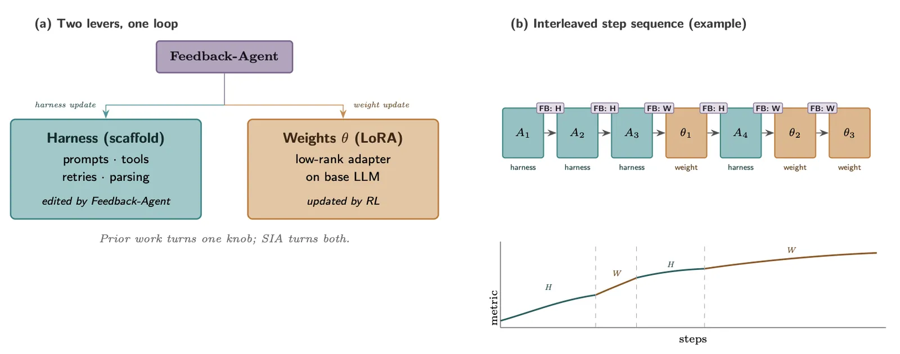 | SIA: joint harness and weight update loop | Joint opt. |

## Entities

- [[Lilian Weng]] — author; Lil'Log survey of harness engineering for RSI.
- [[Recursive Self-Improvement]] — conceptual frame from Good (1965) and Yudkowsky (2008).
- [[Agent Harness]] — product/infrastructure layer around agents.
- [[Coding Harness]] — software-engineering-specific harness patterns.
- [[Reward Hacking]] — central risk in self-improving loops.

## Questions & Gaps

- SIA's evidence is provisional due to weak baselines and model asymmetry between agents.
- How much of future RSI will be internalized into weights vs. remain in harness code is unresolved.
- Scalable human oversight for harness evolution at production scale is still open.
- Research-taste and novelty evaluators remain much weaker than code/math verifiers.

## Related

- [[Continually Improving Our Agent Harness]] — Cursor's production harness-engineering practices.
- [[Components of A Coding Agent]] — Sebastian Raschka's six-component coding-harness reference.
- [[Recursive Self-Improvement]] — RSI definitions and harness-vs-model intelligence.
- [[Self-Improving Harness]] — Self-Harness, AHE, STOP loops.
- [[Agentic Context Engineering]] — ACE, MCE, Meta-Harness.
- [[Evolutionary Program Search]] — AlphaEvolve, DGM, ADAS, AFlow.
- [[Controlling Reasoning Effort in LLMs]] — harness/router may auto-select reasoning effort.
- [[Reward Hacking in Reinforcement Learning]] — reward-specification risks in RSI.
- [[Evaluation and Benchmarks]] — PaperBench, RE-Bench, MLE-bench appendix benchmarks.
