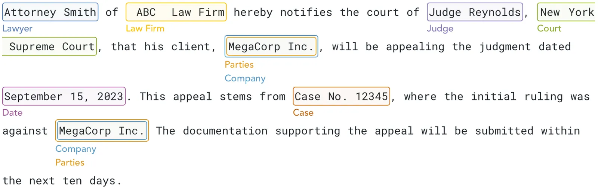
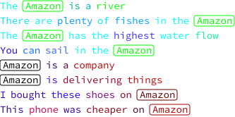
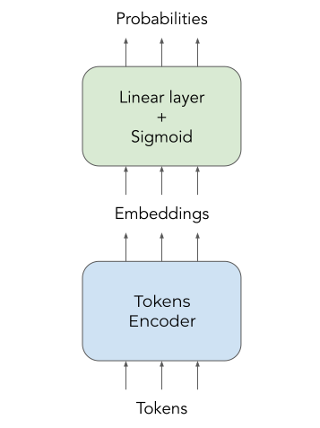
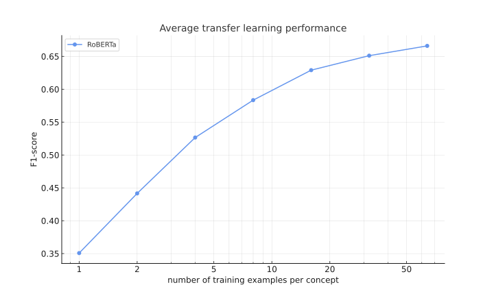
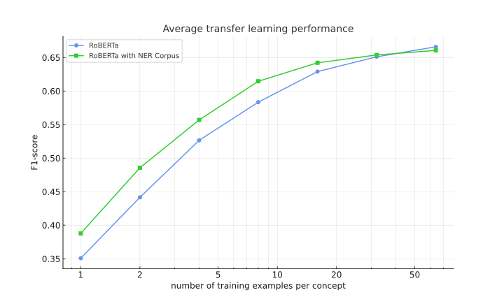
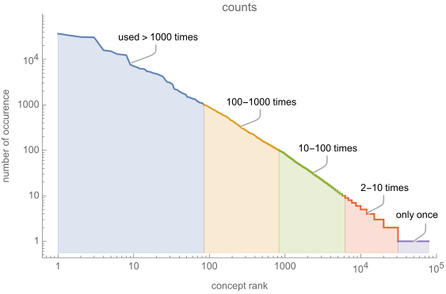
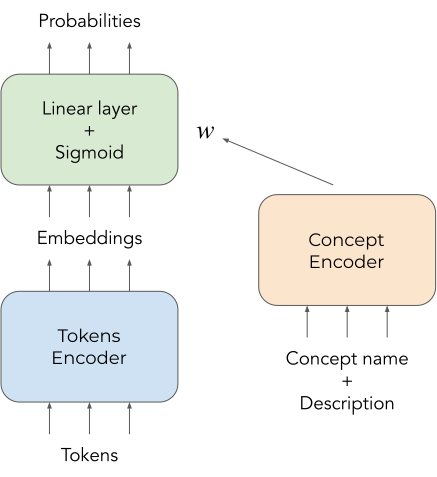
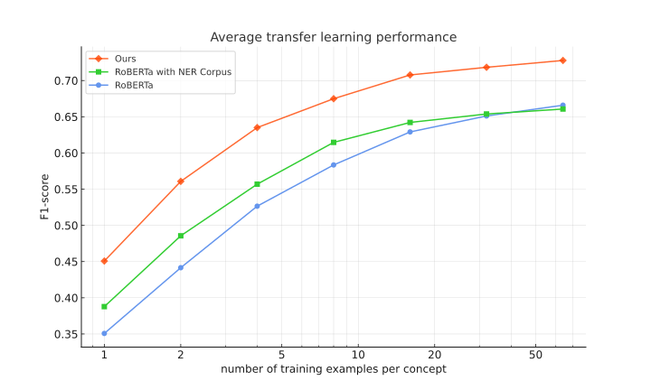
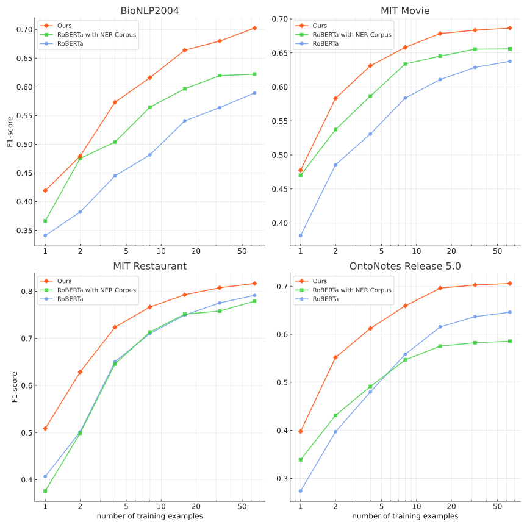

# A Foundation Model for Entity Recognition

**Source**: `raw/a-foundation-model-for-entity-recognition/full-article.md` (SPA shell; readable markdown from WebFetch), https://about.nuextract.ai/blog/a-foundation-model-for-entity-recognition  
**Ingested**: 2026-06-12  
**Tags**: #summary

## Summary

In November 2023, [[NuMind]] introduced a **BERT-size foundation model for entity recognition (NER)** that needs roughly **5× less annotated data** than prior RoBERTa-based approaches to reach strong custom recognizers — about **5 examples per concept** vs ~30 for previous models at F1≈0.65. The recipe combines **LLM-generated ontology-on-the-fly annotations** on diverse C4 text, a **concept-conditioned classifier head**, and keeping only the **token encoder** after training. English and multilingual checkpoints ship MIT-licensed on Hugging Face; the same lineage feeds [[Papers Explained 286 - NuNER]].

Classic NER fine-tunes a linear head on frozen RoBERTa last-layer embeddings. That works but needs hundreds of labeled documents to beat GPT-4 in production settings. Prior work on the **NER Corpus** (315 Wikipedia concepts) improved few-shot transfer only modestly. NuMind's insight: **let the annotating LLM invent concepts as it labels** rather than fixing an ontology upfront — even GPT-3.5 suffices. On **160k C4 sentences** they obtain **~800k annotations** and **~80k unique concepts** (heavy long tail: top-100 concepts = 43% of labels; ~50k concepts appear once).

Training 80k concepts with independent per-class weights fails. Instead, class weights are **`f(concept_name + description)`** via a sentence encoder, enabling similarity sharing and scaling. Training is effectively **contrastive**: only concepts present in the batch are used; false negatives in LLM labels matter little because only **token embeddings** are retained as the foundation model. Fine-tune last six RoBERTa layers; discard the concept head at release.

On **MIT Movie**, **MIT Restaurant**, **OntoNotes 5**, and **BioNLP 2004** (linear probe on frozen embeddings), the model dominates RoBERTa-base and RoBERTa+NER-Corpus across data regimes — up to **>10× data efficiency** on BioNLP2004 / MIT Movie, **2–3×** even on favorable MIT Restaurant.

## Key Claims

- BERT-size **entity-recognition foundation model** needs ~**5 examples/concept** vs ~30 for prior models at F1≈0.65 (**~6× data efficiency**).
- **LLM ontology-on-the-fly** on C4 beats fixed-ontology GPT-4 annotation; yields **80k concepts** on general-domain text.
- **Concept-conditioned weights** `f(name + description)` scale to huge concept sets vs per-class linear heads.
- Post-training artifact is **token encoder only** (contrastive-style training; calibration discarded).
- Open weights: [English](https://huggingface.co/numind/entity-recognition-general-sota-v1), [multilingual](https://huggingface.co/numind/entity-recognition-multilingual-general-sota-v1), MIT license.

## Figures

| Figure | Caption | Page |
|--------|---------|------|
|  | Legal document annotated with entities (NuMind UI) | — |
|  | BERT embeddings: Amazon river vs company disambiguation | — |
|  | Per-token concept probability head on embeddings | — |
|  | RoBERTa-base transfer baseline (frozen encoder) | — |
|  | RoBERTa fine-tuned on NER Corpus vs baseline | — |
|  | Concept frequency long-tail distribution | — |
|  | Foundation model architecture with concept encoder | — |
|  | Transfer learning: RoBERTa vs NER-Corpus vs NuMind model | — |
|  | Per-dataset transfer learning breakdown | — |

## Entities

- [[NuMind]] — company; model powers their annotation product and open-sources weights.
- [[Papers Explained 286 - NuNER]] — later paper/wiki coverage of the same NER foundation-model line.
- [[Synthetic Data]] — LLM-generated C4 annotations at 80k-concept scale.
- [[Contrastive Learning]] — training treats batch-present concepts contrastively; embeddings are the product.

## Questions & Gaps

- Published blog predates the arXiv NuNER paper; [[Papers Explained 286 - NuNER]] adds formal evaluation detail.
- No per-language breakdown beyond English/multilingual checkpoint names in this post.

## Related

- [[Papers Explained 286 - NuNER]] — paper-style recap of NuNER / entity-recognition foundation model.
- [[NuExtract: A Foundation Model for Structured Extraction]] — sibling task-specific foundation model for JSON extraction.
- [[Document AI]] — downstream document understanding applications.
- [[Synthetic Data]] — shared LLM-annotation recipe across NuMind model families.
