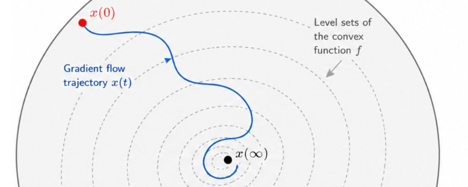
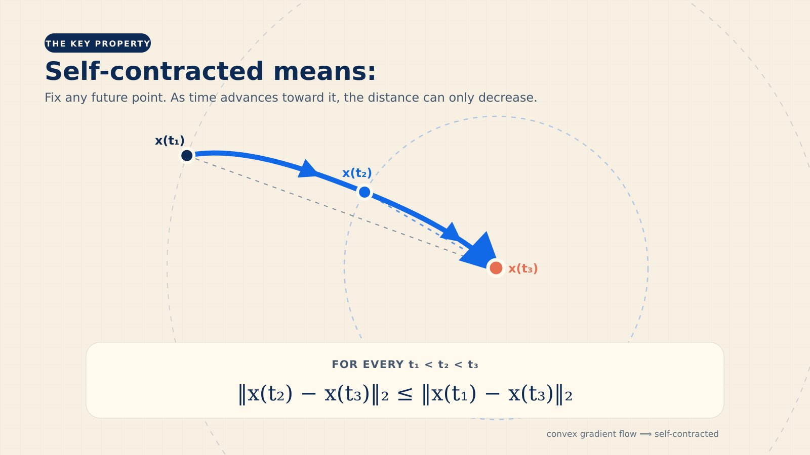
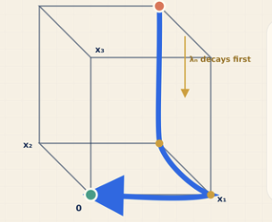

# A Single Question to Track Progress from o3 to GPT-5.6 and Beyond

**Source**: `raw/sebastien-bubeck-a-single-question-to-track-progress-from-o3-to-gpt-5-6-and-beyond/full-article.html`, `raw/sebastien-bubeck-a-single-question-to-track-progress-from-o3-to-gpt-5-6-and-beyond/full-article.md`  
**URL**: https://x.com/SebastienBubeck/article/2075596982622835006  
**Ingested**: 2026-08-23  
**Tags**: #summary

## Summary

In this article published on July 10, 2026, [[Sebastien Bubeck]] (AI researcher at [[OpenAI]], formerly VP AI and Distinguished Scientist at [[Microsoft]]) outlines a benchmark mathematical problem he has used for two years to evaluate the mathematical capabilities and test-time reasoning frontiers of large language models: *How long can the path of a gradient flow on a convex function be, given the constraint that it remains within the unit Euclidean ball in dimension $n$?* While deceitfully simple to formulate, the problem addresses deep geometric properties of [[Self-Contracted Curves]] and [[Gradient Flow on Convex Functions]], where naive intuition from dimension-free convergence rates of gradient descent fails.

The published mathematical state of the art (Manselli & Pucci, 1991) proved rectifiability (finite length) but established only a loose upper bound of $n^{O(n)}$, contrasted against a standard ill-conditioned quadratic lower bound of $\sqrt{n}$. Unpublished human research by Bubeck, Omer Angel, Tomas Merchan Rodriguez, and Fedja Nazarov (~2018) established that the curve length is exponential in dimension, discovering an initial lower bound of $\sqrt{2}^n \approx 1.414^n$ and an upper bound of $4^n$, later sharpened by Merchan Rodriguez and Nazarov to a $2^n$ lower bound and a $2.29\dots^n$ upper bound (the latter bounded by geometric cone volume bounds on the sphere).

Bubeck traces the trajectory of frontier AI systems across generations tackling this open problem:
1. **o3** was the first model to comprehend the question, identifying its connection to self-contracted curves and citing published SOTA.
2. **GPT-5 / GPT-5.2 / GPT-5.4** attempted elaborate answers that were consistently flawed, serving as a cautionary benchmark for problems outside reliable automated reasoning bounds.
3. **GPT-5.5** re-derived the $2^n$ lower bound construction through interactive expert prompting by Mark Sellke, though failing on upper bounds.
4. **[[GPT-5.6]]-pro** achieved a major breakthrough in automated mathematical research: it autonomously **one-shot proved the $2^n$ lower bound** in 80 minutes of test-time compute (extended thinking), and **one-shot proved a $2.31\dots^n$ upper bound** in 88 minutes (surpassing $4^n$ early in its chain of thought and approaching Nazarov's $2.29\dots^n$ human limit).

With total test-time compute of 168 minutes across both proofs, GPT-5.6-pro significantly outperformed the 35-year published literature. While human mathematicians retain a slight edge on the upper bound ($2.29\dots^n$ vs. $2.31\dots^n$), Bubeck conjectures the optimal bound is $2^n$ and predicts frontier AI models may resolve the conjecture within six months.

## Key Claims

- **Problem Definition & Formulation**: Investigates the supremum arc length of continuous [[Gradient Flow on Convex Functions]] $\dot{x}(t) = -\nabla f(x(t))$ constrained to the unit Euclidean ball $\mathcal{B}_n \subset \mathbb{R}^n$.
- **Rectifiability & Self-Contraction**: Continuous gradient flows on convex potentials generate [[Self-Contracted Curves]] where $\mathrm{dist}(x(s), x(t))$ decreases monotonically for $s < t$. In contrast, accelerated gradient flows (such as Nesterov acceleration) can have infinite arc length (proven non-rectifiable in work by Ernest Ryu using GPT-5.5; arXiv:2604.06651).
- **Published SOTA Gap**: The 1991 paper by Manselli and Pucci proved rectifiability with an upper bound of $n^{O(n)}$, while standard ill-conditioned quadratics give a $\sqrt{n}$ lower bound, leaving an enormous gap.
- **Unpublished Human Bounds**: Human mathematicians (Bubeck, Angel, Merchan Rodriguez, Nazarov) proved the true scaling is exponential: $\sqrt{2}^n \le L(n) \le 4^n$, later tightened by Merchan Rodriguez and Nazarov to $2^n \le L(n) \le 2.29\dots^n$.
- **AI Progression Lineage**:
  - *o3*: Understood the problem semantics and identified self-contraction literature.
  - *GPT-5 / 5.2 / 5.4*: Hallucinated flawed proofs, illustrating limits of early CoT.
  - *GPT-5.5*: Interactive re-discovery of the $2^n$ lower bound under expert human steering (Mark Sellke).
  - *GPT-5.6-pro*: Autonomous one-shot discovery of the $2^n$ lower bound (80 min CoT) and $2.31\dots^n$ upper bound (88 min CoT).
- **Test-Time Compute Scaling for Open Math**: Demonstrates that long-horizon continuous test-time reasoning (80–88 min per question, 168 min total) enables frontier models to produce publishable, SOTA-beating mathematical proofs without human intervention.
- **Conjectured Optimum**: The optimal upper bound for self-contracted curves in the unit ball in dimension $n$ is conjectured to be exactly $2^n$, matching the lower bound construction.

## Figures

| Figure | Caption | Page |
|--------|---------|------|
|  | Header illustration for the gradient flow and self-contracted curves mathematical challenge | Cover |
|  | Definition of a self-contracted curve showing distance monotonicity to future points | Section 1 |
|  | A $\sqrt{n}$ length self-contracted curve generated by an ill-conditioned quadratic | Section 1 |

## Entities

- [[Sebastien Bubeck]] — Author; AI researcher at OpenAI, former VP AI at Microsoft, and mathematician working on optimization theory and AI capabilities.
- [[OpenAI]] — Organization developing the o3, GPT-5, and GPT-5.6 models evaluated on this benchmark.
- [[Microsoft]] — Bubeck's former institution where early research on small models (Phi series) and math capabilities was conducted.
- [[GPT-5.6]] — Frontier model family whose pro tier demonstrated 80–88 minute one-shot mathematical proofs beating published SOTA.

## Questions & Gaps

- **Closing the Upper Bound Gap**: Whether frontier models can find a new geometric argument beyond Nazarov's cone volume approach to bridge the $2.31\dots^n$ vs $2^n$ gap.
- **Verification & Formalization**: Whether GPT-5.6's natural-language mathematical proofs have been formalized in interactive proof assistants like Lean 4 (e.g. [[Leanstral]]).
- **Extension to Other Optimization Trajectories**: Evaluating whether similar test-time reasoning can analyze continuous dynamics of non-convex flows, momentum methods, or stochastic gradient descent.

## Related

- [[Self-Contracted Curves]] — Detailed mathematical concept page on curve definition, rectifiability, and dimensional bounds.
- [[Gradient Flow on Convex Functions]] — Theoretical foundations of continuous-time convex optimization dynamics.
- [[GPT-5.6]] — Summary page covering GPT-5.6 Sol / Terra / Luna capabilities, reasoning benchmarks, and release.
- [[Reasoning Models]] — Master topic page covering test-time compute, chain-of-thought scaling, and mathematical problem-solving.
- [[Controllable Thinking Effort]] — Post-training and inference techniques controlling test-time reasoning compute.
- [[Ten Advances in Mathematics and Theoretical Computer Science]] — OpenAI collection documenting frontier model contributions to research mathematics.
- [[How the Ideas Came Together]] — Narrative walkthroughs of AI mathematical proof discoveries across complex domains.
