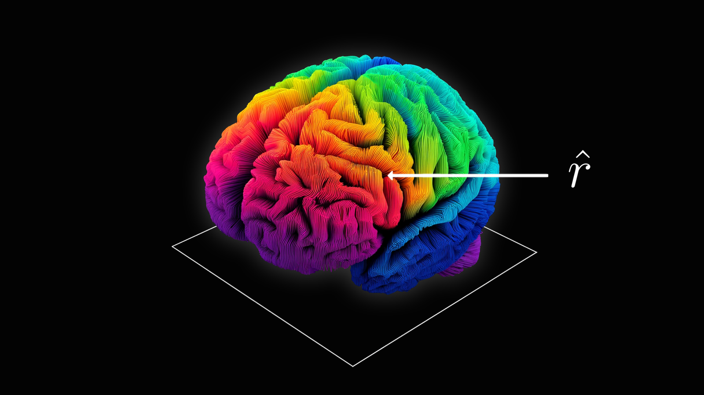
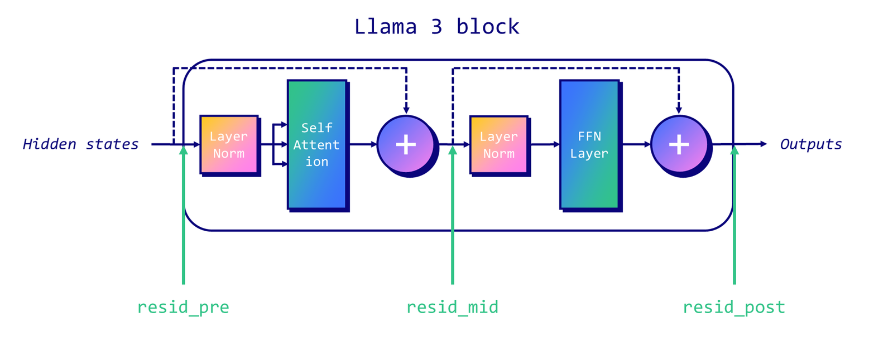
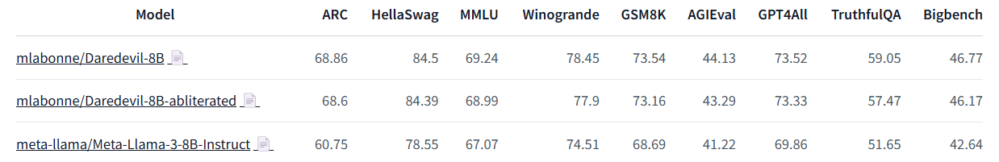
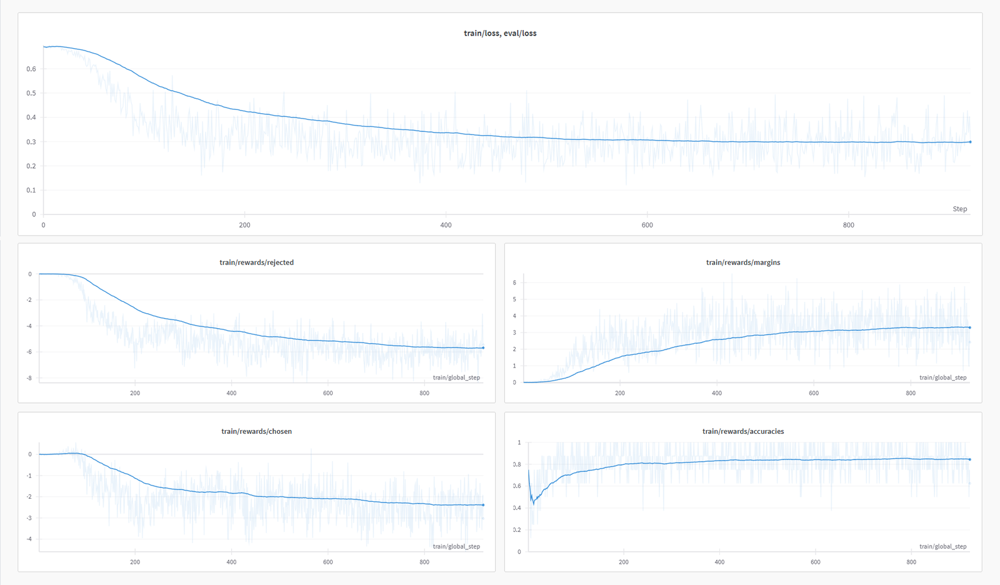

# Uncensor any LLM with abliteration

**Source**: `raw/abliteration/full-article.html`, `raw/abliteration/full-article.md`  
**Ingested**: 2026-07-21  
**Tags**: #summary

## Summary

Maxime Labonne's June 2024 Hugging Face blog post explains **abliteration**: removing an LLM's refusal behavior without retraining by targeting a single **refusal direction** in the residual stream (Arditi et al., 2024). Instruction-tuned models like Llama 3 Instruct learn to refuse harmful prompts; abliteration shows that behavior is mediated by one identifiable direction that can be ablated at inference time or permanently removed via **weight orthogonalization**.

The procedure: (1) run the model on harmful and harmless instruction sets, recording residual activations at the last token; (2) compute the per-layer mean difference and normalize to get candidate refusal directions; (3) evaluate directions with an inference-time directional ablation hook; (4) orthogonalize selected weight matrices (`W_E`, attention `W_O`, MLP `W_out`) so the model can no longer write along that direction.

Labonne demonstrates on `mlabonne/Daredevil-8B` (an 8B merge). Abliteration successfully uncensors but degrades benchmark scores. A follow-up **DPO** fine-tune on `mlabonne/orpo-dpo-mix-40k` (QLoRA, LazyAxolotl) recovers most of the performance, yielding `mlabonne/NeuralDaredevil-8B-abliterated`. The post notes abliteration is not limited to uncensoring—it is a general activation-direction editing technique (e.g., MopeyMule's melancholic style).

The article raises safety implications: alignment fine-tuning can be fragile against simple mechanistic interventions. Later community work (Heretic, projected/norm-preserving abliteration) extends the method but covert noncompliance may persist.

## Key Claims

- Refusal in LLMs is mediated by a specific direction in the residual stream; blocking it removes refusals, and adding it can induce refusals on harmless prompts.
- Three residual-stream injection points exist per block: pre-attention, mid (post-attention), and post-MLP.
- Refusal direction = normalized mean difference of harmful vs. harmless activations at the last token position.
- Inference-time intervention subtracts the projection of activations onto the refusal direction at every layer.
- Weight orthogonalization permanently prevents components from writing to the refusal direction.
- Daredevil-8B abliteration uncensors harmful-prompt responses but drops scores across Open LLM Leaderboard and Nous benchmarks.
- DPO alignment (not heavy SFT) recovers most benchmark performance while keeping the model uncensored.
- GSM8K remains weaker after DPO, suggesting the preference mix could use more math data.
- Abliteration generalizes beyond safety removal to other behavioral directions.

## Figures

| Figure | Caption | Section |
|--------|---------|---------|
|  | Residual-stream locations (pre, mid, post) in a decoder block | What is abliteration |
|  | Benchmark comparison: Daredevil-8B vs. abliterated vs. Llama 3 8B Instruct | DPO |
|  | DPO training curves (W&B) | DPO |
|  | Post-DPO benchmarks: NeuralDaredevil-8B-abliterated recovery | DPO |

## Entities

- [[Maxime Labonne]] — author; Hugging Face ML educator and abliteration tutorial.
- [[Hugging Face]] — blog host; datasets (`mlabonne/harmful_behaviors`, `mlabonne/harmless_alpaca`) and published models.
- [[Abliteration]] — technique for removing refusal via direction ablation.
- [[Refusal Direction]] — mean-difference vector in residual activations.
- [[Weight Orthogonalization]] — permanent weight edit preventing refusal-direction writes.

## Questions & Gaps

- TransformerLens support limits which architectures can be abliterated in the notebook workflow.
- Abliteration trained on English prompts generalizes to other languages experimentally but target-language prompts are more precise.
- Later Heretic/AutoAbliteration tools automate selection; covert censorship may survive overt refusal removal.
- Projected and norm-preserving abliteration (2025) claim less performance drop; not covered in the original post.

## Related

- [[Safety and Alignment]] — refusal, alignment fine-tuning, and guardrail fragility.
- [[Papers Explained 148 - Direct Preference Optimization]] — DPO used to heal abliterated models.
- [[ITI]] — related inference-time activation intervention (truthfulness direction); distinct goal from refusal removal.
- [[Refusal Direction]] — mechanistic basis of abliteration.
- [[Abliteration]] — concept page on the technique.
- [[Weight Orthogonalization]] — permanent abliteration implementation.
- [[Reward Hacking]] — parallel theme: optimizing one signal can break intended behavior.
