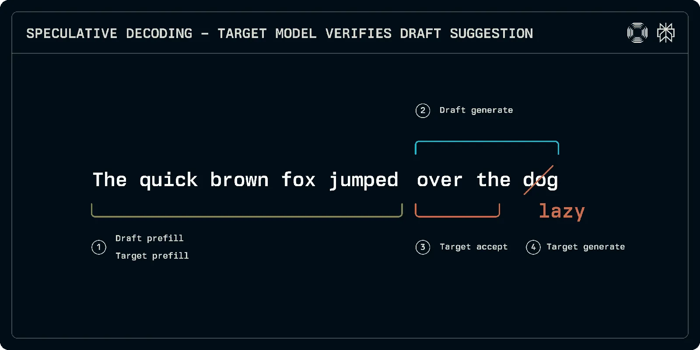
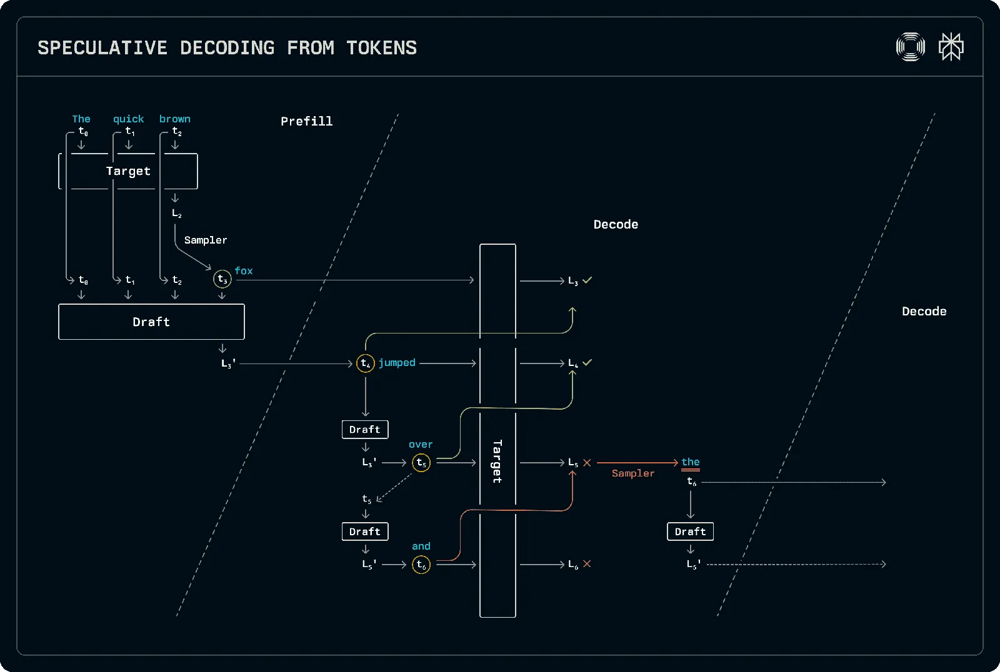
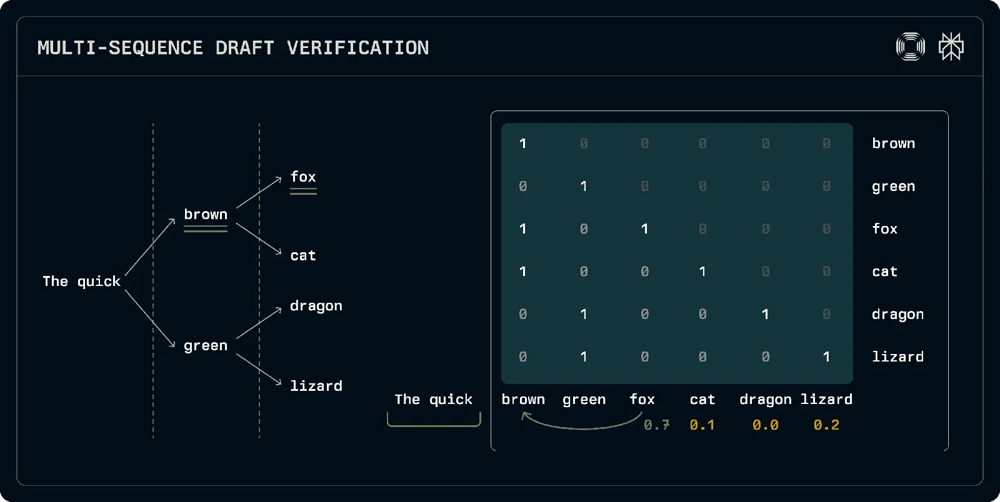
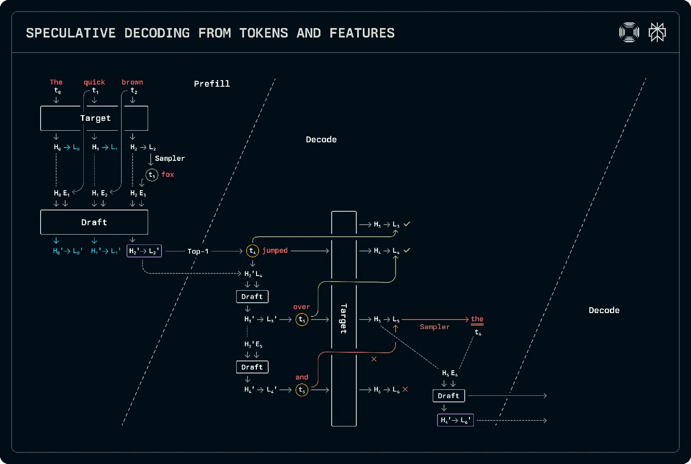
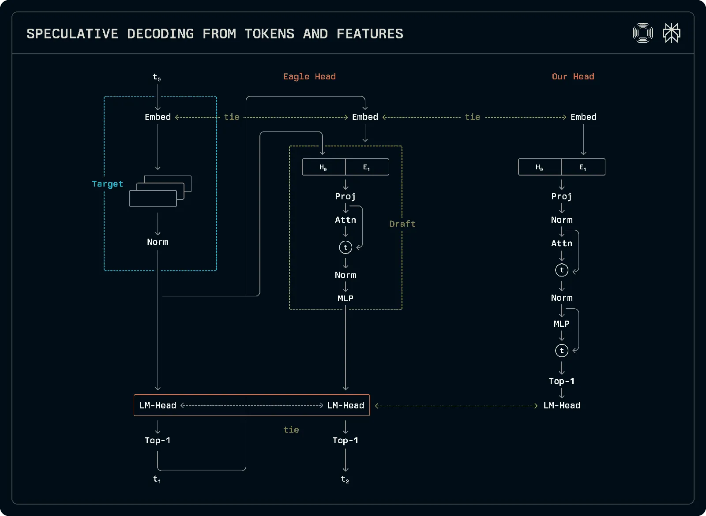
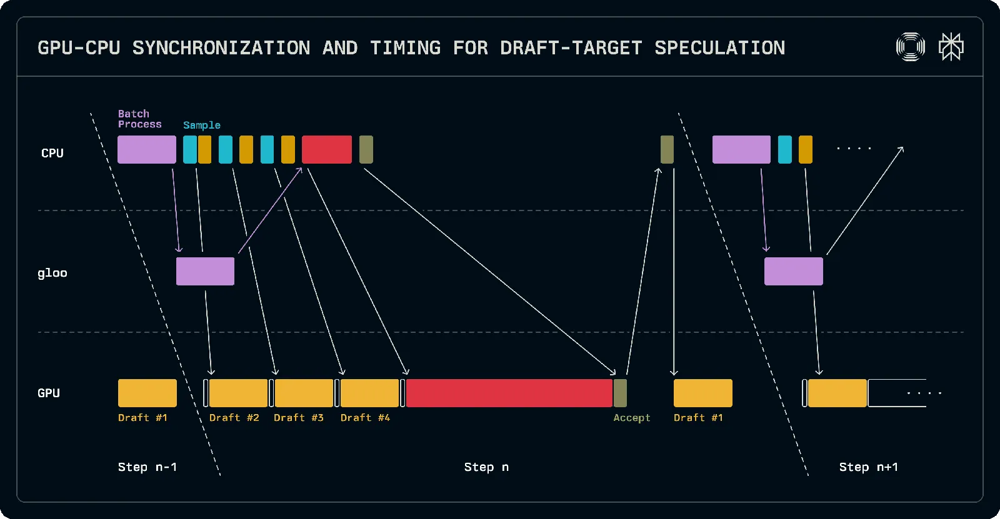
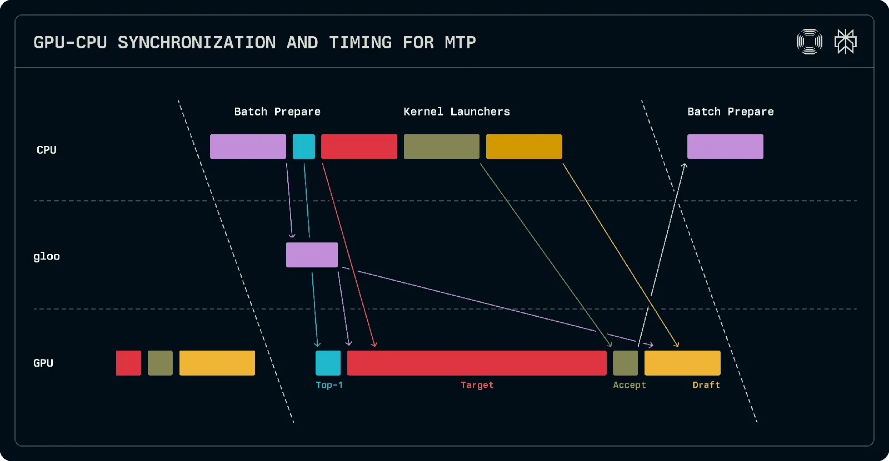

# Accelerating Sonar Through Speculation

**Source**: `raw/accelerating-sonar-through-speculation/full-article.md` (354 KB), `raw/accelerating-sonar-through-speculation/full-article.md` (markdown view)  
**URL**: https://research.perplexity.ai/articles/accelerating-sonar-through-speculation  
**Ingested**: 2026-06-06  
**Tags**: #summary

## Summary

Perplexity's systems post explains how **speculative decoding** reduces inter-token latency for **Sonar** LLMs in production. A small draft model proposes candidate token sequences; the target model verifies them in one forward pass, accepting the longest matching prefix and sampling one additional token for free (up to *n+1* tokens per step). The post covers three schemes deployed or explored: **draft-target** (fine-tuned Llama-1B draft for Sonar), **EAGLE** (tree-structured drafts using target hidden states), and **MTP** (multi-token prediction heads sharing target embeddings and `lm_head`).

Production Sonar acceleration uses a **Llama-1B draft** fine-tuned on the same data as the target. Full EAGLE tree verification is not deployed: custom attention masks for tree verification slow attention by up to ~50%, so Perplexity focuses on **single-token MTP** (DeepSeek-V3-style) in production. MTP heads are trained on 8×H100 in ~one day for models from Llama-1B through Llama-70B and DeepSeek V2-Lite; for 70B, re-introducing **RMSNorm** layers (stripped in original EAGLE) was necessary for convergence on long Perplexity prompts.

The inference runtime is built on **FlashInfer** with **tightly coupled** draft-target stepping (shared batch scheduling and KV page allocation). Speculative decoding introduces a GPU→CPU sync when accepted token counts determine next sequence lengths. Draft-target scheduling overlaps draft execution with CPU batch setup; the draft runs on the **leader rank** only when the target uses tensor parallelism. MTP single-token scheduling processes `2×D` tokens on the target (good for MoE micro-batching), uses a kernel to plug accepted tokens without post-acceptance CPU sync, and trades redundant draft work for simpler pipelining.

## Key Claims

- Speculative decoding can emit multiple tokens per target forward pass when draft and target distributions align on a prefix.
- Draft-target with a full small LLM works for Sonar but adds KV cache overhead and slight TTFT cost; speculation runs on decode-only batches.
- EAGLE's tree exploration is accurate but custom verification masks hurt attention throughput; production uses MTP-like single-token prediction instead.
- MTP heads predict from target hidden states with a one-step token/hidden-state shift at inference; target hidden states repopulate draft KV after acceptance.
- Re-adding RMSNorm to EAGLE-style MTP heads fixes 70B training on long prompts and improves acceptance by a few percentage points.
- FlashInfer-based runtime unifies scheduling across speculation modes; MTP avoids CPU sync after acceptance via extra GPU work and parallel batch scheduling.

## Figures

| Figure | Caption | Page |
|--------|---------|------|
|  | Speculative decoding stages: prefill, draft, acceptance, target generation | — |
|  | Draft-target decoding flow | — |
|  | EAGLE tree-structured draft exploration | — |
|  | MTP token/hidden-state correspondence and inference shift | — |
|  | MTP training target: match draft to next-token target logits/hidden states | — |
|  | Draft-target inference schedule overlapping CPU and GPU work | — |
|  | MTP single-token schedule avoiding post-acceptance CPU sync | — |
|  | MoE micro-batch split (`2×D` tokens) during MTP verification | — |

## Entities

- [[Perplexity AI]] — authors; Sonar inference stack.
- [[Sonar]] — Perplexity LLM family accelerated by these schemes.
- [[Speculative Decoding]] — core inference optimization technique.
- [[FlashInfer]] — attention engine shaping Perplexity's inference metadata and kernels.
- [[Multi-Token Prediction]] — MTP draft heads attached to target models (EAGLE / DeepSeek-V3 lineage).

## Questions & Gaps

- No published acceptance-rate or end-to-end latency numbers for Sonar production configs.
- Full EAGLE tree deployment remains blocked by attention-mask overhead; future kernel support could change the tradeoff.

## Related

- [[Inference Engineering]] — systematic comparison of speculation algorithms and production tradeoffs.
- [[Speculative Decoding]] — concept page with draft-target, Medusa, EAGLE variants.
- [[KV Cache]] — shared page allocation across draft and target in coupled serving.
- [[Mixture of Experts]] — MTP `2×D` batching rationale for MoE over InfiniBand.
- [[Papers Explained - Composer 2]] — Cursor's MTP layers for Composer 2 speculative decoding (parallel industrial pattern).
