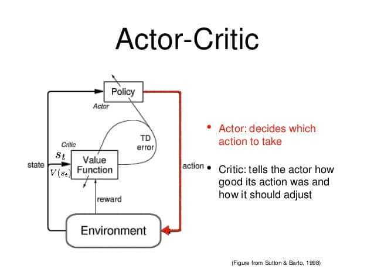
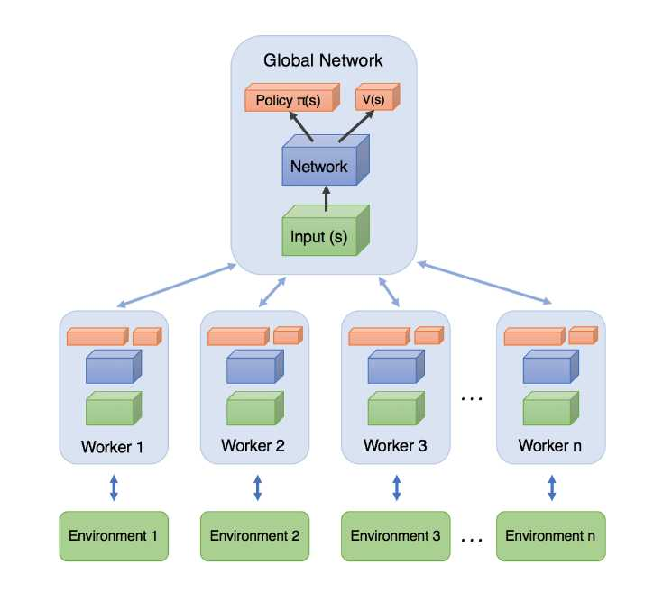
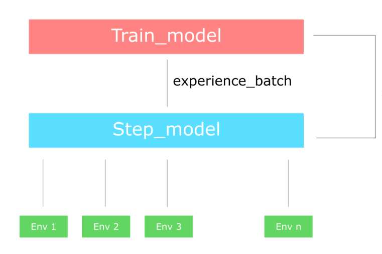

# The Idea behind Actor-Critics and How A2C and A3C Improve Them

**Source**: `raw/actor-critics/full-article.html` (298 KB), `raw/actor-critics/full-article.md` (markdown view)  
**URL**: https://theaisummer.com/Actor_critics/  
**Author**: Sergios Karagiannakos (AI Summer), 2018-11-17  
**Ingested**: 2026-06-06  
**Tags**: #summary

## Summary

This AI Summer article explains **[[Actor-Critic Methods]]** as the hybrid of value-based and policy-based [[Reinforcement Learning]] — positioned as the foundation behind modern algorithms from [[Proximal Policy Optimization]] to A3C. Value-based methods ([[Q-learning]], DQN) learn action values and derive policies; policy-based methods ([[Policy Gradient]], [[REINFORCE]]) optimize π directly. Actor-critic merges the strengths: the **actor** maps states to actions (policy), while the **critic** evaluates those actions via Q-values (value function). Both are function approximators (typically neural networks) trained with gradient ascent, but unlike REINFORCE, weights update **each timestep** via temporal-difference learning rather than waiting for full episodes.

The article uses a child-and-mother analogy: the actor explores; the critic praises or criticizes; the actor adjusts. Architecturally, the critic concatenates state and actor action to output Q(s,a). The piece notes actor-critics have learned complex 2D/3D games (Doom, Super Mario) and previews two key extensions.

**A2C (Advantage Actor-Critic)** decomposes Q(s,a) = V(s) + A(s,a). The critic learns the **advantage** A(s,a) = Q(s,a) − V(s) ≈ r + γV(s′) − V(s), measuring how much better an action is than average at a state — reducing the high variance of pure policy gradients.

**A3C (Asynchronous Advantage Actor-Critic)** (DeepMind, 2016) runs multiple independent agent networks exploring parallel environment copies. Each agent asynchronously updates a **global shared network**, then periodically resets local weights from the global model — enabling broader state-action exploration in less wall-clock time. The synchronous variant waits for all workers, updates globally, and resets together; the practical A2C implementation uses multiple environment copies with a **step model** (rollout) and **train model** (optimization) that sync after each batch of n-step experience.

The article closes by naming DDPG, PPO, and TRPO as actor-critic descendants and references DeepMind's `trfl` RL building-blocks library.

## Key Claims

- Actor-critic combines policy-based (actor) and value-based (critic) RL to get benefits of both families.
- Actor outputs best action for a state; critic outputs Q-value for (state, action) pairs.
- Both networks train separately with gradient ascent; updates happen per step (TD), not per episode (unlike REINFORCE).
- Value-based methods are more sample-efficient; policy-based converge faster on continuous/stochastic tasks.
- **Advantage decomposition**: Q(s,a) = V(s) + A(s,a); advantage captures action quality relative to state baseline.
- Learning A(s,a) instead of raw Q reduces policy-network variance and stabilizes training (A2C).
- **A3C**: multiple parallel workers with independent weights explore different environment copies asynchronously.
- Workers push gradients to a global network; periodic weight resets propagate information between agents.
- Synchronous multi-agent A2C: collect n-step batches from parallel envs → train → sync step model weights.
- A3C (2016) made vanilla policy gradients and DQN comparatively obsolete for many standard RL benchmarks at the time.
- Modern RL stack (2018 article): DDPG, PPO, TRPO all build on actor-critic ideas.

## Figures

| Figure | Caption | Page |
|--------|---------|------|
|  | Actor-critic architecture: actor selects actions, critic evaluates Q-values for state–action pairs | — |
|  | A3C: multiple asynchronous workers explore parallel environments and update a global network | — |
|  | Synchronous A2C: parallel environment copies feed a step model; train model updates then syncs weights | — |

The actor proposes actions from state; the critic scores them with Q-values — the core two-network split.

Independent agents explore in parallel and asynchronously contribute to a shared global policy.

## Entities

- [[AI Summer]] — published this 2018 actor-critic / A2C / A3C tutorial.
- [[Sergios Karagiannakos]] — author; continues the RL series after [[Unravel Policy Gradients and REINFORCE]].
- [[Actor-Critic Methods]] — primary subject; hybrid policy + value architecture.
- [[REINFORCE]] — episodic Monte Carlo baseline that actor-critic improves upon.
- [[Policy Gradient]] — actor side of the hybrid; variance reduced by critic baselines.
- [[Q-learning]] — value-based counterpart referenced from prior DQN articles.
- [[Temporal-Difference Learning]] — per-step critic updates vs Monte Carlo returns.
- [[Proximal Policy Optimization]] — modern descendant named at article end.
- [[DeepMind]] — released A3C (2016).

## Questions & Gaps

- No math derivations for actor-critic loss functions or policy/critic update rules.
- A2C vs A3C distinction is intuitive but light on empirical comparison.
- DDPG mentioned but not explained; TRPO/PPO deferred to next article.
- `trfl` library referenced without implementation detail.

## Related

- [[Unravel Policy Gradients and REINFORCE]] — prior article in series; motivates actor-critic via REINFORCE variance.
- [[Trust Region and Proximal Policy Optimization (TRPO and PPO)]] — next article; stabilizes policy updates atop actor-critic advantages.
- [[Reinforcement Learning: An Introduction]] — Sutton & Barto Ch. 13 actor-critic and advantage actor-critic theory.
- [[GRPO]] — LLM-era policy optimizer building on PPO clipping with group-relative advantages instead of a critic.
- [[Reinforcement Learning Topic]] — topic hub for RL tutorials and papers.
