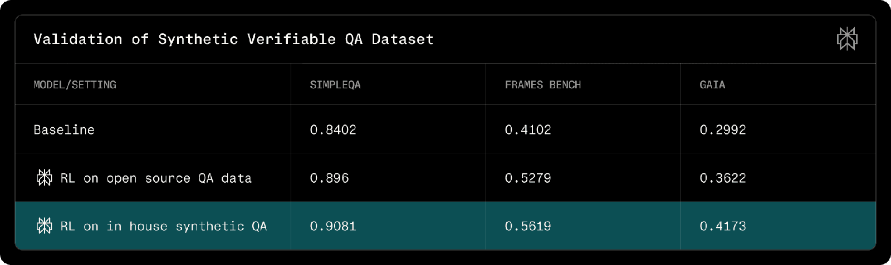
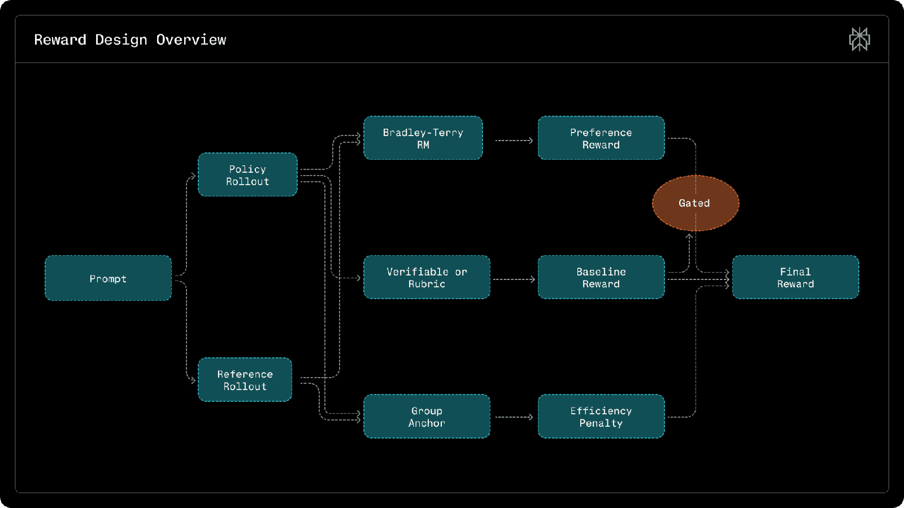
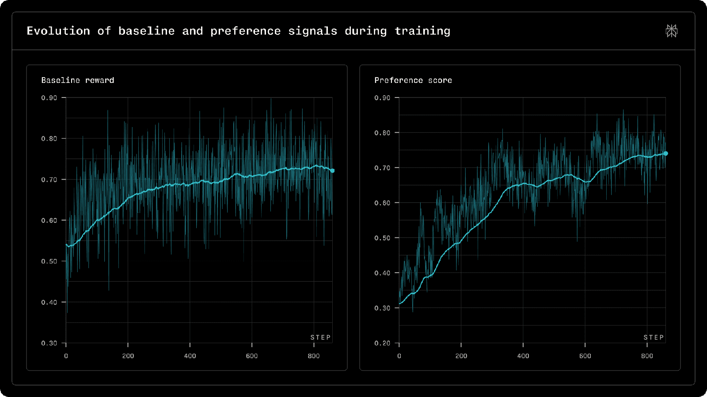
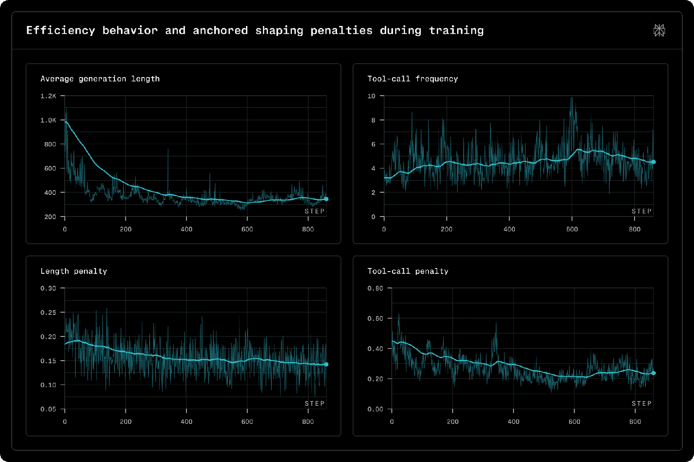

# Advancing Search-Augmented Language Models

**Source**: `raw/advancing-search-augmented-language-models/full-article.html` (433 KB), `raw/advancing-search-augmented-language-models/full-article.md` (markdown view)  
**URL**: https://research.perplexity.ai/articles/advancing-search-augmented-language-models  
**Ingested**: 2026-06-06  
**Tags**: #summary

## Summary

Perplexity Research describes its post-training pipeline for state-of-the-art **web search agents** built on open-source [[Qwen]] models (Qwen3.5-122B-A10B and Qwen3.5-397B-A17B). Training must jointly optimize factual accuracy, tool-use efficiency, and user-preference alignment; optimizing any one axis in isolation tends to hurt the others. The central design principle is that **data curation and reward design must be co-designed**: the data determines which behaviors are observable and verifiable, and the reward translates those signals into optimization pressure.

The recipe is deliberately **two-stage**: (1) [[Supervised Fine-Tuning]] establishes deployment-critical behaviors—guardrails, abstention, instruction following, language consistency, and production-format tool trajectories—while (2) on-policy [[GRPO]] refines search accuracy and tool efficiency without regressing those guardrails. RL uses token-level importance sampling to correct training–inference mismatch; under their on-policy setting, token-level IS alone is sufficient to prevent collapse.

RL data mixes **verifiable search-agent QA** (in-house multi-hop synthetic QA via sequential entity expansion, plus filtered open-source sets) with **rubric-based general chat** that reinforces non-verifiable deployment requirements. Rewards use **gated aggregation**: baseline correctness (QA match or full rubric satisfaction) gates preference credit from a Bradley–Terry reward model, plus **anchored efficiency penalties** on tool calls and length relative to winners within each GRPO group. A 90/10 verifiable-to-rubric sampling mix balances gradient variance across objectives.

Post-trained Qwen3.5-397B-SFT-RL matches or beats GPT-5.4 on FRAMES and Facts Open at comparable tool budgets, with large gains on internal preference, abstention, and language-consistency metrics. Budget-forced evals show the model reaches higher accuracy with fewer tool calls; at budget 4 on FRAMES it scores 73.9% at ~2¢/query vs. GPT-5.4 at 67.8% / 8.5¢.

## Key Claims

- Search-agent post-training requires co-designing verifiable data and composite rewards; SFT and RL stages are separated because joint RL under-serves guardrails while RL-only under-serves search.
- SFT mixture combines preference/style examples with production tool-use trajectories across single-, two-, and multi-turn patterns to avoid degrading base search capability.
- Synthetic verifiable QA uses sequential entity expansion (2–4 hops), name-free question synthesis, and multi-solver verification without a curated knowledge graph.
- Rubric-based RL data converts deployment constraints into atomic, objective, necessary rubrics with pass@4 calibration to retain informative gradient signal.
- Gated reward aggregation prevents preference scores from compensating for factual or rubric failures; anchored penalties regularize tool use and length relative to group winners.
- Token-level IS stabilizes on-policy GRPO under training–inference mismatch; gradient norms stay stable with mild KL drift (~1e-3 scale).
- Qwen3.5-397B-SFT-RL: strong public benchmark scores, best tool-efficiency curves, and favorable cost-accuracy tradeoffs vs. GPT-5.4 and Sonnet 4.6.

## Figures

| Figure | Caption | Page |
|--------|---------|------|
|  | Two-stage SFT → on-policy RL training pipeline overview | — |
|  | Reward design: gated baseline, preference, and efficiency components | — |
|  | Synthetic verifiable QA validation results (Table 1) | — |
|  | Rubric generation example for general-chat RL data | — |
|  | Evolution of baseline and preference signals during training (Figure 2) | — |
|  | Efficiency behavior and anchored shaping penalties (Figure 3) | — |
|  | Benchmark accuracy vs. max tool calls (Figure 5) | — |
|  | Cost per query vs. accuracy (Figure 6) | — |

22 figures total in `wiki/assets/advancing-search-augmented-language-models/` (tables, training curves, and benchmark charts).

## Entities

- [[Perplexity AI]] — authors; production web search agent and retrieval stack.
- [[Qwen]] — base model family (Qwen3.5 Medium/Large MoE checkpoints).
- [[GRPO]] — on-policy RL optimizer for search capability after SFT warmup.
- [[Rubric-Based Reinforcement Learning]] — rubric data and gated rewards for non-verifiable chat traffic.

## Questions & Gaps

- Full numeric Table 2 offline results are in figure assets; text cites directional gains only.
- Training–inference KL drift at very long RL runs may need stronger mitigation (routing replay, bitwise-consistent training) at larger scale.
- Multi-tool, long-horizon trajectories and partial-rollout credit assignment remain open.

## Related

- [[Papers Explained - Advancing Search Augmented Language Models]] — earlier Medium summary of the same research line; this page is the canonical Perplexity Research source.
- [[Agentic AI]] — search agents, tool use, and RAG workflows.
- [[Self-RAG]] — adaptive retrieval with reflection tokens (contrast: Perplexity trains search agents with verifiable QA + rubrics).
- [[GRPO++: Tricks for Making RL Actually Work]] — practical GRPO stabilization techniques complementary to token-level IS here.
- [[Papers Explained: Reward Hacking in Rubric-Based RL]] — rubric RL failure modes Perplexity mitigates via gating and pass@4 calibration.
- [[Reinforcement Learning Topic]] — RL post-training for agents and reasoning.
- [[Embedding and Retrieval]] — first-stage retrieval that feeds these search agents.
