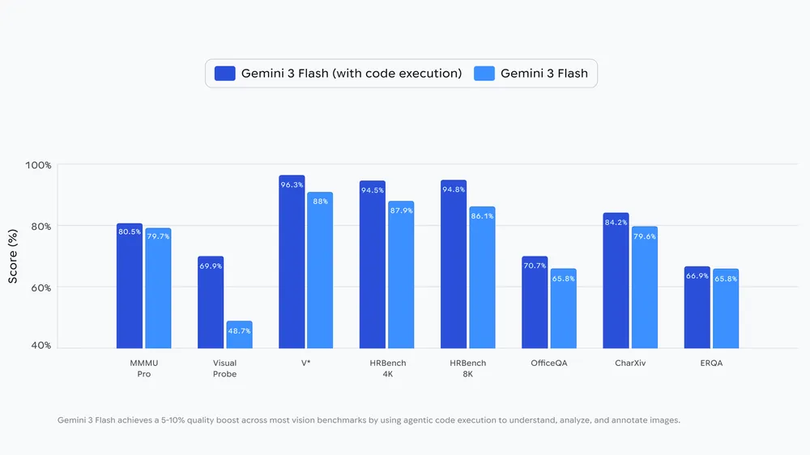
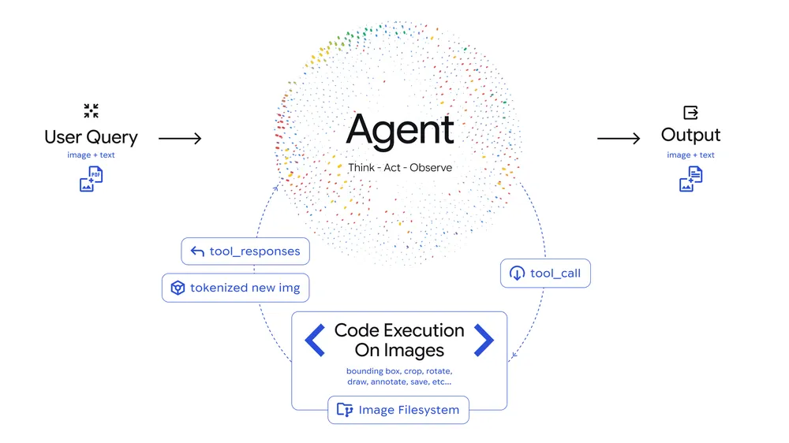

# Agentic Vision in Gemini 3 Flash

**Source**: `raw/agentic-vision-gemini-3-flash/full-article.md`  
**URL**: https://blog.google/innovation-and-ai/technology/developers-tools/agentic-vision-gemini-3-flash/  
**Ingested**: 2026-06-06  
**Tags**: #summary

## Summary

Google introduced **Agentic Vision** in **Gemini 3 Flash** on January 27, 2026, transforming image understanding from a single static glance into an active investigation loop. Instead of guessing when fine-grained details are missed (serial numbers, distant signs, micro-scale features), the model combines visual reasoning with **code execution** to zoom, inspect, annotate, and manipulate images step by step, grounding answers in visual evidence.

The capability follows a **Think-Act-Observe** loop: (1) **Think** — analyze the query and image, formulate a multi-step plan; (2) **Act** — generate and execute Python code to crop, rotate, annotate, or compute over the image; (3) **Observe** — append transformed images to context and inspect before producing a final answer. Enabling code execution delivers a consistent **5–10% quality boost** across most vision benchmarks.

Use cases highlighted include implicit zoom for fine details (PlanCheckSolver.com gained 5% accuracy on building-plan validation), annotation for spatial reasoning, and visual math. Agentic Vision is available in Gemini API via Google AI Studio with Code Execution enabled under Tools; a demo app showcases behaviors. Google plans implicit rotation/visual-math triggers, additional tools (web and reverse image search), and expansion beyond Flash model sizes.

## Key Claims

- Jan 27, 2026 launch in Gemini 3 Flash via API code execution.
- **Think-Act-Observe** agentic loop: plan → execute Python image manipulation → observe transformed context → respond.
- **5–10% vision benchmark improvement** when code execution is enabled vs. static single-pass vision.
- Implicit zoom for fine-grained details; explicit prompts needed for rotation and some visual-math tasks (future: fully implicit).
- PlanCheckSolver.com: +5% accuracy on high-resolution building-plan validation with iterative inspection.
- Available in AI Studio Playground (Code Execution under Tools) and production API.
- Roadmap: more implicit behaviors, web/reverse-image search tools, expansion to other model sizes.

## Figures

| Figure | Caption | Page |
|--------|---------|------|
|  | Bar graph: 5–10% quality boost on vision benchmarks with code execution enabled | — |
|  | Agentic Vision Think-Act-Observe loop architecture diagram | — |

## Entities

- [[Vision Language Models]] — Active, tool-augmented multimodal understanding beyond static VLM inference.
- [[Agentic AI]] — Think-Act-Observe loop with code execution as a vision tool.
- [[Large Language Models]] — Gemini 3 Flash as the base model for Agentic Vision.
- [[Google DeepMind]] — Capability development and benchmark evaluation.

## Questions & Gaps

- Per-benchmark breakdown of the 5–10% range not listed in blog; aggregate claim only.
- Latency and token cost of multi-step zoom loops not quantified.
- Rotation and visual math require explicit prompt nudges today; implicit triggering timeline unspecified.

## Related

- [[Gemini 3 Flash]] — Base model hosting Agentic Vision; default consumer/developer tier.
- [[Gemini 3]] — Pro-tier multimodal reasoning context for the Gemini 3 family.
- [[Vision Language Models]] — Multimodal understanding and benchmark evaluation.
- [[Agentic AI]] — Tool-use loops and code execution as agent capability.
- [[Large Language Models]] — Foundation for vision-language agent behavior.
- [[Google DeepMind]] — Research behind agentic multimodal capabilities.
