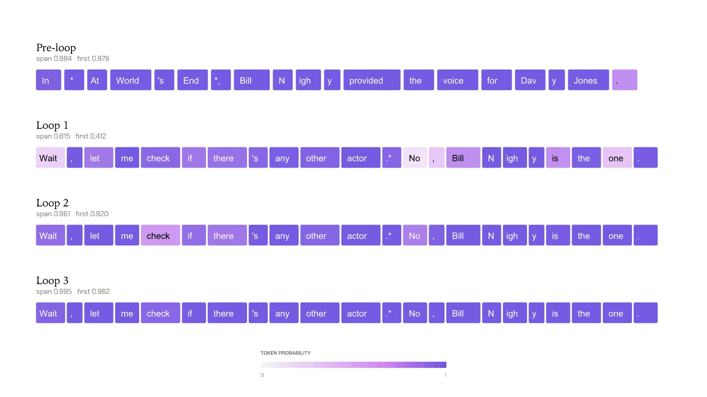
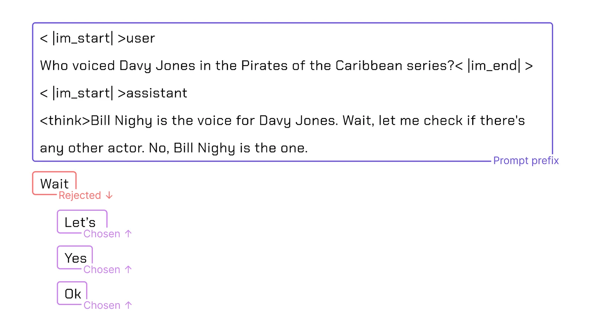
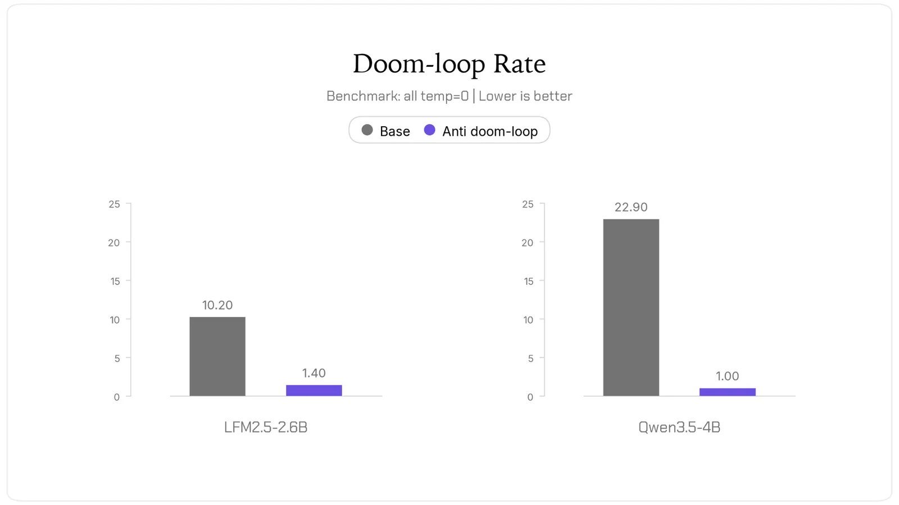
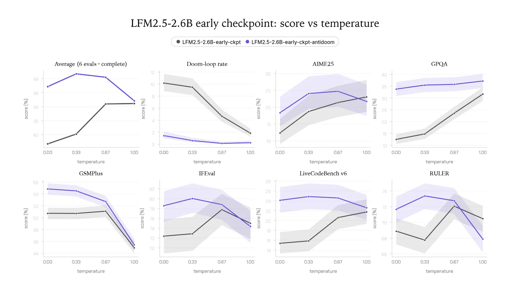
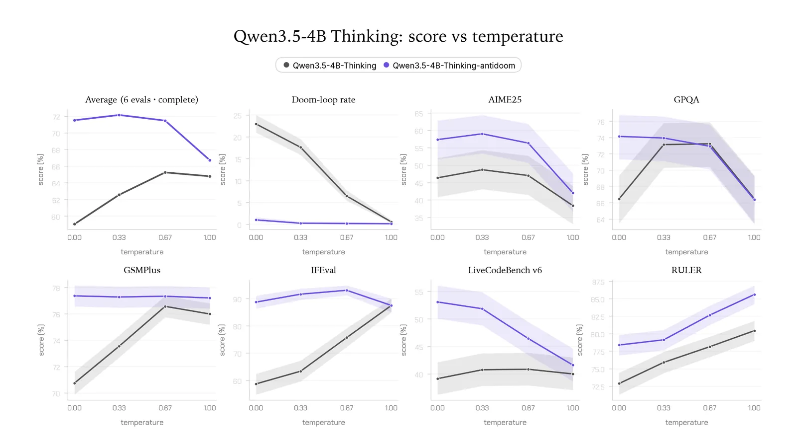

# Antidoom

**Source**: `raw/antidoom/full-article.md`, `raw/antidoom/full-article.md`  
**Ingested**: 2026-07-12  
**Tags**: #summary

## Summary

Liquid AI's **Antidoom** post documents [[Doom Loop|doom loops]] in reasoning models and a fix called [[Final Token Preference Optimization]] (FTPO). A doom loop is repetitive degeneration: the model emits the same span until the context window fills, often inside long reasoning traces on hard math or coding tasks.

The post names three mechanisms. Overtrained-token fallback: when uncertain, the model leans on tokens seen too often during training (e.g., repeated " But"). Prior-context reinforcement: each repeated token makes the next repeat more likely under greedy decoding. Greedy-sampling lock-in: low temperature removes diversity that could break the loop.

FTPO adapts Antislop-style preference training but scopes updates to the single token that starts a loop. Training pairs mark one chosen token and several rejected loop-start tokens; optimization uses logit-space KL with a two-part regularizer so the model learns to avoid loop triggers without broad distribution collapse.

Results on greedy sampling: LFM2.5-2.6B early checkpoint doom-loop rate drops from 10.2% to 1.4%; Qwen3.5-4B drops from 22.9% to 1%. Code is open at github.com/Liquid4All/antidoom.

## Key Claims

- Doom loops are a distinct failure mode from generic repetition: they lock in via overtrained tokens, context feedback, and greedy decoding.
- FTPO trains only on the final (loop-starting) token with multiple rejected alternatives, not full-sequence DPO.
- FTPO cuts doom-loop rates by roughly an order of magnitude on LFM2.5-2.6B and Qwen3.5-4B under greedy sampling.
- Method builds on Antislop and connects to [[Papers Explained 148 - Direct Preference Optimization|DPO]] as a scoped variant.

## Figures

| Figure | Caption |
|--------|---------|
|  | Example doom-loop token table from a reasoning trace |
|  | Candidate loop-start token visualization |
|  | Repetition probability vs. context under greedy decoding |
|  | Doom-loop rate before and after FTPO |
|  | LFM2.5-2.6B results with FTPO |
|  | Qwen3.5-4B results with FTPO |

## Entities

- [[Liquid AI]] — LFM model family and Antidoom authors.
- [[Final Token Preference Optimization]] — training method.
- [[Doom Loop]] — failure mode being mitigated.

## Questions & Gaps

- Evaluations focus on greedy decoding; doom-loop rates under sampling or higher temperature are not reported.
- FTPO is demonstrated on mid-size reasoning checkpoints, not frontier-scale models.
- Interaction with chain-of-thought length limits and tool-use loops is left open.

## Related

- [[Final Token Preference Optimization]] — method details.
- [[Doom Loop]] — failure-mode concept.
- [[Papers Explained 148 - Direct Preference Optimization]] — parent preference-optimization framework.
- [[Liquid AI]] — org page.
- [[Safety and Alignment]] — degeneration and alignment topic hub.
