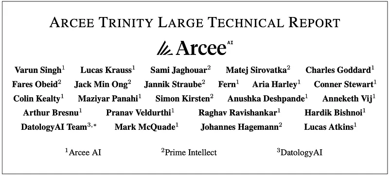
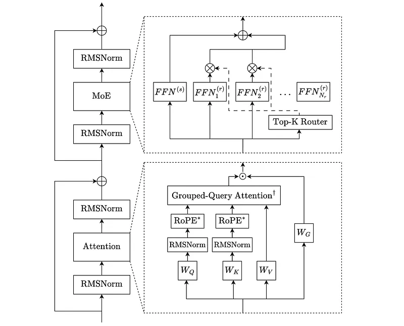
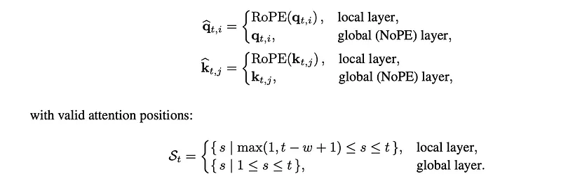
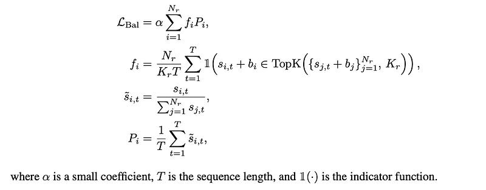
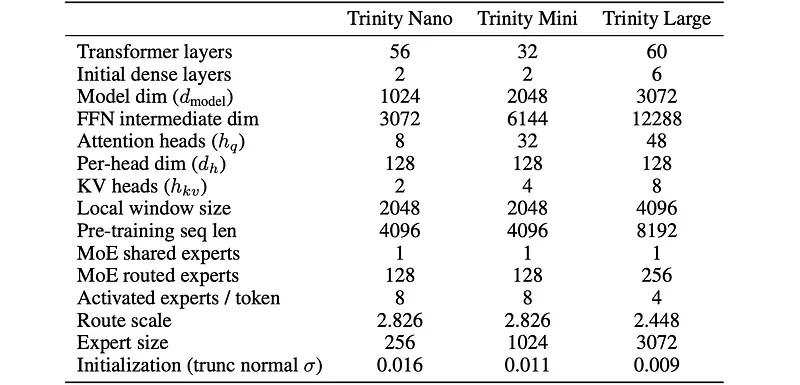
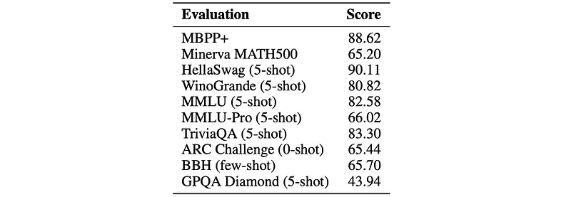

# Papers Explained: Arcee Trinity

**Source**: `raw/arcee-trinity/full-article.md`  
**Ingested**: 2026-05-12  
**Tags**: #summary

## Summary

Arcee Trinity is a family of sparse [[Mixture of Experts]] (MoE) language models released by [[Arcee AI]], spanning three size tiers: Trinity Nano (6B total / 1B activated per token), Trinity Mini (26B total / 3B activated per token), and Trinity Large (400B total / 13B activated per token). The family represents a significant leap beyond the earlier [[Papers Explained 426 - Arcee Foundation Models|AFM]] dense models, introducing a suite of architectural innovations designed for high efficiency at inference time while maintaining frontier-class performance.

The architecture combines interleaved local/global attention (3:1 SWA/NoPE pattern), gated attention, depth-scaled sandwich normalization, and sigmoid routing for the MoE layers — following the [[DeepSeekMoE]] design with fine-grained routed experts and a shared always-active expert. Trinity Large additionally introduces SMEBU (Soft-clamped Momentum Expert Bias Updates), a novel load-balancing strategy that replaces the per-step sign-based bias update with a tanh soft-clamped magnitude-aware approach with a momentum buffer. All three models use a custom 200K-token BPE tokenizer derived from a multilingual pretokenization pipeline inspired by DeepSeek V3.

Pre-training data was curated by DatologyAI. Trinity Nano and Mini trained on 10 trillion tokens (7T phase 1, 1.8T phase 2, 1.2T phase 3), while Trinity Large trained on 17 trillion tokens sampled from a distinct 20T mix, featuring 8T+ tokens of synthetic data — including 6.5T tokens of synthetic web content and 800B tokens of synthetic code. Post-training combines supervised fine-tuning (using Cut Cross-Entropy for memory efficiency) with a short RL stage via prime-rl.

Trinity Large Base achieves competitive scores with GLM 4.5 Base despite having 4× higher sparsity and roughly 2.5× fewer active parameters, demonstrating the efficiency gains from the sparse architecture. The Muon optimizer is used during pretraining of Trinity Large for high efficiency and stability.

## Key Claims

- Trinity Nano (6B/1B active), Mini (26B/3B active), and Large (400B/13B active) are the three model variants, covering a wide range of compute-efficiency trade-offs.
- A custom 200,000-token BPE vocabulary is used across all models, trained on ~10B tokens with a multi-stage pretokenizer inspired by DeepSeek V3 (digit isolation, script-aware CJK+Thai/Lao/Khmer/Myanmar/Korean isolation, byte-level fallback).
- Attention uses GQA + QK-norm + gated attention + 3:1 local:global pattern (SWA with RoPE in local layers, NoPE in global layers), providing efficient long-context handling.
- MoE layers follow the DeepSeekMoE design: fine-grained routed experts + shared expert, SwiGLU activation, sigmoid routing with normalized scores, first-k MoE layers replaced with dense layers for stability.
- Load balancing for Nano/Mini uses auxiliary-loss-free balancing with re-centered expert bias updates plus a sequence-wise load balance loss. Trinity Large uses the novel SMEBU strategy.
- Trinity Large is the first model in the family trained with the Muon optimizer, offering improved efficiency and training stability.
- Over 8 trillion tokens of synthetic data were generated for Trinity Large's training mix, including 6.5T tokens of synthetic web content (format transformation, style modification, content restructuring) and 800B tokens of synthetic code.
- Context extension training reveals that training at longer sequences than the target window consistently improves performance; Trinity Large achieves MK-NIAH (@256K) of 0.994 and scores 0.976 at 512K even without 512K training.
- Trinity Large Base is competitive with GLM 4.5 Base despite 4× higher sparsity and ~2.5× fewer active parameters.
- Post-training uses Cut Cross-Entropy for memory-efficient SFT, followed by RL with prime-rl; the coding subset draws heavily from agentic harness trajectories (OpenCode).

## Figures

| Figure | Caption |
|--------|---------|
|  | Title card / hero image for Arcee Trinity article. |
|  | Architecture overview of the Trinity model family. |
|  | Query, key, value projections and QK-norm attention equations. |
|  | Local (SWA+RoPE) vs. global (NoPE) attention key/query formulas. |
|  | GQA head mapping from query heads to shared KV heads. |
|  | Scaled dot-product attention with shared KV computation. |
|  | Gated attention elementwise gate applied before output projection. |
|  | MoE output formula combining shared and routed experts. |
|  | Sigmoid routing score formula for routed experts. |
|  | Top-K expert selection with sigmoid + expert bias. |
|  | Auxiliary-loss-free expert bias update with re-centering formula. |
|  | Sequence-wise load balance loss formula. |
|  | SMEBU: normalized per-expert violation + tanh soft-clamping formula. |
|  | SMEBU: momentum buffer for expert bias updates. |
|  | Depth-scaled sandwich norm formula. |
|  | Depth-scaled RMSNorm gain initialization per layer. |
|  | RMSNorm applied before the language modeling head. |
|  | Embedding layer scaling by √d during forward pass. |
|  | Model configurations table for all Trinity variants (Nano, Mini, Large). |
|  | Trinity Large Base performance on benchmarks. |
|  | Trinity Large Preview (instruct) performance on benchmarks. |

> fig-18 (weight initialization standard deviation formula) was unavailable due to a corrupted URL in the source export.

## Entities

- [[Arcee AI]] — the organization that developed and released the Trinity model family.
- [[DatologyAI]] — curated all pretraining data for Trinity Nano, Mini, and Large.
- [[Mixture of Experts]] — the core architectural paradigm enabling sparse compute; Trinity models are MoE across all sizes.
- [[DeepSeekMoE]] — the MoE design that Trinity's expert layers are based on (fine-grained routed experts + shared expert, sigmoid routing).
- [[SMEBU]] — novel load-balancing algorithm introduced for Trinity Large; a concept worth tracking.
- [[Muon Optimizer]] — used for Trinity Large pretraining; a modern second-order-ish optimizer for efficiency and stability.
- [[prime-rl]] — RL framework used in the post-training stage.
- [[OpenCode]] — agentic code harness whose trajectories supply a large share of the coding SFT data.

## Questions & Gaps

- The technical report (arXiv 2602.17004) presumably has fuller ablations; the article summary is fairly concise on evaluation details beyond the top-level table.
- SMEBU's behavior relative to standard aux-loss and aux-loss-free baselines is described mathematically but there are no ablation numbers showing its superiority in isolation.
- The "Muon optimizer" reference is mentioned for Trinity Large but no training curve comparisons are shown against AdamW.
- The context extension dataset (~117B tokens, 35.6M documents) is described but the specific impact of each component (OLMo OCR data, ProLong, FLAN, etc.) is not ablated.
- It's not clear how the Trinity models compare to other Western open-weight MoE models (e.g., Mixtral, Nemotron, Kimi K2) at matched active parameter counts.

## Related

- [[Papers Explained 426 - Arcee Foundation Models]] — the earlier AFM dense model family from Arcee; Trinity is the MoE successor.
- [[Mixture of Experts]] — topic page grouping all MoE models in the corpus.
- [[Papers Explained 451 - Kimi K2]] — another large MoE model (1T/32B active) for comparison.
- [[Papers Explained - Nemotron 3 Super]] — another MoE model using hybrid Mamba-Attention for comparison.
- [[DeepSeekMoE]] — architectural template for Trinity's expert layers.
- [[GRPO]] — RL optimizer used in related post-training work; Trinity uses prime-rl which is in a similar space.
- [[Synthetic Data]] — Trinity Large's 8T+ synthetic token dataset is a major example of synthetic data at scale.
