# How Attention Works in Deep Learning: Understanding the Attention Mechanism in Sequence Models

**Source**: `raw/attention/full-article.md` (387 KB), `raw/attention/full-article.md` (markdown view)  
**URL**: https://theaisummer.com/attention/  
**Author**: Nikolas Adaloglou (AI Summer), 2020-11-19  
**Ingested**: 2026-06-06  
**Tags**: #summary

## Summary

This AI Summer primer traces how [[Attention Mechanism|attention]] emerged from sequence modeling and machine translation before transformers dominated NLP. Nikolas Adaloglou frames attention through Alex Graves's dictum — *memory is attention through time* — and walks from vanilla [[Encoder-Decoder Architecture|seq2seq]] [[Recurrent Neural Networks|RNN]] encoders (stacked [[LSTM]]/[[GRU]] layers compressing input into a fixed context vector \(z\)) to the **bottleneck problem**: \(z\) cannot faithfully encode all timesteps, especially in long sentences (>20 tokens), and RNNs overweight recent tokens while forgetting distant context. Stacked RNNs also suffer [[Vanishing Gradients]].

Attention addresses both issues by letting the decoder access **all encoder hidden states** at each output step instead of only the final \(z\). The article taxonomizes **implicit vs explicit** attention (deep nets already focus on salient inputs; explicit attention makes this interpretable and trainable), **soft vs hard** attention (differentiable softmax weighting vs discrete stochastic glimpses trained with REINFORCE), and **global vs local** attention (full-sequence vs subset windows for long inputs). In the Bahdanau encoder–decoder setup, scores \(e_{ij} = \text{attention\_net}(y_{i-1}, h_j)\) are softmax-normalized into \(\alpha_{ij}\), and the context vector becomes a weighted sum \(z_i = \sum_j \alpha_{ij} h_j\) — a learned, data-dependent alignment between source and target tokens visualizable as heatmaps (word-order swaps in translation). Score functions include dot product, additive (Bahdanau), location-based softmax, and cosine similarity (Neural Turing Machines).

The piece closes with [[Self-Attention]] as the transformer building block (scores within a single sequence, viewable as a weighted graph), advantages over RNN bottlenecks (direct encoder–decoder paths like [[Skip Connections]], interpretability), and applications beyond translation (BERT, GPT, ViT, healthcare, recommenders). Quadratic \(O(T^2)\) cost is noted as the main tradeoff.

## Key Claims

- Attention originated from time-varying sequence problems; seq2seq RNNs dominated translation before transformers.
- Encoder–decoder RNNs compress all input into one context vector \(z\); this **bottleneck** fails on long sequences (>~20 timesteps in practice).
- RNNs tend to forget early timesteps and overweight recent tokens — misaligned with human language understanding.
- Attention lets the decoder dynamically query all encoder states; weights \(\alpha_{ij}\) store memory gained through time.
- **Implicit attention**: deep networks naturally focus on salient inputs (e.g. human-body pixels in self-supervised video).
- **Explicit attention**: enforced, interpretable weighting over inputs; what the literature usually means by "attention."
- **Soft attention**: differentiable, continuous weights (standard softmax); **hard attention**: discrete choices, non-differentiable, trained with RL (REINFORCE) and high variance.
- Bahdanau additive attention \(v_a^T \tanh(W_a[h; y_{i-1}])\) became the durable score function; dot-product and cosine variants also exist.
- Attention alignment heatmaps reveal non-diagonal word reordering in translation (many-to-one mappings).
- Global attention over full sequences costs \(O(T^2)\); local attention restricts to subsets for very long inputs.
- **Self-attention** scores elements within the same sequence; can be viewed as a fully connected weighted graph (symmetric in undirected form).
- Attention provides skip-like paths between encoder and decoder, mitigating vanishing gradients and improving explainability.
- Attention generalizes beyond NLP (image classification glimpses, ViT, healthcare, GNNs); transformers are one instantiation, not the whole story.

## Figures

| Figure | Caption | Page |
|--------|---------|------|
| 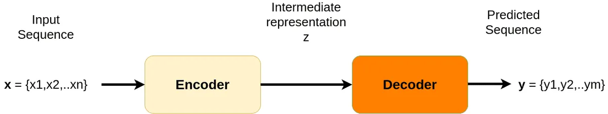 | Seq2seq architecture before attention: encoder maps input tokens to output sequence | — |
| 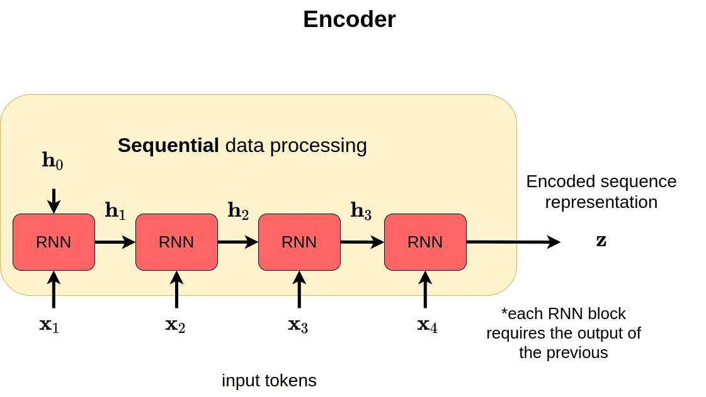 | Encoder: stacked RNN layers compress input into context vector \(z\) | — |
| 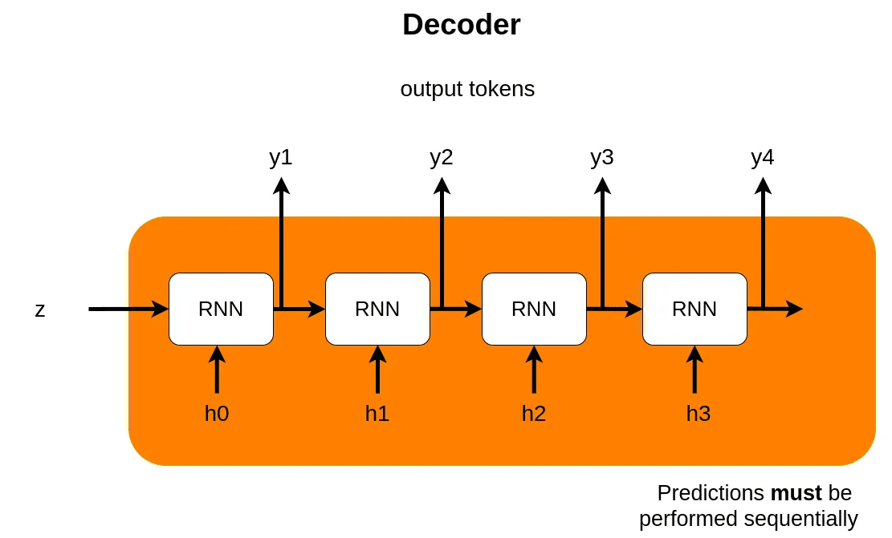 | Decoder: generates output sequence conditioned on \(z\) | — |
| 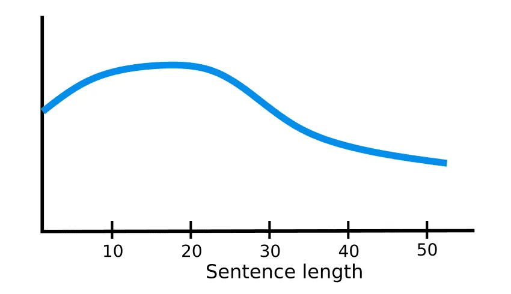 | RNN performance degrades as sequence length grows (bottleneck) | — |
| 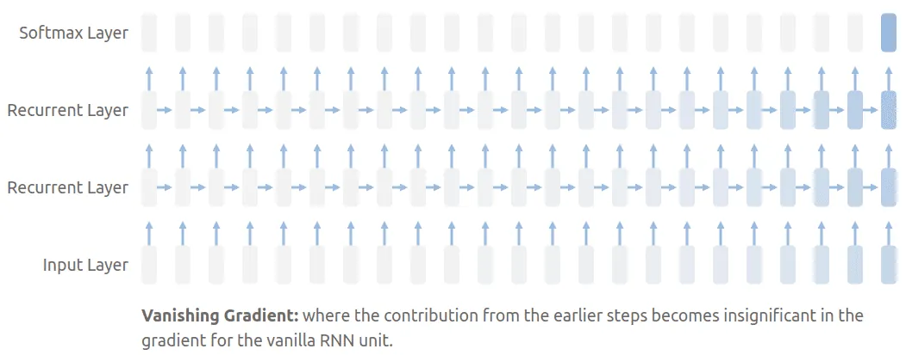 | Stacked RNN vanishing-gradient visualization (Distill) | — |
| 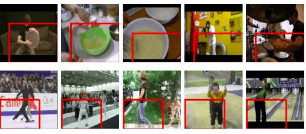 | Implicit attention: self-supervised activations focus on human body parts (Misra et al. ECCV 2016) | — |
| 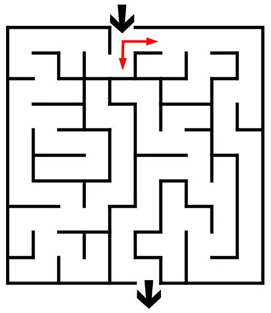 | Hard attention intuition: discrete path choice in a labyrinth | — |
| 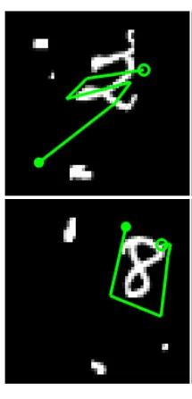 | Hard attention: stochastic glimpse selection in image classification | — |
| 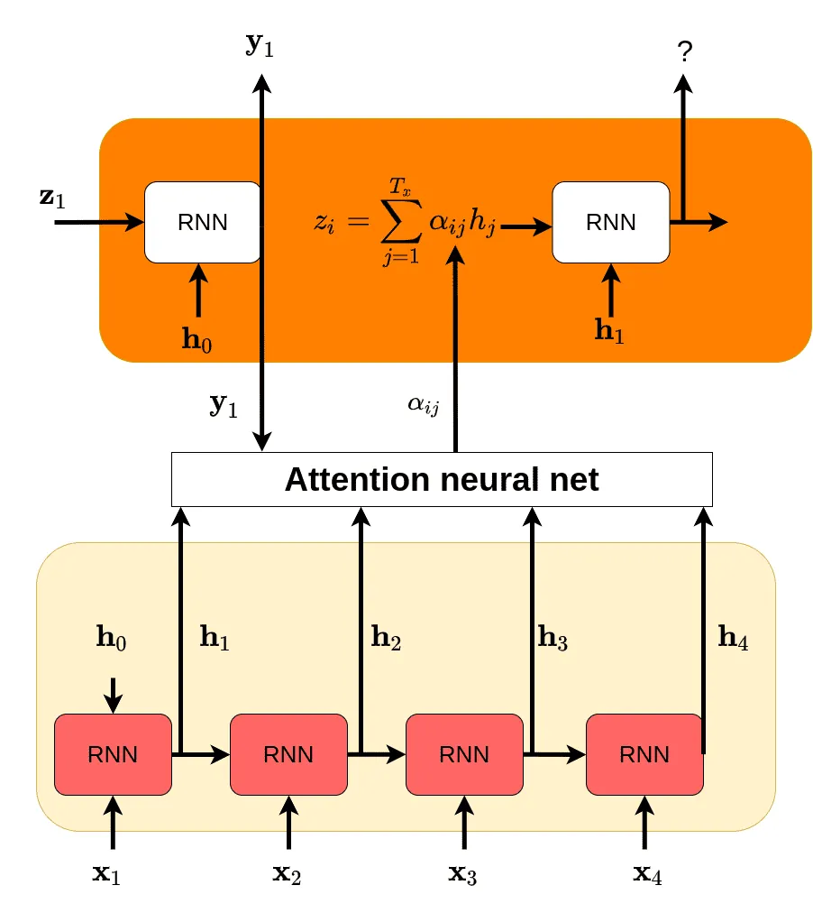 | Encoder–decoder with attention: decoder queries all encoder hidden states | — |
| 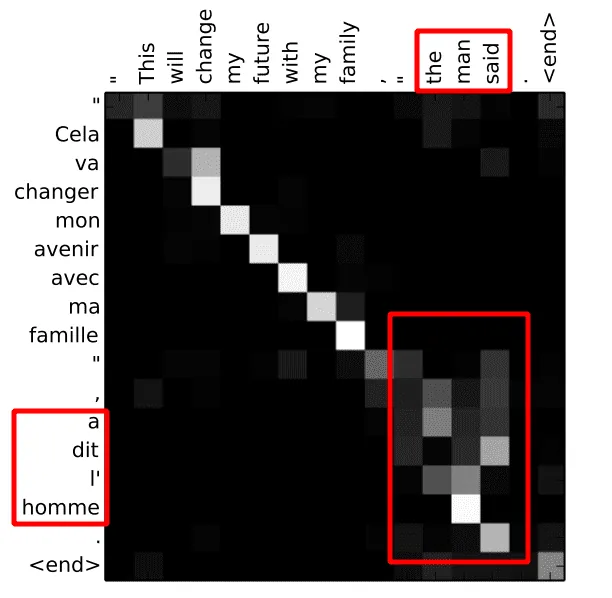 | Machine-translation attention alignment heatmap (Bahdanau et al.) | — |
| 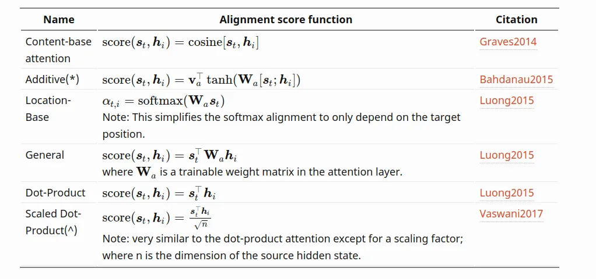 | Comparison of attention score functions (dot, additive, location, cosine) | — |
| 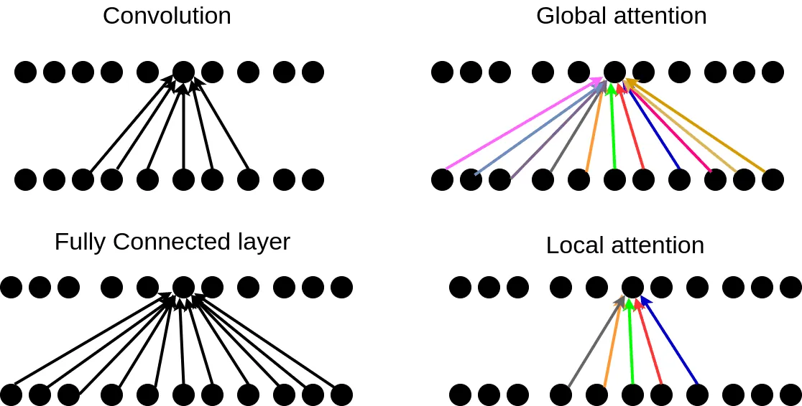 | Attention vs convolution vs fully connected: dynamic vs slowly changing weights | — |
| 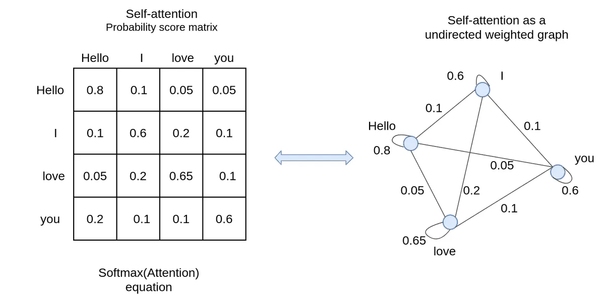 | Self-attention as a weighted graph over sequence tokens | — |

Pre-attention seq2seq: encoder processes source tokens; decoder generates the target sequence.

Performance drops as sequence length increases because the fixed context vector cannot hold all information.

Attention heatmaps expose learned word alignments, including non-monotonic reordering in translation.

Self-attention connects every token to every other token with learned edge weights.

## Entities

- [[AI Summer]] — educational blog publishing this attention primer (2020).
- [[Nikolas Adaloglou]] — primary author.
- [[Attention Mechanism]] — core concept surveyed from seq2seq through self-attention.
- [[Self-Attention]] — intra-sequence attention; key transformer component.
- [[Encoder-Decoder Architecture]] — seq2seq framing where attention was first popularized in NLP.
- [[Recurrent Neural Networks]] — dominant pre-transformer sequence architecture.
- [[Lilian Weng]] — cited for attention score-function comparison table.
- Alex Graves — DeepMind; "memory is attention through time" (lecture cited).
- Bahdanau, Cho, Bengio (2014) — additive attention for neural machine translation.

## Questions & Gaps

- Does not derive scaled dot-product multi-head attention (covered in sequel [[How Transformers Work in Deep Learning and NLP: An Intuitive Introduction]]).
- Hard-attention RL discussion is brief; no modern sparse-attention or linear-attention alternatives.
- ViT and BERT/GPT mentioned only at high level; no architecture walkthrough.
- Quadratic cost noted but efficient-attention literature (Longformer, Performer, etc.) not covered.
- Self-attention symmetry claim applies to undirected graph view; standard transformer attention is directed (query–key).

## Related

- [[How Transformers Work in Deep Learning and NLP: An Intuitive Introduction]] — direct sequel: full transformer architecture built on self-attention.
- [[Why Multi-Head Self Attention Works: Math, Intuitions and 10+1 Hidden Insights]] — research-backed analysis of why multi-head self-attention works.
- [[Recurrent Neural Networks: Building a Custom LSTM Cell]] — same author's RNN/LSTM foundation; prerequisite for encoder–decoder context.
- [[Encoder-Decoder Architecture]] — seq2seq structure attention augments.
- [[Skip Connections]] — attention paths analogized to residual shortcuts for gradient flow.
- [[Vanishing Gradients]] — problem attention partially alleviates in seq2seq.
- [[Papers Explained 01 - Transformer]] — successor architecture replacing RNN encoders with self-attention.
- [[Papers Explained Review 09 - Attention Layers]] — scaled dot-product attention in the Papers Explained corpus.
- [[Large Language Models]] — modern NLP built on attention-based transformers.
- [[Deep Learning]] — foundational sequence-model and encoder–decoder treatment.
