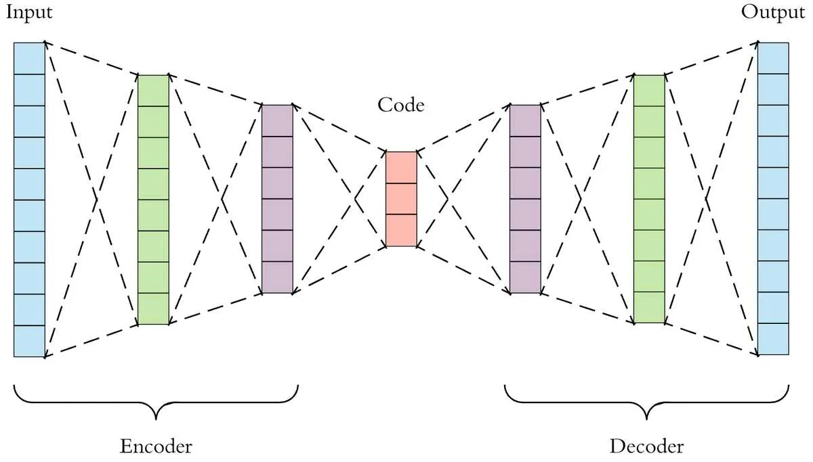
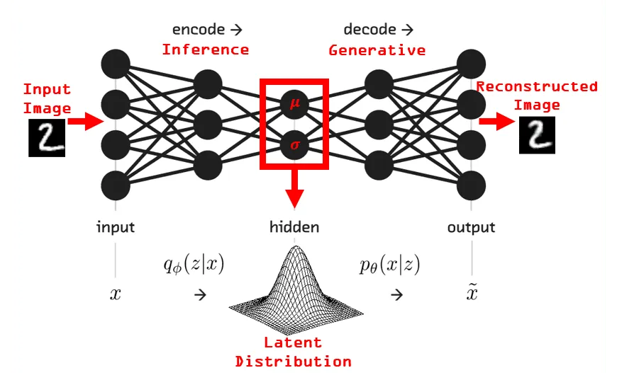
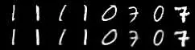

# How to Generate Images using Autoencoders

**Source**: `raw/autoencoder/full-article.md` (337 KB), `raw/autoencoder/full-article.md` (markdown view)  
**URL**: https://theaisummer.com/Autoencoder/  
**Author**: Sergios Karagiannakos (AI Summer), 2018-09-09  
**Ingested**: 2026-06-06  
**Tags**: #summary

## Summary

Sergios Karagiannakos introduces [[Unsupervised Learning]] as an alternative to label-hungry supervised models, positioning classical methods (K-Means, [[Principal Component Analysis]]) before the neural-network answer: [[Autoencoders]]. An autoencoder is a feedforward network trained to reconstruct its input; the encoder compresses data into a low-dimensional latent code and the decoder reconstructs the original signal. The bottleneck representation supports compression, dimensionality reduction, [[Denoising Autoencoders|denoising]], data augmentation, and anomaly detection (large reconstruction error on out-of-distribution inputs). Like other deep nets, plain autoencoders can overfit and suffer [[Vanishing Gradients]].

The article's generative pivot is the [[Variational Autoencoders|variational autoencoder (VAE)]]. Instead of a deterministic code, the encoder outputs parameters of a latent distribution (μ and log-variance); samples are drawn and passed to the decoder to reconstruct or generate data. Training maximizes a variational bound with two terms: reconstruction loss (binary cross-entropy on flattened MNIST pixels) and [[KL Divergence]] regularizing the latent toward a prior. Because sampling is stochastic, backprop uses the **reparameterization trick**: \(z = \mu + \sigma \odot \epsilon\) with \(\epsilon \sim \mathcal{N}(0, I)\), decoupling randomness from learnable parameters.

The article describes a minimal fully connected VAE trained on MNIST handwritten digits; reconstructions are reported as nearly indistinguishable from originals.

The post closes by distinguishing **generative** models (learn \(p(x,y)\), synthesize new data) from **discriminative** models (learn \(p(y|x)\), classify existing data), foreshadowing GANs as a follow-up topic.

## Key Claims

- Most supervised models (SVMs, CNNs) require labels; unsupervised methods infer structure from unlabeled data alone.
- K-Means and PCA are simple, widely used unsupervised baselines for clustering and dimensionality reduction.
- Autoencoders output their input; usefulness comes from a low-dimensional latent bottleneck, not identity mapping.
- Latent codes enable compression, dimensionality reduction, denoising, augmentation, and anomaly detection via reconstruction error.
- Plain autoencoders share standard NN failure modes: overfitting and vanishing gradients.
- VAEs model a latent probability distribution, sample from it, and decode samples—making them stochastic generative models grounded in Bayesian inference.
- VAE loss = reconstruction loss (e.g. BCE) + KL divergence regularizing the latent distribution.
- Reparameterization (\(z = \mu + \sigma\epsilon\)) enables gradient descent through stochastic latents.
- MNIST VAE demo: shallow fully connected encoder/decoder; reconstructions match originals closely.
- Generative models learn joint \(p(x,y)\); discriminative models learn conditional \(p(y|x)\).

## Figures

| Figure | Caption | Page |
|--------|---------|------|
|  | Classic autoencoder architecture: encoder compresses input to latent vector, decoder reconstructs output (ECG biometrics paper diagram) | — |
|  | VAE schematic: encoder outputs distribution parameters, latent samples feed decoder for generation (texture synthesis RNN-VAE) | — |
|  | MNIST training results: original digits (top row) vs VAE reconstructions (bottom row) | — |

## Entities

- [[AI Summer]] — educational blog publishing this 2018 autoencoder/VAE primer.
- [[Sergios Karagiannakos]] — author; early AI Summer generative-model tutorial.
- [[Autoencoders]] — encoder–decoder unsupervised representation learning.
- [[Variational Autoencoders]] — probabilistic autoencoder with reparameterized sampling.
- [[Unsupervised Learning]] — learning paradigm without labels.
- [[KL Divergence]] — regularizer in the VAE objective.
- [[Denoising Autoencoders]] — corruption-based variant cited as an application.
- [[Vanishing Gradients]] — training difficulty shared with other deep nets.
- [[Representation Learning]] — broader goal of learning compressed latent features.
- [[Deep Learning]] — textbook treatment of autoencoders and VAE foundations.

## Questions & Gaps

- Only a shallow fully connected architecture on MNIST; no convolutional VAE or qualitative latent-space interpolation shown.
- KL term described as keeping reconstructions "diverse" — more precisely it regularizes the latent toward a prior (typically standard normal).
- No quantitative metrics (ELBO, FID, etc.) beyond visual reconstruction comparison.
- GANs mentioned as a teaser; see [[GANs in Computer Vision: Introduction to Generative Learning]] for the adversarial follow-up.
- edX TensorFlow course (module 5) referenced for deeper autoencoder theory but not summarized here.

## Related

- [[The Theory behind Latent Variable Models: Formulating a Variational Autoencoder]] — 2021 follow-up with full probabilistic VAE derivation and ELBO.
- [[Papers Explained Review 11 - Auto Encoders]] — wiki survey of autoencoder variants.
- [[Denoising Autoencoders]] — noise-corruption training objective.
- [[Variational Inference]] — theoretical foundation for VAE training.
- [[Latent Diffusion Models]] — modern generative pipeline that also uses latent spaces.
- [[GANs in Computer Vision: Introduction to Generative Learning]] — 2020 AI Summer GAN primer contrasting adversarial sharpness with blurry MSE autoencoders.
- [[How Diffusion Models Work: The Math from Scratch]] — 2022 AI Summer follow-up on DDPM math and latent diffusion scaling.
- [[Deep Learning]] — Chapters 14 and 19 on autoencoders and variational methods.
- [[Computer Vision]] — image generation and representation learning topic hub.
