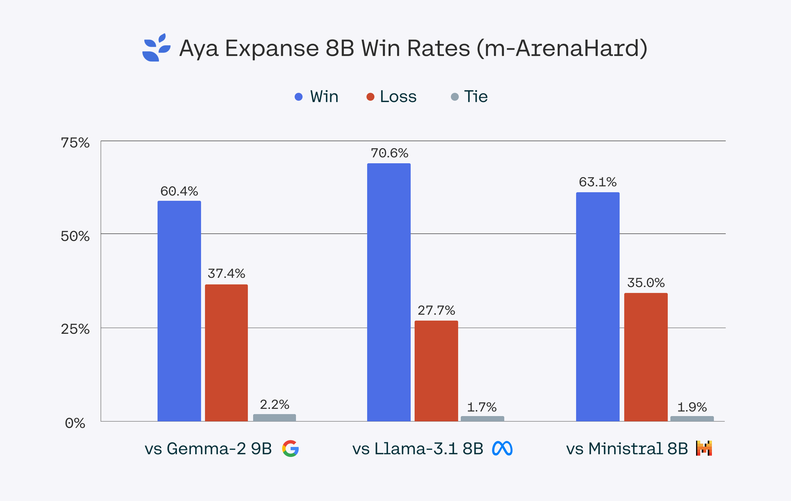
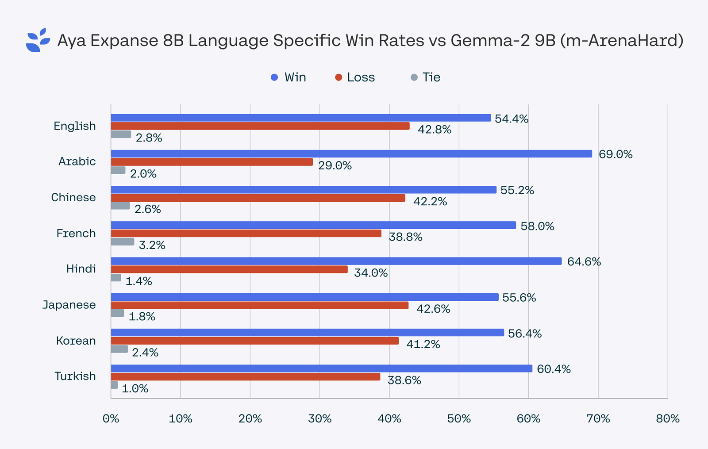
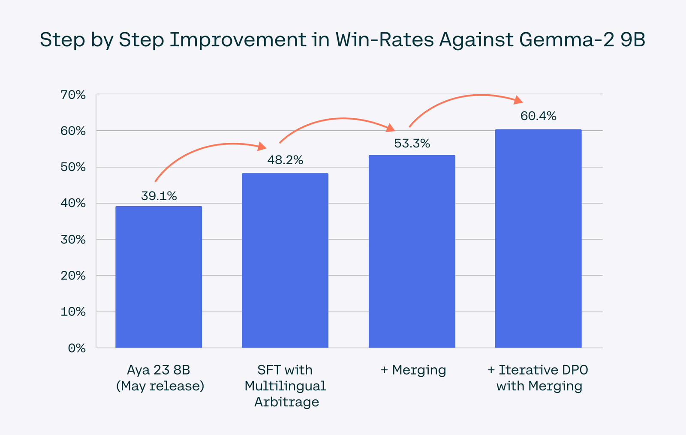
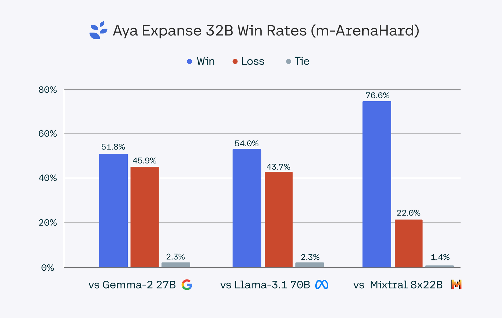

# Aya Expanse: Connecting our world

**Source**: `raw/aya-expanse/full-article.html` (342 KB), `raw/aya-expanse/full-article.md` (markdown view)  
**URL**: https://cohere.com/blog/aya-expanse-connecting-our-world  
**Ingested**: 2026-06-06  
**Tags**: #summary

## Summary

Cohere For AI announces **Aya Expanse**, a state-of-the-art open-weights multilingual LLM family covering **23 languages** — continuing the Aya research line after [[Papers Explained 109 - Aya 101]] (101 languages) and [[Papers Explained 151 - Aya 23]] (23 languages with deeper per-language capacity). Two sizes ship on Kaggle and Hugging Face: **8B** ([aya-expanse-8b](https://huggingface.co/CohereForAI/aya-expanse-8b)) for accessible research and **32B** ([aya-expanse-32b](https://huggingface.co/CohereForAI/aya-expanse-32b)) for frontier multilingual performance. Models are also available on the Cohere API.

The blog frames Aya Expanse as the culmination of a two-year **Aya initiative** involving 3,000+ researchers from 119 countries, building on the Aya collection (513M multilingual examples), evaluation suites, red-teaming datasets, and prior model releases. Performance is reported via **pairwise win rates on m-ArenaHard** across 23 languages: **Aya Expanse 8B** beats Gemma 2 9B, Llama 3.1 8B, and Ministral 8B with win rates from **60.4% to 70.6%**; **Aya Expanse 32B** outperforms Gemma 2 27B, Mistral 8x22B, and Llama 3.1 70B (more than 2× its size) with win rates from **51.8% to 76.6%**.

Three research ingredients are highlighted as the training recipe: **data arbitrage** (routing synthetic-data generation to different teacher models by data distribution to avoid mode collapse in low-resource languages), **multilingual preference training** (extending human-preference optimization beyond Western-centric safety/quality signals), and **model merging** (combining candidate checkpoints for versatility). The post shows step-by-step win-rate gains as each technique is added, arguing these methods scale from 8B to 32B.

## Key Claims

- Aya Expanse is a new SOTA open-weights multilingual family for 23 languages, released as 8B and 32B on Hugging Face, Kaggle, and the Cohere API.
- Aya Expanse 8B leads its parameter class vs. Gemma 2 9B (60.4% win rate), Llama 3.1 8B, and Ministral 8B (up to 70.6%).
- Aya Expanse 32B beats Gemma 2 27B, Mistral 8x22B, and Llama 3.1 70B on multilingual m-ArenaHard pairwise comparisons (51.8%–76.6%).
- **Data arbitrage**: strategically assign different teacher models to different data distributions when generating synthetic multilingual data, reducing gibberish/mode collapse in low-resource settings.
- **Multilingual preference training**: preference optimization adapted for diverse cultural/linguistic perspectives improves both general quality and safety beyond English-centric protocols.
- **Model merging**: combining weights from multiple candidate models at training stages yields further multilingual gains; all three techniques compose in one recipe.
- Builds on the Aya ecosystem: Aya collection, evaluation suite, red-teaming data, and community of 220 language ambassadors acknowledged in the release.

## Figures

| Figure | Caption | Page |
|--------|---------|------|
|  | Aya Expanse 8B pairwise win rates on m-ArenaHard vs. leading open models in its class | — |
|  | Language-specific win rates: Aya Expanse 8B vs. Gemma 2 9B on m-ArenaHard | — |
|  | Step-by-step win-rate improvement against Gemma 2 9B as data arbitrage, preference training, and merging are added | — |
|  | Aya Expanse 32B pairwise win rates on m-ArenaHard vs. larger open models | — |

## Entities

- [[Cohere]] — parent org; Cohere For AI research arm leads the Aya initiative and model release.
- [[Multilingual Models]] — Aya Expanse extends the Aya line as SOTA open-weights multilingual LLMs for 23 languages.

## Questions & Gaps

- Blog reports m-ArenaHard pairwise win rates but not full per-benchmark tables or human-eval details; technical paper-level specs are not linked here.
- One sentence mentions "8b and 35b" but model cards and links consistently name **8B** and **32B** — likely a typo in the source post.
- Data arbitrage, preference-training, and merging hyperparameters are described conceptually without reproducible training configs in the blog.

## HF Blog Cross-References

- [A Deepdive into Aya Expanse: Advancing the Frontier of Multilinguality](https://huggingface.co/blog/aya-expanse) (2024-10-24) — the Cohere For AI team's technical companion post on the Hugging Face blog, walking through the same data arbitrage, preference training, and merging recipe as above with more mechanism detail: an internal reward model ("Arbiter") routes each prompt to the best of several teacher models rather than relying on one, preference training runs offline-then-online DPO for 3 iterations, and merging gains scale up to 3x larger at 32B than at 8B.

## Related

- [[Multilingual Models]] — topic hub for cross-lingual and multilingual LLM work.
- [[Papers Explained 151 - Aya 23]] — prior 23-language Aya family (8B/35B) built on Command; Aya Expanse is the next-generation recipe.
- [[Papers Explained 109 - Aya 101]] — earlier 101-language Aya model and data-mixture lineage.
- [[Papers Explained 108 - Aya Dataset]] — human-annotated multilingual instruction data underpinning the Aya training stack.
