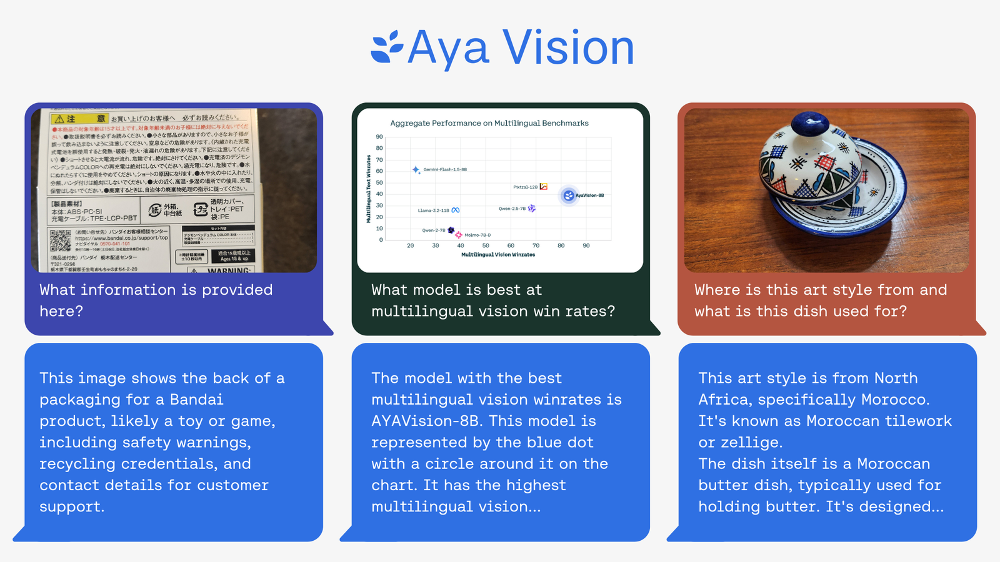
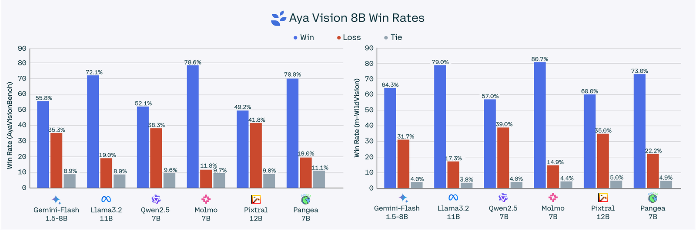
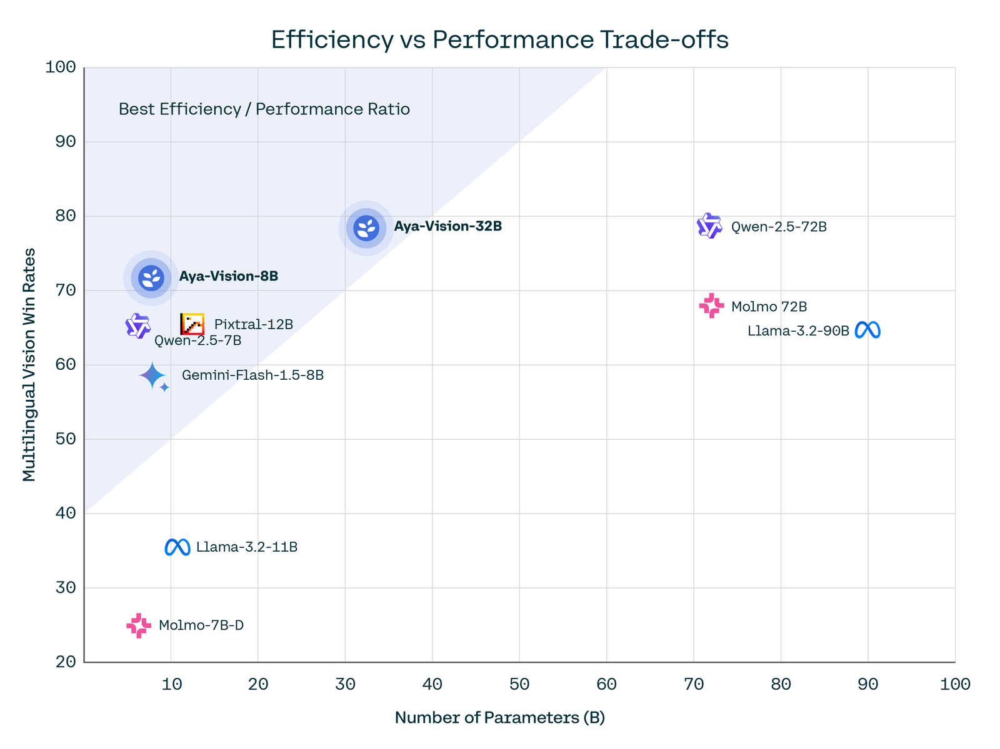
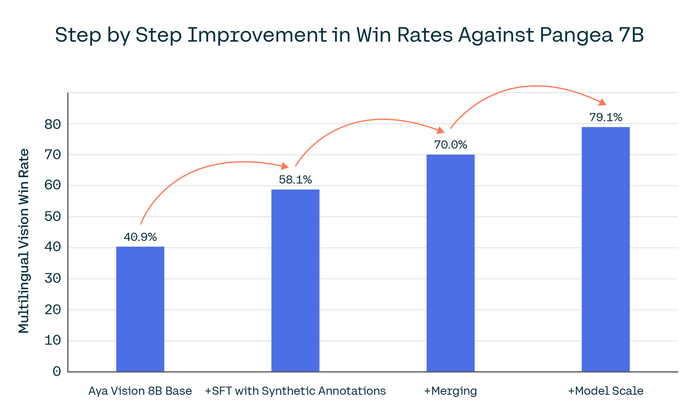

# Aya Vision: Expanding the worlds AI can see

**Source**: `raw/aya-vision/full-article.html` (326 KB), `raw/aya-vision/full-article.md` (markdown view)  
**URL**: https://cohere.com/blog/aya-vision  
**Ingested**: 2026-06-06  
**Tags**: #summary

## Summary

Cohere For AI announces **Aya Vision**, a family of open-weights **vision-language models** built to close the multilingual gap in multimodal AI. The release extends image+text capabilities to **23 languages** spoken by over half the world's population—covering tasks such as image captioning, visual question answering, text generation, and translating both text and images into natural language.

Aya Vision ships as **8B and 32B** parameter models on Kaggle and Hugging Face, with free WhatsApp access for broader reach. On multilingual multimodal benchmarks, **Aya Vision 8B** leads its parameter class—outperforming Qwen2.5-VL 7B, Gemini Flash 1.5 8B, Llama-3.2 11B Vision, and Pangea 7B by up to **70% win rates** on AyaVisionBench and **79%** on m-WildVision. **Aya Vision 32B** sets a new frontier among open multilingual vision models, beating Llama-3.2 90B Vision, Molmo 72B, and Qwen2-VL 72B by up to **64%** on AyaVisionBench and **72%** on m-WildVision. Notably, the 8B model outperforms models **10× its size** (e.g., Llama-3.2 90B Vision at 63% win rates), emphasizing efficiency for researchers with limited compute.

Training builds on techniques unified from the Aya research line: **synthetic annotations**, scaled multilingual data via translation and rephrasing, and **multimodal model merging**—improving 8B win rates from 40.9% to 79.1% step by step. C4AI also open-sources **Aya Vision Benchmark**, an evaluation set in 23 languages focused on open-ended (not multiple-choice) multimodal questions that better reflect real-world use. See [[Papers Explained 332 - Aya Vision]] for the technical paper on the synthetic data pipeline and cross-modal merging.

## Key Claims

- Multimodal performance varies sharply by language; Aya Vision targets that gap across 23 languages.
- Aya Vision 8B and 32B are open-weights releases on Kaggle and Hugging Face, plus free WhatsApp access.
- 8B leads its class on AyaVisionBench (up to 70% win rates) and m-WildVision (79%); 32B beats much larger open models (up to 64%/72%).
- 8B outperforms Llama-3.2 90B Vision despite ~10× fewer parameters (63% win rates).
- Algorithmic recipe—synthetic annotations, multilingual translation/rephrasing, multimodal merging—scales from 8B to 32B.
- Aya Vision Benchmark provides rigorous open-ended multilingual multimodal evaluation in 23 languages.

## Figures

| Figure | Caption | Page |
|--------|---------|------|
|  | Aya Vision multilingual multimodal examples across languages | — |
|  | Aya Vision 8B combined win rates on AyaVisionBench and m-WildVision | — |
|  | Efficiency vs performance: 8B beating far larger vision models | — |
|  | Step-by-step improvement in multilingual multimodal win rates (8B) | — |

## Entities

- [[Cohere]] — publisher; Cohere For AI research arm.
- [[Vision Language Models]] — Aya Vision is an open multilingual VLM family (8B/32B).
- [[Multilingual Models]] — 23-language coverage; builds on the Aya initiative.

## Questions & Gaps

- Blog post is announcement-focused; training and data details are in the arXiv paper ([[Papers Explained 332 - Aya Vision]]).
- WhatsApp access terms and geographic availability are not specified.

## HF Blog Cross-References

- [A Deepdive into Aya Vision: Advancing the Frontier of Multilingual Multimodality](https://huggingface.co/blog/aya-vision) (2025-03-04) — a guest post by the Cohere For AI team on the Hugging Face blog, adding architecture and training detail beyond the Cohere announcement above: SigLIP2-patch14-384 as the vision encoder, 4x Pixel Shuffle downsampling of image tokens, a two-stage pipeline (frozen-backbone vision-language alignment, then full SFT), and ablations showing the model-merging step alone adds 11.9 points of win rate on AyaVisionBench.

## Related

- [[Papers Explained 332 - Aya Vision]] — technical paper on synthetic multilingual multimodal data and cross-modal merging.
- [[Vision Language Models]] — topic hub for multimodal vision+language systems.
- [[Multilingual Models]] — topic hub for cross-lingual and multilingual model work.
