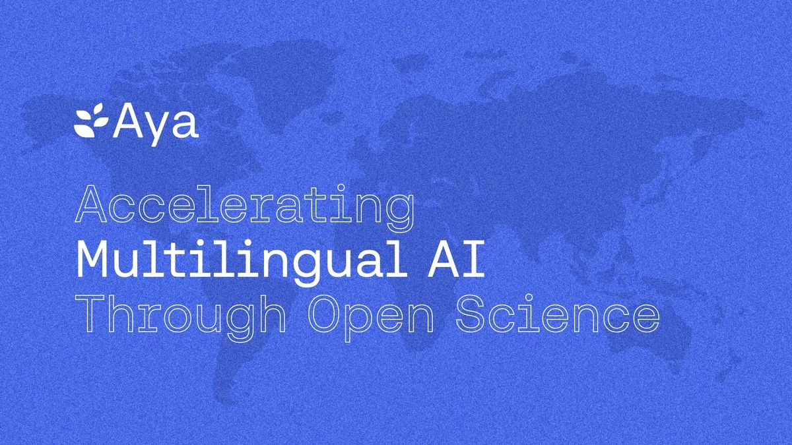
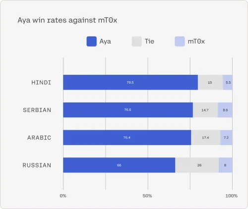

# C4AI Launches Aya, an LLM Covering More Than 100 Languages

**Source**: `raw/aya/full-article.md` (330 KB), `raw/aya/full-article.md` (markdown view)  
**URL**: https://cohere.com/blog/aya  
**Ingested**: 2026-06-06  
**Tags**: #summary

## Summary

[[Cohere]] For AI (C4AI) announces **Aya**, an open-source massively multilingual generative LLM covering **101 languages** — more than double prior open-source multilingual coverage. The release pairs the model with the largest multilingual instruction fine-tuning dataset to date: the **Aya Collection** (513M prompts/completions across 114 languages) and the human-curated **Aya Dataset** (~204K annotations in 67 languages). Both ship under **Apache 2.0**.

The post frames Aya as an open-science paradigm shift: over **3,000 researchers from 119 countries** collaborated to close language and cultural gaps left by English-centric LLMs. Aya targets dozens of underrepresented languages (50+ previously unserved, e.g. Somali, Uzbek) and claims wide-margin benchmark wins over open models like **mT0** and **Bloomz**, with **75%** human-eval preference vs. other leading open models and **80–90%** simulated win rates. Technical training data curation, language taxonomy, and evaluation details are documented in [[Papers Explained 108 - Aya Dataset]] and [[Papers Explained 109 - Aya 101]]; this page is the original C4AI launch announcement (Feb 2024).

## Key Claims

- Aya is a state-of-the-art open-source multilingual generative LLM covering **101 languages** — >2× prior open-source language breadth.
- **Aya Collection**: 513M instruction examples across **114 languages**; includes templated, translated, and human-annotated data from fluent speakers worldwide.
- **Aya Dataset**: ~204K human-curated instruction annotations in **67 languages** — largest human-annotated multilingual instruction dataset at launch.
- Open-science coalition: **3,000+ independent researchers** from **119 countries** via the Aya project.
- Benchmarks: surpasses mT0 and Bloomz by a wide margin; **75%** human-eval win rate vs. leading open models; **80–90%** simulated win rates.
- Expands coverage to **50+ previously unserved languages** (Somali, Uzbek, etc.) for open research.
- **Apache 2.0** license on model and datasets; available via Cohere Playground, Hugging Face, and the Aya Project website.
- Many collection languages had **no prior instruction-tuning representation**; data spans dialects and informal organic language use.

## Figures

| Figure | Caption | Page |
|--------|---------|------|
|  | C4AI Aya launch blog banner | — |
|  | Geographical distribution of Aya collaborators | — |
|  | Head-to-head comparison of preferred model responses | — |

## Entities

- [[Cohere]] — parent org; C4AI (Cohere For AI) research lab leads the Aya open-science initiative and model release.
- [[Multilingual Models]] — Aya is a flagship massively multilingual open-weights LLM and dataset release in the Aya research line.

## Questions & Gaps

- Blog is announcement-oriented; architecture, training recipe, and per-benchmark tables live in [[Papers Explained 109 - Aya 101]] and the Aya paper, not this post.
- Human-eval and simulated win-rate methodology are stated without sample sizes or task breakdowns in the blog body.
- Later Aya releases ([[Aya Expanse: Connecting our world]], Aya 23, Tiny Aya) refine the lineage with fewer languages but stronger per-language depth.

## Related

- [[Papers Explained 108 - Aya Dataset]] — Aya Annotation Platform, Dataset, Collection, and Evaluation Suite that underpin this release.
- [[Papers Explained 109 - Aya 101]] — technical explainer of the Aya 101 model, data mixture, and benchmark results.
- [[Multilingual Models]] — topic hub for cross-lingual and massively multilingual LLM work.
- [[Aya Expanse: Connecting our world]] — later C4AI multilingual release (23 languages; data arbitrage + preference training + merging).
