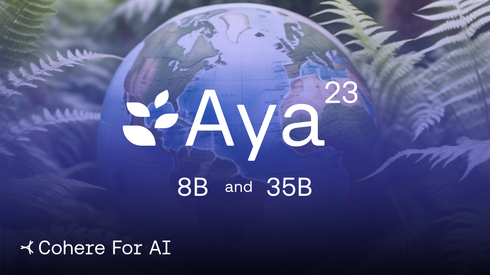
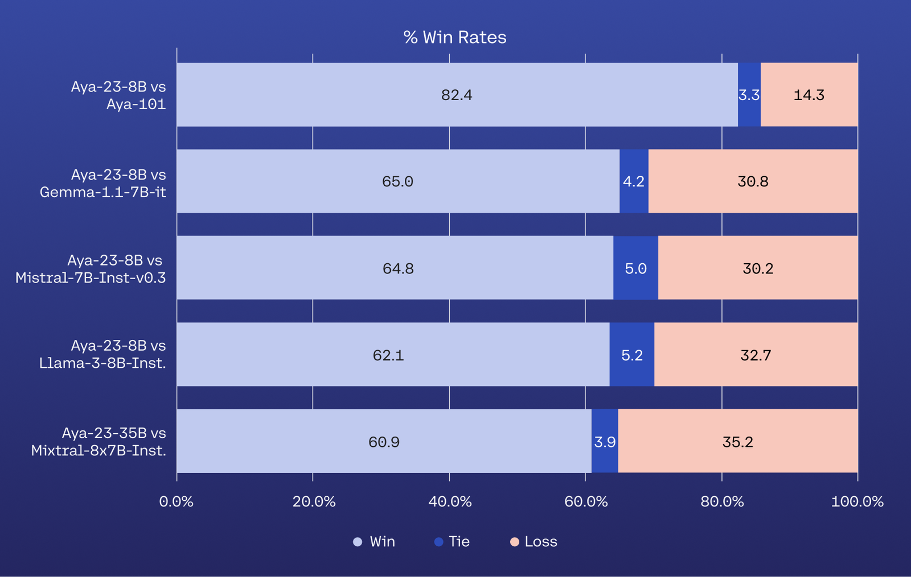
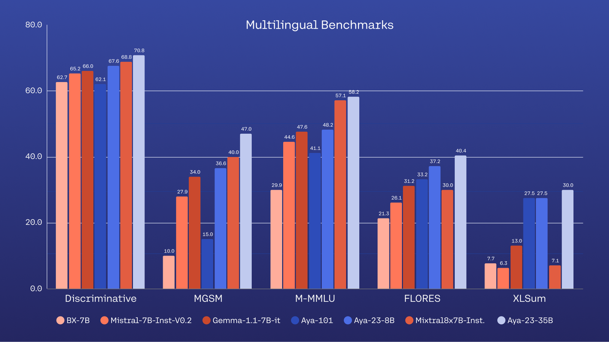

# C4AI Launches Aya 23, 8B and 35B Parameter Open Weights Release

**Source**: `raw/aya23/full-article.html` (321 KB), `raw/aya23/full-article.md` (markdown view)  
**URL**: https://cohere.com/blog/aya23  
**Published**: 2024-05-22  
**Ingested**: 2026-06-06  
**Tags**: #summary

## Summary

[[Cohere]] For AI (C4AI) announced **Aya 23**, a family of open-weight multilingual generative LLMs covering **23 languages**. The release includes **8B** and **35B** parameter instruction-tuned models built on the broader **Aya** open-science initiative, which mobilized ~3,000 collaborators to build large-scale multilingual instruction data. Where [[Papers Explained 109 - Aya 101|Aya 101]] prioritized **breadth** across 101 languages, Aya 23 trades coverage for **depth**: a strong pretrained backbone (Command-series lineage; see [[Papers Explained 151 - Aya 23]]) paired with the Aya dataset collection on a focused set of 23 languages—languages spoken by nearly half the world's population.

The blog positions Aya 23 as evidence that high-resource performance need not be limited to a handful of languages. **35B Aya 23** leads across benchmarks for the covered languages versus massively multilingual baselines (including Aya-101) and widely used open instruction-tuned models; **8B Aya 23** delivers best-in-class multilingual performance in its size class with lower compute requirements for researchers globally. Capabilities highlighted include natural language understanding, summarization, and translation across the linguistic spectrum.

Models are released for fundamental research and safety auditing on Hugging Face ([8B](https://huggingface.co/CohereForAI/aya-23-8B), [35B](https://huggingface.co/CohereForAI/aya-23-35B), [demo space](https://huggingface.co/spaces/CohereForAI/aya-23)). A technical report ([arXiv:2405.15032](https://arxiv.org/abs/2405.15032)) accompanies the release with full benchmark and generation-quality results.

## Key Claims

- Aya 23 serves 23 languages with 8B and 35B open-weight releases under C4AI's multilingual research program.
- Aya 23 emphasizes **depth over breadth** relative to Aya 101's 101-language coverage.
- 35B Aya 23 achieves the highest benchmark results among compared models for the 23 covered languages.
- 8B Aya 23 demonstrates best-in-class multilingual performance among similarly sized open instruction-tuned models.
- Models excel on NLU, summarization, and translation across a wide linguistic spectrum.
- 8B variant targets accessible deployment with reduced compute for democratizing multilingual AI research.
- Full evaluation details are in the Aya 23 technical report on arXiv.

## Figures

| Figure | Caption | Page |
|--------|---------|------|
|  | Blog featured image — Aya 23 open-weights announcement | — |
|  | LLM-as-a-judge win rates across 10 languages (Aya 23 vs baselines) | — |
|  | Multilingual benchmark comparison for Aya 23 8B and 35B | — |

## Entities

- [[Cohere]] — parent org; Cohere For AI research lab announces and releases Aya 23.
- [[Multilingual Models]] — topic framing breadth-vs-depth tradeoffs and 23-language coverage.

## Questions & Gaps

- Blog is a launch announcement; architecture, training data mix, and per-benchmark numbers live in [[Papers Explained 151 - Aya 23]] and the technical report.
- Hugging Face URLs in the live page HTML may differ from canonical `aya-23-8B` / `aya-23-35B` repo names.

## Related

- [[Papers Explained 151 - Aya 23]] — detailed architecture, fine-tuning recipe, and evaluation breakdown.
- [[Multilingual Models]] — curated topic page for multilingual LLM work in the wiki.
- [[Papers Explained 109 - Aya 101]] — prior breadth-first Aya release (101 languages).
- [[Papers Explained 108 - Aya Dataset]] — multilingual instruction data underpinning the Aya initiative.
