# An Overview of Classifier-Free Diffusion Guidance: Impaired Model Guidance with a Bad Version of Itself (Part 2)

**Source**: `raw/classifier-free-guidance-part-2/full-article.html` (428 KB), `raw/classifier-free-guidance-part-2/full-article.md` (markdown view)  
**URL**: https://theaisummer.com/classifier-free-guidance-part-2/  
**Authors**: Nikolas Adaloglou, Tim Kaiser (AI Summer), 2024-09-26  
**Ingested**: 2026-06-06  
**Tags**: #summary

## Summary

Part 2 of the AI Summer CFG survey addresses a core limitation of vanilla **[[Classifier-Free Guidance]]**: it requires conditioning dropout during training (or separately trained conditional/unconditional models). When that is unavailable — or when guiding purely **unconditional** generators — recent work replaces the unconditional "negative" term with an **impaired positive model**. The generalized framework uses positive/negative notation: \(\hat{D}_{\text{out}} = D_{\text{neg}} + (1+\gamma)(D_{\text{pos}} - D_{\text{neg}})\), extending CFG beyond explicit conditions (Hong et al. 2023).

**Training-free perturbation methods** derive \(D_{\text{neg}}\) from the same network: **Self-Attention Guidance (SAG)** blurs high self-attention patches in the input; **[[Perturbed Attention Guidance]] (PAG)** replaces selected self-attention maps with identity matrices, breaking semantic structure. Both work on conditional or unconditional models but require manual layer/head selection and can produce OOD artifacts under aggressive perturbation.

**[[Autoguidance]]** (Karras et al. 2024) takes a different path: the negative model is a deliberately weak version of the positive one — fewer parameters (30–50% capacity) and/or an earlier training checkpoint — while **both remain conditional**, avoiding the task-discrepancy problem of vanilla CFG's unconditional negative. Combined with post-hoc EMA tuning at sampling time, autoguidance achieves SOTA FID on ImageNet-512/64 but demands extra training or checkpoint search.

**Independent Condition Guidance (ICG)** offers a training-free fix for conditional models without dropout: use a **random wrong class/prompt** as the negative instead of unconditional. **SIMS** retrains an auxiliary model on synthetic data; **Smoothed Energy Guidance (SEG)** Gaussian-blurs attention weights interpreting the operation as reducing Hopfield energy curvature. The article concludes no method fully replaces vanilla CFG out of the box — each trades training cost, hyperparameter search, and architecture dependence differently.

## Key Claims

- Vanilla CFG requires (a) external condition and (b) joint conditional/unconditional training via dropout (~10–20%) or separate models.
- Generalized CFG: positive \(D_{\text{pos}}\) and negative \(D_{\text{neg}}\) can be arbitrary models; negative is typically an impaired version of positive.
- **SAG**: negative = conditional model with Gaussian-blurred high self-attention patches; ~10% FID improvement on ImageNet 128×128; training- and condition-free.
- SAG ablation: global Gaussian blur and attention-targeted blur beat random/square pixel resets; DINO attention maps also work.
- SAG limitation: aggressive input perturbation → OOD samples and hyperparameter sensitivity.
- **PAG**: negative = same U-Net with identity self-attention maps at selected encoder layers; repairs semantic coherence via \(\gamma \tilde{\Delta}_t\).
- PAG/SAG are architecture-dependent: which U-Net layers/heads to perturb is manual.
- **Autoguidance**: \(D_{\text{neg}}\) = smaller and/or under-trained checkpoint of \(D_{\text{pos}}\); both conditional — no task discrepancy.
- Autoguidance sweet spot: 30–50% parameter capacity; training budget \(\tau \in [T/3.5, T/16]\) relative to main model; earlier checkpoint often beats smaller capacity alone.
- Post-hoc EMA combinations of checkpoints enable sampling-time grid search over positive/negative EMA lengths.
- Autoguidance impractical with single public checkpoint and no auxiliary training.
- **ICG**: random condition as negative for models without dropout; comparable metrics to CFG on Stable Diffusion and DiT-XL.
- **SIMS**: retrain impaired model on synthetic samples from main model; FID sensitive to retraining budget and guidance scale.
- **SEG**: Gaussian blur on \(QK^\top\) attention weights; only \(\sigma\) tuned; layer selection still manual.
- No single out-of-the-box replacement for vanilla CFG as of 2024.

## Figures

| Figure | Caption | Page |
|--------|---------|------|
| 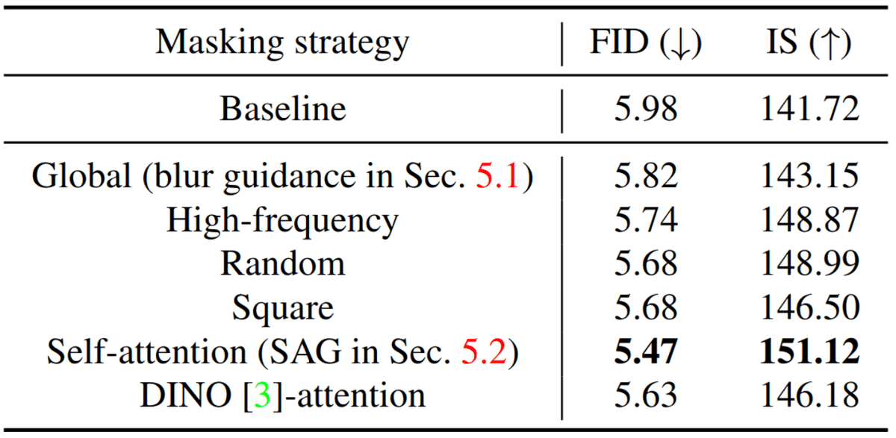 | SAG masking-strategy ablation on ImageNet 128×128 ADM (Hong et al.) | — |
| 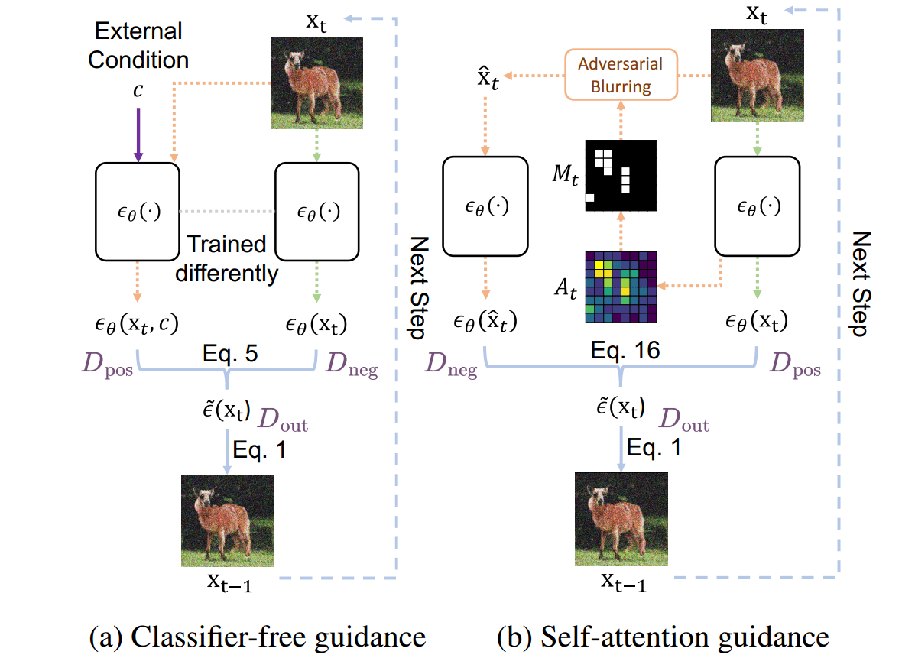 | CFG vs SAG positive/negative term diagram (Hong et al.) | — |
| 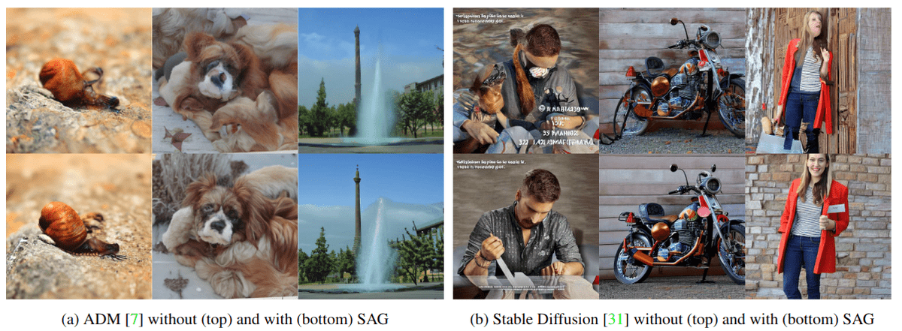 | Unguided vs SAG samples: unconditional ADM and Stable Diffusion | — |
| 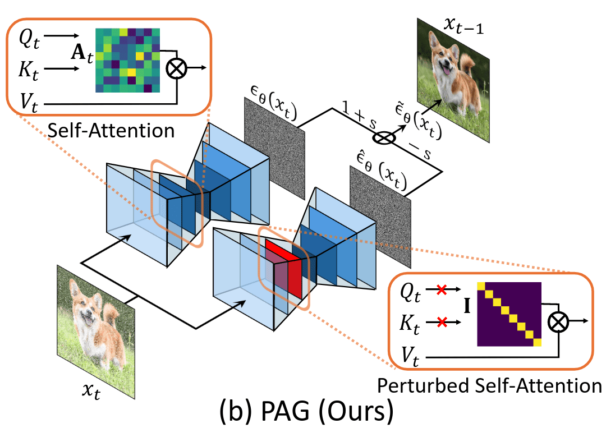 | PAG: identity-matrix self-attention perturbation schematic (Ahn et al.) | — |
| 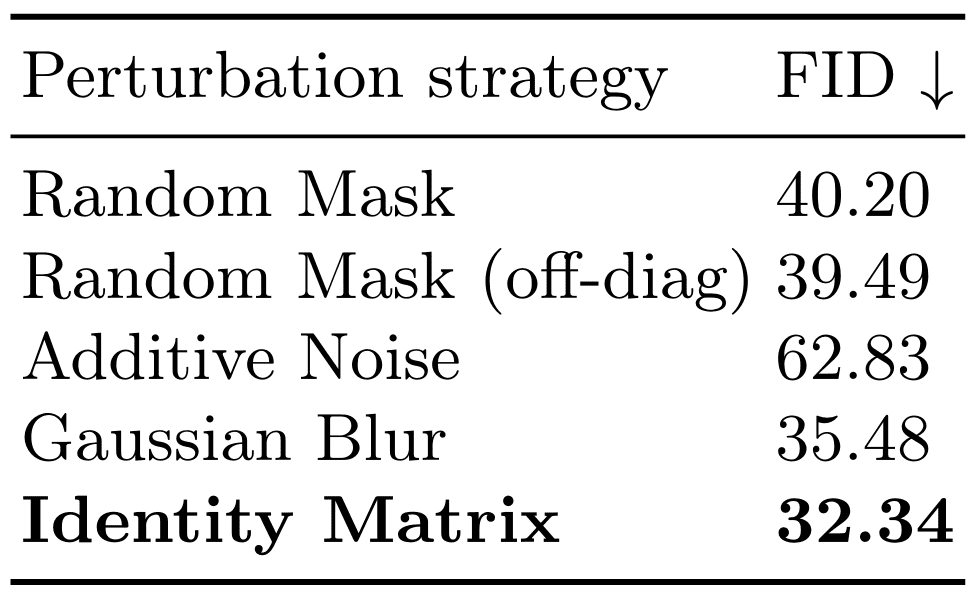 | PAG perturbation ablation on ImageNet 256×256 unconditional ADM | — |
| 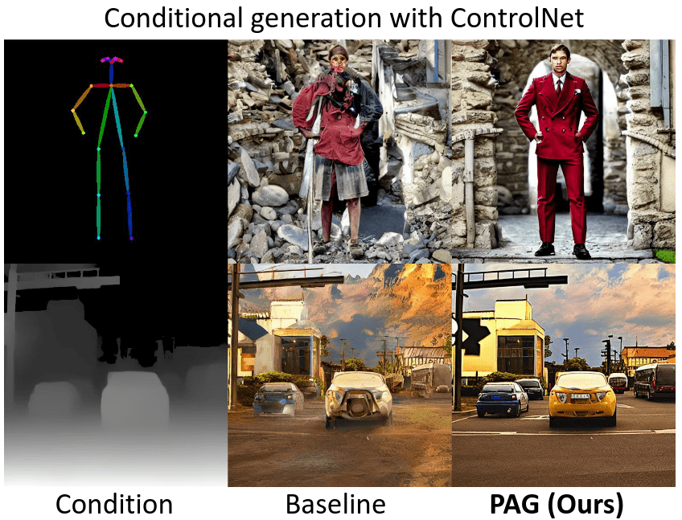 | Unguided vs PAG qualitative comparisons | — |
| 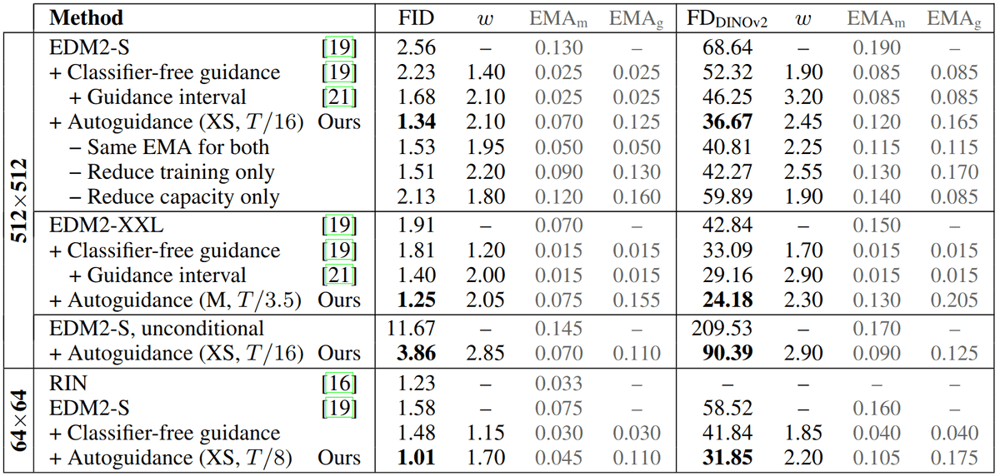 | Autoguidance ImageNet-512/64 results: capacity, training budget, EMA params (Karras et al.) | — |
| 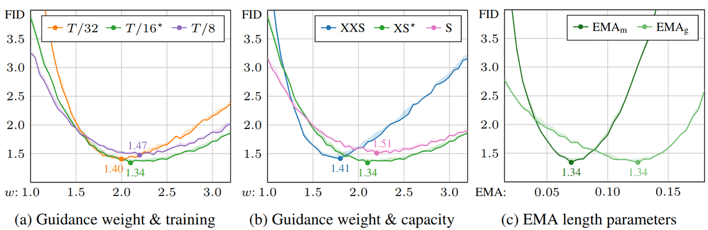 | Autoguidance sensitivity sweeps on EDM2-S ImageNet-512 | — |
| 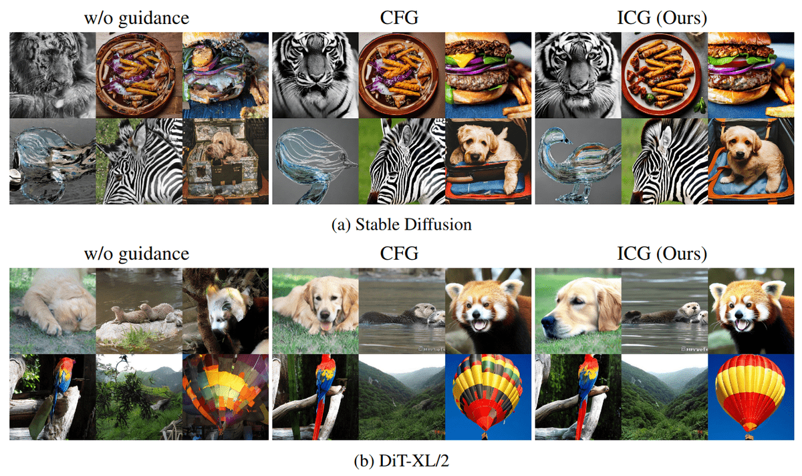 | CFG vs ICG qualitative comparison on Stable Diffusion and DiT-XL | — |
| 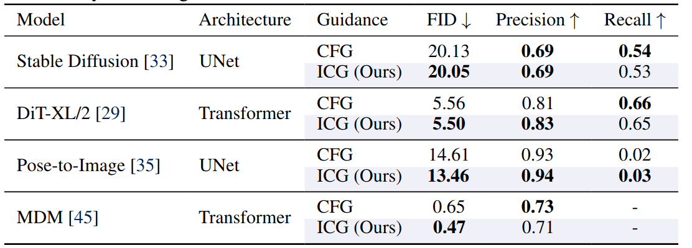 | CFG vs ICG quantitative metrics (Sadat et al.) | — |
| 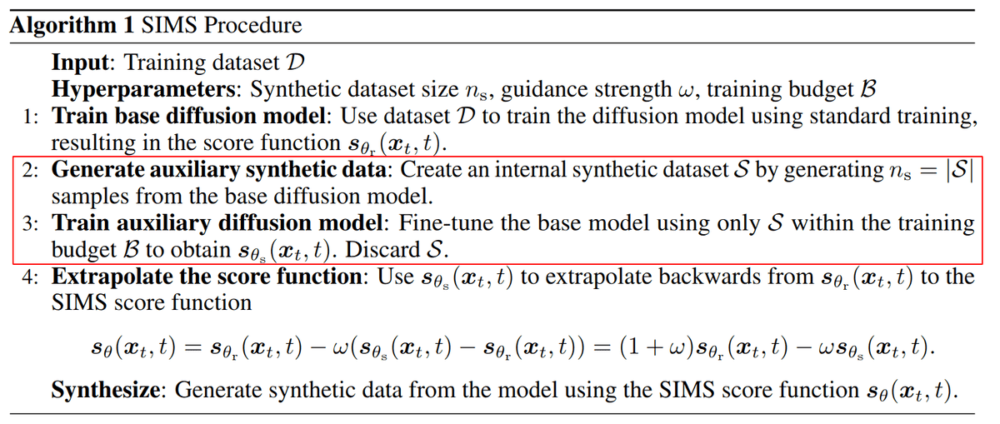 | SIMS algorithm: self-improving diffusion with synthetic retraining (Alemohammad et al.) | — |
| 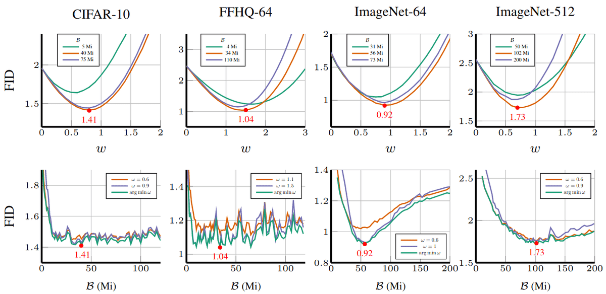 | SIMS FID vs guidance scale and retraining budget | — |
| 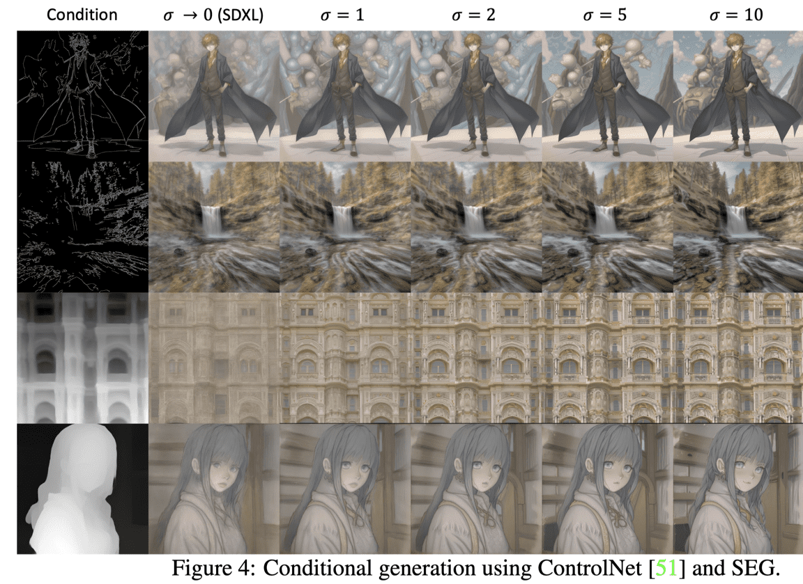 | SEG / conditional generation control illustration (Hong 2024) | — |

Attention-targeted Gaussian blur outperforms random pixel resets as a negative-model surrogate.

Weaker/smaller checkpoint of the same conditional model can serve as the CFG negative term.

## Entities

- [[AI Summer]] — published this CFG part-2 survey (2024).
- [[Nikolas Adaloglou]] — co-author.
- [[Tim Kaiser]] — co-author.
- [[Classifier-Free Guidance]] — vanilla method being generalized.
- [[Autoguidance]] — Karras et al. "bad version of itself" approach.
- [[Perturbed Attention Guidance]] — identity-matrix self-attention perturbation (PAG).
- [[Self-Attention]] — SAG and PAG manipulate self-attention maps.
- [[An Overview of Classifier-Free Guidance for Diffusion Models]] — part 1 prerequisite.
- [[How Diffusion Models Work: The Math from Scratch]] — DDPM foundations.

## Questions & Gaps

- Layer/head selection for SAG, PAG, and SEG remains manual and architecture-specific.
- Autoguidance SOTA results require training infrastructure most practitioners lack.
- ICG random-condition negative may fail on fine-grained prompts not covered in paper.
- SIMS retraining cost vs quality gain not compared head-to-head with autoguidance.
- Part 2 citation block duplicates part 1 URL (likely copy-paste error in source).

## Related

- [[An Overview of Classifier-Free Guidance for Diffusion Models]] — part 1: classifier guidance, CFG derivation, thresholding, noise schedules.
- [[Classifier-Free Guidance]] — concept page for vanilla CFG math.
- [[Autoguidance]] — impaired-checkpoint negative model method.
- [[Perturbed Attention Guidance]] — training-free attention perturbation guidance.
- [[How Diffusion Models Work: The Math from Scratch]] — introductory guided diffusion.
- [[Computer Vision]] — generative vision topic hub.
