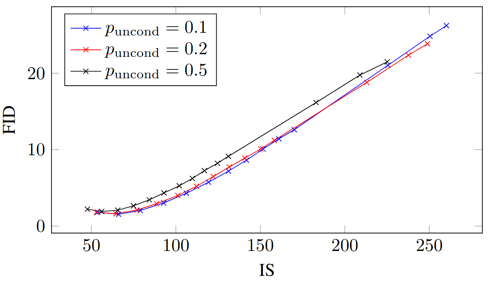
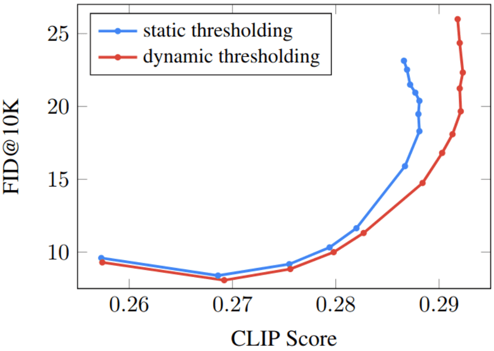
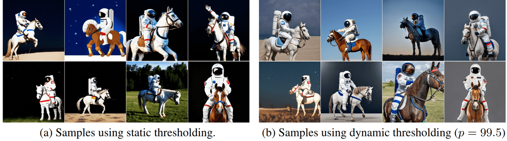
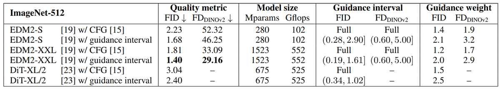
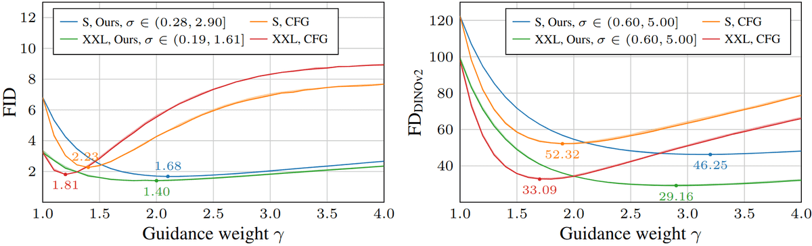
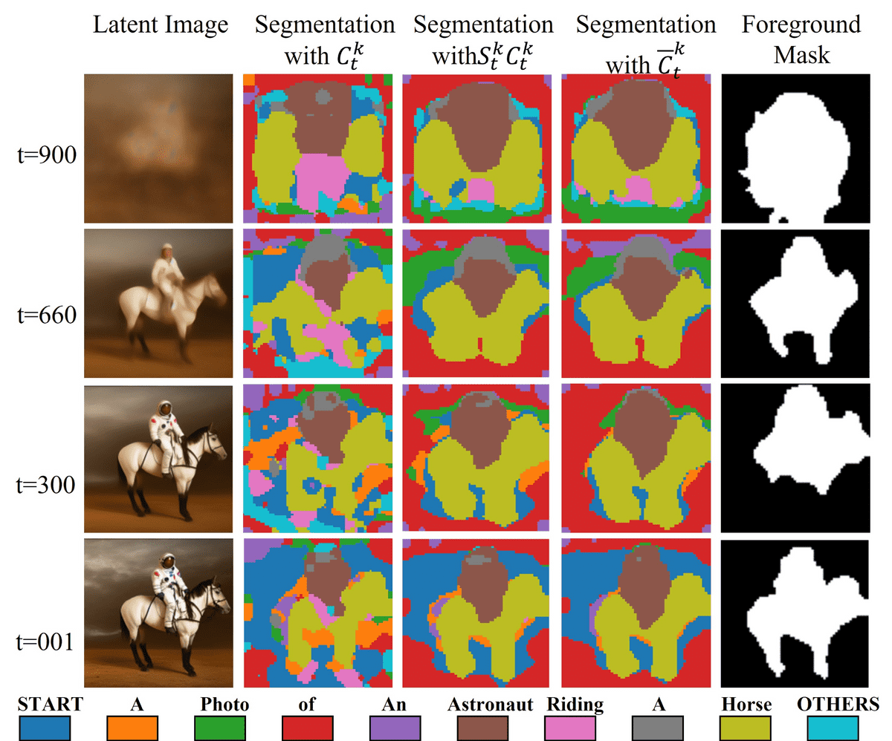
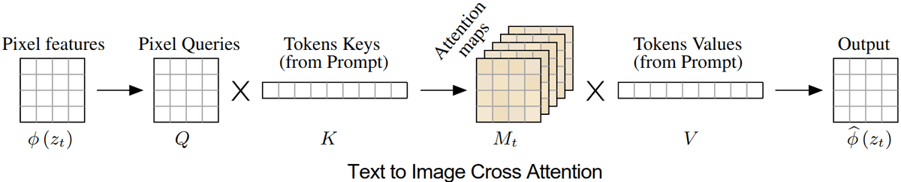
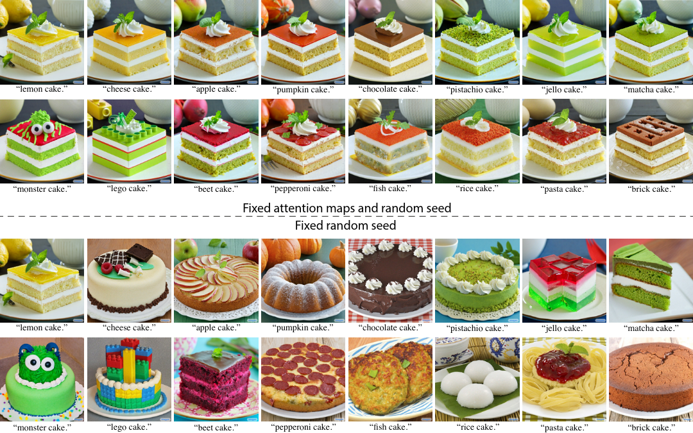
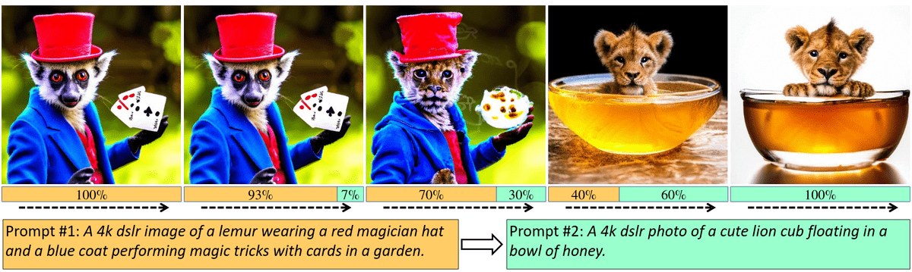
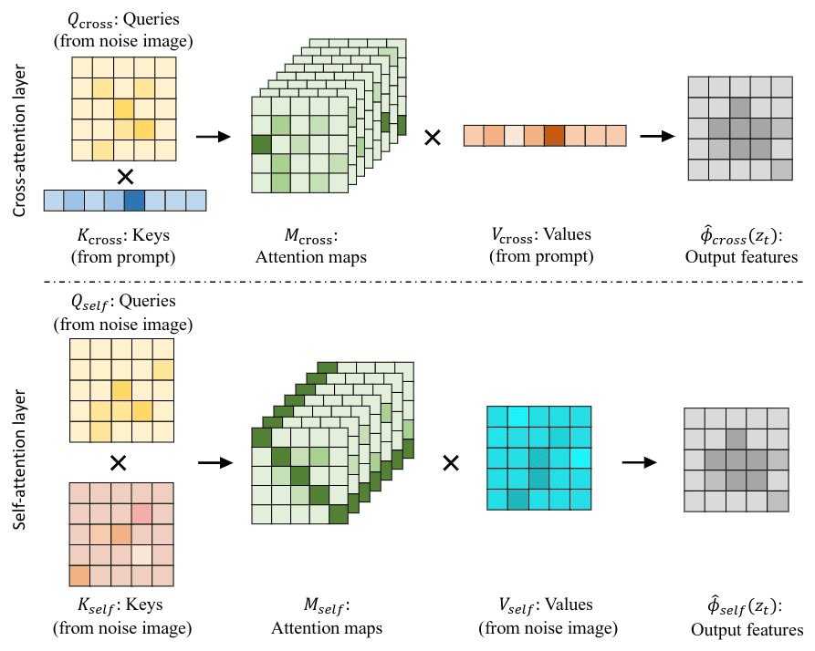

# An Overview of Classifier-Free Guidance for Diffusion Models

**Source**: `raw/classifier-free-guidance/full-article.html` (758 KB), `raw/classifier-free-guidance/full-article.md` (markdown view)  
**URL**: https://theaisummer.com/classifier-free-guidance/  
**Authors**: Nikolas Adaloglou, Tim Kaiser (AI Summer), 2024-07-22  
**Ingested**: 2026-06-06  
**Tags**: #summary

## Summary

This AI Summer survey is a deep dive into **diffusion guidance** — how to trade off sample diversity for fidelity and condition alignment, the problem GANs solve with the truncation trick but diffusion cannot (Gaussian noise must stay Gaussian). The article walks from **classifier guidance** (Dhariwal & Nichol 2021: train \(p(c \mid x_t)\) on noisy images; add weighted classifier gradients to the score) through **[[Classifier-Free Guidance]]** (Ho & Salimans 2022: derive the implicit classifier from conditional minus unconditional scores; train one model with 10–20% conditioning dropout).

The CFG update extrapolates beyond the conditional score: \(\nabla_{x_t} \log p'(x_t \mid c) = \nabla_{x_t} \log p(x_t) + w(\nabla_{x_t} \log p(x_t \mid c) - \nabla_{x_t} \log p(x_t))\). Weights \(w > 1\) sharpen toward easy-to-classify modes at the cost of diversity — oversaturation, OOD samples, and simplistic backgrounds are known failure modes. The equivalent \(\gamma = w - 1\) formulation makes the extrapolation interpretation explicit.

The second half covers **sampling-time fixes and schedule variants**: Imagen's **static vs dynamic thresholding** (clip/rescale denoised \(\hat{x}_0\) to prevent saturation at high \(w\)); **CADS** (condition-annealed sampling — corrupt the condition with noise that decays over \(\sigma\)); **limited-interval CFG** (apply guidance only in intermediate noise levels — Kynkäänniemi et al. 2024); monotonically increasing \(w(\sigma)\) schedules for text-to-image (Wang et al.); and **spatially varying guidance** from attention-derived segmentation maps (Shen et al. 2024). An appendix clarifies how **cross-attention** (text→region binding, text-to-image only) and **self-attention** (structure/geometry) differ inside U-Net denoisers — relevant to the part-2 follow-up on impaired-model guidance.

Pairs with [[How Diffusion Models Work: The Math from Scratch]] for DDPM foundations and [[An Overview of Classifier-Free Diffusion Guidance: Impaired Model Guidance with a Bad Version of Itself (Part 2)]] for CFG without conditioning dropout.

## Key Claims

- GAN truncation trick fails for diffusion because sampling noise must remain Gaussian.
- Classifier guidance: \(\nabla_{x_t} \log p'(x_t \mid c) = w \nabla_{x_t} \log p(c \mid x_t) + \nabla_{x_t} \log p(x_t)\); requires training a noise-robust classifier in parallel.
- High-noise timesteps yield weak/adversarial classifier gradients (Dieleman 2023 geometry illustration).
- CFG solves for implicit classifier: \(\nabla_{x_t} \log p(c \mid x_t) = \nabla_{x_t} \log p(x_t \mid c) - \nabla_{x_t} \log p(x_t)\).
- Conditioning dropout \(p_{\text{uncond}} \in [10\%, 20\%]\) trains conditional and unconditional scores in one network.
- \(w=0\) → unconditional; \(w=1\) → conditional; \(0 < w < 1\) → interpolation; \(w > 1\) → extrapolation (typical use).
- CFG paper initially rejected at ICLR 2022 ("Unconditional Diffusion Guidance") for requiring labels and doubling inference cost.
- CFG limitations: intensity oversaturation, OOD at large \(w\), limited diversity / easy backgrounds.
- Alternative notation: \(\gamma = w - 1\); \(\nabla \log p' = \nabla \log p(x_t \mid c) + \gamma(\nabla \log p(x_t \mid c) - \nabla \log p(x_t))\).
- Imagen dynamic thresholding: clip \(\hat{x}_0\) to \([-s, s]\) at 99.5th percentile, rescale to \([-1,1]\) — enables high \(w\) without saturation.
- Dynamic CFG: piecewise-linear \(w(\sigma)\) from unconditional at high \(\sigma\) to conditional at low \(\sigma\).
- CADS corrupts condition \(c\) with Gaussian noise annealed over \(\sigma\); works without training-time condition noise.
- Limited-interval CFG: set \(\gamma(\sigma) = 0\) outside \((\sigma_{\text{low}}, \sigma_{\text{high}}]\); improves FID and \(\text{FD}_{\text{DINOv2}}\) on ImageNet-512 (EDM2, DiT).
- Early high-noise CFG harms trajectories; late low-noise CFG has minimal effect on class-conditional models.
- Spatial CFG: per-pixel guidance mask \(W_t\) from refined cross/self-attention maps equalizes semantic regions.
- Cross-attention maps encode global structure; swapping K/V changes appearance while fixed K preserves layout (Hertz et al.).
- Text prompt visual impact negligible in final ~40% of denoising steps (Balaji et al. eDiff-i).
- Self-attention exists in class-conditional and unconditional U-Nets; cross-attention is text-to-image specific.

## Figures

| Figure | Caption | Page |
|--------|---------|------|
|  | IS/FID vs guidance strength for ImageNet 64×64 CFG models with varying \(p_{\text{uncond}}\) (Ho & Salimans) | — |
|  | Imagen Pareto curves: thresholding vs guidance weight sweep (Saharia et al.) | — |
|  | Static vs dynamic thresholding on "astronaut riding a horse" at \(w=5\) (Imagen appendix) | — |
|  | ImageNet-512 quantitative results: limited-interval CFG vs baseline (Kynkäänniemi et al.) | — |
|  | FID and \(\text{FD}_{\text{DINOv2}}\) vs guidance weight: full CFG vs interval CFG | — |
|  | Spatial CFG segmentation refinement: cross-attention → × self-attention → graph propagation (Shen et al.) | — |
|  | Cross-attention in U-Net: text keys/values fused with visual queries (Hertz et al.) | — |
|  | Fixed cross-attention maps (K from "lemon cake") with swapped V — identical global structure | — |
|  | Prompt switching during denoising: late steps have negligible text impact (Balaji et al.) | — |
|  | Cross- and self-attention layers in Stable Diffusion U-Net (Liu et al.) | — |

Higher guidance weight improves inception score but trades off FID — the core diversity–fidelity tension CFG controls.

Applying CFG only in an intermediate noise interval can beat full-interval guidance on both FID and \(\text{FD}_{\text{DINOv2}}\).

## Entities

- [[AI Summer]] — published this two-part CFG survey (2024).
- [[Nikolas Adaloglou]] — co-author.
- [[Tim Kaiser]] — co-author.
- [[Classifier-Free Guidance]] — primary concept; full derivation and schedule variants.
- [[Denoising Diffusion Probabilistic Models]] — foundation diffusion framework.
- [[How Diffusion Models Work: The Math from Scratch]] — prior AI Summer DDPM primer.
- [[Self-Attention]] — appendix on U-Net self-attention for structure.
- [[An Overview of Classifier-Free Diffusion Guidance: Impaired Model Guidance with a Bad Version of Itself (Part 2)]] — direct sequel on replacing the unconditional model.

## Questions & Gaps

- Class-conditional vs text-to-image guidance insights may not transfer directly (authors note this explicitly).
- Limited-interval vs monotonic \(w(\sigma)\) schedules not head-to-head human-evaluated across SOTA models.
- Spatial CFG requires hand-crafted per-token weight rules left out of the overview.
- Human evaluation missing for comparing CADS, interval CFG, and Wang et al. schedules.

## Related

- [[An Overview of Classifier-Free Diffusion Guidance: Impaired Model Guidance with a Bad Version of Itself (Part 2)]] — sequel: SAG, PAG, autoguidance, ICG.
- [[How Diffusion Models Work: The Math from Scratch]] — DDPM and introductory CFG math.
- [[What are Diffusion Models?]] — Lilian Weng master survey including CFG and thresholding.
- [[Classifier-Free Guidance]] — concept page with Imagen thresholding and worked example.
- [[Latent Diffusion Models]] — Stable Diffusion backbone referenced in attention appendix.
- [[Computer Vision]] — topic hub for generative vision content.
