# Claude Models

**Source**: 17 Anthropic blog posts in `raw/introducing-claude/`, `raw/claude-2/`, `raw/claude-2-1/`, `raw/claude-3-family/`, `raw/claude-3-haiku/`, `raw/claude-3-5-sonnet/`, `raw/3-5-models-and-computer-use/`, `raw/claude-3-7-sonnet/`, `raw/claude-4/`, `raw/claude-opus-4-1/`, `raw/claude-sonnet-4-5/`, `raw/claude-haiku-4-5/`, `raw/claude-opus-4-5/`, `raw/claude-opus-4-6/`, `raw/claude-sonnet-4-6/`, `raw/claude-opus-4-7/`, `raw/claude-opus-4-8/`, `raw/claude-sonnet-5/`; plus `raw/mythos/full-article.md`, `raw/claude-fable-5-mythos-5/full-article.md` (HTML canonical; markdown sibling per slug)  
**Ingested**: 2026-06-06 (Claude 1–4.8 batch); 2026-06-09 (Fable 5 / Mythos 5); 2026-07-12 (Claude Sonnet 5)  
**Tags**: #summary

## Summary

Anthropic's **Claude** model family spans from the March 2023 launch of Claude and Claude Instant through the June 2026 **Claude Fable 5** / **Claude Mythos 5** Mythos-class release (and the May 2026 **Claude Opus 4.8** release before it). The lineage moves from helpful/harmless chat assistants (Claude 1–2) to a three-tier Opus/Sonnet/Haiku family with vision (Claude 3), agentic coding and **computer use** (Claude 3.5–3.7), unified **extended thinking** (Claude 3.7 onward), and a Claude 4 generation built for long-horizon agents, **Claude Code**, and enterprise knowledge work. By 2026, Opus-class models lead on SWE-bench Verified and Terminal-Bench while Sonnet and Haiku compress frontier capability into lower-cost tiers—with Sonnet 4.6 approaching prior Opus performance at $3/$15 per million tokens.

Across releases, Anthropic emphasizes **Constitutional AI** and its **Responsible Scaling Policy** (ASL-2/ASL-3), red-teaming, and alignment evaluations alongside capability gains. Product surfaces expanded from API + claude.ai to Artifacts, Claude Code, Claude Agent SDK, Cowork, Chrome/Excel/PowerPoint integrations, and effort-controlled reasoning on the developer platform.

## Timeline

| Release | Date | Key models | Highlights |
|---------|------|------------|------------|
| Introducing Claude | Mar 2023 | Claude, Claude Instant | First public API/chat; HHH training; Notion, Quora, DuckDuckGo partners |
| Claude 2 | Jul 2023 | Claude 2 | 100K context; 71.2% HumanEval; claude.ai beta (US/UK) |
| Claude 2.1 | Nov 2023 | Claude 2.1 | 200K context; 2× lower hallucination; API tool use (beta); system prompts |
| Claude 3 Family | Mar 2024 | Opus, Sonnet, Haiku | Vision; 200K context; near-perfect NIAH; ASL-2 |
| Claude 3 Haiku | Mar 2024 | Claude 3 Haiku | 21K tok/s; enterprise speed tier |
| Claude 3.5 Sonnet | Jun 2024 | Claude 3.5 Sonnet | Beats Opus on many evals at Sonnet price; Artifacts; 200K context |
| Computer Use + 3.5 | Oct 2024 | 3.5 Sonnet (new), 3.5 Haiku | **Computer use** public beta; SWE-bench 49.0%; OSWorld 22.0% |
| Claude 3.7 Sonnet | Feb 2025 | Claude 3.7 Sonnet | First hybrid **extended thinking** model; **Claude Code** preview |
| Claude 4 | May 2025 | Opus 4, Sonnet 4 | SWE-bench 72.5%/72.7%; thinking + tool use; Claude Code GA |
| Claude Opus 4.1 | Aug 2025 | Opus 4.1 | 74.5% SWE-bench; precision coding upgrade |
| Claude Sonnet 4.5 | Sep 2025 | Sonnet 4.5 | 77.2% SWE-bench; 61.4% OSWorld; Claude Agent SDK; ASL-3 |
| Claude Haiku 4.5 | Oct 2025 | Haiku 4.5 | 73.3% SWE-bench at 1/3 Sonnet 4.5 cost; ASL-2 |
| Claude Opus 4.5 | Nov 2025 | Opus 4.5 | SOTA coding/agents; **effort** parameter; $5/$25 pricing |
| Claude Opus 4.6 | Feb 2026 | Opus 4.6 | 1M context (beta); adaptive thinking; agent teams |
| Claude Sonnet 4.6 | Feb 2026 | Sonnet 4.6 | 1M context; default free/Pro model; OSWorld gains |
| Claude Opus 4.7 | Apr 2026 | Opus 4.7 | High-res vision; `xhigh` effort; cyber safeguards |
| Claude Opus 4.8 | May 2026 | Opus 4.8 | Dynamic workflows; effort control in apps; fast mode 3× cheaper |
| Claude Fable 5 / Mythos 5 | Jun 2026 | Fable 5 (GA), Mythos 5 (trusted access) | Mythos-class capability; Fable safeguards route cyber/bio to Opus 4.8; Glasswing cyber upgrade; $10/$50 pricing |
| Claude Sonnet 5 | Jun 2026 | Sonnet 5 | Most agentic Sonnet yet; near Opus 4.8 on BrowseComp/OSWorld at lower cost; default Free/Pro; $2/$10 intro then $3/$15; cyber safeguards + Cyber Verification Program |

## Claude 1 Era (2023)

### Introducing Claude (Mar 2023)

**Source**: `raw/introducing-claude/full-article.md`

Anthropic launched **Claude** and **Claude Instant** after a closed alpha with Notion, Quora, and DuckDuckGo. Claude is positioned as a next-generation assistant trained to be helpful, honest, and harmless ([[Constitutional AI]]), available via chat and API. Two tiers ship day one: full **Claude** for state-of-the-art performance and **Claude Instant** for lower cost and latency. Early partners highlight conversational quality, steerability, legal document understanding (Robin AI), and search-grounded answers (DuckAssist).

### Claude 2 (Jul 2023)

**Source**: `raw/claude-2/full-article.md`

**Claude 2** improves coding, math, and reasoning over Claude 1.3: **76.5%** on the Bar exam MC section (vs 73.0%), **71.2%** HumanEval (vs 56.0%), **88.0%** GSM8K. Context expands to **100K tokens** input; outputs can span thousands of tokens. Safety red-teaming shows **2×** better harmless responses vs Claude 1.3. Public beta chat launches at claude.ai (US/UK); API pricing unchanged from Claude 1.3. Partners Jasper and Sourcegraph emphasize long-context remixing and codebase-aware coding (Cody).

### Claude 2.1 (Nov 2023)

**Source**: `raw/claude-2-1/full-article.md`

**Claude 2.1** doubles context to **200K tokens** (~150K words) and introduces **API tool use** (beta), **system prompts**, and Workbench for prompt iteration. Hallucination rates drop **2×** vs Claude 2.0 on complex factual probes; long-document comprehension improves **30%** on incorrect answers. 200K context reserved for Claude Pro subscribers at launch.

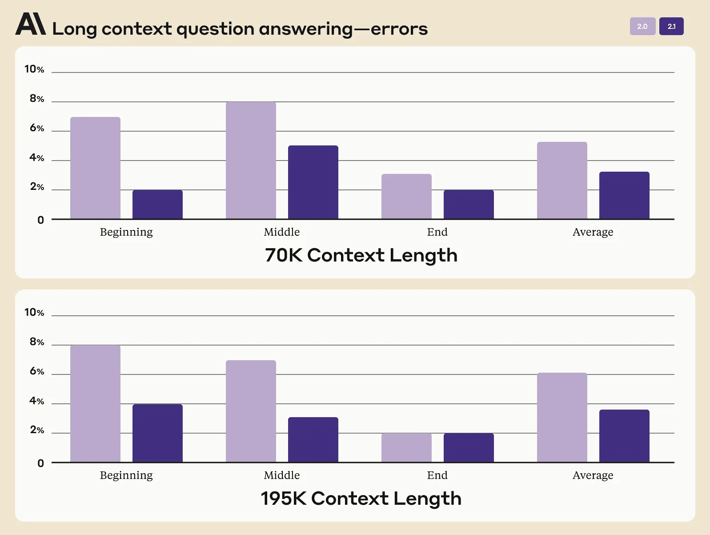

## Claude 3 Era (2024)

### Claude 3 Family (Mar 2024)

**Source**: `raw/claude-3-family/full-article.md`

Anthropic announces **Claude 3 Opus, Sonnet, and Haiku**—a three-tier family setting benchmarks on MMLU, GPQA, GSM8K, and multimodal tasks. **Opus** leads frontier general intelligence; **Sonnet** is 2× faster than Claude 2/2.1 with higher intelligence; **Haiku** targets near-instant enterprise workloads. All three add **vision** (photos, charts, PDFs), **200K context** (1M for select customers), fewer unnecessary refusals, and improved honesty (2× accuracy vs Claude 2.1 on open-ended factual QA). Opus achieves **>99%** on Needle-in-a-Haystack recall. Models ship at **ASL-2** under the [[Responsible Scaling Policy]].

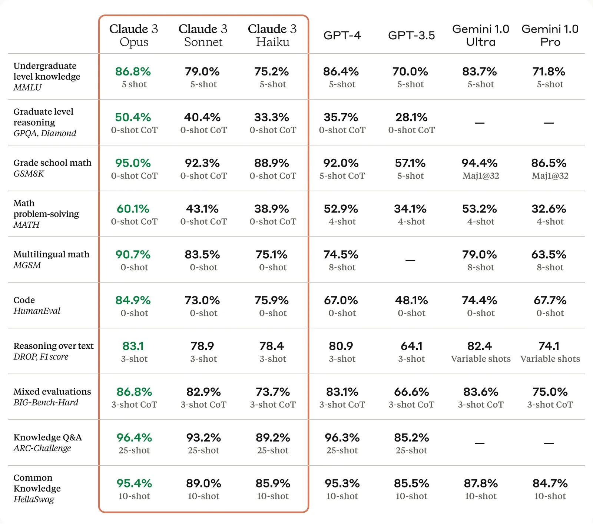

### Claude 3 Haiku (Mar 2024)

**Source**: `raw/claude-3-haiku/full-article.md`

**Claude 3 Haiku** emphasizes speed and cost: **~21K tokens/s** for prompts under 32K, state-of-the-art vision in its class, and pricing designed for long-input enterprise workloads (1:5 input:output ratio). Available on API, Claude Pro, and Amazon Bedrock.

### Claude 3.5 Sonnet (Jun 2024)

**Source**: `raw/claude-3-5-sonnet/full-article.md`

**Claude 3.5 Sonnet** outperforms Claude 3 Opus on GPQA, MMLU, and HumanEval while running at **2× Opus speed** for **$3/$15** per million tokens (200K context). Vision gains on chart/graph reasoning and OCR from imperfect images. **Artifacts** on claude.ai let users edit code and documents in a side panel. Internal agentic coding eval: **64%** problem solve rate vs 38% for Opus. Rated **ASL-2**; UK AISI pre-deployment evaluation.

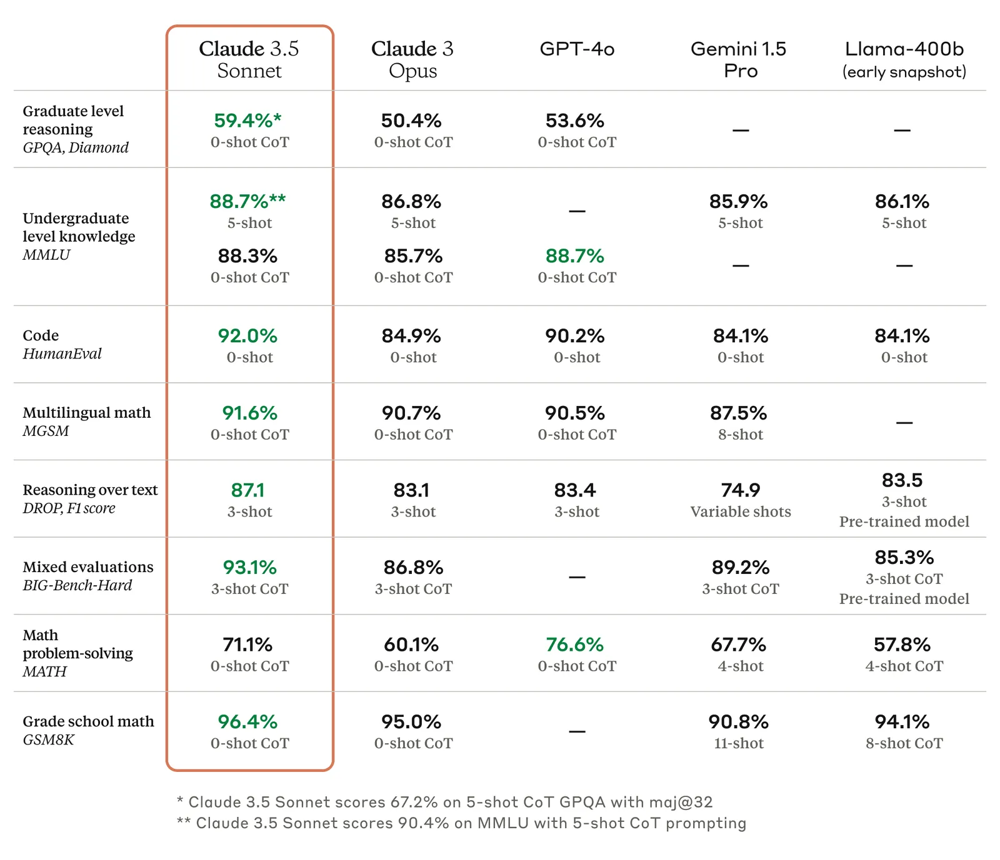

### Claude 3.5 Models & Computer Use (Oct 2024)

**Source**: `raw/3-5-models-and-computer-use/full-article.md`

Anthropic releases an upgraded **Claude 3.5 Sonnet** and **Claude 3.5 Haiku**, plus public-beta **computer use**: Claude views screens, moves cursors, clicks, and types like a human. Upgraded Sonnet hits **49.0%** SWE-bench Verified (from 33.4%) and leads TAU-bench retail/airline domains. **Claude 3.5 Haiku** matches Claude 3 Opus on many benchmarks at Haiku speed; **40.6%** SWE-bench Verified. OSWorld computer-use: **14.9%** (screenshot-only) / **22.0%** with more steps—first frontier model with general computer use in public beta.

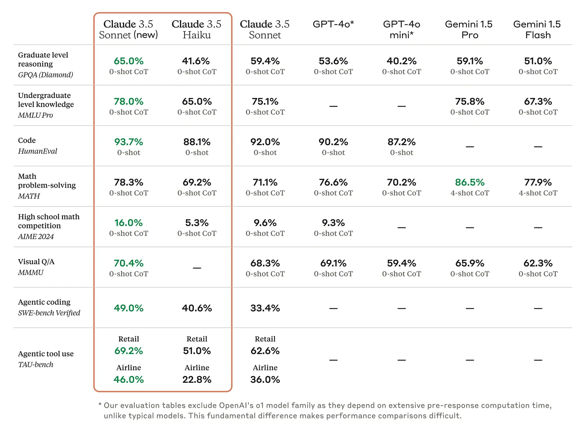

## Claude 3.7 & Claude 4 Era (2025)

### Claude 3.7 Sonnet (Feb 2025)

**Source**: `raw/claude-3-7-sonnet/full-article.md`

**Claude 3.7 Sonnet** is Anthropic's first **hybrid reasoning** model: standard fast mode plus **extended thinking** with visible step-by-step reasoning and API control over thinking token budget (up to 128K). Philosophy: one model for both quick and deep answers, optimized for real-world business tasks over competition math. State-of-the-art on **SWE-bench Verified** and **TAU-bench**. Introduces **Claude Code** (research preview)—terminal agent that reads/edits code, runs tests, and pushes to GitHub. GitHub integration on all Claude plans. Unnecessary refusals down **45%**.

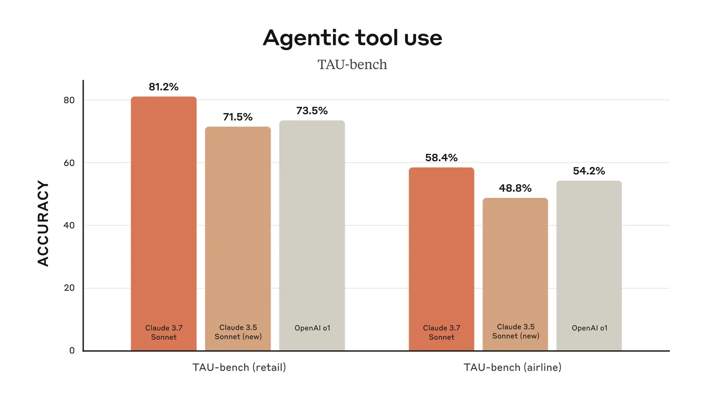

### Claude 4: Opus 4 & Sonnet 4 (May 2025)

**Source**: `raw/claude-4/full-article.md`

**Claude Opus 4** and **Claude Sonnet 4** are hybrid reasoning models with extended thinking, parallel tool use, and file-based **memory**. Opus 4 leads **SWE-bench Verified (72.5%)** and **Terminal-bench (43.2%)**; can run multi-hour agent workflows (Rakuten: 7-hour refactor). Sonnet 4 hits **72.7%** SWE-bench as a practical upgrade from 3.7. **Claude Code** reaches general availability with VS Code/JetBrains extensions and GitHub Actions. New API tools: code execution, MCP connector, Files API, 1-hour prompt caching. Pricing: Opus 4 **$15/$75**, Sonnet 4 **$3/$15** per million tokens.

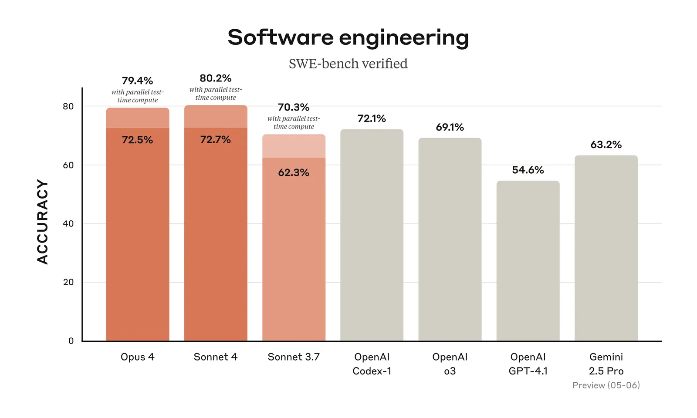

### Claude Opus 4.1 (Aug 2025)

**Source**: `raw/claude-opus-4-1/full-article.md`

**Claude Opus 4.1** incrementally improves agentic coding and research: **74.5%** SWE-bench Verified, better multi-file refactoring and detail tracking. Same pricing as Opus 4. API ID: `claude-opus-4-1-20250805`.

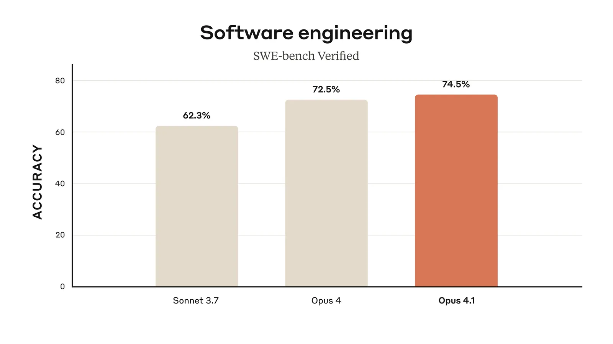

### Claude Sonnet 4.5 (Sep 2025)

**Source**: `raw/claude-sonnet-4-5/full-article.md`

**Claude Sonnet 4.5** targets SOTA coding (**77.2%** SWE-bench Verified), agents, and **computer use (61.4% OSWorld)**—maintaining focus for **30+ hours** on complex tasks. Ships **Claude Agent SDK** (infrastructure behind Claude Code), checkpoints in Claude Code, code execution and file creation in apps. Anthropic's most aligned frontier model to date; released under **ASL-3** with CBRN classifiers. Pricing unchanged at **$3/$15**.

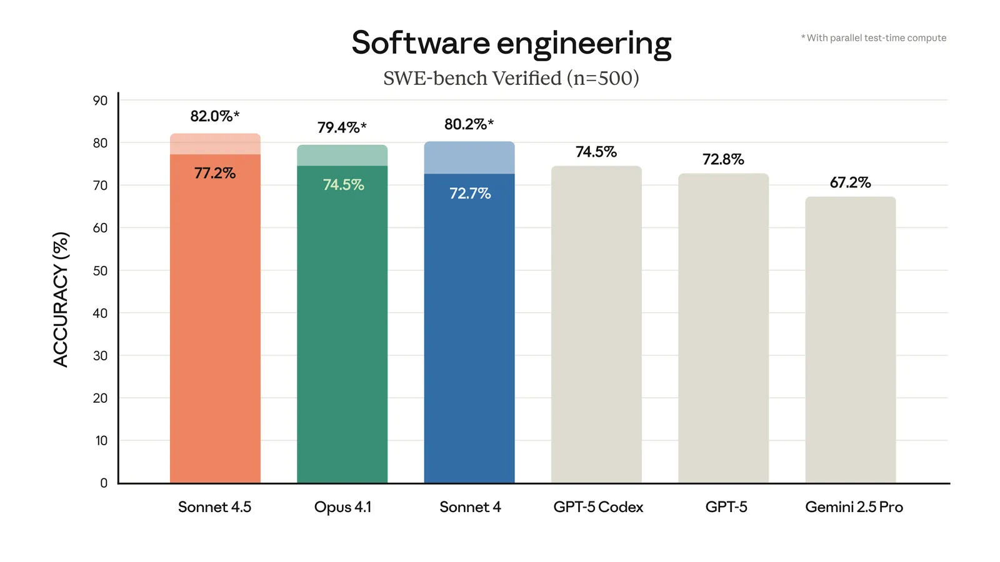

### Claude Haiku 4.5 (Oct 2025)

**Source**: `raw/claude-haiku-4-5/full-article.md`

**Claude Haiku 4.5** delivers near-frontier coding (**73.3%** SWE-bench Verified) at **$1/$5** per million tokens—~⅓ Sonnet 4.5 cost and >2× speed. Surpasses Sonnet 4 on some computer-use tasks. Rated **ASL-2**; lowest misaligned-behavior rate in Anthropic's automated audit at launch.

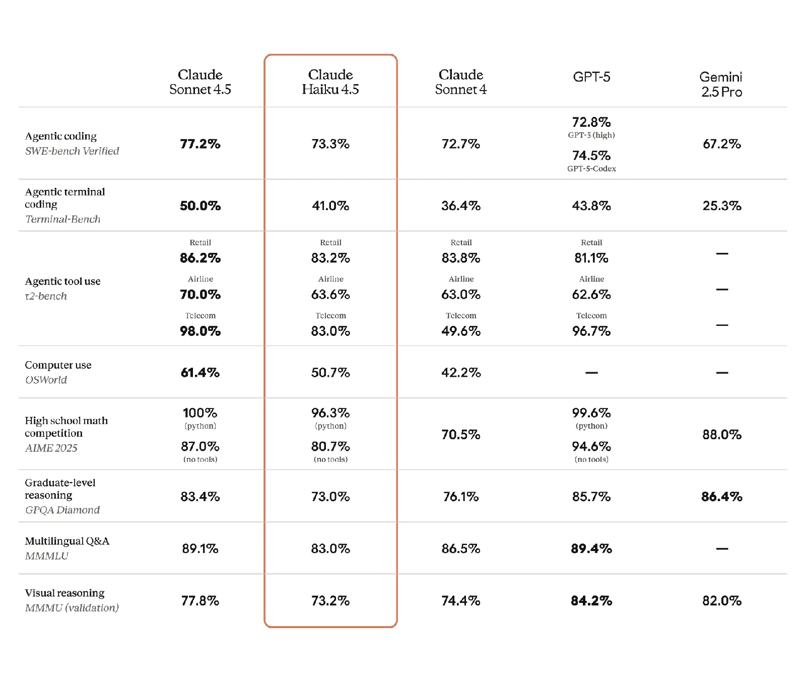

### Claude Opus 4.5 (Nov 2025)

**Source**: `raw/claude-opus-4-5/full-article.md`

**Claude Opus 4.5** is SOTA for coding, agents, and computer use at **$5/$25** per million tokens (down from Opus 4's $15/$75). Introduces **effort** parameter on API—trade latency/cost vs capability (medium effort matches Sonnet 4.5 SWE-bench with 76% fewer output tokens). Outperforms all human candidates on Anthropic's internal performance-engineering take-home within 2 hours. Strongest prompt-injection robustness among frontier models tested. Product updates: Claude Code Plan Mode, desktop parallel sessions, conversation auto-summarization, Claude for Chrome (Max), Claude for Excel beta expansion.

## Claude 4.6+ Era (2026)

### Claude Opus 4.6 (Feb 2026)

**Source**: `raw/claude-opus-4-6/full-article.md`

**Claude Opus 4.6** adds **1M token context** (beta, premium above 200K), **adaptive thinking**, four **effort** levels, **context compaction**, and **agent teams** in Claude Code. Leads **Terminal-Bench 2.0**, **Humanity's Last Exam**, **GDPval-AA** (knowledge work), and **BrowseComp**. Long-context retrieval: **76%** on 8-needle 1M MRCR v2 vs 18.5% for Sonnet 4.5. Claude in Excel/PowerPoint upgrades for enterprise workflows. Pricing **$5/$25** unchanged.

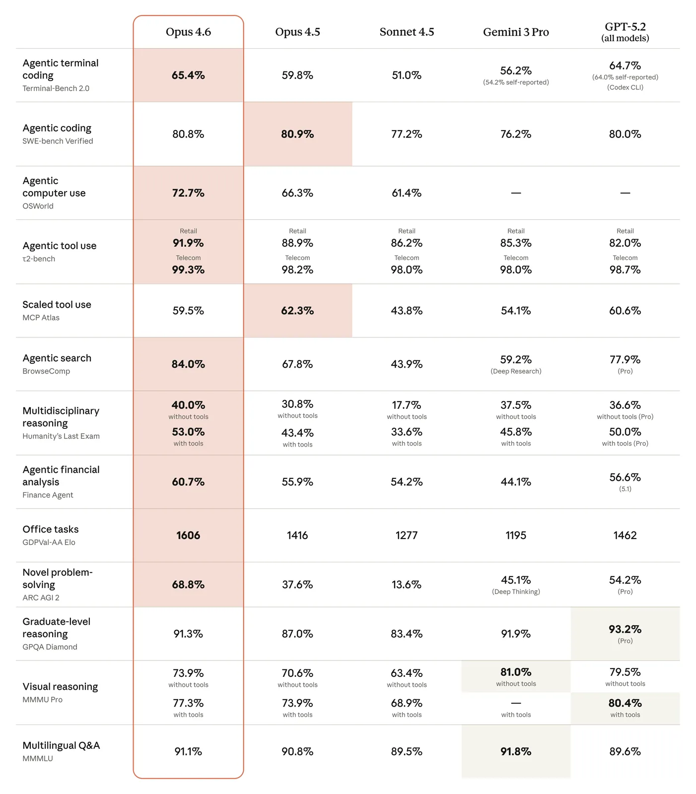

### Claude Sonnet 4.6 (Feb 2026)

**Source**: `raw/claude-sonnet-4-6/full-article.md`

**Claude Sonnet 4.6** becomes the default model on Free/Pro plans and Cowork at **$3/$15**. Full upgrade across coding, computer use, long-context reasoning, agent planning, and design—with **1M context** (beta). Early testers prefer Sonnet 4.6 over Sonnet 4.5 **~70%** of the time and over Opus 4.5 **~59%**. Major OSWorld gains since Oct 2024 computer-use launch. API: adaptive/extended thinking, context compaction, programmatic tool calling GA.

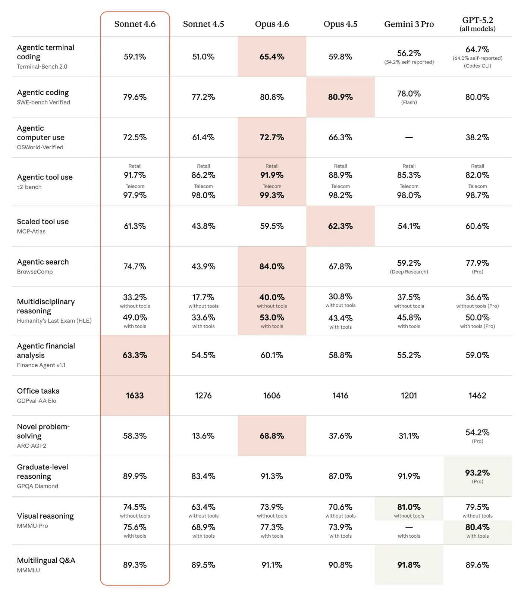

### Claude Opus 4.7 (Apr 2026)

**Source**: `raw/claude-opus-4-7/full-article.md`

**Claude Opus 4.7** improves hardest coding tasks, high-resolution vision (up to **2576px** long edge), instruction following, and self-verification. New **`xhigh`** effort level between `high` and `max`; Claude Code default effort raised to `xhigh`. Cyber safeguards auto-block high-risk requests; **Cyber Verification Program** for legitimate security research. Tokenizer update may increase token count 1.0–1.35× vs Opus 4.6. Pricing **$5/$25** unchanged. API: `claude-opus-4-7`.

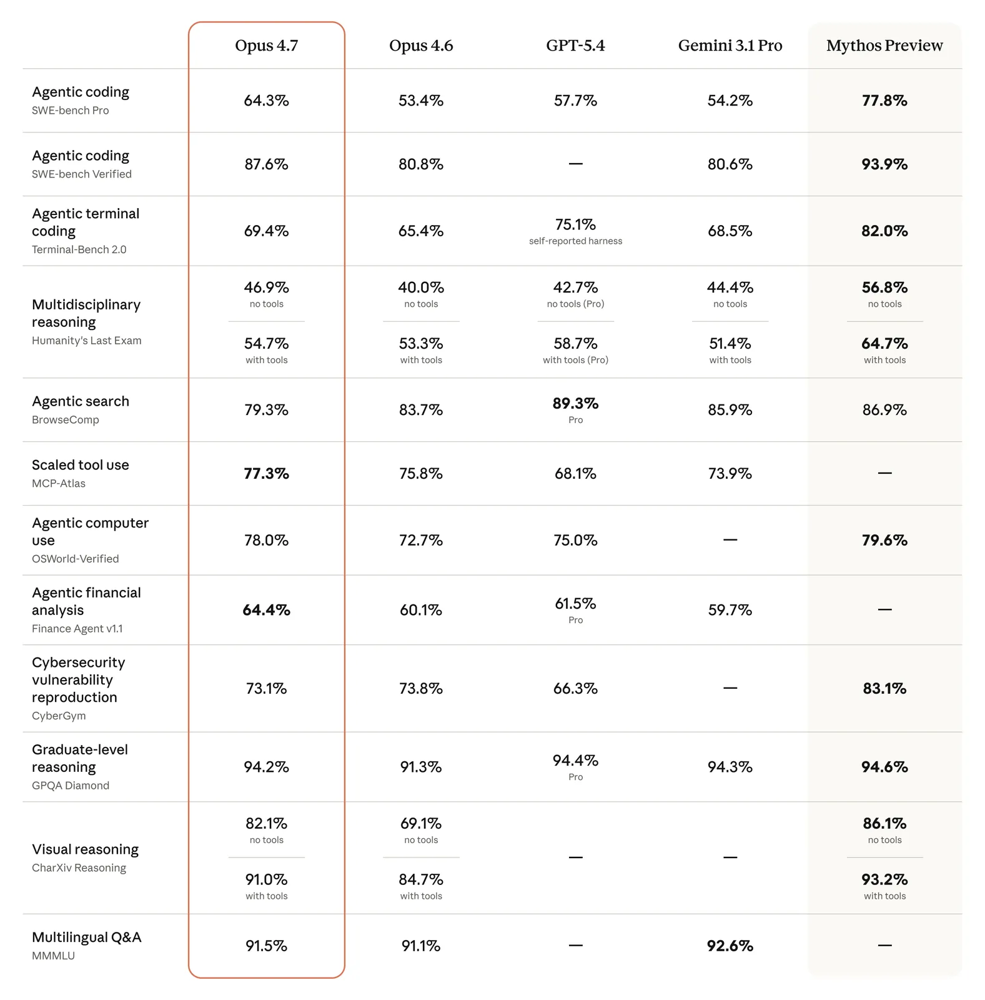

### Claude Opus 4.8 (May 2026)

**Source**: `raw/claude-opus-4-8/full-article.md`

**Claude Opus 4.8** refines Opus 4.7 with better judgment, honesty (4× less likely to pass flawed code unremarked), and token-efficient tool use. **Dynamic workflows** in Claude Code run hundreds of parallel subagents for codebase-scale migrations. **Effort control** comes to claude.ai and Cowork; **fast mode** at 2.5× speed is 3× cheaper than prior fast modes. Messages API accepts system entries mid-conversation without breaking prompt cache. Pricing **$5/$25** regular; fast mode **$10/$50**. API: `claude-opus-4-8`.

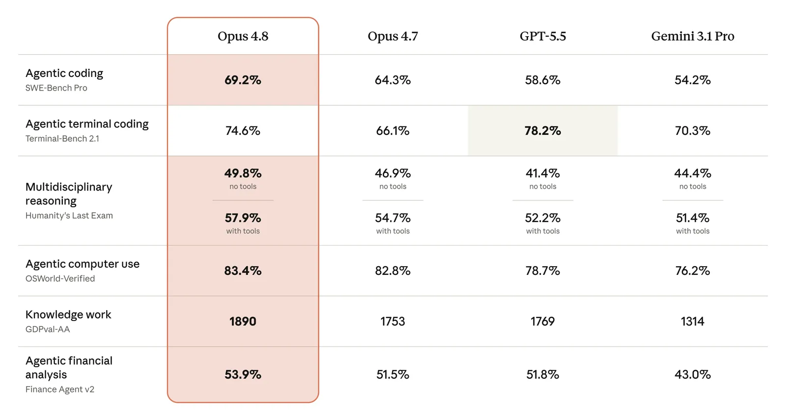

## Claude 5 / Mythos Era (2026)

### Claude Fable 5 and Claude Mythos 5 (Jun 2026)

**Source**: `raw/claude-fable-5-mythos-5/full-article.md`, `raw/mythos/full-article.md`

Anthropic's June 2026 joint launch introduces **Claude Fable 5** for general availability and **Claude Mythos 5** for vetted cyberdefense and life-sciences partners. Both share the same underlying **Mythos-class** weights—the most capable models Anthropic has released broadly—but differ in deployment safeguards.

**Claude Fable 5** exceeds prior generally available Claude models on tested benchmarks across software engineering, knowledge work, vision, scientific research, and long-horizon autonomy. Releasing this capability required new **[[Claude Fable Safeguards]]**: queries in cybersecurity and biology domains are automatically routed to **Claude Opus 4.8** rather than exposing full Mythos-level dual-use performance. Safeguards are conservatively tuned (<5% average session trigger rate, with acknowledged false positives on benign requests).

**Claude Mythos 5** lifts those safeguards for trusted-access programs—initially through **[[Project Glasswing]]** as an upgrade to Claude Mythos Preview. Anthropic describes it as the strongest cybersecurity model available and plans broader trusted-access expansion for biology research. Mythos 5 requires **30-day data retention** for safety monitoring.

Pricing for both tiers: **$10/M input**, **$50/M output**—less than half Mythos Preview pricing.

**Software engineering.** Early Stripe testing: Fable 5 compressed months of work into days—a codebase-wide migration across a 50M-line Ruby monorepo in one day vs an estimated two months by hand. On Cognition's **FrontierCode** eval (production-quality code standards), Fable 5 leads frontier models even at medium effort and is more token-efficient than prior Claude models. Cursor reports Fable 5 SOTA on CursorBench, opening long-horizon problem classes previously out of reach.

**Knowledge work & vision.** SOTA on Hebbia Finance Benchmark senior-level reasoning; strong spreadsheet and analytical task performance. Vision: extracts precise numbers from scientific figures; rebuilds web apps from screenshots; completed Pokémon FireRed with a **vision-only** minimal harness (prior Claude models needed complex helper harnesses).

**Memory & long context.** Maintains focus across millions of tokens; persistent file-based memory improved Slay the Spire performance 3× more than Opus 4.8; reached final act 3× more often.

**Life sciences (Mythos 5).** Internal protein-design workflows accelerated ~10×; Mythos 5 with tools matches or beats skilled human operators on 9/14 protein targets. First model to consistently produce novel, compelling molecular-biology hypotheses (~80% scientist preference vs Opus-class in blinded comparisons). Autonomous genomics research over a week outperformed a recent _Science_ model at 100× smaller scale.

**Alignment.** Automated alignment assessment found Mythos 5 misaligned-behavior levels low and similar to Opus 4.8 (Fable 5 shares the same base).

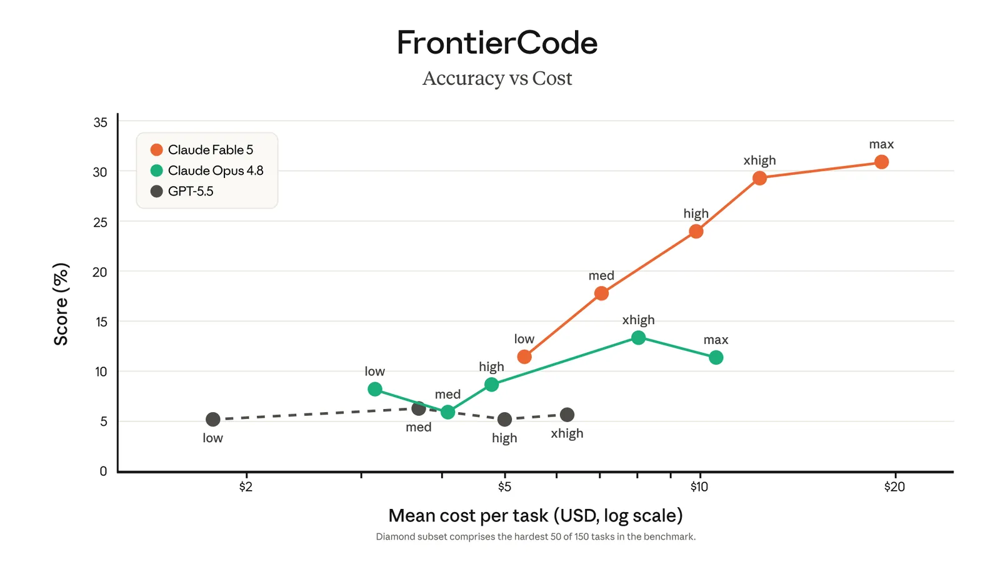

### Claude Sonnet 5 (Jun 2026)

**Source**: `raw/claude-sonnet-5/full-article.md`

**Claude Sonnet 5** is Anthropic's most agentic Sonnet release. Anthropic positions it close to **Opus 4.8** on agentic search (BrowseComp) and computer use (OSWorld-Verified) while costing less. It improves over Sonnet 4.6 on reasoning, tool use, coding, and knowledge work, with lower hallucination and sycophancy rates in pre-deployment safety evals.

Sonnet 5 ships with a new tokenizer (same family as Opus 4.7) that can increase token count by roughly 1.0–1.35× for the same text. Introductory pricing is $2/$10 per million tokens through August 31, 2026, then $3/$15; Anthropic says the intro rate keeps migration roughly cost-neutral despite the tokenizer change.

It is the default model on Free and Pro plans and available on Max, Team, Enterprise, Claude Code, and the Claude API (`claude-sonnet-5`). Effort levels span a wider cost-performance range than Sonnet 4.6; medium effort is substantially more cost-efficient, and high effort can match Opus 4.8 on some tasks.

Safety: cyber safeguards enabled by default (same class as Opus 4.7/4.8, less strict than Fable 5). Sonnet 5 is weaker than Opus/Mythos on dangerous cyber evaluations and never produced a working Firefox exploit in Mozilla's test. Enrolled organizations in the [[Cyber Verification Program]] get reduced guardrails without reapplying.

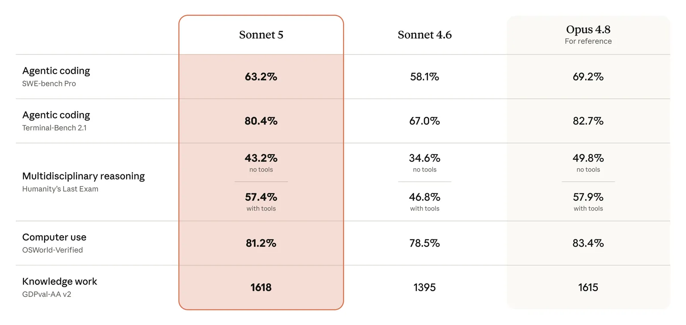

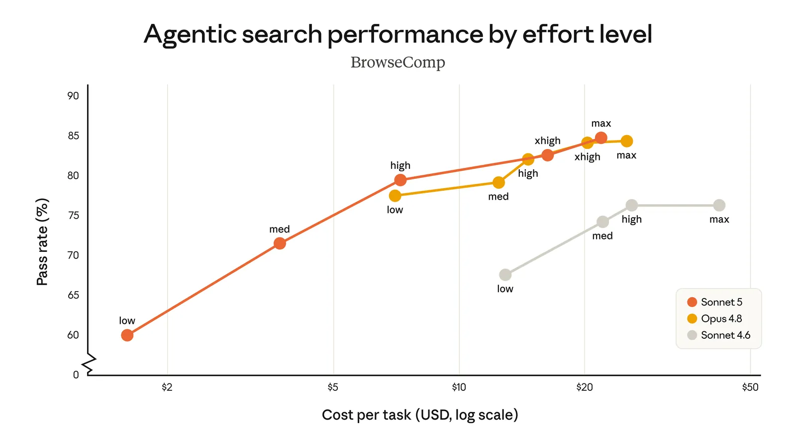

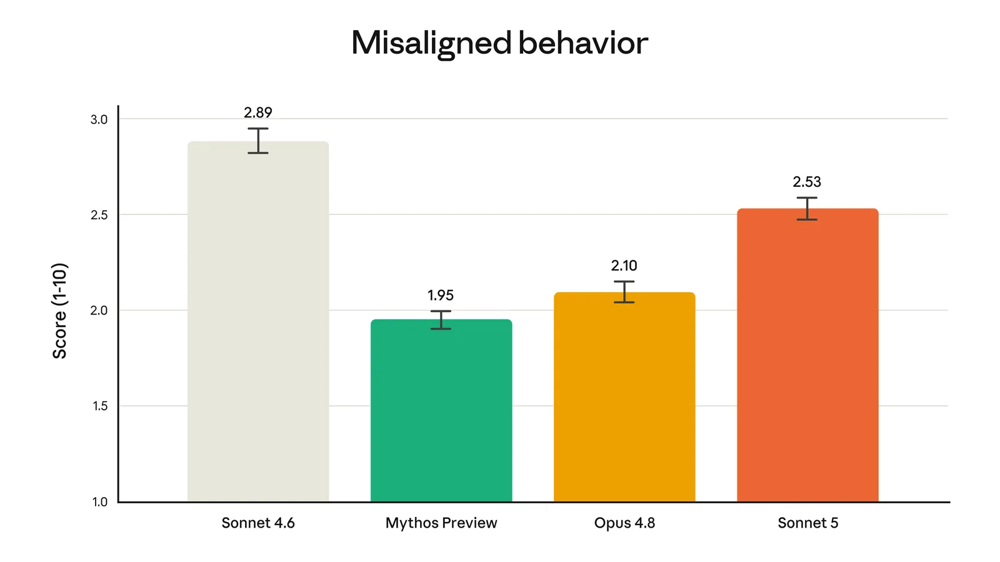

## Key Claims

- Claude evolved from dual-tier chat/API (2023) to Opus/Sonnet/Haiku tiers with vision (2024), computer use (Oct 2024), hybrid extended thinking (Feb 2025), and agent-native products (Claude Code, Agent SDK, Cowork).
- Coding leadership progressed HumanEval 71.2% (Claude 2) → SWE-bench 49% (3.5 Sonnet new) → 72.5% (Opus 4) → 77.2% (Sonnet 4.5) → SOTA Opus 4.5/4.6/4.7/4.8 on agentic coding benchmarks.
- Context windows: 100K (Claude 2) → 200K (2.1, Claude 3+) → 1M beta (Opus 4.6, Sonnet 4.6).
- Safety: Constitutional AI from launch; ASL-2 (Claude 3) → ASL-3 (Sonnet 4.5+); effort control and cyber safeguards added in Opus 4.5–4.7 generation.
- Pricing compression: Opus from $15/$75 (Opus 4) to $5/$25 (Opus 4.5+); Haiku 4.5 at $1/$5 near-frontier coding.
- **Fable 5 / Mythos 5 (Jun 2026)**: Mythos-class models; Fable 5 GA with domain safeguards routing cyber/bio to Opus 4.8; Mythos 5 for trusted Glasswing cyberdefense and life-sciences access; $10/$50 pricing.
- Fable 5: SOTA on broad capability benchmarks; longest autonomous horizons to date; vision-only Pokémon FireRed; FrontierCode leader at medium effort.
- Mythos 5: strongest stated cybersecurity capability; 10× drug-design acceleration; novel molecular-biology hypotheses; autonomous genomics outperforming published _Science_ model at 100× smaller scale.
- **Claude Sonnet 5 (Jun 2026)**: default Free/Pro model; near Opus 4.8 agentic performance at Sonnet pricing; new tokenizer (1.0–1.35× tokens); $2/$10 intro through Aug 2026 then $3/$15; cyber safeguards on by default; Cyber Verification Program eligible.
- Sonnet 5: strict improvement over Sonnet 4.6 on BrowseComp and OSWorld cost-performance curves; lower misaligned-behavior rate than Sonnet 4.6 but higher than Opus 4.8/Mythos Preview on automated audit.

## Figures

| Figure | Caption | Release |
|--------|---------|---------|
|  | Claude 3 family benchmark comparison | Claude 3 Family |
|  | Claude 3.5 Sonnet eval chart | Claude 3.5 Sonnet |
|  | Claude 3.7 Sonnet SWE-bench Verified | Claude 3.7 Sonnet |
|  | Claude 4 SWE-bench comparison | Claude 4 |
|  | Opus 4.5 SWE-bench leadership | Opus 4.5 |
|  | Sonnet 4.6 OSWorld progress | Sonnet 4.6 |
|  | Opus 4.7 benchmark overview | Opus 4.7 |
|  | Fable 5 / Mythos 5 benchmark comparison | Fable 5 / Mythos 5 |
|  | Pokémon FireRed vision-only timelapse | Fable 5 |
|  | Protein complexes designed by Mythos 5 | Mythos 5 |
| 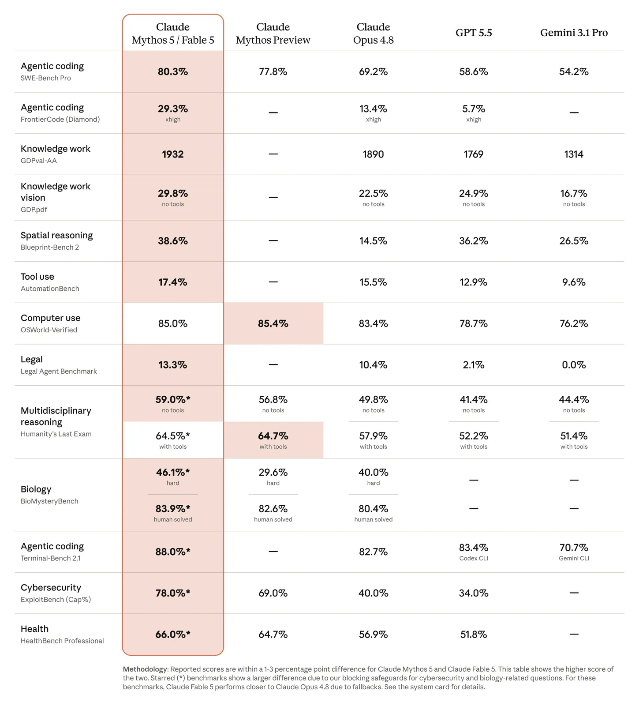 | Mythos 5 product-page benchmark table | Mythos 5 |
|  | Sonnet 5 benchmark comparison vs. Sonnet 4.6 and Opus 4.8 | Sonnet 5 |
|  | Sonnet 5 BrowseComp cost-performance at effort levels | Sonnet 5 |
| 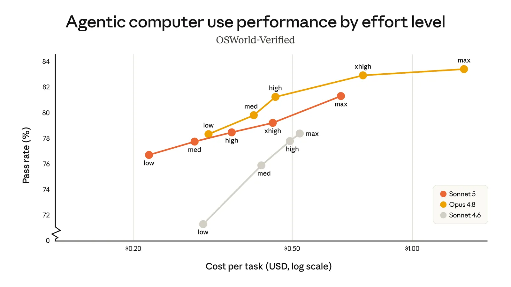 | Sonnet 5 OSWorld-Verified cost-performance at effort levels | Sonnet 5 |
|  | Misaligned-behavior rates across Claude models | Sonnet 5 |
| 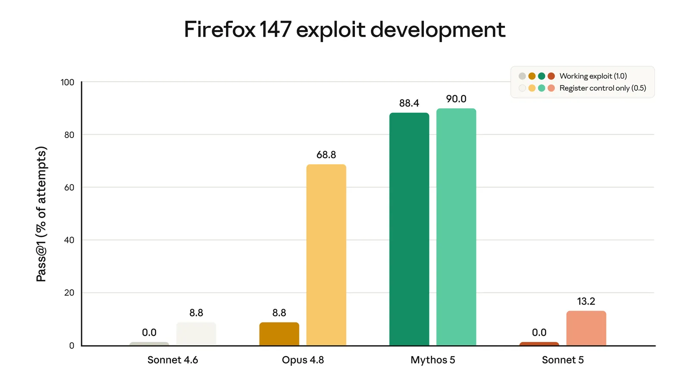 | Firefox exploit development evaluation (partial vs. full success) | Sonnet 5 |

## Entities

- [[Anthropic]] — AI safety company; creator of the Claude model family and Constitutional AI.
- [[Claude Code]] — Agentic coding tool (terminal, IDE, GitHub Actions); introduced Feb 2025, GA May 2025.
- [[Computer Use]] — General computer-control capability; public beta Oct 2024 with Claude 3.5 Sonnet.
- [[Extended Thinking]] — Hybrid reasoning mode with visible chain-of-thought; from Claude 3.7 Sonnet onward.
- [[Constitutional AI]] — Anthropic's alignment approach training models to be helpful, honest, harmless.
- [[Responsible Scaling Policy]] — ASL framework governing deployment safeguards by capability tier.
- [[Project Glasswing]] — multi-stakeholder cyber-defense initiative deploying Mythos 5.
- [[Claude Fable Safeguards]] — domain-routing safeguard pattern for Mythos-class GA release.
- [[Cyber Verification Program]] — opt-in reduced cyber guardrails for vetted security research orgs.

## Questions & Gaps

- Fable 5 safeguard false positives acknowledged at launch; refinement timeline not specified.
- Mythos 5 trusted-access expansion for biology and broader cyber partners is planned but not fully open.
- Exact parameter counts and training data mixes are not disclosed in blog posts.
- Sonnet 5 "cost-neutral" migration claim sits alongside a 1.0–1.35× tokenizer multiplier; effective cost depends on content type and whether intro pricing is active.
- Benchmark scaffolding (tools, thinking budget, test-time compute) varies by release; compare using each post's methodology footnotes.
- Claude 3.5 Sonnet received a silent upgrade (Oct 2024 "new" Sonnet) distinct from the Jun 2024 launch—both covered above.

## Related

- [[Large Language Models]] — Claude as a major commercial LLM family alongside Gemini, GPT, Mistral.
- [[Code Models]] — SWE-bench, Terminal-Bench, and Claude Code agentic coding lineage.
- [[Reasoning Models]] — Extended thinking and hybrid reasoning from Claude 3.7 onward.
- [[Agentic AI]] — Computer use, tool use, Claude Agent SDK, and multi-agent workflows.
- [[Safety and Alignment]] — Constitutional AI, ASL tiers, alignment evaluations.
- [[Vision Language Models]] — Claude 3+ vision and Opus 4.7 high-resolution multimodal inputs.
- [[Papers Explained 181 - Claude]] — Medium explainer of Claude 3 family (complements official posts).
