# How Claude Watermarks AI-Generated Text

**Source**: `raw/claude-watermarking/full-article.md`, `raw/claude-watermarking/full-article.md`  
**Ingested**: 2026-08-23  
**Tags**: #summary

## Summary

A video lecture and comprehensive slide breakdown by [[Sebastian Raschka]] analyzing [[Anthropic]]'s deployment of cryptographic text watermarking across the [[Claude Models]] output stream. Prompted by Anthropic's public announcement—driven partly by regulatory compliance requirements such as the EU AI Act—the 52-slide explainer demystifies how statistical text watermarking operates directly at the token sampling stage without retraining the base model or modifying weight tensors. Raschka establishes that text generation transforms input prompt tokens into a vocabulary score distribution (logits) via an LLM forward pass, which is then mapped to probabilities via Softmax before sampling a token and detokenizing.

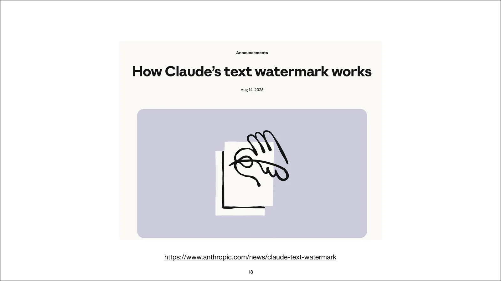

Claude's text watermarking works by substituting unconstrained random sampling with deterministic pseudorandom sampling keyed by a private secret key $K$ (held exclusively by Anthropic) and the preceding $h$ tokens of context ($n$-gram history, typically $h=4$ or $h=5$). When the LLM reaches a high-entropy decision point where multiple candidate tokens are plausible (e.g., "overcast" vs "grey"), the watermark algorithm deterministically seeds the token choice based on the secret key and context hash. On low-entropy or factual tokens (where only one token has high probability, such as "Berlin" in "The capital of Germany is [Berlin]"), the watermark is bypassed to prevent factual corruption or perceptual quality degradation.

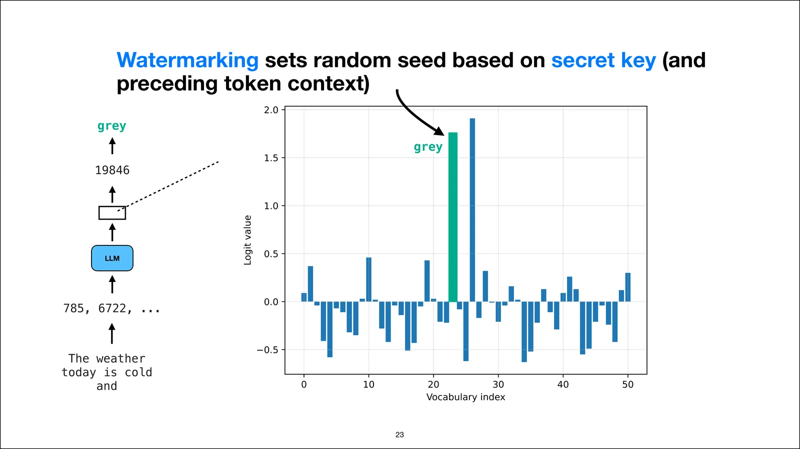

To solve the detection bottleneck—where traditional pseudorandom watermarks require running a full LLM forward pass to reconstruct logit distributions during verification—Anthropic employs **[[Tournament Sampling]]** (derived from Google DeepMind's SynthID Text line). The vocabulary is evaluated by a bank of pseudorandom binary watermark functions $g_1, g_2, \dots, g_n: V \to \{0, 1\}$ derived from the key and context. Candidate tokens compete in a bracketed knockout tournament across rounds matching their bit signatures. This ensures generated text contains a statistically elevated proportion of watermark bits, allowing post-hoc verification to score arbitrary web text in milliseconds using simple string lookups and average bit calculations ($S = \frac{1}{T}\sum_t \frac{1}{n}\sum_j g_j$) without invoking any LLM.

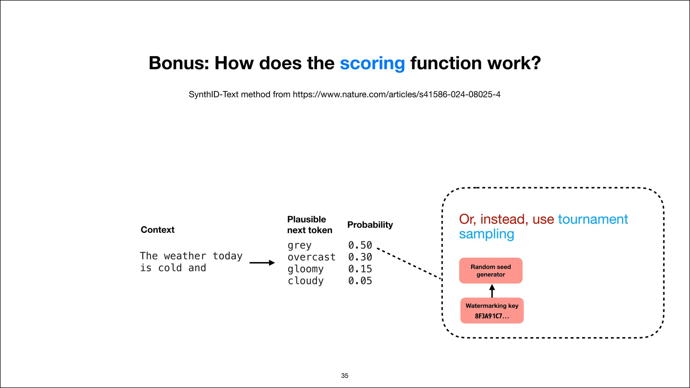

Raschka concludes by examining watermark evasion and its systemic consequences for web text. Because adversaries do not possess the secret key or know precisely which token positions were biased, removing the watermark requires making multi-position surgical edits. In practice, users attempting to evade watermarking will likely route high-tier Claude outputs through unwatermarked local models (e.g., Llama, Qwen, or Gemma) for automated paraphrasing. Because automated paraphrasing alters syntax awkwardly and disrupts nuanced phrasing, the effort to strip watermarks threatens to degrade overall text quality, producing a paradoxical outcome where "undetectable" AI text is noticeably worse than the original model generation.

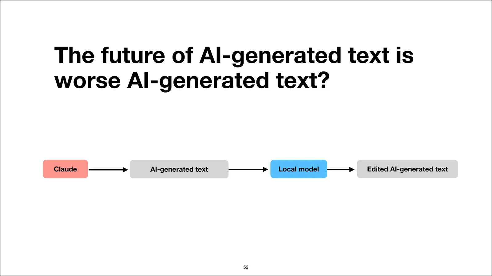

## Key Claims

- Text watermarking in [[Claude Models]] is implemented entirely at the inference sampling stage without altering model parameters, fine-tuning weights, or modifying latency-critical prefill computations.
- Claude replaces unconstrained weighted random sampling with pseudorandom sampling driven by a secret key $K$ combined with a sliding window hash of the preceding $h$ tokens.
- Watermarking is entropy-aware: it is applied only at high-entropy decision points where multiple tokens have comparable likelihood, preserving factual accuracy on low-entropy tokens.
- Claude implements **[[Tournament Sampling]]**, using a bank of pseudorandom hash functions $g_1, \dots, g_n$ to pair candidate tokens in tournament brackets during decoding.
- [[Tournament Sampling]] decouples generation from detection: verifying text on the internet requires only the secret key and the hash functions to compute average watermark bit scores, eliminating the need to rerun expensive LLM forward passes.
- For human or unwatermarked text, watermark hash functions yield an expected bit value of $\mathbb{E}[g_j] = 0.5$; watermarked Claude text yields statistically significant elevations above a decision threshold.
- Watermark removal without the key requires distributed edits across multiple token positions; using secondary local LLMs to rewrite Claude text strips the watermark but typically degrades textual coherence and quality.

## Figures

| Figure | Caption | File |
|--------|---------|------|
| 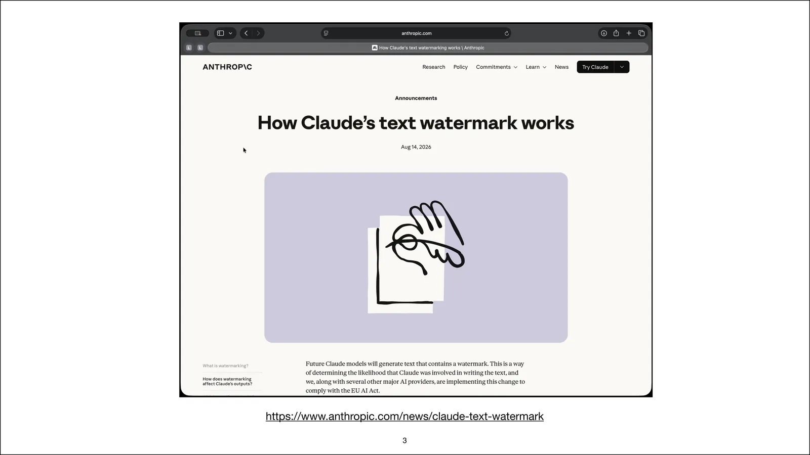 | Anthropic announcement about Claude text watermarking | `wiki/assets/claude-watermarking/fig-3.webp` |
| 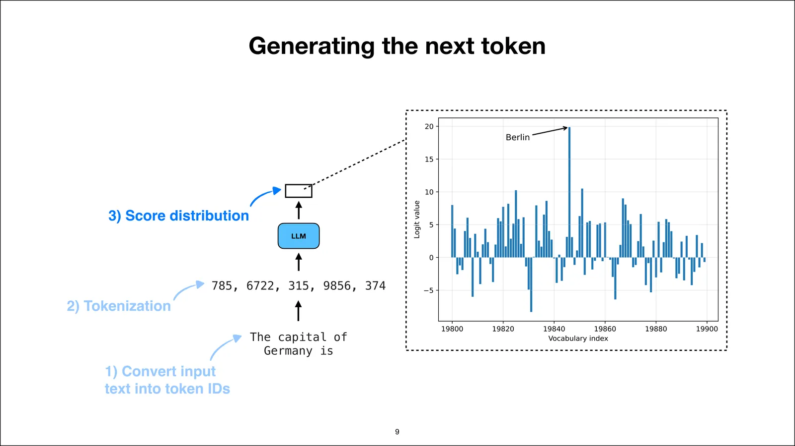 | Step 3: obtain next-token score distribution from LLM | `wiki/assets/claude-watermarking/fig-9.webp` |
| 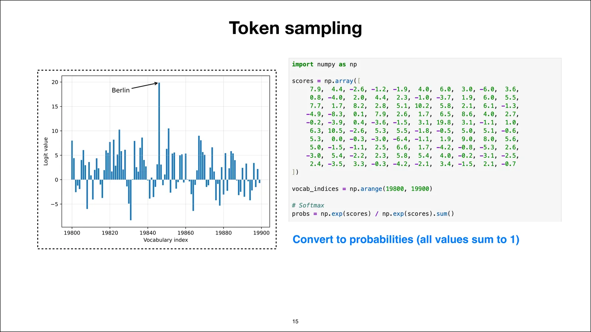 | Softmax conversion of logits into probabilities | `wiki/assets/claude-watermarking/fig-15.webp` |
|  | Anthropic's explanation of Claude's text watermark | `wiki/assets/claude-watermarking/fig-18.webp` |
|  | Deriving pseudorandom seeds from secret key and token context | `wiki/assets/claude-watermarking/fig-23.webp` |
| 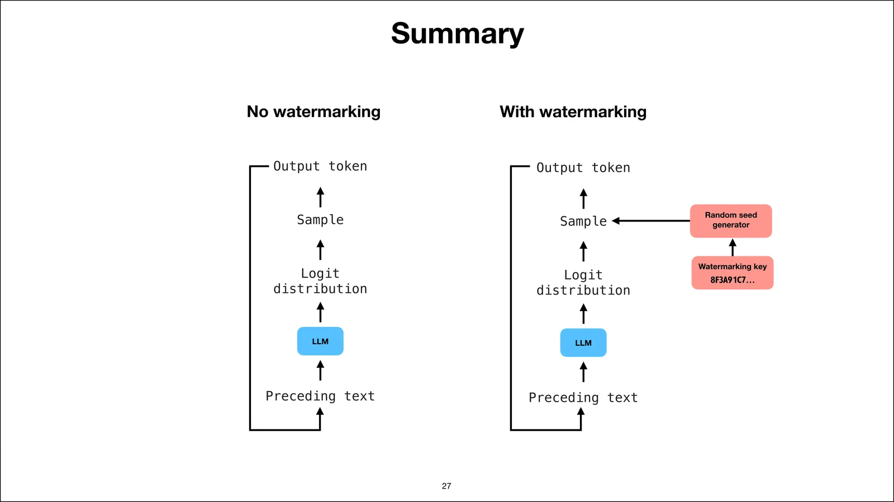 | Text generation lifecycle with vs. without watermarking | `wiki/assets/claude-watermarking/fig-27.webp` |
| 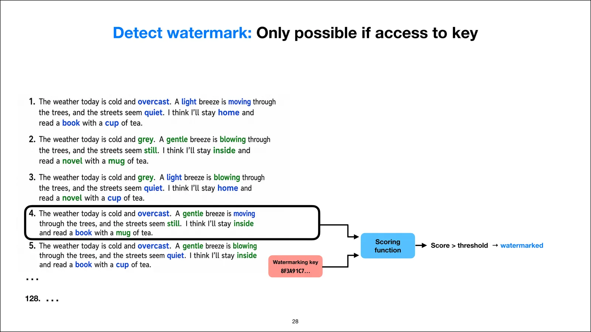 | Watermark detection requiring secret key and hashing functions | `wiki/assets/claude-watermarking/fig-28.webp` |
| 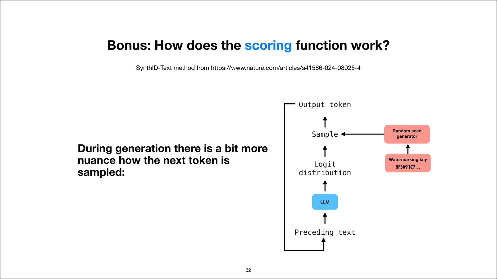 | Modified sampling stage enabling lightweight downstream scoring | `wiki/assets/claude-watermarking/fig-32.webp` |
|  | Tournament sampling replacing ordinary weighted random choice | `wiki/assets/claude-watermarking/fig-35.webp` |
| 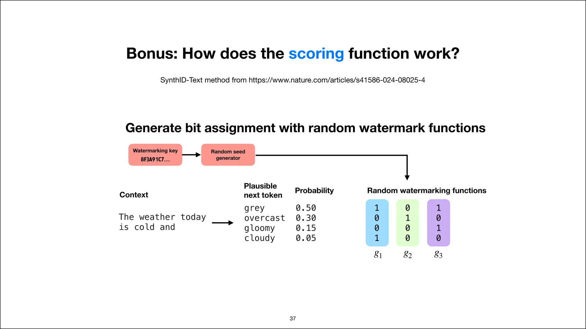 | Assigning bit signatures across candidate vocabulary tokens | `wiki/assets/claude-watermarking/fig-37.webp` |
| 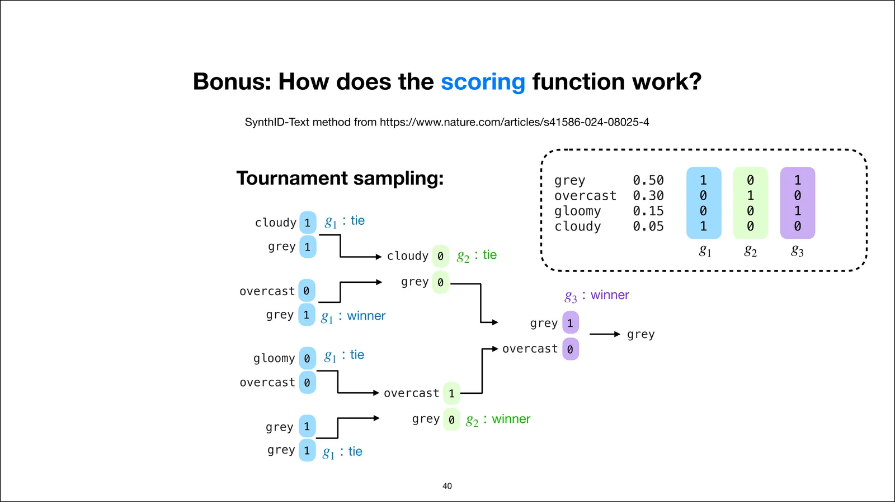 | Tournament knockout rounds determining winning token | `wiki/assets/claude-watermarking/fig-40.webp` |
| 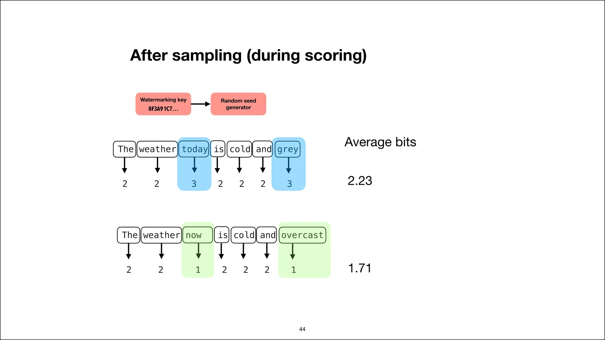 | Comparing average watermark bit scores between watermarked and unwatermarked text | `wiki/assets/claude-watermarking/fig-44.webp` |
| 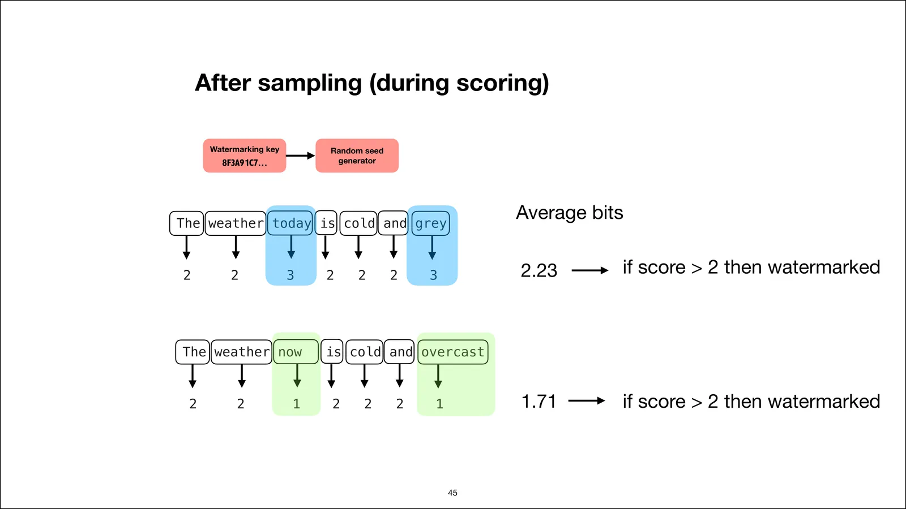 | Threshold decision boundary classifying text as watermarked | `wiki/assets/claude-watermarking/fig-45.webp` |
| 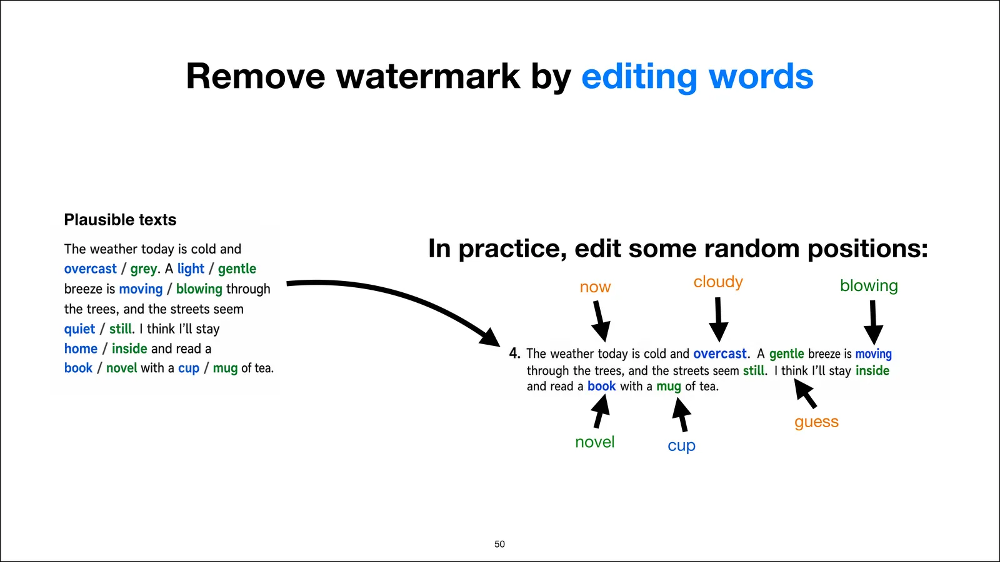 | Multi-position editing required to disrupt watermark detection | `wiki/assets/claude-watermarking/fig-50.webp` |
|  | Local model paraphrasing pipeline and text quality degradation | `wiki/assets/claude-watermarking/fig-52.webp` |

## Entities

- [[Sebastian Raschka]] — Author of the *Ahead of AI* explainer and video lecture.
- [[Anthropic]] — Creator of Claude, deploying secret-key text watermarking across Claude model outputs.
- [[Claude Models]] — Frontier model family implementing inference-time tournament sampling watermarks.
- [[Google DeepMind]] — Developed the underlying SynthID Text tournament sampling algorithms.

## Questions & Gaps

- The article notes that Anthropic plans to provide a detection API, but leaves open whether verification keys or tooling will be accessible to the general public, enterprise partners, or restricted strictly to regulatory entities.
- Does not provide exact empirical ROC curves, false-positive rates, or minimum text length requirements ($T_{\min}$) specific to Claude's production deployment parameters ($n$-gram window $h$, number of hash functions $n$).
- Does not measure the computational latency overhead of tournament sampling inside large-scale batched inference engines (e.g., vLLM or custom serving infrastructure).

## Related

- [[Text Watermarking]] — Core concept page on statistical, cryptographic, and sampling-based LLM watermarking.
- [[Tournament Sampling]] — Algorithmic breakdown of tournament-based token selection and post-hoc detection.
- [[Introducing SynthID Text]] — DeepMind / Hugging Face release of the foundational tournament sampling watermarking library.
- [[Safety and Alignment]] — Broader topic hub on AI provenance, content authenticity, and governance frameworks.
- [[Responsible Scaling Policy]] — Anthropic's deployment and safety governance structure.
