# Best Deep CNN Architectures and Their Principles: from AlexNet to EfficientNet

**Source**: `raw/cnn-architectures/full-article.html` (453 KB), `raw/cnn-architectures/full-article.md` (markdown view)  
**URL**: https://theaisummer.com/cnn-architectures/  
**Author**: Nikolas Adaloglou (AI Summer), 2021-01-21  
**Ingested**: 2026-06-06  
**Tags**: #summary

## Summary

This AI Summer survey traces the evolution of ImageNet-classification [[Convolutional Neural Networks]] from [[AlexNet]] (2012, 63.3% Top-1) through [[EfficientNet]] and semi-supervised training schemes that pushed accuracy past 90%. Rather than listing benchmark numbers alone, Nikolas Adaloglou organizes the lineage around **scaling principles**: width (more feature maps), depth (more layers), and input resolution — and shows that more parameters do not always yield better accuracy.

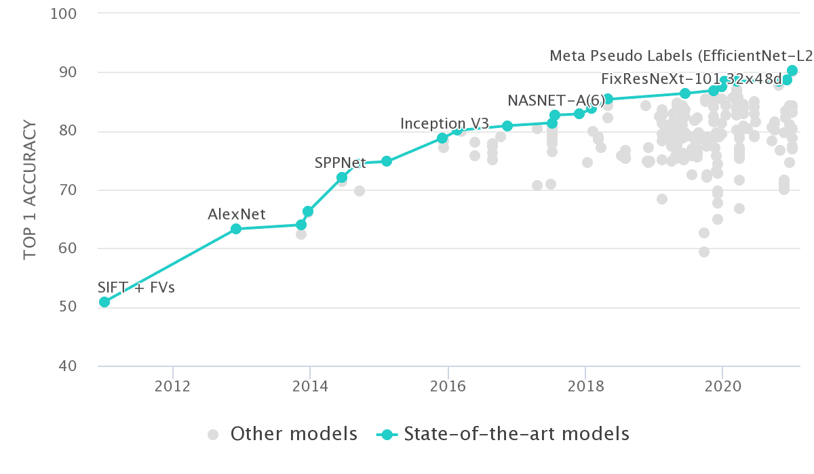

The article walks through landmark architectures in historical order. **AlexNet** introduced max-pooling, ReLU, and dropout at scale. **VGG** showed that stacking 3×3 convolutions beats a single 7×7 layer (more non-linearities, fewer parameters) and made depth the dominant scaling axis — until normalization became a bottleneck. **Inception / GoogLeNet** widened networks in parallel branches using 1×1 bottleneck convolutions to keep FLOPs bounded while processing multiple kernel scales. **ResNet** solved vanishing gradients with identity [[Skip Connections]] (learn residuals F(x) rather than H(x) directly) and bottleneck 1×1 blocks for deep variants. **DenseNet** pushed skip connectivity further via dense concatenation and feature reuse, trading memory for parameter efficiency.

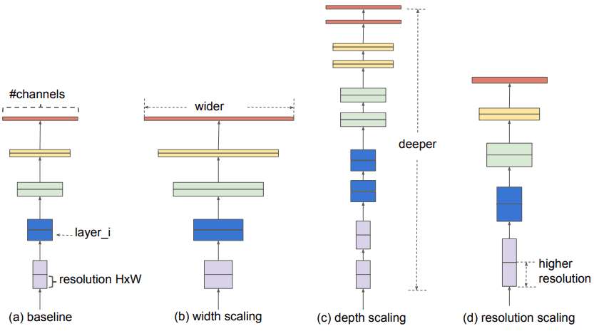

Post-2017 highlights include **BiT (Big Transfer)**: ResNet-152 variants pretrained on JFT-300M with group normalization + weight standardization instead of batch norm for stable transfer at scale. **EfficientNet** formalizes **compound scaling** — jointly scaling depth, width, and resolution with a single coefficient φ under a FLOPs constraint (α·β²·γ² ≈ 2). Baseline EfficientNet-B0 comes from NAS; B1–B7 apply compound scaling. **Noisy Student** and **Meta Pseudo Labels** extend EfficientNet with semi-supervised pseudo-labeling; the latter adds a teacher–student feedback loop on labeled data to correct confirmation bias.

## Key Claims

- ImageNet Top-1 rose from 63.3% (AlexNet, 2012) to 90.2% (Meta Pseudo Labels + EfficientNet-L2, 2021); parameter count alone does not predict accuracy.
- **Width** = more feature maps; **depth** = more conv layers; **resolution** = larger input spatial size — the three axes of architecture scaling (Tan & Le 2019).
- AlexNet (2012): first successful large-scale ImageNet CNN; 5 conv layers, max-pool, ReLU, dropout on large FC heads.
- VGG (2014): depth scaling with repeated 3×3 stacks; three 3×3 layers ≈ one 7×7 with fewer params and more non-linearities; pretrained VGG still used for perceptual losses and style transfer.
- Inception/GoogLeNet (2014): multi-scale parallel branches; 1×1 convs for channel reduction before expensive 3×3/5×5 convs; 22 layers, global average pooling; auxiliary classifiers against vanishing gradients.
- Inception V2/V3 (2015): factorized convolutions (5×5 → two 3×3; spatial separable 1×3 + 3×1); batch normalization; wider modules.
- ResNet (2015): identity skip connections learn residuals; batch norm; bottleneck 1×1–3×3–1×1 blocks for ResNet-50+; depths 18–152.
- DenseNet (2017): concatenate (not add) feature maps within dense blocks; growth rate k controls channel expansion; 1×1 bottlenecks limit memory; strong in segmentation/medical imaging despite slow training.
- BiT (2020): ResNet-152(x4) pretrained on JFT-300M; GN + weight standardization replace BN for large-batch distributed pretraining and better transfer to small downstream sets.
- EfficientNet (2019): NAS-derived B0 baseline; compound scaling d=α^φ, w=β^φ, r=γ^φ with α·β²·γ²≈2; B1 is 7.6× smaller and 5.7× faster than ResNet-152 at competitive accuracy.
- Noisy Student (2020): teacher labels 300M unlabeled images; larger student trains on labeled + pseudo labels with noise (dropout, stochastic depth, RandAugment); iterative teacher→student cycles.
- Meta Pseudo Labels (2021): teacher updated from student performance on labeled data to reduce confirmation bias in pseudo-labeling.

## Figures

| Figure | Caption | Page |
|--------|---------|------|
| 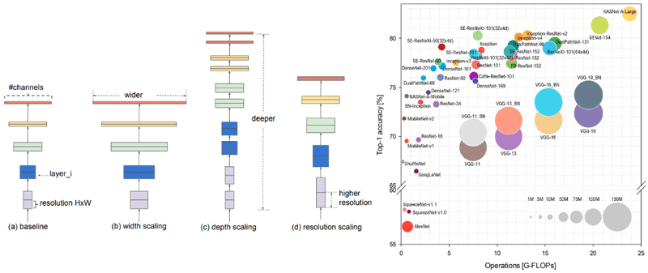 | Article hero: CNN architecture survey overview | — |
|  | ImageNet classification accuracy trend (Papers with Code) | — |
| 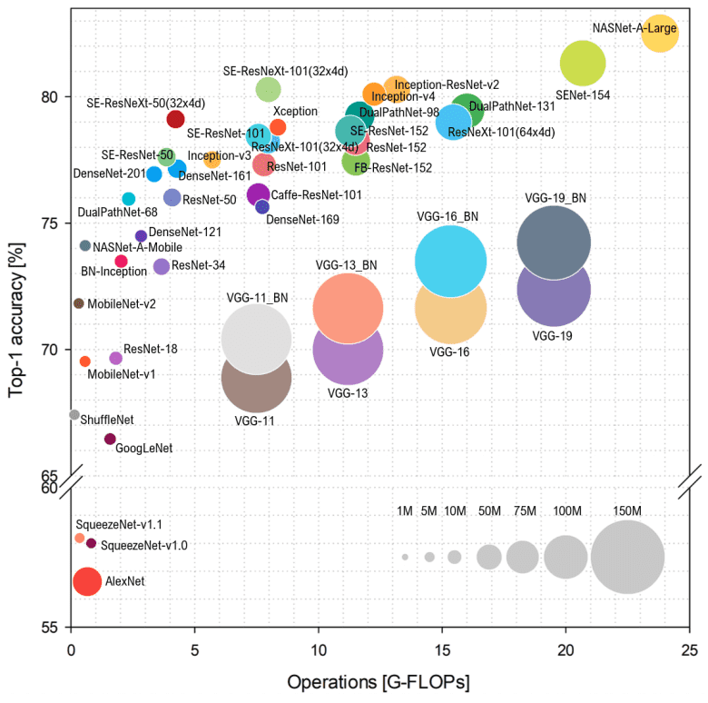 | Top CNN architectures until 2018: accuracy vs FLOPs vs parameter count | — |
|  | Architecture scaling: width, depth, and resolution | — |
| 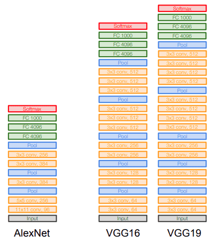 | VGG vs AlexNet layer comparison (Stanford DL lectures) | — |
| 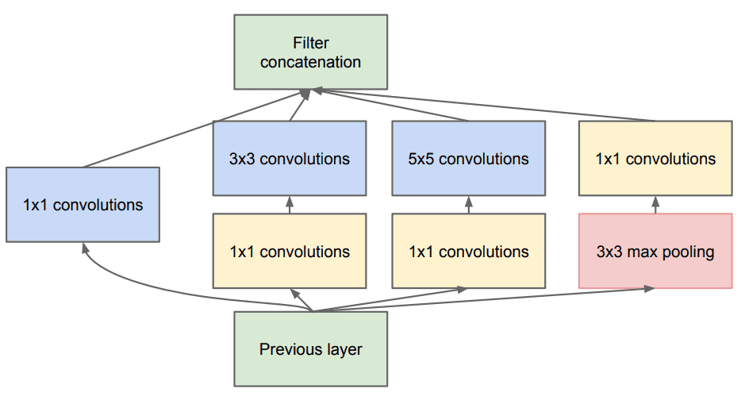 | Inception module: parallel 1×1, 3×3, 5×5 branches with pooling | — |
| 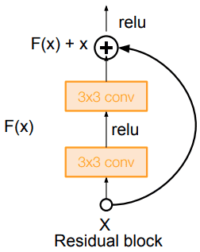 | ResNet skip connection (residual block) | — |
| 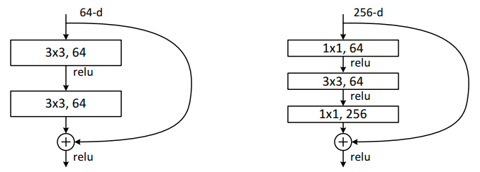 | ResNet bottleneck block with 1×1 convolutions | — |
| 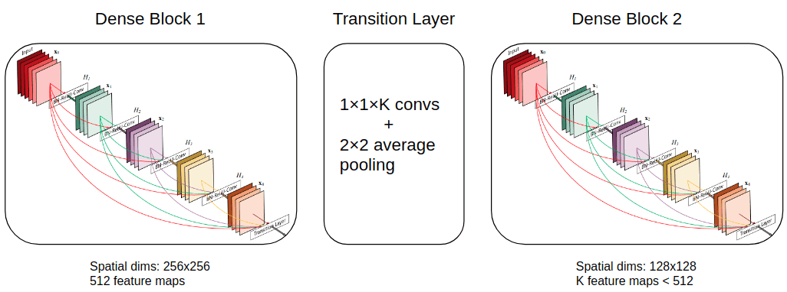 | DenseNet dense block and transition layer | — |
| 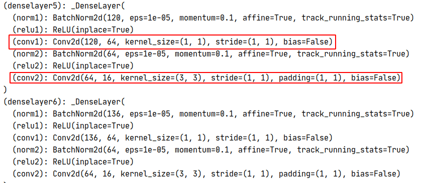 | DenseNet growth rate illustrated in PyTorch | — |
| 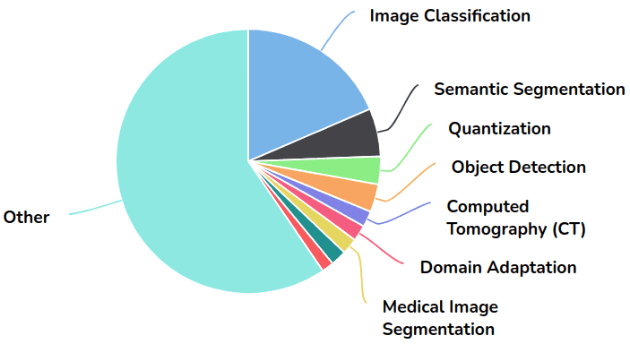 | DenseNet application domains (Papers with Code) | — |
|  | Group normalization vs batch normalization | — |
| 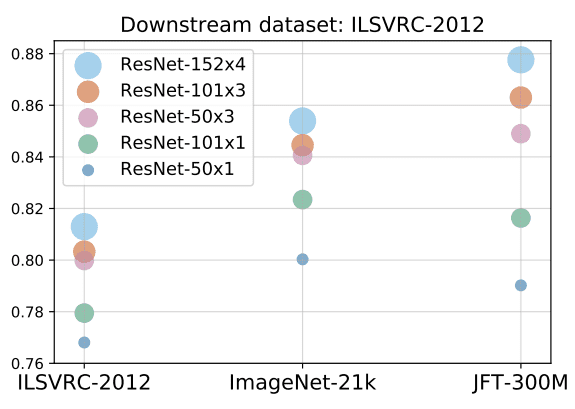 | BiT performance scaling with model and data size | — |
| 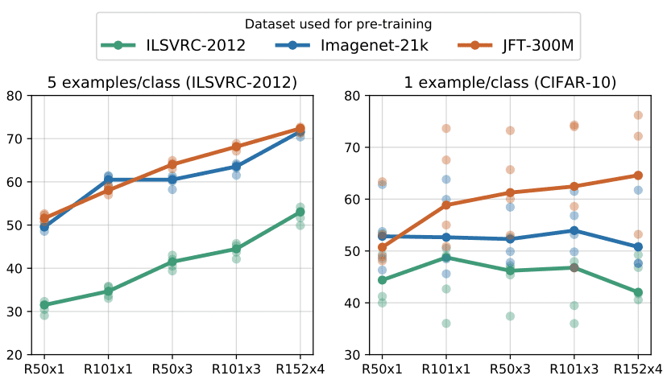 | BiT fine-tuning with very few labeled examples per class | — |
| 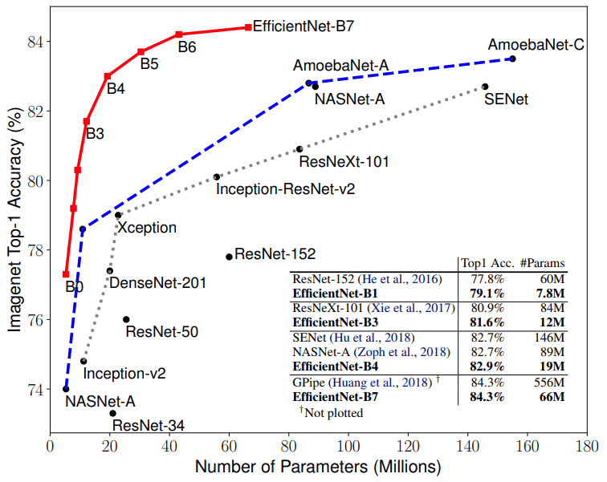 | EfficientNet ImageNet accuracy vs model parameters | — |
| 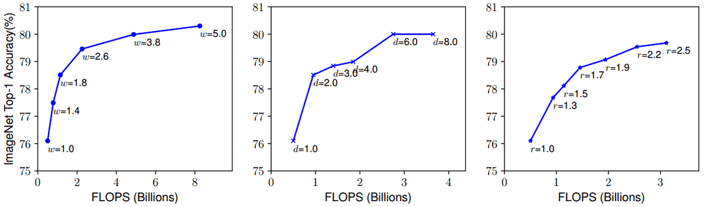 | Individual scaling of depth, width, or resolution saturates | — |
| 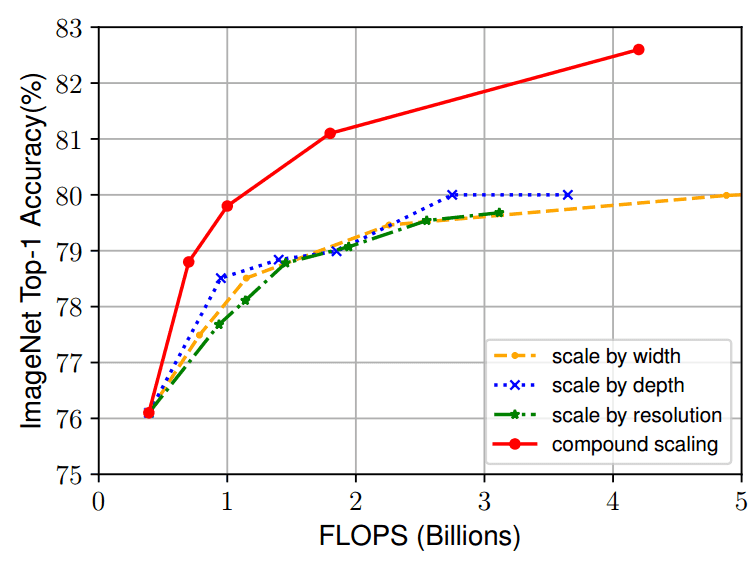 | Compound scaling outperforms individual scaling (EfficientNet-B0) | — |
| 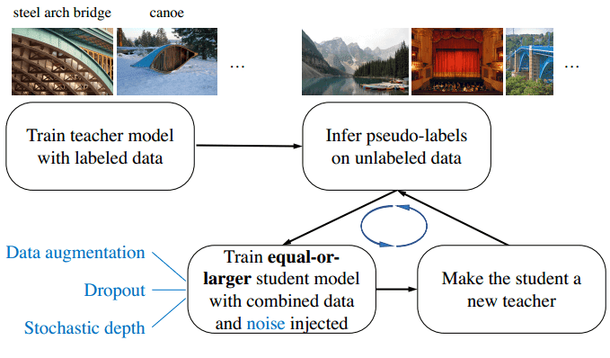 | Noisy Student iterative self-training pipeline | — |
| 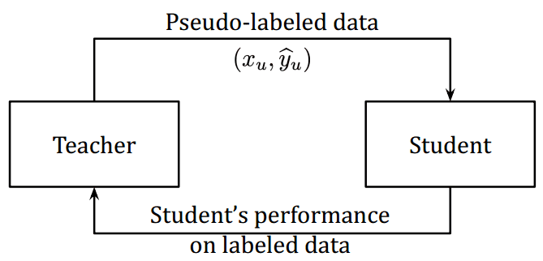 | Meta Pseudo Labels teacher–student feedback loop | — |

Inception modules process the same input at multiple kernel scales in parallel, using 1×1 bottlenecks to control compute.

Joint depth–width–resolution scaling (compound scaling) beats scaling any single dimension alone.

## Entities

- [[AI Summer]] — published this architecture survey (2021).
- [[Nikolas Adaloglou]] — author.
- [[AlexNet]] — 2012 ImageNet breakthrough architecture.
- [[VGG]] — deep 3×3 stacking paradigm.
- [[Inception Network]] — multi-branch width scaling (GoogLeNet).
- [[ResNet]] — residual skip connections enabling very deep nets.
- [[DenseNet]] — dense feature concatenation and reuse.
- [[Big Transfer]] — large-scale ResNet pretraining (BiT).
- [[EfficientNet]] — compound-scaled efficient CNN family.
- [[Compound Scaling]] — joint depth/width/resolution scaling law.
- [[Noisy Student]] — semi-supervised EfficientNet training at web scale.
- [[Meta Pseudo Labels]] — teacher feedback to fix pseudo-label bias.
- [[Convolutional Neural Networks]] — overarching architecture class.
- [[Computer Vision]] — application domain.

## Questions & Gaps

- Article stops at 2021 (Meta Pseudo Labels); no ConvNeXt, ViT hybrids, or modern scaling laws.
- HRNet mentioned in passing but not covered in depth.
- Inception V4 / Inception-ResNet only named, not explained.
- Training details (optimizers, augment policies per era) are sparse beyond dropout/BN notes.
- Does not connect scaling principles to downstream detection/segmentation backbones beyond DenseNet use cases.

## Related

- [[Understanding the Receptive Field of Deep Convolutional Networks]] — companion AI Summer article on RF math and design (same author).
- [[Object Detection for Dummies Part 2]] — AlexNet/VGG/ResNet in detection context (Lilian Weng).
- [[Papers Explained - EfficientNetV2]] — follow-on EfficientNet family in this wiki.
- [[Deep Learning]] — textbook CNN foundations (Chapter 9).
- [[Vanishing Gradients]] — motivation for ResNet and auxiliary Inception classifiers.
- [[Pooling]] — downsampling primitive used across all surveyed architectures.
