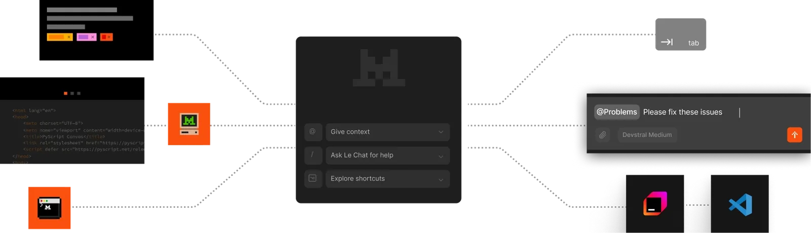
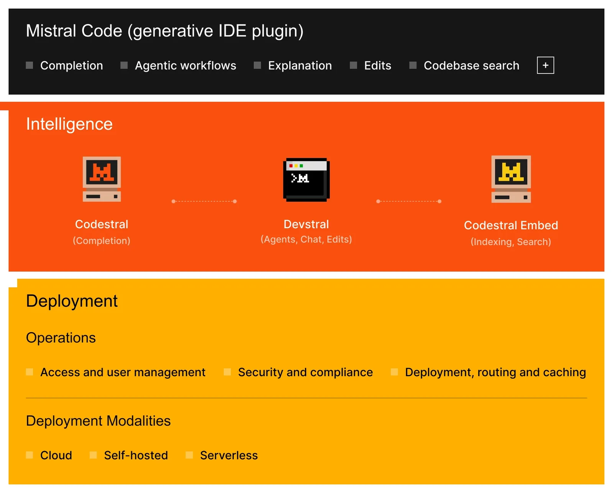
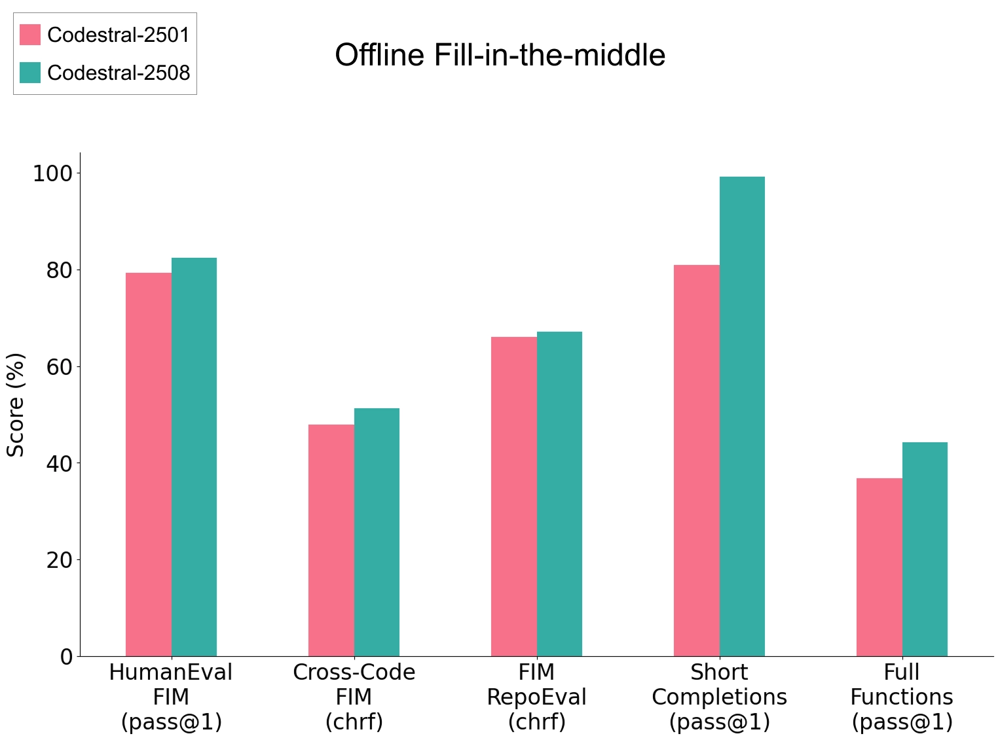
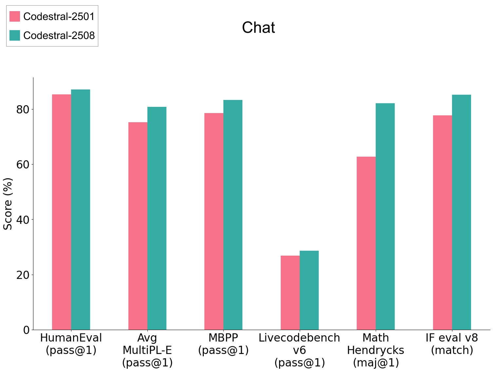
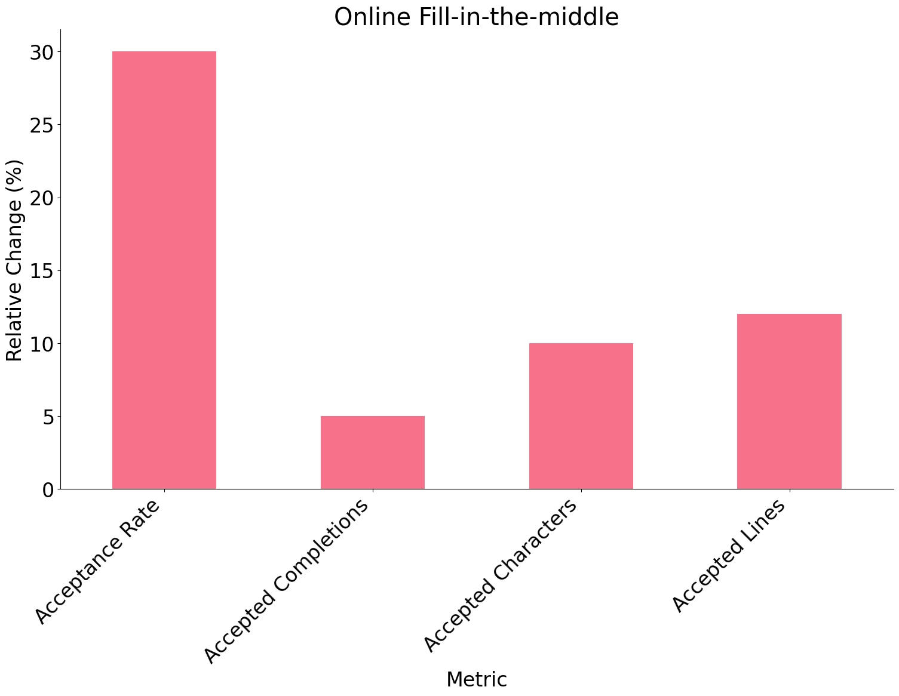
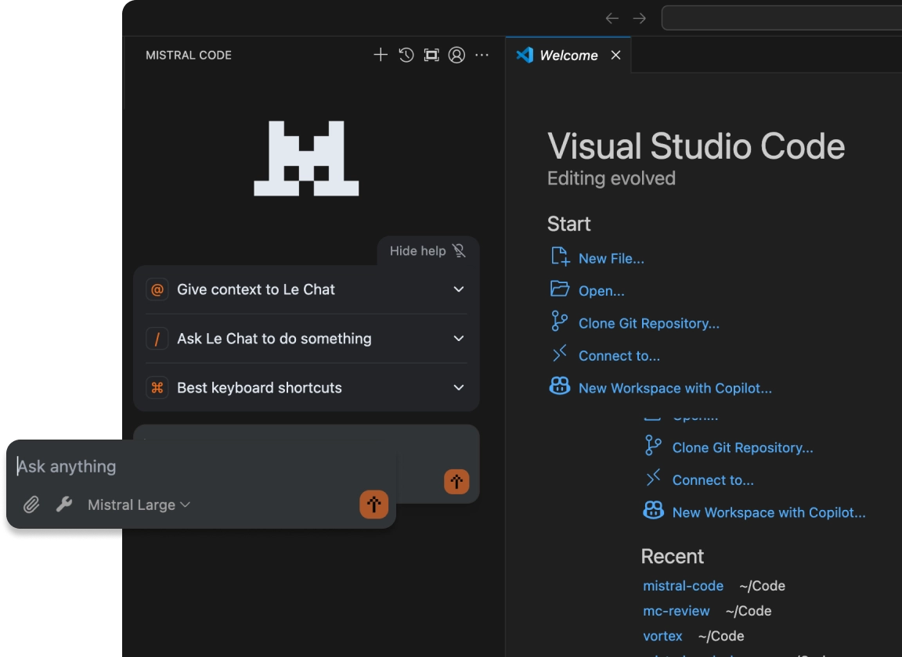

# Announcing Codestral 25.08 and the Complete Mistral Coding Stack for Enterprise

**Source**: `raw/codestral-25-08/full-article.md` (232 KB), `raw/codestral-25-08/full-article.md` (markdown view)  
**URL**: https://mistral.ai/news/codestral-25-08/  
**Ingested**: 2026-06-06  
**Tags**: #summary

## Summary

Mistral AI announces **Codestral 25.08** and positions it inside a unified **enterprise coding stack**: **Codestral** (FIM completion), **Codestral Embed** (semantic codebase retrieval), **Devstral** (agentic coding via OpenHands), and **Mistral Code** (JetBrains/VS Code plugin tying the layers together). The post argues enterprise adoption lags due to SaaS-only deployment, fragmented vendor stacks, missing observability, and poor toolchain integration—not raw model quality.

**Codestral 25.08** claims production-validated IDE gains: **+30% accepted completions**, **+10% retained code**, **50% fewer runaway generations**, plus academic FIM improvements; chat mode adds **+5% IF eval v8** and **+5% MultiplE**. **Codestral Embed** provides private, configurable-dimension code search. **Devstral Small 1.1** (53.6% SWE-Bench Verified) and **Devstral Medium** (61.6%) power cross-file refactors, test generation, and PR authoring. **Mistral Code** surfaces completions, one-click Devstral tasks, embed-backed search, SSO/audit logging, and Console observability—with cloud, VPC, and on-prem GA in Q3.

Customer references include **Capgemini**, **Abanca**, and **SNCF**; tier-1 banks and manufacturers piloting. Marketing claim: leading enterprises cut dev/review/test time by **50%** with integrated Mistral coding solutions.

## Key Claims

- Full-stack enterprise coding: Codestral 25.08 + Codestral Embed + Devstral + Mistral Code IDE plugin.
- Codestral 25.08: +30% accepted completions, +10% retained suggestions, 50% fewer runaway generations in live IDE evals.
- Chat improvements: +5% instruction following (IF eval v8), +5% MultiplE code abilities.
- Codestral Embed: private deployable code retrieval; configurable dims; beats OpenAI/Cohere on cited real-world benchmarks.
- Devstral Small 1.1: 53.6% SWE-Bench Verified; Devstral Medium: 61.6%; outperforms cited closed/open models.
- Mistral Code: FIM completions, Devstral automations, embed search, Git/terminal/static-analysis context; SSO + audit + Console metrics.
- Deploy cloud, VPC, or on-prem (on-prem GA Q3); no mandatory external telemetry for inference/search.
- Production customers: Capgemini, Abanca (self-hosted banking), SNCF (legacy Java modernization agents).

## Figures

| Figure | Caption | Page |
|--------|---------|------|
|  | Enterprise coding adoption barriers overview | — |
|  | Mistral full-stack coding architecture diagram | — |
|  | Developer workflow: Codestral completion → Embed search → Devstral agent PR | — |
|  | Codestral 25.08 IDE productivity metrics | — |
|  | Devstral SWE-Bench Verified and agent capability highlights | — |
|  | Enterprise customer adoption and deployment modalities | — |

## Entities

- [[Code Models]] — Codestral 25.08 FIM completion layer of the enterprise coding stack.
- [[Agentic AI]] — Devstral agentic workflows on OpenHands; cross-file refactors and PR automation.
- [[Embedding and Retrieval]] — Codestral Embed as semantic retrieval foundation for IDE search and agent RAG.

## Questions & Gaps

- 50% time-savings claim is marketing-level; methodology and baselines not specified.
- On-prem GA was Q3 2025 at publish; current availability may differ.
- Devstral Medium pricing and weight details deferred to separate Devstral posts.

## Related

- [[Codestral 25.01]] — prior Codestral generation upgrade; 25.08 adds IDE-validated FIM gains.
- [[Codestral Embed]] — code embedding model used for semantic search in the stack.
- [[Devstral]] — agentic coding model family integrated with OpenHands.
- [[Code Models]] — enterprise code completion, retrieval, and agentic coding platform.
- [[Agentic AI]] — SWE-Bench Verified agents, OpenHands scaffold, and IDE-integrated automations.
