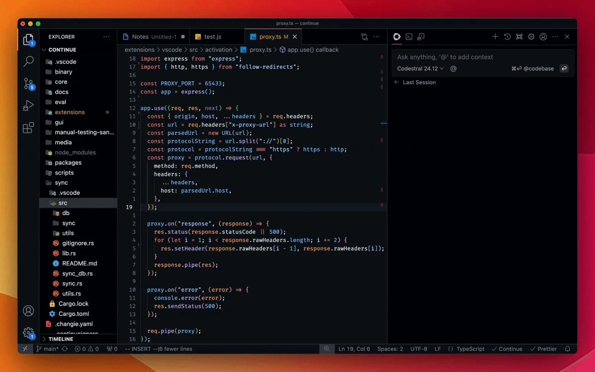

# Codestral 25.01

**Source**: `raw/codestral-2501/full-article.html` (242 KB), `raw/codestral-2501/full-article.md` (markdown view)  
**URL**: https://mistral.ai/news/codestral-2501/  
**Ingested**: 2026-06-06  
**Tags**: #summary

## Summary

Mistral AI ships **Codestral 25.01**, a major upgrade to the Codestral code model family. The release features a more efficient architecture and improved tokenizer, yielding roughly **2× faster** code generation and completion versus the original Codestral. The model expands context to **256k** tokens and is positioned as the leader in its weight class for coding, with claimed **SOTA fill-in-the-middle (FIM)** performance across Python, Java, and JavaScript benchmarks.

Reported headline scores vs. Codestral-2405 22B and sub-100B competitors include **86.6% HumanEval**, **85.9% HumanEvalFIM average**, **95.3% FIM pass@1 average**, and strong RepoBench/LiveCodeBench/CruxEval numbers. Per-language HumanEval averages reach **71.4%** across seven languages. The post notes debut at **#1 on the LMsys copilot arena** leaderboard.

Rollout via IDE partners (e.g., **Continue** for VS Code/JetBrains); enterprise on-prem/VPC deployment supported. API: **codestral-latest** on la Plateforme; also Vertex AI (private preview on Azure AI Foundry, Bedrock coming).

## Key Claims

- ~2× faster generation vs. original Codestral; 256k context (up from 32k on Codestral-2405 22B).
- Claimed SOTA for FIM in its weight class; leader on LMsys copilot arena at launch.
- HumanEval 86.6%, MBPP 80.2%, CruxEval 55.5%, LiveCodeBench 37.9%, RepoBench 38.0%, Spider 66.5%.
- FIM exact-match average 85.89%; FIM pass@1 average 95.3% (beats Codestral-2405 and several API baselines).
- Per-language HumanEval average 71.4% across Python, C++, Java, JS, Bash, TypeScript, C#.
- Available via Continue IDE plugins, la Plateforme (codestral-latest), Vertex AI, Azure AI Foundry preview.
- Enterprise local/VPC deployment for data residency requirements.

## Figures

| Figure | Caption | Page |
|--------|---------|------|
|  | Benchmark tables: overview, per-language HumanEval, and FIM comparisons vs. Codestral-2405 and competitors | — |

## Entities

- [[Code Models]] — upgraded Codestral with 256k context and SOTA FIM claims.
- [[Large Language Models]] — sub-100B coding model competitive with larger code LLMs on FIM tasks.

## Questions & Gaps

- Blog tables are image-based; markdown extraction preserves numbers but layout is lossy.
- OpenAI FIM API baseline noted as GPT-3.5 Turbo—may not reflect latest OpenAI FIM offerings.
- Exact parameter count and architecture changes vs. Codestral 22B not specified in the post.

## Related

- [[Codestral]] — original May 2024 Codestral 22B announcement and API surfaces.
- [[Code Models]] — FIM, autocomplete, and coding benchmark landscape.
- [[Papers Explained 62 - Code Llama]] — prior open code-model benchmark comparisons cited in tables.
