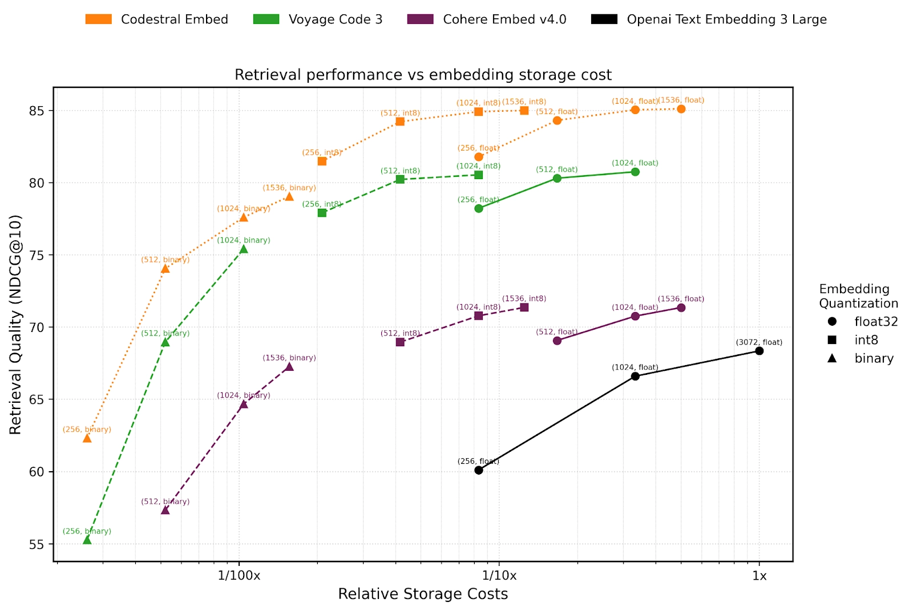

# Codestral Embed

**Source**: `raw/codestral-embed/full-article.html` (224 KB), `raw/codestral-embed/full-article.md` (markdown view)  
**URL**: https://mistral.ai/news/codestral-embed/  
**Ingested**: 2026-06-06  
**Tags**: #summary

## Summary

Mistral AI releases **Codestral Embed** (`codestral-embed-2505`), its first **code-specialized embedding model**, optimized for retrieval on real-world code corpora. The model outperforms **Voyage Code 3**, **Cohere Embed v4.0**, and **OpenAI's large embedding model** on reported retrieval benchmarks, with especially strong results on **SWE-Bench lite** (GitHub-issue → files-to-modify retrieval for coding agents) and **Text2Code (GitHub)** tasks relevant to completion and editing context.

Embeddings support **configurable dimensions and precisions** (e.g., 256-dim INT8) with a smooth quality/cost tradeoff—256-dim INT8 still beats competitor full models per the blog. Dimensions are ordered by relevance; truncating to the first *n* dimensions preserves a quality ladder. Context size is **8192 tokens**; recommended chunking is **3000 characters with 1000 overlap** for retrieval pipelines.

Use cases: RAG for copilots and coding agents, semantic code search, near-duplicate detection, and unsupervised code clustering. Pricing: **$0.15/M tokens** on API; **50% batch API discount**. On-prem via Mistral applied AI team.

## Key Claims

- First Mistral embedding model specialized for code; SOTA vs. Voyage Code 3, Cohere Embed v4, OpenAI large embed on reported suites.
- Strong on SWE-Bench lite (agent RAG) and GitHub Text2Code retrieval categories.
- Matryoshka-style dimension truncation: any prefix of ordered dimensions usable; 256-dim INT8 beats competitors.
- 8192-token context; chunking guidance: 3000 chars, 1000 overlap for best retrieval.
- API name codestral-embed-2505 at $0.15/M tokens; batch API at half price.
- Use cases: copilot RAG, semantic search, duplicate detection, code clustering.

## Figures

| Figure | Caption | Page |
|--------|---------|------|
|  | Retrieval quality vs. embedding dimension/precision tradeoffs; category benchmark scores vs. competitors | — |

## Entities

- [[Embedding and Retrieval]] — code-specific embeddings for RAG, semantic search, and agent retrieval.
- [[Code Models]] — embedding layer complementing Codestral generation and Devstral agents.
- [[Agentic AI]] — SWE-Bench lite retrieval for coding-agent RAG workflows.

## Questions & Gaps

- Benchmark table details are partially preserved in markdown extraction; figure is canonical for scores.
- On-prem deployment process requires sales contact; no public weights mentioned.
- Comparison set may not include newest embedders released after May 2025.

## Related

- [[Embedding and Retrieval]] — RAG, chunking, and retrieval-quality tradeoffs.
- [[Code Models]] — code assistants and retrieval-augmented coding workflows.
- [[Agentic AI]] — coding agents using embed-based codebase retrieval (SWE-Bench lite).
- [[Papers Explained 466 - Jina Code Embeddings]] — comparable code-embedding research line.
