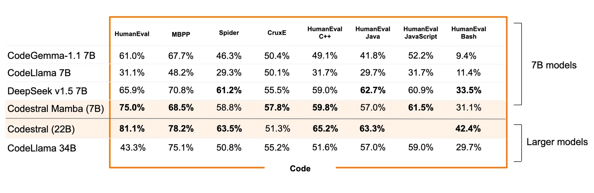

# Codestral Mamba

**Source**: `raw/codestral-mamba/full-article.md` (212 KB), `raw/codestral-mamba/full-article.md` (markdown view)  
**URL**: https://mistral.ai/news/codestral-mamba/  
**Ingested**: 2026-06-06  
**Tags**: #summary

## Summary

Mistral AI releases **Codestral Mamba**, a **7.3B** instructed code model built on the **Mamba** architecture (linear-time inference, theoretically unbounded sequence modeling) rather than a standard Transformer. Developed with Albert Gu and Tri Dao, it targets code productivity where long inputs and fast responses matter—tested for in-context retrieval up to **256k tokens** as a local code assistant.

The post positions Codestral Mamba as competitive with SOTA Transformer-based code models while offering efficiency advantages for long-context IDE and retrieval workflows. Weights are **Apache 2.0** on [Hugging Face](https://huggingface.co/mistralai/mamba-codestral-7B-v0.1). Deployment paths include **mistral-inference** v1.2.0, **TensorRT-LLM** Mamba examples, and upcoming **llama.cpp** support. Also available on la Plateforme as **codestral-mamba-2407**, alongside Codestral 22B (commercial/self-deploy or community license).

## Key Claims

- Mamba-based 7.3B instructed code model; linear-time inference vs. quadratic Transformer attention.
- Designed for code + reasoning; claimed on-par with SOTA transformer code models.
- In-context retrieval validated up to 256k tokens; suited for local code assistant use.
- Apache 2.0 license; free use, modification, and distribution.
- Deploy via mistral-inference SDK, TensorRT-LLM, or Hugging Face weights.
- Available on la Plateforme as codestral-mamba-2407 alongside Codestral 22B.

## Figures

| Figure | Caption | Page |
|--------|---------|------|
|  | Codestral Mamba architecture and performance overview | — |

## Entities

- [[Papers Explained - Mistral 7B]] — Mistral model family context; Codestral Mamba explores non-Transformer code architectures.
- [[Code Models]] — Mamba-based code assistant optimized for long-context retrieval and local deployment.
- [[Model Compression and Efficiency]] — linear-time inference as an efficiency alternative to full attention.

## Questions & Gaps

- Short announcement; limited benchmark numbers in extracted text—performance claims are qualitative.
- Comparison baseline models and eval suites not tabulated in the blog body.
- llama.cpp support was "keep an eye out" at publish time; availability may have changed.

## Related

- [[Code Models]] — code-generation models and long-context coding assistants.
- [[Papers Explained 132 - RecurrentGemma]] — other non-standard sequence architectures for efficient inference.
