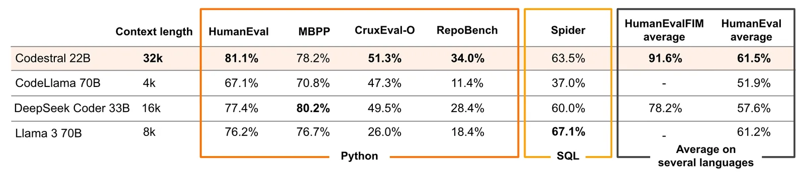
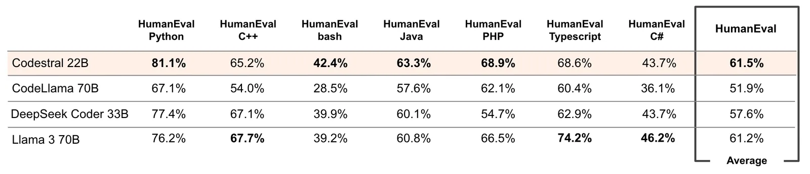
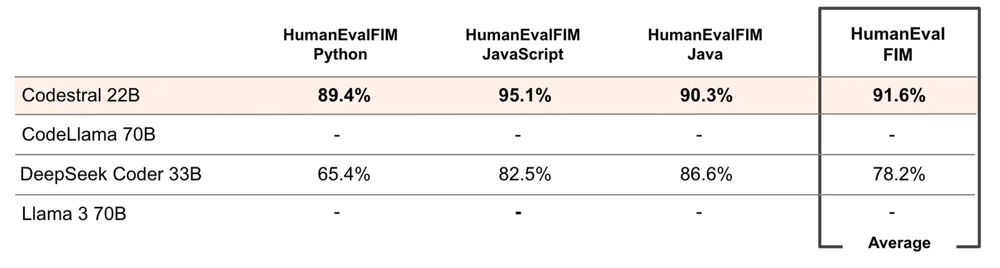

# Codestral

**Source**: `raw/codestral/full-article.md` (223 KB), `raw/codestral/full-article.md` (markdown view)  
**URL**: https://mistral.ai/news/codestral/  
**Ingested**: 2026-06-06  
**Tags**: #summary

## Summary

Mistral AI announces **Codestral**, its first dedicated code model: a **22B** open-weight generative model for code generation, instruction, and fill-in-the-middle (FIM) completion via a shared API. Trained on **80+ programming languages** (Python, Java, C/C++, JavaScript, Bash, Swift, Fortran, and more), Codestral targets low-latency IDE autocomplete, test generation, and agentic coding applications built on top of code + English fluency.

Benchmark claims position Codestral as strong in the performance/latency tradeoff for code models. Its **32k context window** is highlighted as a differentiator on **RepoBench** (long-range repository-level completion) versus competitors at 4k–16k. Evaluations cover Python (HumanEval, MBPP, CruxEval, RepoBench), SQL (Spider), six additional HumanEval languages, and FIM benchmarks vs. DeepSeek Coder 33B.

Availability: **Mistral AI Non-Production License** for research/testing on [Hugging Face](https://huggingface.co/mistralai/Codestral-22B-v0.1); commercial licenses on request. Two API surfaces—**codestral.mistral.ai** (IDE/FIM, personal API keys, free 8-week beta behind waitlist) and **api.mistral.ai** (token-billed, research/batch). Integrations ship with **Continue.dev**, **Tabnine**, **LlamaIndex**, and **LangChain**; self-deployment via Mistral sales.

## Key Claims

- First Mistral code model: 22B parameters, open-weight, optimized for generation, instruction, and FIM.
- Fluent in 80+ languages; supports completion, test writing, and partial-code FIM.
- 32k context; claimed SOTA on RepoBench vs. prior code models with higher hardware requirements.
- Strong Python (HumanEval, MBPP, CruxEval, RepoBench), SQL (Spider), multi-language HumanEval, and FIM vs. DeepSeek Coder 33B.
- Non-Production License for research; commercial license available; Hugging Face weights released.
- Dedicated codestral.mistral.ai endpoint for IDE use; api.mistral.ai for token-billed workloads.
- Partner integrations: Continue.dev, Tabnine (VS Code/JetBrains), LlamaIndex, LangChain.
- Community quotes cite low latency, Kotlin-HumanEval gains vs. GPT-4-Turbo, and LangGraph self-corrective codegen.

## Figures

| Figure | Caption | Page |
|--------|---------|------|
|  | RepoBench and long-context code-generation benchmarks vs. competitors | — |
|  | Python, SQL, multi-language, and FIM benchmark comparisons | — |
|  | Additional detailed benchmark breakdowns | — |

## Entities

- [[Papers Explained - Mistral 7B]] — prior Mistral open-model lineage; Codestral extends Mistral into dedicated code generation.
- [[Code Models]] — 22B code-specialized LLM with FIM, multi-language coverage, and IDE integrations.
- [[Large Language Models]] — open-weight frontier code model in the broader LLM landscape.

## Questions & Gaps

- Blog is announcement-oriented; no full training-data or architecture ablation detail beyond size and context length.
- Benchmark tables are figure-based; numeric claims in prose are sparse compared to later Codestral 25.01 post.
- Beta pricing and waitlist gating for codestral.mistral.ai may have changed since May 2024.

## Related

- [[Code Models]] — code generation, FIM, and coding benchmarks.
- [[Papers Explained 62 - Code Llama]] — comparable open code-model family in the same problem space.
- [[Papers Explained 45 - Codex]] — earlier code-model + Copilot lineage that Codestral targets.
