# Understanding and Coding the KV Cache in LLMs from Scratch

**Source**: `raw/coding-the-kv-cache-in-llms/full-article.html` (363 KB), `raw/coding-the-kv-cache-in-llms/full-article.md` (markdown view)  
**URL**: https://magazine.sebastianraschka.com/p/coding-the-kv-cache-in-llms  
**Ingested**: 2026-06-07  
**Tags**: #summary

## Summary

Sebastian Raschka's June 2025 *Ahead of AI* tutorial explains the [[KV Cache]]—why it matters for production LLM inference, how it relates to [[Self-Attention]], and how to implement it in readable PyTorch atop the GPT model from his *Build a Large Language Model (From Scratch)* book. The article was written as a follow-up readers requested because the book omitted KV caching to keep early chapters simpler and memory-focused.

The core problem is autoregressive redundancy: without caching, each new token forces the model to re-encode the entire prefix, recomputing identical key and value projections for every prior token at every step. A KV cache stores those projections after the first pass and appends only the new token's keys/values on subsequent decode steps. Raschka walks through the "Time flies fast" example with diagrams showing how `k(1)/v(1)` and `k(2)/v(2)` are wastefully recomputed without a cache, then contrasts the cached flow where prior tensors are retrieved instead of recomputed.

The implementation section is the article's centerpiece. In `MultiHeadAttention`, `register_buffer` holds `cache_k` and `cache_v`; a `use_cache` flag concatenates new keys/values via `torch.cat` and uses the full cache for attention. `reset_kv_cache` clears stale state between unrelated prompts (critical—otherwise new queries attend to old keys). `GPTModel` tracks `current_pos` so positional embeddings continue from the correct offset during incremental decoding; `TransformerBlock` propagates `use_cache`. The generation loop prefills on the full prompt, then passes only `next_idx` on each step. On an untrained 124M GPT on M4 CPU, this yields ~5× speedup for 200 tokens while producing **bit-identical** output to the no-cache baseline—an important correctness check.

Raschka closes with trade-offs and production notes that complement [[Inference Engineering]]: caching cuts cumulative attention work from O(n²) to O(n) but grows memory linearly with sequence length. Educational `torch.cat` is clear but fragments memory; pre-allocation and sliding-window truncation are the practical fixes (`gpt_with_kv_cache_optimized.py`). On tiny CUDA models, transfer overhead can erase gains. Bonus experiments on from-scratch Qwen3 (0.6B) and Llama 3 (1B) show KV cache + `torch.compile` helping most on CPU; on GPU, compiled baselines can win when KV tensors are not pre-allocated and models are small.

## Key Claims

- KV caches store attention key/value tensors across decode steps so prior tokens are not re-projected on every autoregressive step.
- Without KV cache, each generation step reprocesses the full prefix; with cache, only the new token's keys/values are computed and prior entries are reused.
- KV cache is inference-only—it cannot be used during training and increases code complexity and memory use.
- Cumulative attention work without caching scales as O(n²); with caching, each key/value is computed once, yielding O(n) total work across generation.
- Memory for the KV cache grows linearly with sequence length and can become the dominant VRAM consumer on long contexts.
- Correct implementation requires resetting caches between independent prompts and tracking token position so new queries align with stored keys.
- Raschka's readable implementation uses `torch.cat` on buffers; production systems prefer pre-allocated tensors and optional sliding-window truncation.
- On a 124M untrained GPT (M4 CPU, 200 new tokens), KV cache gives ~5× speedup with identical generated text vs no cache.
- For small models on GPU, device transfer and allocation overhead can outweigh KV-cache benefits unless tensors are pre-allocated.
- Qwen3 and Llama 3 from-scratch ports benefit most from KV cache on CPU; `torch.compile` adds further gains; pre-allocating huge context tensors (~8 GB for 131k/41k contexts) is often impractical.

## Figures

| Figure | Caption | Page |
|--------|---------|------|
| 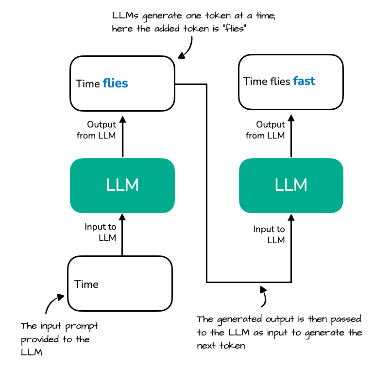 | Autoregressive generation: prompt "Time" → "flies" → "fast" one token at a time | — |
| 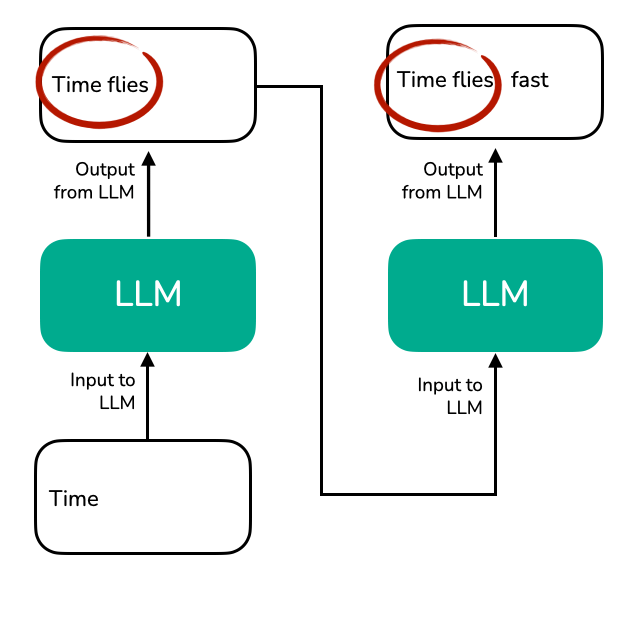 | Redundant reprocessing of prefix "Time flies" at each step without caching | — |
| 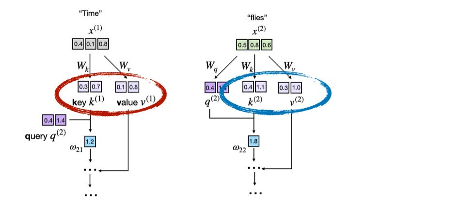 | Attention excerpt: token embeddings projected via W_k, W_v, W_q | — |
| 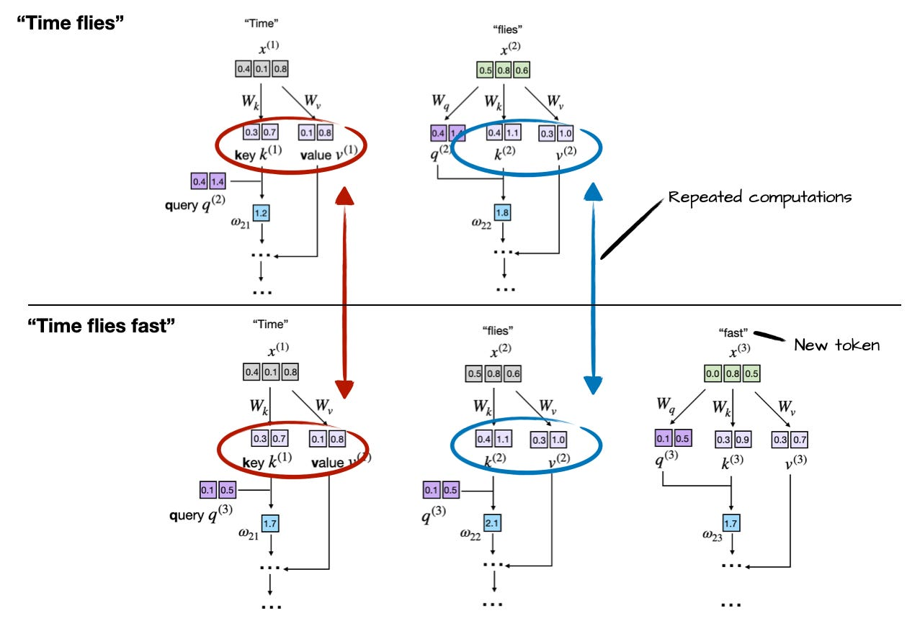 | Key and value vectors derived from embeddings for "Time" and "flies" | — |
| 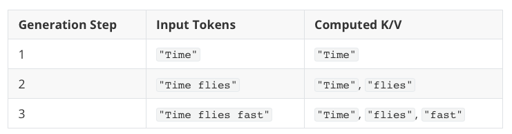 | Recomputed k(1)/v(1) and k(2)/v(2) when generating "fast" without cache | — |
| 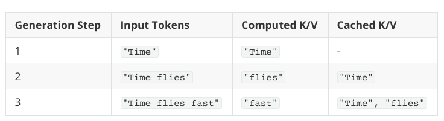 | Generation without KV cache: redundant recomputation of prior tokens | — |
| 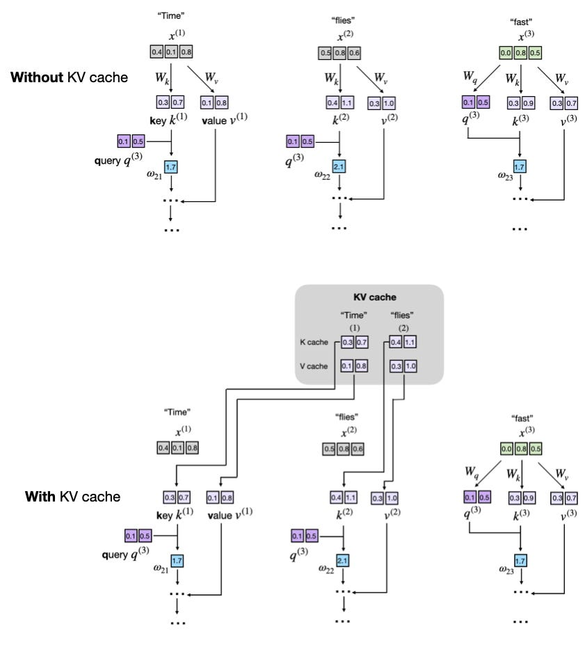 | Generation with KV cache: store, append, and reuse prior keys/values | — |
| 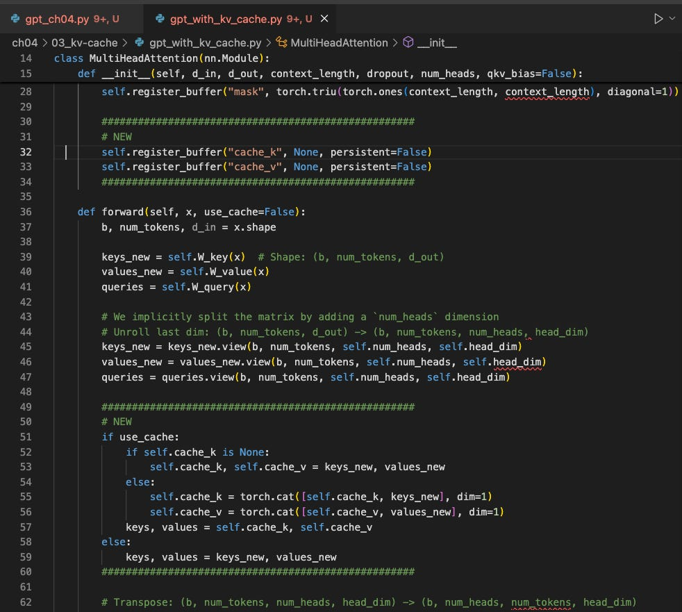 | Side-by-side step 3: with vs without KV cache | — |
| 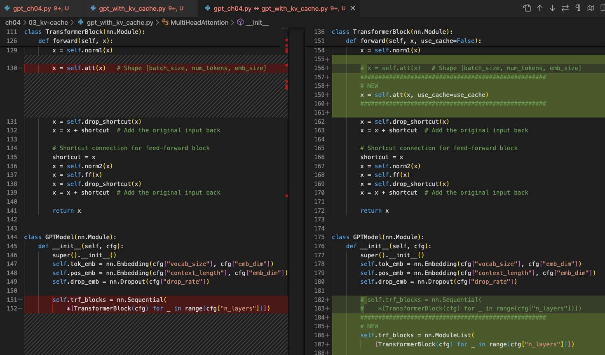 | Code diff: `# NEW` markers in `gpt_with_kv_cache.py` | — |
| 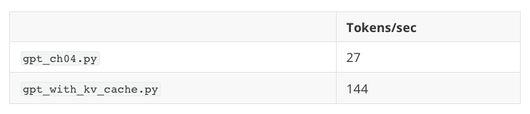 | ~5× CPU speedup: 124M GPT, 200 tokens, M4 Mac Mini | — |
| 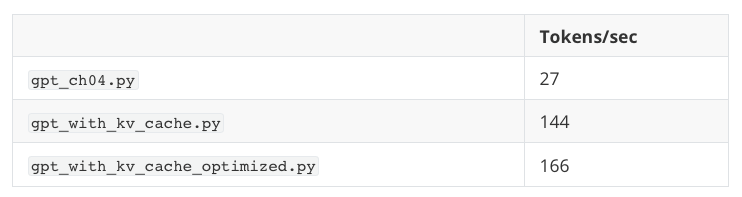 | Optimized vs readable KV cache runtime on M4 CPU | — |
| 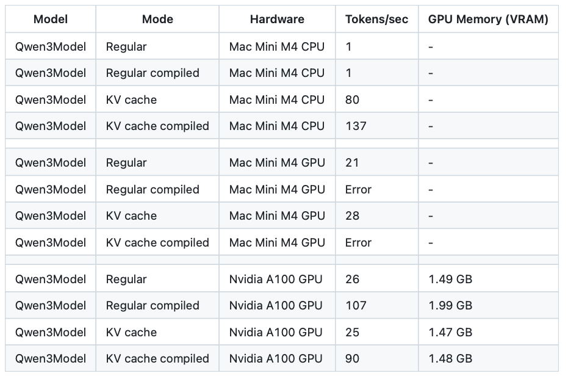 | Qwen3 0.6B: KV cache + compile on CPU vs GPU | — |
| 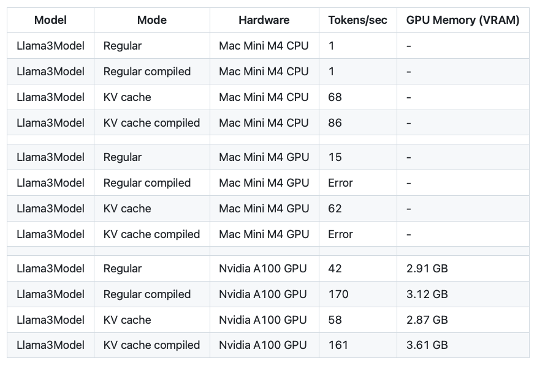 | Llama 3 1B: KV cache + compile on CPU vs GPU | — |
| 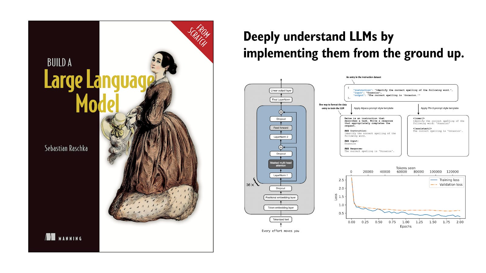 | KV cache advantages (O(n) compute) vs disadvantages (linear memory) | — |

The redundancy problem that motivates caching:

Cached vs uncached generation at step 3:

## Entities

- [[Sebastian Raschka]] — author; pedagogical from-scratch LLM educator and Ahead of AI columnist.
- [[KV Cache]] — central concept; article provides conceptual diagrams and minimal PyTorch implementation.
- [[Self-Attention]] — source of the key/value tensors being cached.
- [[Inference Engineering]] — production-oriented complement covering PagedAttention, prefix caching, and tiered storage.
- [[Large Language Models]] — autoregressive decode context for the tutorial.

## Questions & Gaps

- Benchmarks use an **untrained** 124M GPT; coherent text requires post-training, but the speedup and correctness claims still hold.
- No multi-head shape/layout detail (batch × heads × seq × dim) in the prose—readers must infer from the book code.
- GQA/MQA and shared KV heads (common in modern models) are not covered; cache memory formulas for grouped heads are left to other sources.
- GPU results on tiny models are hardware- and allocation-strategy dependent; pre-allocation recommendations are qualitative.

## Related

- [[Inference Engineering]] — production KV cache: prefix caching, PagedAttention, offloading, quantization.
- [[KV Cache]] — concept page; this article adds from-scratch implementation detail.
- [[Self-Attention]] — attention mechanism whose K/V projections are cached.
- [[Speculative Decoding]] — another inference speed technique; often combined with KV cache in serving stacks.
- [[Model Compression and Efficiency]] — GQA, sliding-window attention, and cache compression in deployed models.
- [[Components of A Coding Agent]] — another Raschka Ahead of AI tutorial in the same pedagogical style.
- [[How Transformers Work in Deep Learning and NLP: An Intuitive Introduction]] — transformer foundations referenced by Raschka's broader tutorial series.
