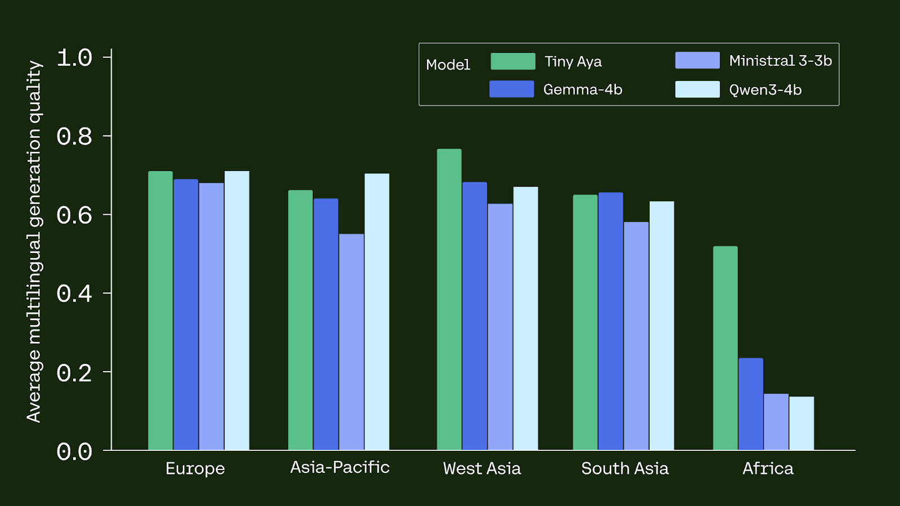
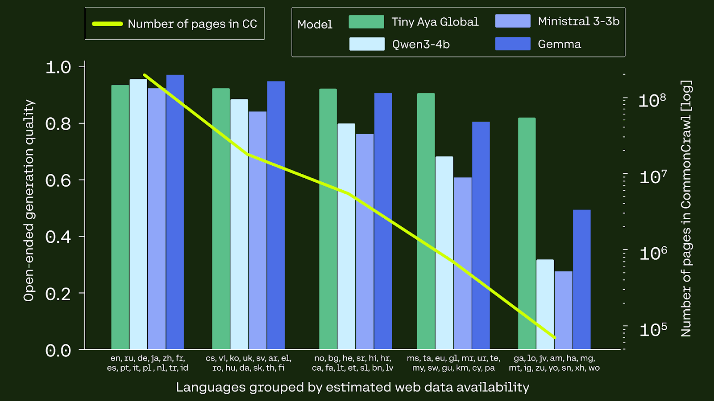
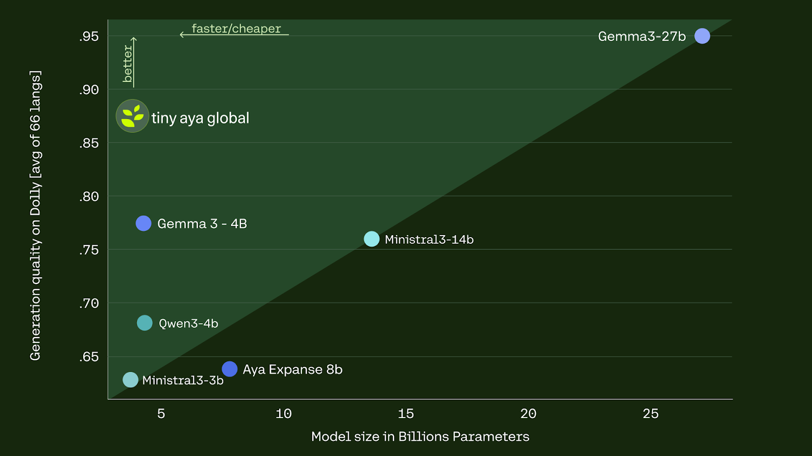
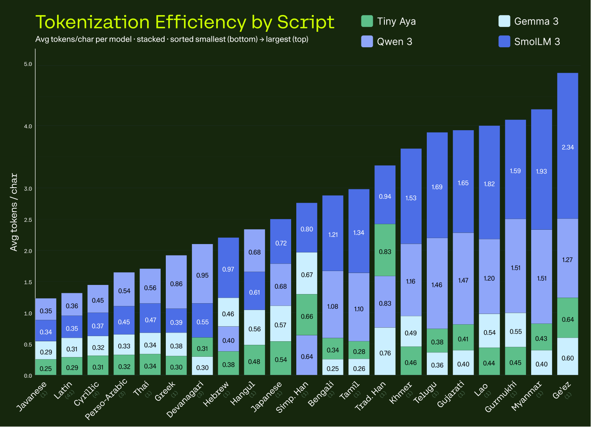
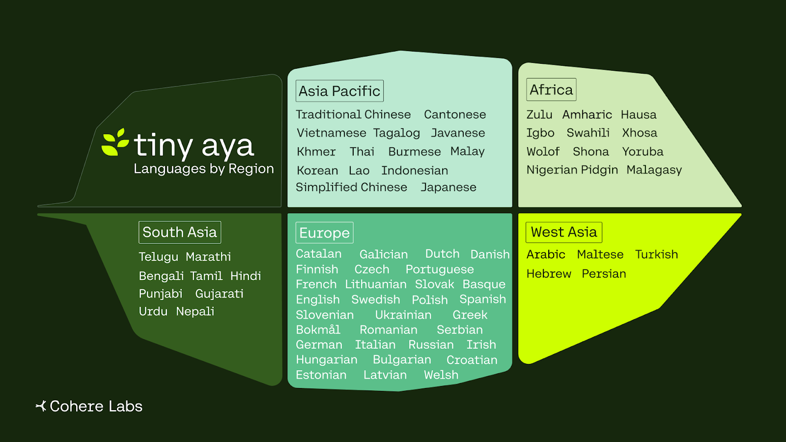
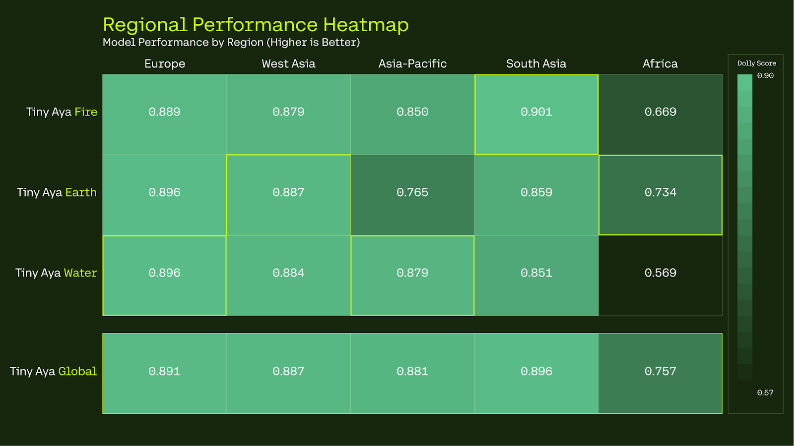

# Cohere Labs Launches Tiny Aya

**Source**: `raw/cohere-labs-tiny-aya/full-article.html` (338 KB), `raw/cohere-labs-tiny-aya/full-article.md` (markdown view)  
**URL**: https://cohere.com/blog/cohere-labs-tiny-aya  
**Ingested**: 2026-06-06  
**Tags**: #summary

## Summary

[[Cohere]] Labs announces **Tiny Aya**, an open-weight multilingual model family at **3.35B parameters** designed for local deployment on consumer hardware and phones. The release positions Tiny Aya as the most capable multilingual open model at its scale, emphasizing translation quality, multilingual understanding, target-language response fluency, and broad coverage of lower-resourced languages rather than shallow coverage across hundreds of languages.

The family includes **TinyAya-Base** (pretrained, 70+ languages), **TinyAya-Global** (instruction-tuned across 67 languages), and three region-specialized variants—**Earth** (Africa & West Asia), **Fire** (South Asia), and **Water** (Asia-Pacific & Europe)—built on a shared cross-lingual backbone. Cohere Labs also releases a multilingual fine-tuning dataset, benchmarks, and a technical report ([arXiv:2603.11510](https://arxiv.org/abs/2603.11510)). Weights are on Hugging Face and Kaggle; demos run on Hugging Face Spaces and the Cohere platform.

Training builds on the Aya initiative: tokenizer design for script efficiency, synthetic-data naturalization, fusion of diverse generations, and selective model merging. Post-training completed on a single **64×H100** cluster. The blog stresses accessibility—offline use in classrooms and community labs—and invites community specialization via **Expedition Tiny Aya**, a mentor-supported research challenge.

## Key Claims

- Tiny Aya-Base covers 70+ languages; instruction-tuned variants prioritize 67 languages across five geographic regions.
- Instruction-tuned Tiny Aya models are competitive with existing massively multilingual models at ~3B scale on translation, understanding, math reasoning, and open-ended generation.
- Aggregated benchmarks show state-of-the-art generative multilingual performance at this scale for West Asia and Africa languages.
- Performance stays stable for web-underrepresented languages (CommonCrawl tail), unlike typical multilingual LLM skew toward high-resource languages.
- Open-ended generation quality exceeds prior Aya models at smaller scale and beats Gemma-class baselines at comparable parameter counts.
- Tiny Aya tokenizer achieves lowest or near-lowest tokens-per-sequence on Flores across most evaluated languages vs. competing multilingual tokenizers.
- Post-training on one 64×H100 cluster demonstrates that data design and training strategy can substitute for brute-force scaling.
- Models ship open-weight with dataset, benchmarks, technical report, Hugging Face/Kaggle weights, and Expedition Tiny Aya community program.

## Figures

| Figure | Caption | Page |
|--------|---------|------|
|  | Instruction-tuned Tiny Aya benchmark aggregate vs. multilingual peers at this scale | — |
|  | Stable performance on CommonCrawl-underrepresented languages | — |
|  | Open-ended generation scores vs. model size (Aya lineage and Gemma baselines) | — |
|  | Tokenization efficiency (tokens per sequence on Flores; lower is better) | — |
|  | 67 post-training languages across five global regions | — |
|  | Regional specialization strength profiles (Earth, Fire, Water, Global) | — |

## Entities

- [[Cohere]] — parent company; Cohere Labs is its research arm releasing Tiny Aya.
- [[Multilingual Models]] — topic framing balanced multilingual depth at small scale.

## Questions & Gaps

- Blog is announcement-oriented; per-language benchmark tables and training hyperparameters live in the technical report.
- Hugging Face Space and Expedition Tiny Aya program details are linked but not reproduced in the post body.

## Related

- [[Papers Explained 546 - Tiny Aya]] — independent Medium explainer of the same model family; this page is the official Cohere Labs blog announcement.
- [[Multilingual Models]] — Aya lineage and small-scale multilingual LLM topic hub.
- [[Papers Explained 108 - Aya Dataset]] — earlier Aya initiative resources.
- [[Papers Explained 151 - Aya 23]] — prior Aya model generation.
- [[Model Compression and Efficiency]] — 3.35B local-deployment design goals.
