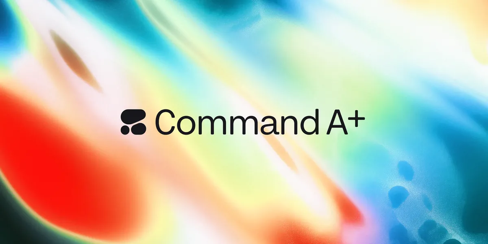
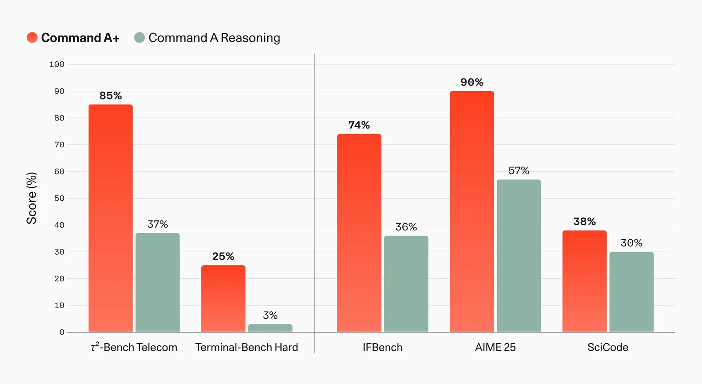
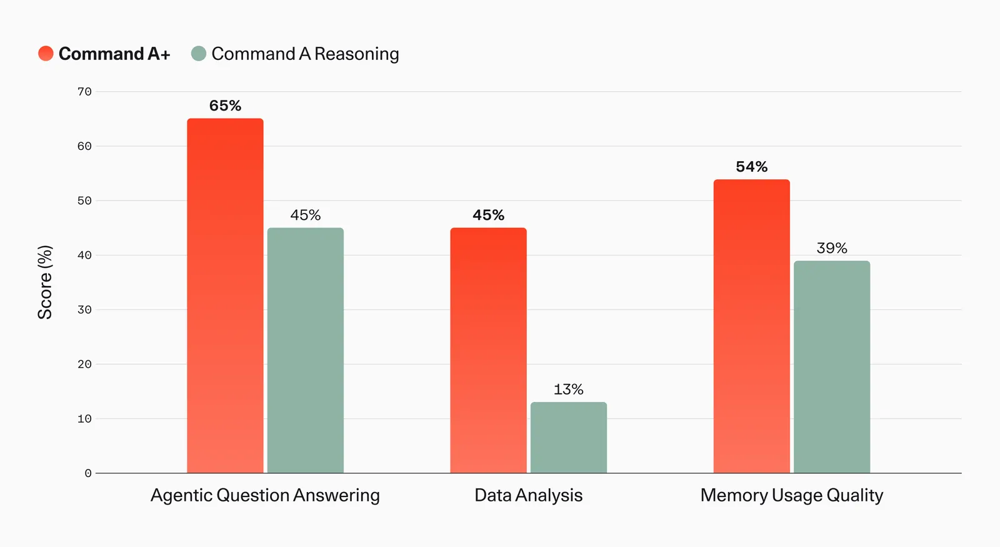
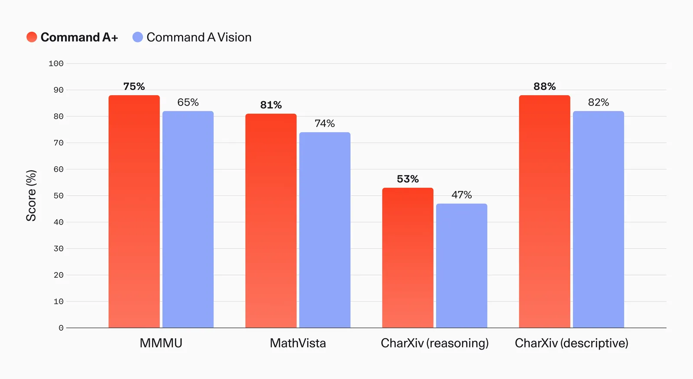
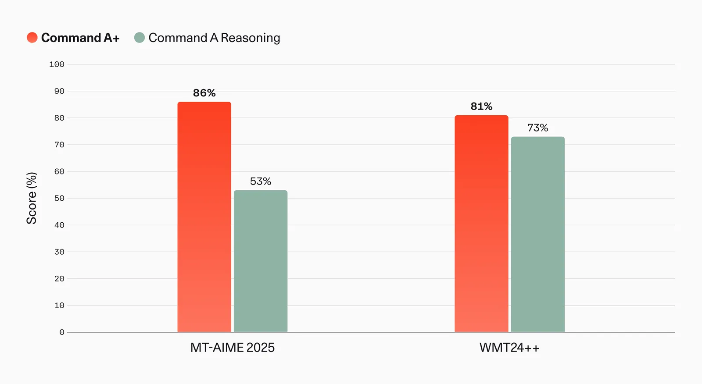
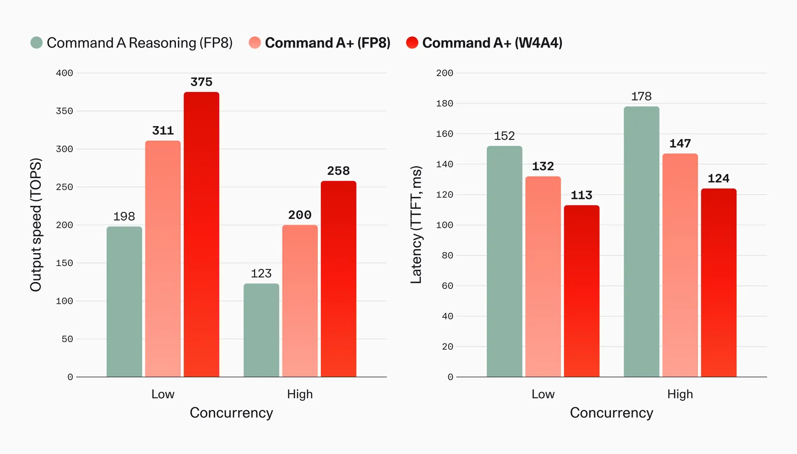
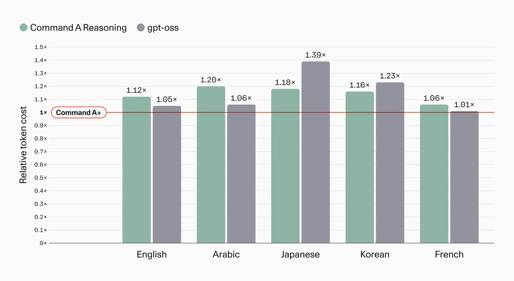

# Introducing Command A+

**Source**: `raw/command-a-plus/full-article.md` (411 KB), `raw/command-a-plus/full-article.md` (markdown view), `raw/command-a-plus/press-release.md` (press release)  
**URL**: https://cohere.com/blog/command-a-plus (technical), https://cohere.com/blog/cohere-releases-command-a-plus (press)  
**Ingested**: 2026-06-06  
**Tags**: #summary

## Summary

Cohere releases **Command A+** (`command-a-plus-05-2026`), an Apache 2.0 open-weight **MoE** model with **218B total / 25B active** parameters that consolidates reasoning, multimodal vision, tool use, and multilingual translation from the prior Command A family into one deployable system. The technical post frames it as the product of a year of **North** enterprise agent deployments; the companion press release emphasizes **sovereign AI** for governments and regulated industries — on-premises, VPC, or air-gapped deployment with full weight transparency and no vendor lock-in.

The model supports **128K input context** and **64K max generation**, text/image/tool inputs, text/reasoning/tool outputs, and **48 languages** (up from 23 in Command A Reasoning). Minimum hardware is **2× H100 @ W4A4** or **1× B200 @ W4A4**, with BF16/FP8/W4A4 quantizations on Hugging Face showing imperceptible quality loss. Cohere reports up to **63% higher TOPS** and **17% lower TTFT** vs Command A Reasoning at matched quantization, plus **1.5–1.6×** additional speedup from MoE-tuned **speculative decoding**. A new tokenizer compresses tokens ~16–20% for Arabic, Korean, and Japanese.

Benchmark highlights vs prior Command A variants: τ²-Bench Telecom **37% → 85%**, Terminal-Bench Hard **3% → 25%**, North agentic QA **+20%**, spreadsheet analysis **+32%**, memory usage **39% → 54%**, MMMU Pro **63%**, MathVista **73.5% → 80.6%**, Artificial Analysis Intelligence Index **37** (leading open models cited). The press release positions Command A+ for real enterprise workloads — RAG, multi-step SQL, financial document analysis, and multimodal chart/PDF processing — under EU AI Act and global data-residency constraints.

## Key Claims

- Command A+ unifies reasoning, multimodal, tool-use, and 48-language support in one 218B-A25B MoE model under Apache 2.0.
- Runs on as few as 2× H100 (W4A4) or 1× B200 with near-lossless low-bit quantization across BF16, FP8, and W4A4.
- MoE-optimized speculative decoding yields 1.5–1.6× inference speedup on text and multimodal inputs without quality loss.
- New tokenizer reduces token count ~16–20% for Arabic, Korean, and Japanese vs prior Command tokenizers.
- Large gains over Command A Reasoning on agentic benchmarks (τ²-Bench Telecom 37%→85%, Terminal-Bench Hard 3%→25%) and North internal evals.
- Sovereign deployment: full open weights, no hidden backdoors, on-prem/private-cloud/air-gapped operation, regulatory alignment, no licensing lock-in.

## Figures

| Figure | Caption | Page |
|--------|---------|------|
|  | Command A+ hero / announcement visual | — |
|  | Command A family capability comparison (reasoning, multimodal, tool use, languages) | — |
|  | Open-source benchmark performance vs Command A Reasoning | — |
|  | North internal evals: agentic QA, data analysis, memory usage | — |
|  | Multimodal benchmark comparison vs Command A Vision | — |
|  | Multilingual performance vs Command A Reasoning (MT-AIME, WMT24++) | — |
|  | Speed (TOPS) and latency (TTFT) vs Command A Reasoning by quantization and concurrency | — |
|  | Speed and latency by concurrency and quantization (Image 7, panel 2) | — |
|  | Tokenizer efficiency vs Command A Reasoning and gpt-oss across languages (Image 8) | — |

## Entities

- [[Cohere]] — model author; North platform and sovereign-AI positioning.
- [[Mixture of Experts]] — 218B total / 25B active sparse architecture enabling efficient inference.
- [[Speculative Decoding]] — MoE-tuned draft verification for 1.5–1.6× generation speedup.
- [[Agentic AI]] — target workloads: tool use, North agentic QA, τ²-Bench, Terminal-Bench.
- [[Multilingual Models]] — 48-language support including all official EU languages.

## Questions & Gaps

- Press release cites 24B active parameters; technical post says 25B active — minor discrepancy unresolved.
- Image 2 in the technical post is partly an HTML table; fig-2 is the rendered comparison graphic.
- Full benchmark methodology and per-language WMT24++ breakdowns are in footnotes, not reproduced here.
- Speculative decoding implementation details are deferred to a separate Cohere post.

## Related

- [[Mixture of Experts]] — sparse activation architecture underlying Command A+ efficiency.
- [[Speculative Decoding]] — inference acceleration technique deployed on this model.
- [[Agentic AI]] — enterprise agent workflows (North, tool use, coding benches) the model targets.
- [[Multilingual Models]] — 48-language expansion and tokenizer gains for non-European scripts.
- [[Large Language Models]] — open-weight enterprise LLM landscape and deployment constraints.
