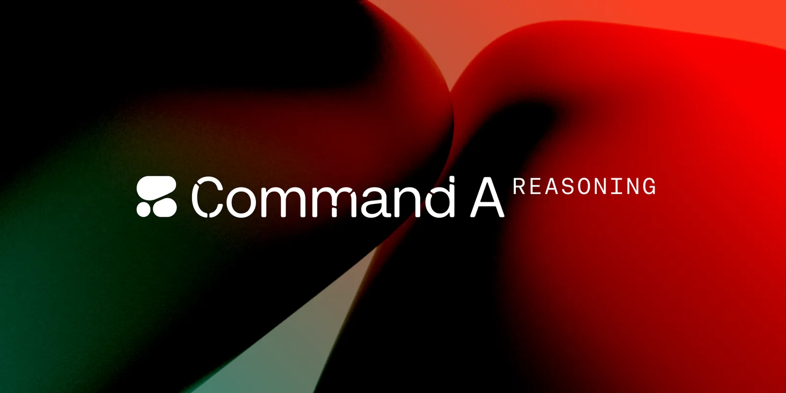
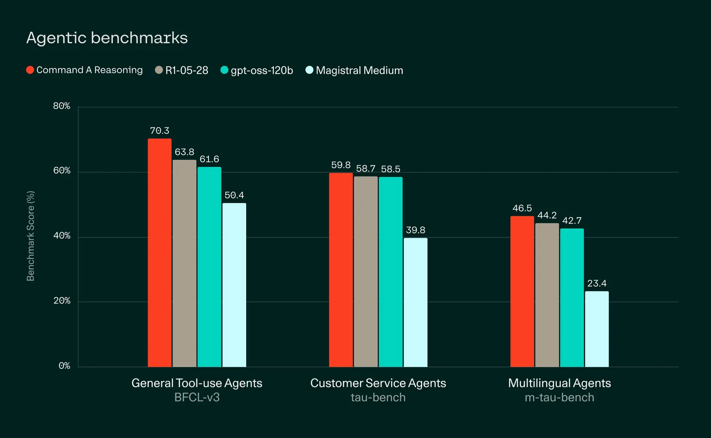
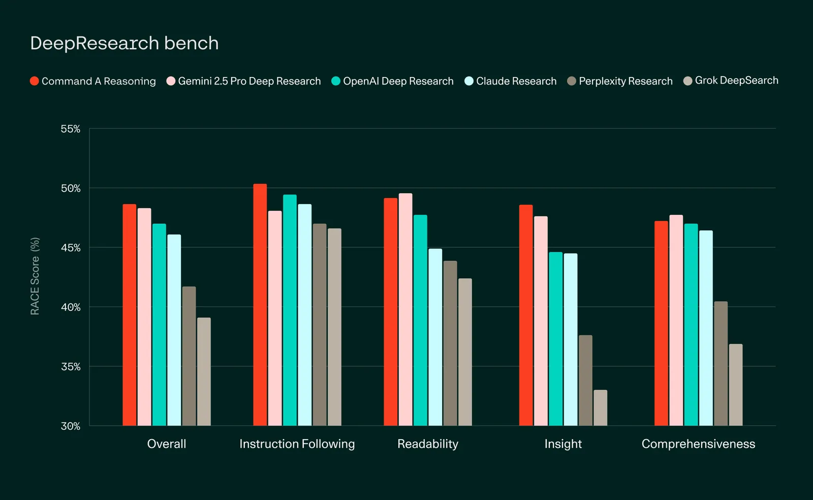
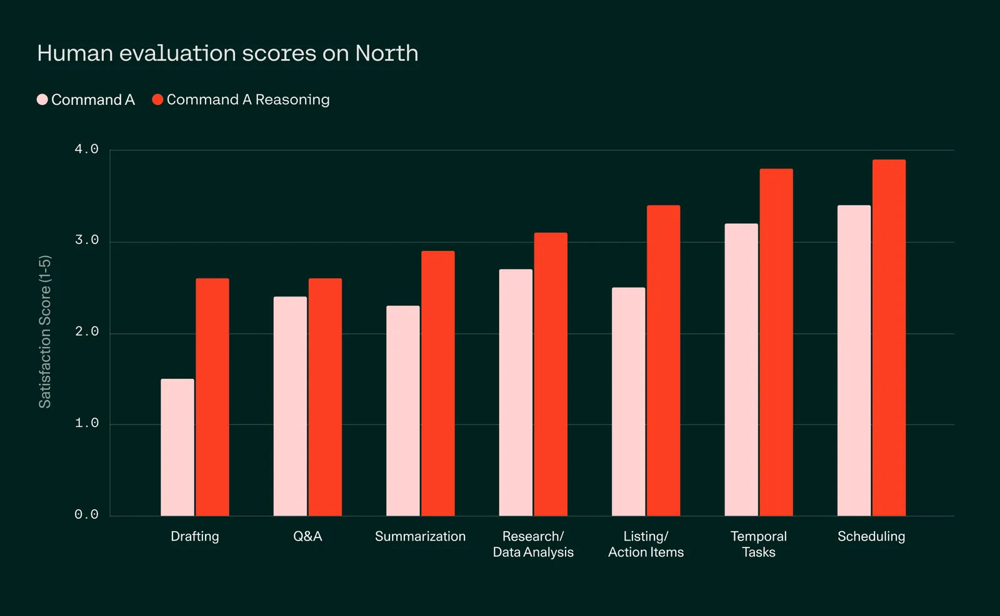
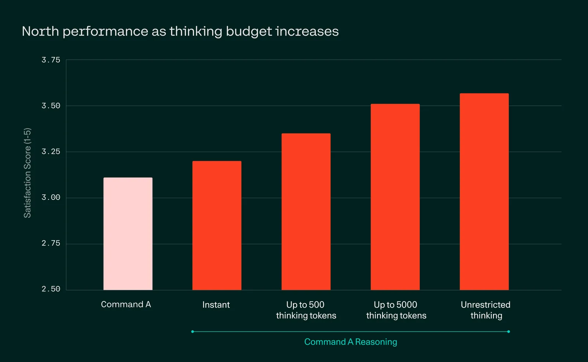
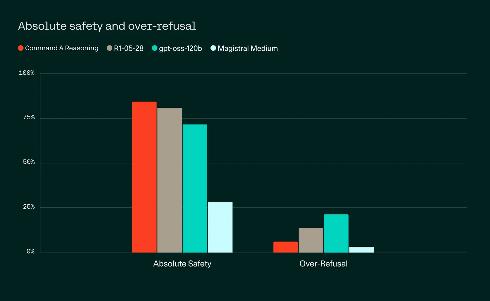

# Command A Reasoning: Enterprise-grade Control for AI Agents

**Source**: `raw/command-a-reasoning/full-article.md` (343 KB), `raw/command-a-reasoning/full-article.md` (markdown view)  
**URL**: https://cohere.com/blog/command-a-reasoning  
**Ingested**: 2026-06-06  
**Tags**: #summary

## Summary

Cohere announces **Command A Reasoning**, a reasoning variant of [[Papers Explained 347 - Command A]] aimed at enterprise agent workloads. The blog positions it as outperforming other privately deployable models in its class — including gpt-oss-120b, DeepSeek-R1 0528, and Mistral Magistral Medium — on agentic and multilingual reasoning benchmarks while keeping deployment practical: single H100 or A100 at 128k context, scaling to 256k on two or more GPUs for latency-optimized setups.

The central enterprise control mechanism is a **user-configurable reasoning token budget**. Customers can dial compute up for mission-critical accuracy or down for throughput, avoiding separate reasoning and non-reasoning model fleets. In North internal evals, performance scales smoothly from zero reasoning (where the model still beats Command A) to higher reasoning levels. Command A Reasoning powers **North**, Cohere's secure on-prem agent platform, and backs a hierarchical **Deep Research** multi-agent system that decomposes queries, runs parallel web-search sub-agents, and synthesizes cited reports — claimed to beat comparable deep-research offerings on DeepResearchBench RACE scores.

Benchmarks highlighted include **BFCL-v3** (function calling), **Tau-bench** and **M-tau-bench** (tool-use agents across English and six business languages), human satisfaction evals on 112 daily work tasks, and DeepResearchBench. Safety training covers CSEA, self-harm, violence/hate, sexual content, and conspiracy theories with a balance against over-refusal. The model ships on the Cohere platform and Hugging Face; private/on-prem deployment is sales-led.

## Key Claims

- Command A Reasoning is Cohere's most advanced enterprise reasoning model, optimized for agentic workflows and end-to-end agent systems.
- Outperforms gpt-oss-120b, DeepSeek-R1 0528, and Mistral Magistral Medium among privately deployable models in its class.
- Runs on a single H100 or A100 (128k context); scales to 256k context with two or more GPUs for latency-optimized deployment.
- User-controlled reasoning token budget replaces separate reasoning/non-reasoning model stacks; zero-reasoning mode still beats Command A on North evals.
- Leads on agentic benchmarks: BFCL-v3 (FC setting), Tau-bench (avg pass^1 over 10 runs, airline + retail), and M-tau-bench (Ja, Ko, Ar, Es, Fr, En).
- Deep Research hierarchical multi-agent system outperforms comparable deep-research capabilities from other leading AI labs on DeepResearchBench RACE (English).
- Human eval (112 questions, 6 annotators each) shows Command A Reasoning consistently beats Command A on representative daily work tasks.
- Core generative model for North — Cohere's secure on-prem agentic AI platform for custom agents and automations.
- Available on Cohere platform and Hugging Face; private/on-prem via sales.

## Figures

| Figure | Caption | Page |
|--------|---------|------|
|  | Command A Reasoning announcement hero — enterprise agent control and reasoning | — |
|  | Agentic benchmark results: BFCL-v3, Tau-bench, and related tool-use scores | — |
|  | DeepResearchBench RACE scores vs other deep-research systems | — |
|  | Human evaluation satisfaction scores across daily work task categories | — |
|  | North performance vs reasoning budget — smooth scaling from zero to higher reasoning | — |
|  | Multilingual agentic benchmark results (M-tau-bench across business languages) | — |

## Entities

- [[Cohere]] — model author; North platform and private deployment.
- [[Reasoning Models]] — controllable reasoning-token variant for enterprise workloads.
- [[Agentic AI]] — tool use, multi-agent Deep Research, and North agent deployments.

## Questions & Gaps

- No parameter count or architecture details in the marketing post; training recipe beyond "reasoning variant of Command A" is unspecified.
- Benchmark charts show relative leadership but exact numeric scores are image-only; footnotes describe protocols but not full tables.
- Deep Research is "coming soon to North"; production latency and pricing not disclosed.
- M-tau-bench and human-eval rubrics are internal or partially internal; reproducibility depends on future public releases.

## Related

- [[Reasoning Models]] — topic hub for training-time and test-time reasoning strategies.
- [[Agentic AI]] — tool use, orchestration, and enterprise agent systems.
- [[Papers Explained 347 - Command A]] — base Command A architecture, multilingual coverage, and agent-optimized post-training.
- [[Command A Translate: Secure Translation for Global Enterprises]] — sibling Command A product line for enterprise MT with similar deployment story.
