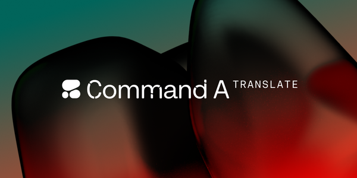
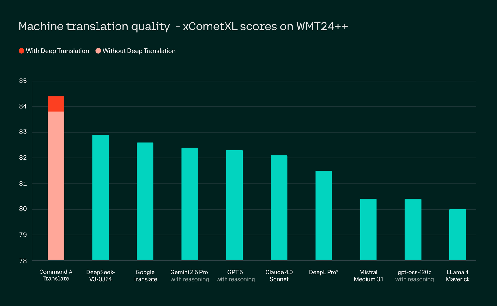

# Command A Translate: Secure Translation for Global Enterprises

**Source**: `raw/command-a-translate/full-article.html` (331 KB), `raw/command-a-translate/full-article.md` (markdown view)  
**URL**: https://cohere.com/blog/command-a-translate  
**Ingested**: 2026-06-06  
**Tags**: #summary

## Summary

Cohere announces **Command A Translate**, an enterprise-focused machine translation model built on [[Papers Explained 347 - Command A]] and optimized for secure, high-quality translation across 23 business languages. The blog positions it as outperforming GPT-5, DeepSeek-V3, DeepL Pro's LLM, and Google Translate on production-relevant benchmarks, with optional **Deep Translation** — an agentic multi-step refinement pipeline for complex documents such as legal text.

The product pitch centers on **data sovereignty**: sensitive contracts, financial reports, and customer materials can be translated behind enterprise firewalls via private or on-prem deployment. A single H100/A100 GPU with 4-bit quantization is claimed sufficient for low-footprint production with less than 0.5 xCometXL quality loss. Fine-tuning and customization are offered for industry-specific terminology and additional languages. RWS (Language Weaver) provides third-party validation across 23 languages using automated metrics and professional linguist review.

On WMT24++ (English→L2, 23 languages), Command A Translate reports an average **xCometXL score of 83.8**, rising to **84.4** with Deep Translation. The model ships on the Cohere platform and Hugging Face for research; private deployment is sales-led. Technical training details (DPO on difficulty-filtered document data, WMT submission variants) are covered in [[Papers Explained 498 - Command A Translate]].

## Key Claims

- Command A Translate targets enterprise MT with private deployment, fine-tuning, and on-prem options for sensitive documents.
- Benchmarked against GPT-5, DeepSeek-V3, DeepL Pro LLM, and Google Translate; claims best-in-class xCometXL on WMT24++ across 23 languages (83.8 avg; 84.4 with Deep Translation).
- Supports 23 business languages aligned with Command A coverage (English, French, Spanish, Italian, German, Portuguese, Japanese, Korean, Arabic, Chinese, Russian, Polish, Turkish, Vietnamese, Dutch, Czech, Indonesian, Ukrainian, Romanian, Greek, Hindi, Hebrew, Persian).
- Deep Translation uses iterative reasoning to improve fluency and naturalness on high-stakes translation; available by request.
- Single-GPU (H100/A100) 4-bit quantized deployment with &lt;0.5 xCometXL degradation.
- RWS evaluation confirms strong performance on numbers, names, and polysemous words across domains.
- Available on Cohere platform and Hugging Face; private/on-prem via sales.

## Figures

| Figure | Caption | Page |
|--------|---------|------|
|  | Command A Translate announcement hero — secure enterprise machine translation | — |
|  | WMT24++ xCometXL scores: Command A Translate (83.8) vs competitors; 84.4 with Deep Translation | — |

## Entities

- [[Cohere]] — model author; offers platform, private deployment, and fine-tuning.
- [[Multilingual Models]] — 23-language enterprise MT product in the multilingual model landscape.

## Questions & Gaps

- Deep Translation workflow, latency, and pricing are "by request" only; no public technical spec in the blog.
- Blog cites aggregate xCometXL; per-language breakdowns and WMT25 human-eval details live in [[Papers Explained 498 - Command A Translate]] and the WMT paper.
- Comparison set and evaluation protocol (temperature, reasoning modes) not fully specified in the marketing post.

## Related

- [[Papers Explained 498 - Command A Translate]] — independent explainer of DPO training, difficulty filtering, CommandA-WMT system, and full benchmark tables.
- [[Multilingual Models]] — topic hub for translation and cross-lingual model work.
