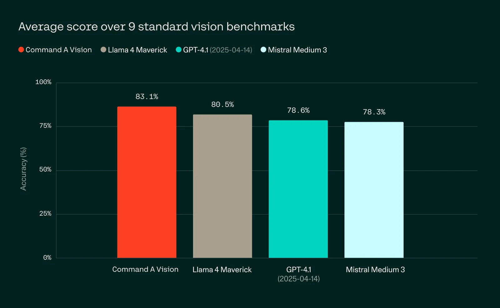
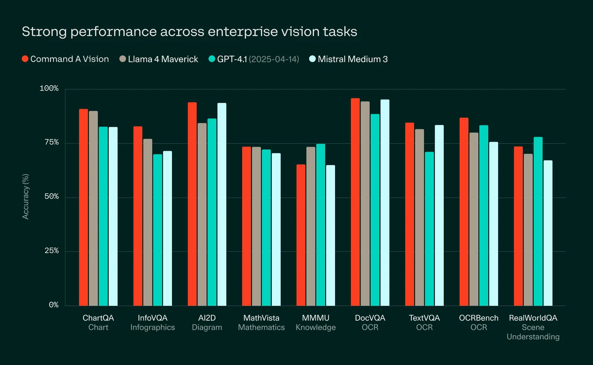
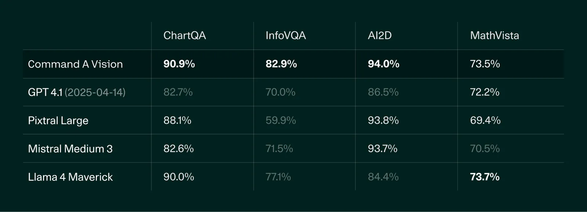
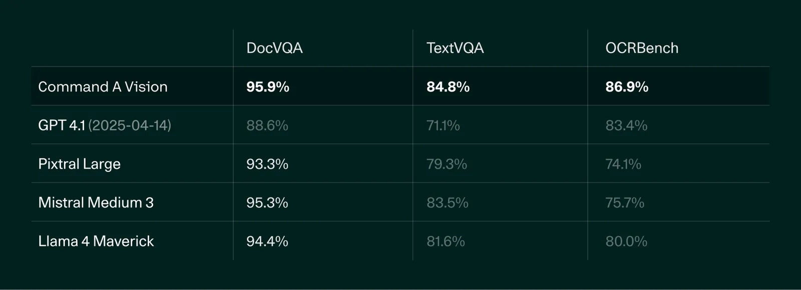
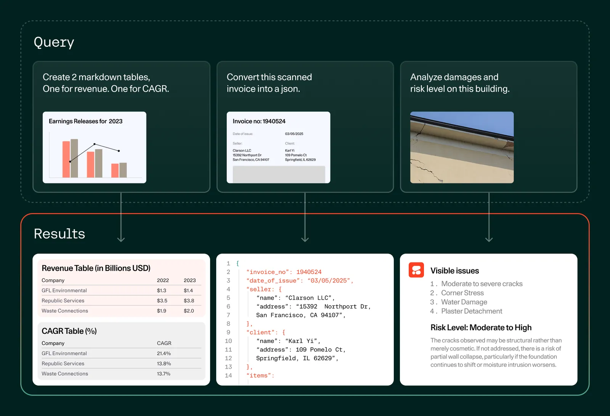

# Introducing Command A Vision: Multimodal AI built for business

**Source**: `raw/command-a-vision/full-article.md` (327 KB), `raw/command-a-vision/full-article.md` (markdown view)  
**URL**: https://cohere.com/blog/command-a-vision  
**Ingested**: 2026-06-06  
**Tags**: #summary

## Summary

Cohere announces **Command A Vision**, an enterprise multimodal model that extends the Command A text stack with vision understanding for slides, diagrams, PDFs, photos, and real-world scenes. The blog positions it as state-of-the-art in its class on multimodal benchmarks, beating GPT 4.1, Llama 4 Maverick, Mistral Medium 3, and Pixtral Large while keeping a low serving footprint (two A100s, or one H100 at 4-bit). Enterprise deployment—on-prem or private cloud—is a core theme alongside secure, JSON-mode structured outputs for document automation.

Three capability pillars are highlighted: **chart/graph/diagram analysis** across multilingual visual data and verticals (finance, healthcare, manufacturing, construction, energy); **document OCR and layout understanding** for scanned docs, invoices, and forms with strong DocVQA, TextVQA, and OCRBench scores; and **real-world scene understanding** for spatial context, risk detection, and retail analytics. Command A Vision inherits Command A text features—RAG with citations and multilingual business languages—so agents can reason over mixed text-and-image enterprise data on customer hardware.

Customer quotes from Fujitsu Intelligence and Oracle Infrastructure Industries emphasize visual grounding for complex workflows and construction-document extraction. The model ships on the Cohere platform and Hugging Face; private/on-prem pricing is sales-led. Compared to [[Papers Explained 332 - Aya Vision]], Command A Vision is Cohere's **enterprise product** multimodal line, whereas Aya Vision is Cohere Labs' **research** multilingual VLM with synthetic data and cross-modal merging.

## Key Claims

- Command A Vision leads its model class on key multimodal benchmarks vs. GPT 4.1, Llama 4 Maverick, Mistral Medium 3, and Pixtral Large.
- Private deployment fits on ≤2 GPUs (two A100s; one H100 with 4-bit quantization).
- Strong on chart/graph/table/diagram extraction with domain-specific analysis across major industries.
- Top-tier DocVQA, TextVQA, and OCRBench performance; JSON mode supports structured document automation.
- Real-world scene understanding covers spatial relationships and context beyond object detection.
- Retains Command A text strengths: RAG with citations and multilingual business-language support.
- Available on Cohere platform and Hugging Face; on-prem via bespoke sales pricing.

## Figures

| Figure | Caption | Page |
|--------|---------|------|
|  | Average multimodal benchmark comparison vs. GPT 4.1, Llama 4 Maverick, Mistral Medium 3, Pixtral Large | — |
|  | Detailed per-benchmark scores across enterprise vision tasks | — |
|  | Chart, graph, and diagram analysis benchmark table | — |
|  | Document OCR and visual processing benchmarks (DocVQA, TextVQA, OCRBench) | — |
|  | Enterprise use cases: slides, diagrams, PDFs, photos, real-world scenes | — |

## Entities

- [[Cohere]] — model vendor; Command A Vision product launch.
- [[Vision Language Models]] — enterprise VLM for image+text understanding and agentic visual automation.

## Questions & Gaps

- No model card size, architecture, or training-data details in the blog post.
- Benchmark methodology mixes provider reports, leaderboards, and internal VLMEvalKit runs (greyed cells); full eval configs not published here.
- Relationship to Aya Vision / Command A base weights is not spelled out.

## Related

- [[Papers Explained 332 - Aya Vision]] — Cohere Labs research multilingual VLM; contrast with this enterprise product line.
- [[Vision Language Models]] — topic hub for multimodal systems.
- [[Document AI]] — document OCR, layout parsing, and VQA benchmarks cited in the post.
