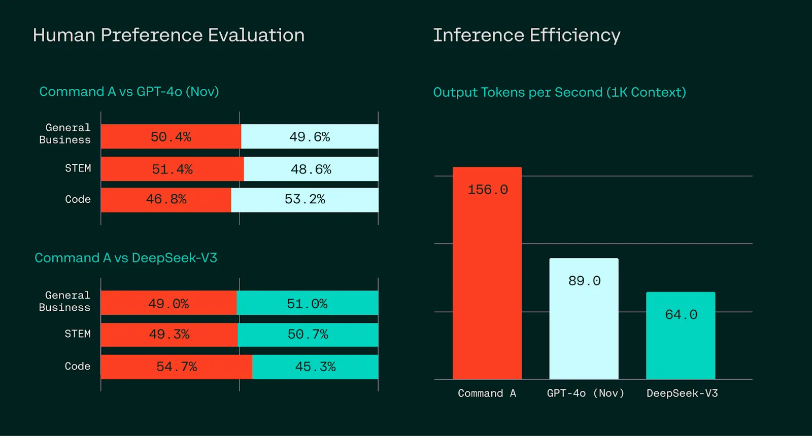
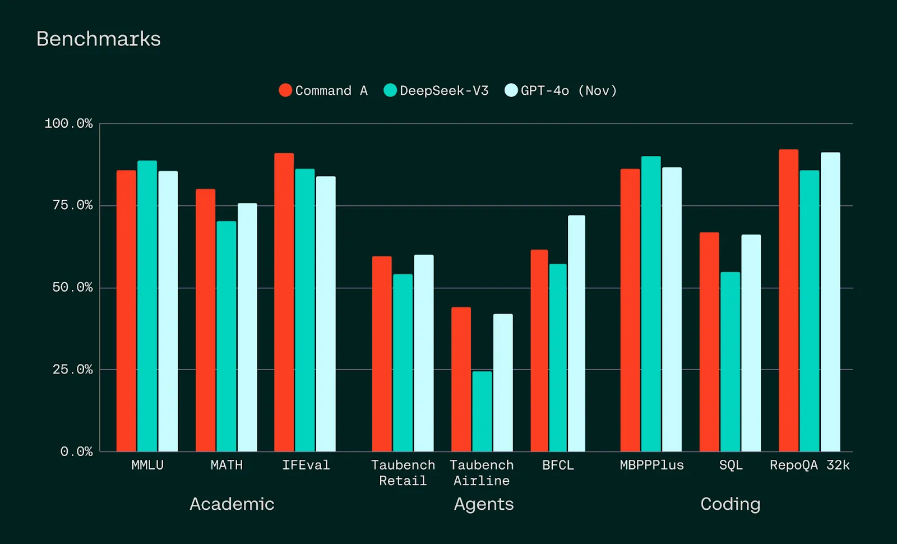
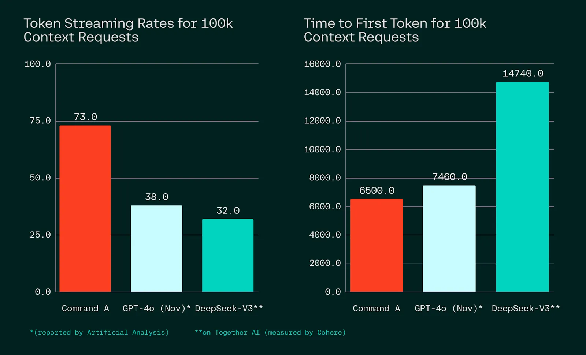
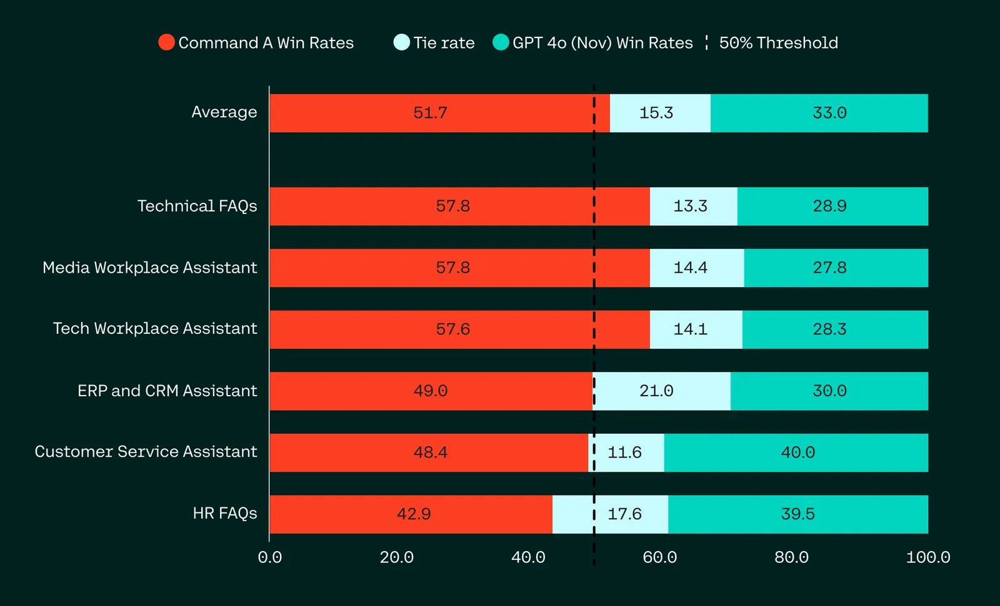
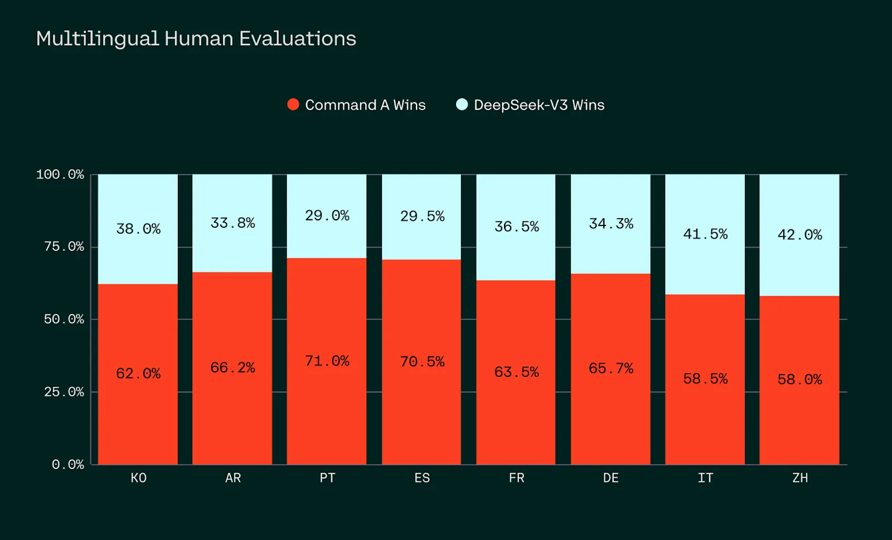
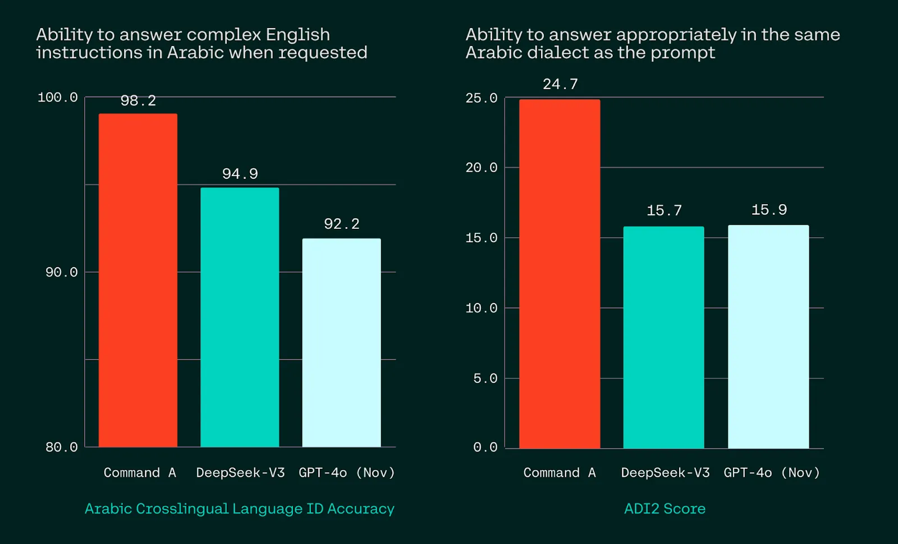

# Introducing Command A: Max performance, minimal compute

**Source**: `raw/command-a/full-article.md` (341 KB), `raw/command-a/full-article.md` (markdown view)  
**URL**: https://cohere.com/blog/command-a  
**Ingested**: 2026-06-06  
**Tags**: #summary

## Summary

[[Cohere]] announces **Command A**, a 111B-parameter enterprise LLM positioned for maximum performance with minimal compute. The blog claims parity or better vs. GPT-4o and DeepSeek-V3 on agentic enterprise tasks—business, STEM, and coding—while running on **two A100/H100 GPUs** (vs. up to 32 for comparable models). Human blind evaluations on real enterprise data are emphasized over academic benchmarks alone.

Command A targets private deployments with **256k context**, advanced RAG with verifiable citations, agentic tool use, enterprise security, and **23 business languages**. Throughput reaches up to **156 tokens/sec** (1.75× GPT-4o, 2.4× DeepSeek-V3 per Artificial Analysis); private deployment is claimed up to 50% cheaper than API access. The model integrates with Cohere's **North** agents platform for CRM/ERP and internal-database workflows. Availability: Cohere platform (`command-a-03-2025`), Hugging Face ([`CohereForAI/c4ai-command-a-03-2025`](https://huggingface.co/CohereForAI/c4ai-command-a-03-2025)), and upcoming cloud providers. API pricing: $2.50/1M input, $10/1M output tokens.

Architectural and post-training details (SwiGLU, interleaved sliding-window/full attention, expert soup merging, CoPG alignment) are covered in [[Papers Explained 347 - Command A]] and the arXiv paper (2504.00698).

## Key Claims

- Command A matches or outperforms GPT-4o and DeepSeek-V3 on blind human evaluations across business, STEM, and coding enterprise tasks.
- Deployable on two GPUs for private/on-prem use; significantly lower serving footprint than comparable frontier models.
- Strong benchmark coverage: MMLU, MATH, IFEval, BFCL, Taubench, MBPPPlus, SQL, RepoQA—instruction following, agents, and coding.
- Up to 156 tokens/sec throughput; 1.75× GPT-4o and 2.4× DeepSeek-V3; superior TTFT on long and short contexts.
- 256k context (2× typical leading models); RAG with verifiable citations; agentic tool use; 23-language enterprise support.
- Preferred over GPT-4o on enterprise RAG (fluency, faithfulness, utility) and over DeepSeek-V3 across most languages in human evals.
- Superior Arabic dialect consistency (LPR and ADI2) vs. GPT-4o and DeepSeek-V3.
- Powers North secure AI agents; integrates with CRM, ERP, internal DBs, and web search behind enterprise firewalls.
- Available on Cohere platform and Hugging Face; private/on-prem via sales.

## Figures

| Figure | Caption | Page |
|--------|---------|------|
|  | Head-to-head human evaluation win rates on enterprise tasks (accuracy, instruction following, style) | — |
|  | Academic, agent (BFCL, Taubench), and coding benchmark performance vs. competitors | — |
|  | Tokens/sec and time-to-first-token vs. GPT-4o and DeepSeek-V3 (long/short context) | — |
|  | Enterprise RAG human-eval win rates: Command A vs. GPT-4o (fluency, faithfulness, utility) | — |
|  | Multilingual enterprise task win rates across 8 languages | — |
|  | Arabic cross-lingual LPR and ADI2 dialect scores vs. GPT-4o and DeepSeek-V3 | — |

## Entities

- [[Cohere]] — model author; Cohere platform, North agents, and private deployment.
- [[Large Language Models]] — 111B enterprise LLM in the frontier model landscape.
- [[Agentic AI]] — agentic tool use, North integration, BFCL/Taubench agent benchmarks.

## Questions & Gaps

- Blog is marketing-oriented; full architecture, training recipe, and ablations are in [[Papers Explained 347 - Command A]] and arXiv 2504.00698.
- Human-eval methodology (annotator training, sample sizes) summarized in footnotes only; no per-task breakdowns in the post.
- North platform and video demo referenced but not technically specified in the blog body.

## Related

- [[Papers Explained 347 - Command A]] — detailed explainer of architecture, post-training soup, CoPG, and full benchmark tables from the arXiv paper.
- [[Large Language Models]] — topic hub for model releases and training recipes.
- [[Agentic AI]] — tool use, agents, and enterprise agent platforms (North).
- [[Embedding and Retrieval]] — RAG with verifiable citations; Command A as retrieval-augmented enterprise backbone.
