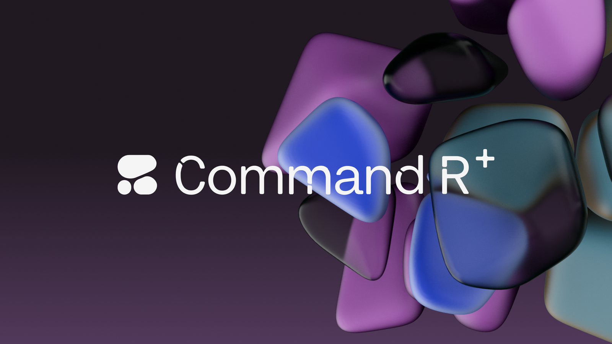
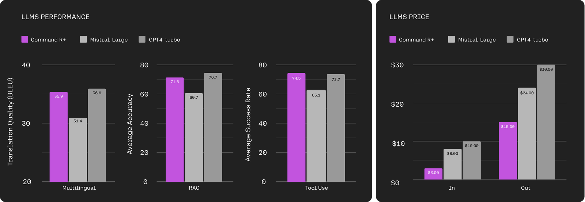
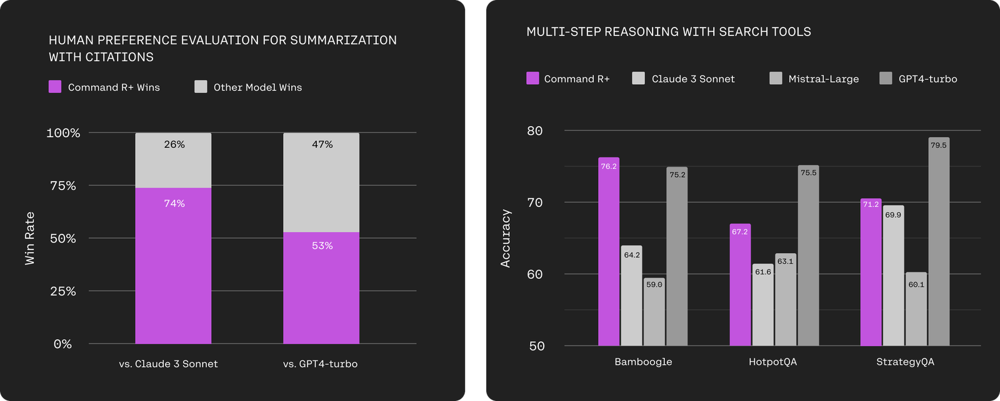
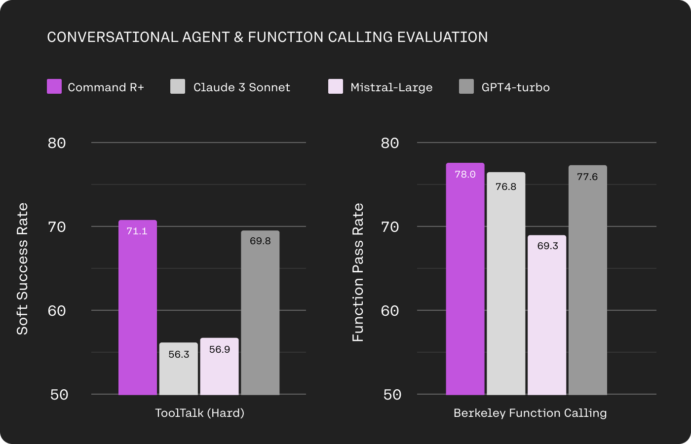
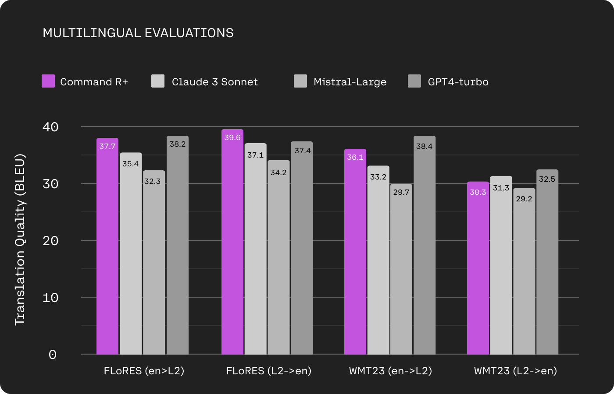
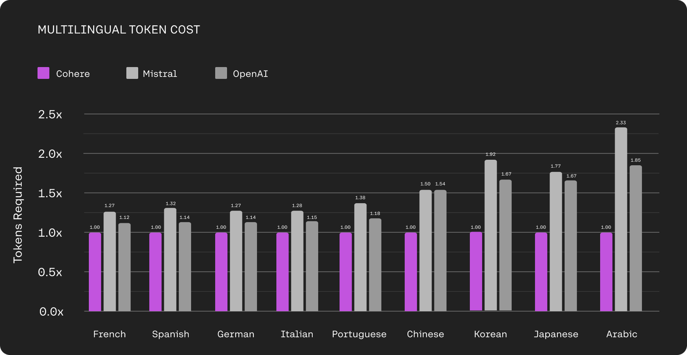

# Introducing Command R+: A Scalable LLM Built for Business

**Source**: `raw/command-r-plus/full-article.html` (338 KB), `raw/command-r-plus/full-article.md` (markdown view)  
**URL**: https://cohere.com/blog/command-r-plus-microsoft-azure  
**Ingested**: 2026-06-06  
**Tags**: #summary

## Summary

Cohere's April 2024 launch post introduces **Command R+**, a **104B-parameter** LLM positioned as the flagship of the Command R family for enterprise production workloads. The model targets **retrieval-augmented generation (RAG)**, **multi-step tool use**, and **multilingual** business applications, with a **128k-token** context window. It debuted first on **Microsoft Azure**, with planned availability on Oracle Cloud Infrastructure and other platforms.

Command R+ extends Command R's RAG strengths with stronger citation quality and answer reliability for proprietary enterprise data. The post highlights **multi-step tool use**: the model can chain tools across steps and recover from failed tool calls. Benchmarks cited in the announcement compare Command R+ favorably to **Mistral Large** (consistently ahead) and **GPT-4 Turbo** (on par) across multilingual, RAG, and tool-use suites on Azure-hosted models. Human preference evaluations weight fluency, citation quality, and utility; multi-hop REACT agents on HotpotQA and web search show competitive reasoning with search tools.

A distinguishing production claim is the **Cohere tokenizer** for the R-series: it represents non-English text with far fewer tokens than Mistral (Mixtral) or OpenAI tokenizers—up to **57% cost reduction** on some languages—while multilingual translation evals on FLoRES and WMT23 demonstrate strong coverage across ten business languages. The post connects Command R+ to Cohere's broader stack ([[Embedding and Retrieval]] via Embed/Rerank) and partner integrations (LangChain, Accenture, Scale, Atomicwork).

## Key Claims

- Command R+ is a 104B LLM with 128k context, optimized for enterprise RAG, tool use, and multilingual workloads.
- Available first on Microsoft Azure; Hugging Face weights released for research/evaluation.
- Beats Mistral Large and matches GPT-4 Turbo on aggregated multilingual, RAG, and tool-use benchmarks on Azure.
- Advanced RAG outputs include in-line citations to reduce hallucinations and surface source context.
- Multi-step tool use chains multiple tools across steps and can self-correct after failed tool invocations.
- Evaluated on Microsoft ToolTalk (Hard) and Berkeley Function Calling Leaderboard (BFCL) for tool use.
- Strong multilingual performance on FLoRES and WMT23 across ten business languages.
- Cohere tokenizer compresses non-Latin text substantially vs. competitor tokenizers (up to 57% fewer tokens / lower cost).

## Figures

| Figure | Caption | Page |
|--------|---------|------|
|  | Command R+ blog header / hero image | — |
|  | Azure performance (multilingual, RAG, tool use) and token-cost comparison | — |
|  | Human preference RAG eval and multi-hop REACT agent accuracy | — |
|  | ToolTalk (Hard) and BFCL function-calling benchmarks | — |
|  | FLoRES and WMT23 multilingual translation evaluations | — |
|  | Token-count comparison: Cohere vs Mistral vs OpenAI tokenizers | — |

## Entities

- [[Cohere]] — model author; Command R+ is the flagship R-series release.
- [[Embedding and Retrieval]] — RAG stack context; pairs with Cohere Embed and Rerank for retrieval pipelines.
- [[Large Language Models]] — 104B generative model family for enterprise deployment.

## Questions & Gaps

- Blog does not detail architecture (e.g., MoE vs dense) or training data composition for Command R+.
- Benchmark aggregation methodology for the headline "beats Mistral / on-par with GPT-4 Turbo" is summarized visually, not tabulated in prose.
- OCI and additional cloud rollout timelines were "coming months" at publication (April 2024).

## Related

- [[Papers Explained 166 - Command Models]] — deeper technical survey of Command R, R+, R7B, and structured outputs in the wiki corpus.
- [[Embedding and Retrieval]] — RAG, embedding, and reranking topic hub.
- [[Large Language Models]] — model-family and release catalog across the wiki.
