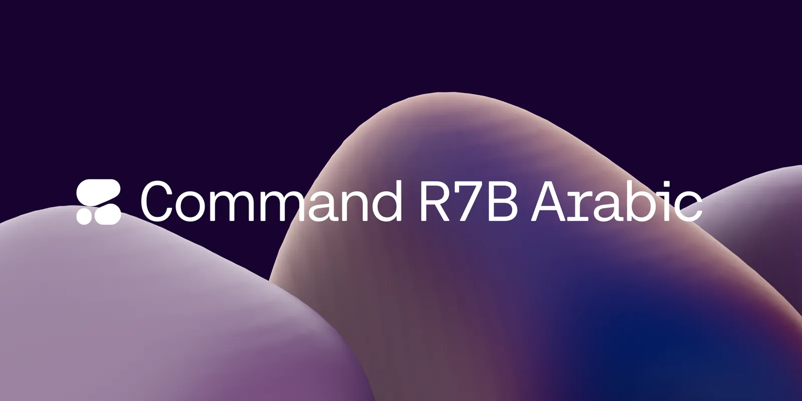
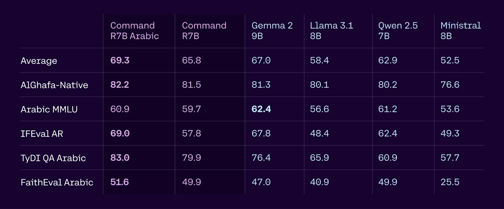
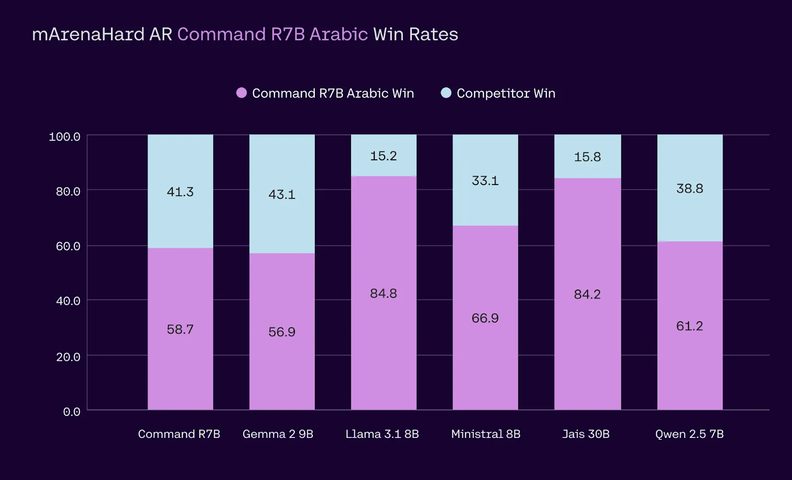

# Introducing Command R7B Arabic

**Source**: `raw/command-r7b-arabic/full-article.md` (340 KB), `raw/command-r7b-arabic/full-article.md` (markdown view)  
**URL**: https://cohere.com/blog/command-r7b-arabic  
**Ingested**: 2026-06-06  
**Tags**: #summary

## Summary

[[Cohere]] releases **Command R7B Arabic** (`c4ai-command-r7b-arabic-02-2025`), an open-weights specialization of the lightweight [[Command R7B]] family tuned for Modern Standard Arabic and English enterprise workloads in the MENA region. The ~8B-parameter model (7B transformer + ~1B embedding parameters) keeps the R-series 128K context window and targets production constraints: low-end GPU, MacBook, or CPU deployment with strong regional language understanding, instruction following, length control, and RAG with inline citations.

Cohere positions R7B Arabic as a class-leading compact model for Arabic cultural and linguistic nuance without regressing the core multilingual languages already supported by base Command R7B. Benchmarks cited in the post span AlGhafa-Native, Arabic MMLU, IFEval Arabic, TyDI QA Arabic, FaithEval Arabic (an Arabic translation of the FaithEval RAG benchmark), and auto win-rates on an Arabic LMSYS Arena "Hard" preference suite (methodology aligned with Aya Expanse). Use cases emphasized include document QA, summarization, agentic tool use (search, APIs, vector DBs), and on-prem fine-tuning.

The model ships on the Cohere platform playground, [Hugging Face](https://huggingface.co/CohereForAI/c4ai-command-r7b-arabic-02-2025), and Ollama, with weights released under the same open-research pattern as other Command R models. A bilingual English/Arabic blog post accompanies the launch; technical details and citations appear in arXiv:2503.14603.

## Key Claims

- Command R7B Arabic improves all Arabic language dimensions vs. base Command R7B with no regression on previously supported core languages.
- Outperforms leading models in its size class on Arabic enterprise benchmarks: language/culture understanding, instruction following, and RAG.
- Runs efficiently on single GPU, on-prem, or consumer hardware while maintaining enterprise task accuracy.
- Addresses Arabic-specific challenges: complex morphology and dialectal variation via customized training rather than generic multilingual baselines.
- Open weights on Hugging Face and Ollama; API access via Cohere platform; on-prem deployment via sales.
- 128K context supports long-document RAG and multi-step agent workflows with citation-grounded outputs.

## Figures

| Figure | Caption | Page |
|--------|---------|------|
|  | Blog hero — Command R7B Arabic announcement | — |
|  | Enterprise task benchmarks: AlGhafa-Native + Arabic MMLU, IFEval Arabic, TyDI QA Arabic + FaithEval Arabic | — |
|  | Enterprise usability: auto win-rates on Arabic LMSYS Arena "Hard" preference tasks | — |
|  | Arabic-language version of enterprise capability benchmark chart | — |

## Entities

- [[Cohere]] — model author; Command R series and MENA enterprise focus.
- [[Multilingual Models]] — Arabic/English enterprise LLM in the regional specialization lineage.

## Questions & Gaps

- Absolute benchmark scores and competitor model names are shown only in chart form, not tabulated in prose.
- FaithEval Arabic translation methodology and LMSYS Arena Arabic "Hard" task construction are referenced but not fully specified in the blog text (see Aya Expanse paper for preference-eval details).
- License is CC-BY-NC per Hugging Face model card; blog does not restate acceptable-use constraints.

## Related

- [[Papers Explained 166 - Command Models]] — wiki coverage of the broader Command R / Command R+ family and multilingual RAG evaluation.
- [[Papers Explained 498 - Command A Translate]] — later Cohere multilingual translation specialization in the Command lineage.
- [[Multilingual Models]] — topic page grouping Arabic and cross-lingual model work.
- [[Papers Explained 347 - Command A]] — successor-generation Command A multilingual enterprise model.
